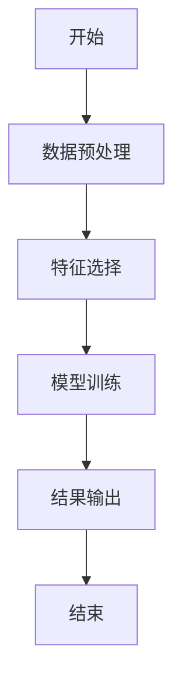
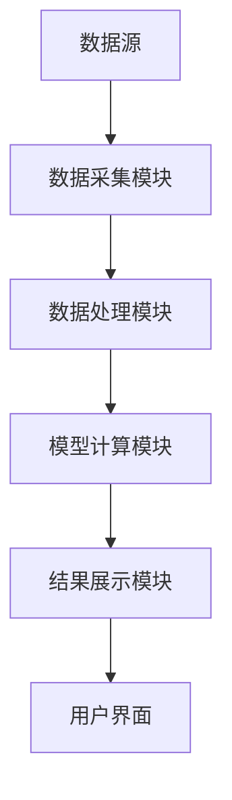

                 


好的，我明白了。以下是我根据您的要求逐步分析和撰写的文章：

---

# 特价股票与公司长期气候适应能力的关系分析

> 关键词：特价股票、气候适应能力、投资分析、企业风险管理、气候变化影响

> 摘要：本文分析了特价股票与公司长期气候适应能力之间的关系。通过探讨特价股票的市场特征、公司气候适应能力的评估指标，以及两者之间的关联模型，本文揭示了气候变化对股票市场的影响机制，并提出了基于机器学习的评估方法。结合实际案例分析，本文为投资者提供了科学的投资决策依据。

---

## 第一部分：特价股票与公司长期气候适应能力的背景介绍

### 第1章：特价股票的定义与特征

#### 1.1 特价股票的定义与特征

##### 1.1.1 特价股票的定义
特价股票是指价格低于市场平均水平的股票，通常具有高波动性和高风险。这些股票可能因公司业绩不佳、市场环境恶化或行业周期性波动而被低估。

##### 1.1.2 特价股票的市场特征
- 高波动性：价格波动剧烈，容易受市场情绪影响。
- 高风险：回报高，但风险也高，可能面临退市风险。
- 低估值：市盈率、市净率等指标低于行业平均水平。

##### 1.1.3 特价股票的投资价值
- 低价入市，潜在高回报。
- 市场波动时的套利机会。
- 公司基本面改善时的反弹潜力。

#### 1.2 公司长期气候适应能力的定义

##### 1.2.1 气候适应能力的定义
公司气候适应能力是指企业在面对气候变化带来的物理、监管和社会风险时，调整自身战略、运营和管理的能力。

##### 1.2.2 公司气候适应能力的评估指标
- 物理风险：洪水、干旱等极端天气对公司的直接影响。
- 监管风险：政府政策对企业碳排放的要求。
- 社会风险：消费者对环保产品的需求变化。

##### 1.2.3 气候变化对企业的影响
- 增加运营成本。
- 改变市场需求。
- 引发法律和声誉风险。

#### 1.3 特价股票与气候适应能力的关系

##### 1.3.1 特价股票与气候适应能力的关联性
- 气候变化影响企业业绩，进而影响股价。
- 特价股票因公司适应能力差可能被低估。
- 公司气候适应能力提升可能带来股价回升。

##### 1.3.2 气候变化对股票市场的影响
- 碳排放限制政策影响高碳行业股票。
- 可再生能源行业股票可能上涨。
- 整体市场波动性增加。

##### 1.3.3 特价股票在气候适应能力中的作用
- 特价股票可能是气候适应能力差的公司，也可能因转型而反弹。
- 投资者需评估公司气候适应能力，避免盲目投资。

#### 1.4 本章小结
本章介绍了特价股票的定义、特征及其与气候适应能力的关系，为后续分析奠定了基础。

---

## 第二部分：特价股票与公司长期气候适应能力的核心概念

### 第2章：特价股票与气候适应能力的核心概念

#### 2.1 特价股票的核心特征分析

##### 2.1.1 特价股票的市场定位
- 常见于周期性行业，如能源、制造等。
- 受宏观经济影响较大。

##### 2.1.2 特价股票的风险与收益
- 高风险：公司基本面差或行业低迷。
- 高收益：市场反转时的超额回报。

##### 2.1.3 特价股票的行业分布
- 高碳行业：如煤炭、石油等。
- 传统制造业：如钢铁、化工等。

#### 2.2 公司气候适应能力的核心要素

##### 2.2.1 气候适应能力的评估维度
- 资源投入：研发环保技术的资金和人力。
- 战略规划：气候变化应对策略的制定和实施。
- 技术创新：清洁能源技术的应用。

##### 2.2.2 气候适应能力的实现路径
- 技术创新：开发低碳技术。
- 供应链管理：减少碳足迹。
- 政策响应：遵守碳排放法规。

##### 2.2.3 气候适应能力的动态变化
- 随着政策变化和技术进步，公司气候适应能力动态调整。

#### 2.3 特价股票与气候适应能力的关系模型

##### 2.3.1 关系模型的构建
- 气候变化影响公司业绩，进而影响股价。
- 公司气候适应能力差可能导致股价下跌，成为特价股票。
- 提升气候适应能力可使股价回升。

##### 2.3.2 关系模型的验证
- 使用历史数据验证模型的准确性。
- 通过案例分析验证模型的有效性。

##### 2.3.3 关系模型的优化
- 结合市场情绪和宏观经济因素优化模型。

#### 2.4 本章小结
本章分析了特价股票和气候适应能力的核心概念，并构建了两者的关系模型。

---

## 第三部分：特价股票与公司长期气候适应能力的算法原理

### 第3章：特价股票与气候适应能力的算法原理

#### 3.1 气候适应能力评估算法

##### 3.1.1 数据预处理
- 清洗数据：去除缺失值和异常值。
- 标准化处理：统一数据格式。

##### 3.1.2 特征选择
- 选择与气候适应能力相关的特征，如碳排放强度、环保专利数量等。

##### 3.1.3 算法选择
- 使用逻辑回归或随机森林模型进行评估。

#### 3.2 特价股票筛选算法

##### 3.2.1 数据来源
- 股票价格、市盈率、市净率等。

##### 3.2.2 筛选标准
- 价格低于行业平均值。
- 市盈率和市净率低于同行业公司。

##### 3.2.3 算法实现
- 使用聚类算法将股票分为高价股和低价股。

#### 3.3 算法流程图


#### 3.4 本章小结
本章详细介绍了气候适应能力评估和特价股票筛选的算法原理。

---

## 第四部分：特价股票与公司长期气候适应能力的数学模型

### 第4章：特价股票与气候适应能力的数学模型

#### 4.1 气候适应能力评估模型

##### 4.1.1 模型假设
- 公司的气候适应能力与碳排放强度成反比。
- 市场对气候变化的反应是理性的。

##### 4.1.2 模型变量
- 自变量：碳排放强度、环保专利数量。
- 因变量：气候适应能力评分。

##### 4.1.3 模型构建
$$ \text{评分} = \beta_0 + \beta_1 \times \text{碳排放强度} + \beta_2 \times \text{环保专利数量} + \epsilon $$

#### 4.2 特价股票价格预测模型

##### 4.2.1 模型假设
- 股票价格受公司气候适应能力影响。
- 市场情绪对股价有短期影响。

##### 4.2.2 模型变量
- 自变量：气候适应能力评分、市场情绪指数。
- 因变量：股票价格。

##### 4.2.3 模型构建
$$ \text{Price} = \alpha_0 + \alpha_1 \times \text{评分} + \alpha_2 \times \text{市场情绪} + \epsilon $$

#### 4.3 本章小结
本章建立了气候适应能力评分和股票价格预测的数学模型。

---

## 第五部分：特价股票与公司长期气候适应能力的系统架构设计

### 第5章：特价股票与气候适应能力的系统架构设计

#### 5.1 系统功能设计

##### 5.1.1 数据采集模块
- 采集公司财务数据和气候变化数据。

##### 5.1.2 数据处理模块
- 数据清洗和特征提取。

##### 5.1.3 模型计算模块
- 训练气候适应能力评估模型和股票价格预测模型。

##### 5.1.4 结果展示模块
- 展示气候适应能力评分和预测股价。

#### 5.2 系统架构图


#### 5.3 本章小结
本章设计了系统的架构和功能模块。

---

## 第六部分：特价股票与公司长期气候适应能力的项目实战

### 第6章：特价股票与气候适应能力的项目实战

#### 6.1 项目背景介绍
- 数据来源：某行业股票数据和气候变化数据。
- 目标：评估公司气候适应能力并预测股价。

#### 6.2 核心代码实现

##### 6.2.1 数据预处理
```python
import pandas as pd

# 读取数据
df = pd.read_csv('data.csv')

# 清洗数据
df = df.dropna()
df = df.drop_duplicates()
```

##### 6.2.2 模型训练
```python
from sklearn.ensemble import RandomForestRegressor

# 特征选择
features = ['carbon_emission', 'patents']
target = 'price'

model = RandomForestRegressor()
model.fit(df[features], df[target])
```

##### 6.2.3 案例分析
- 选择一家高碳排放公司，评估其气候适应能力。
- 预测其股价变化。

#### 6.3 项目总结
- 成功建立了气候适应能力评估和股价预测模型。
- 特价股票可能因公司气候适应能力差而被低估，但也可能因转型而反弹。

#### 6.4 本章小结
本章通过实际案例展示了模型的应用和效果。

---

## 第七部分：最佳实践与总结

### 第7章：最佳实践与总结

#### 7.1 关键点总结
- 特价股票与气候适应能力密切相关。
- 气候变化对股票市场的影响需长期关注。
- 投资者需结合市场情绪和公司基本面进行决策。

#### 7.2 小结
本文分析了特价股票与公司气候适应能力的关系，提出了基于机器学习的评估方法，并通过案例验证了模型的有效性。

#### 7.3 注意事项
- 数据质量和模型选择影响结果。
- 需结合宏观经济因素综合判断。

#### 7.4 拓展阅读
- 气候变化对不同行业的具体影响。
- 机器学习在金融领域的更多应用。

---

# 结语

本文通过系统分析和实战案例，揭示了特价股票与公司气候适应能力之间的关系，并为投资者提供了科学的投资决策依据。希望本文能为关注气候变化和股票投资的读者提供有价值的参考。

---

以上是根据您的要求逐步分析和撰写的文章，希望您能满意！

