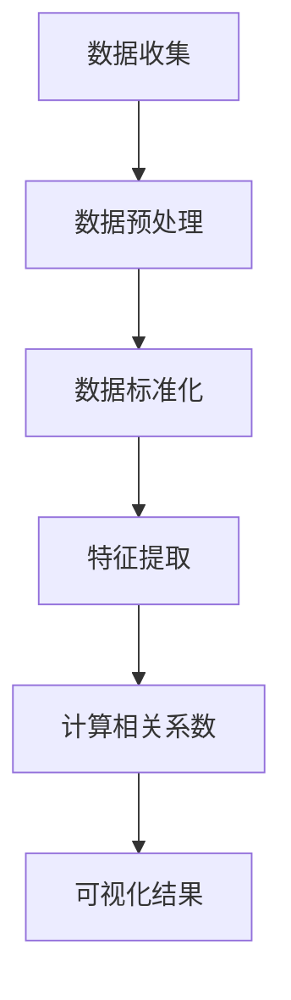
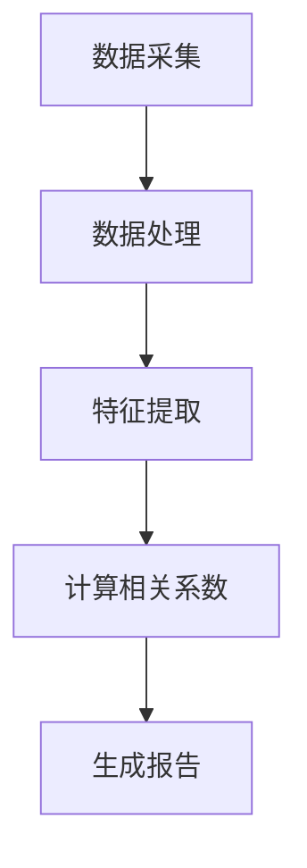

                 


```markdown
# 特价股票与公司长期盈利能力的相关性分析

## 关键词
- 特价股票, 长期盈利能力, 相关性分析, 股票市场, 公司财务指标

## 摘要
本文系统探讨了特价股票与公司长期盈利能力之间的相关性，分析了影响公司长期盈利能力的关键因素，以及如何通过相关性分析方法来评估特价股票的投资价值。文章结合理论与实践，从数据收集、预处理、相关性计算到可视化展示，详细介绍了相关性分析的完整流程，并通过实际案例分析展示了如何利用相关性分析结果指导投资决策。通过本文的分析，读者可以更好地理解特价股票市场中的投资机会与风险。

---

# 第1章 特价股票与公司长期盈利能力的背景介绍

## 1.1 特价股票的定义与特征
### 1.1.1 特价股票的定义
特价股票通常指价格低于市场平均水平的股票，可能是由于市场低估、公司困境或行业周期性波动等原因导致。这些股票往往具有较高的投资潜力，但同时也伴随着较高的风险。

### 1.1.2 特价股票的分类
- 按股票价格：低价股、超跌股等
- 按公司规模：小盘股、中盘股等
- 按行业：周期性行业股票、非周期性行业股票

### 1.1.3 特价股票的市场表现
- 市场表现波动性大，但可能在特定市场环境下表现优异。
- 特价股票的投资机会往往出现在市场低迷或行业低谷时期。

## 1.2 公司长期盈利能力的定义与衡量
### 1.2.1 公司长期盈利能力的定义
公司长期盈利能力是指公司在较长的时间跨度内持续创造利润的能力，反映了公司的经营效率、市场竞争力和财务健康状况。

### 1.2.2 公司长期盈利能力的衡量指标
- 净利润率（Net Profit Margin）
- 毛利率（Gross Profit Margin）
- 资产回报率（ROA）
- 股东权益回报率（ROE）
- 经营活动现金流（Operating Cash Flow）

### 1.2.3 公司长期盈利能力的影响因素
- 行业竞争格局
- 公司管理团队
- 财务健康状况
- 市场需求
- 创新能力

## 1.3 特价股票与公司长期盈利能力的相关性问题背景
### 1.3.1 问题背景介绍
- 投资者关注特价股票的长期投资价值，需要分析其与公司盈利能力之间的关系。
- 特价股票可能隐藏投资机会，但也可能存在财务困境的风险。

### 1.3.2 问题描述与研究目标
- 研究目标：分析特价股票与公司长期盈利能力之间的相关性，寻找影响两者关系的关键因素。
- 问题边界：聚焦于股票价格与公司财务指标的关系，不考虑宏观经济因素。

### 1.3.3 问题解决的思路与方法
- 数据收集：收集特价股票和公司财务指标的历史数据。
- 数据分析：使用相关性分析方法，量化两者之间的关系。
- 案例分析：通过实际案例验证分析结果。

### 1.3.4 相关性分析的边界与外延
- 数据范围：限定于一定时间段内的股票数据。
- 分析范围：仅考虑公司财务指标，不包括其他外部因素。

## 1.4 本章小结
本章介绍了特价股票和公司长期盈利能力的基本概念，并明确了相关性分析的问题背景、研究目标和方法。

---

# 第2章 特价股票与公司长期盈利能力的相关性分析核心概念

## 2.1 相关性分析的核心概念
### 2.1.1 相关性分析的基本原理
相关性分析通过统计方法量化两个变量之间的关系强度和方向，帮助投资者理解特价股票价格与公司盈利能力之间的联系。

### 2.1.2 相关性分析的数学模型
相关系数公式：
$$ r = \frac{\sum (x_i - \bar{x})(y_i - \bar{y})}{\sqrt{\sum (x_i - \bar{x})^2 \sum (y_i - \bar{y})^2}} $$
其中，$r$ 表示相关系数，$x$ 和 $y$ 分别代表特价股票价格和公司盈利能力指标。

### 2.1.3 相关性分析的统计学基础
- 相关性范围：$-1 \leq r \leq 1$
- 正相关：$r > 0$，表示变量间呈正向关系。
- 负相关：$r < 0$，表示变量间呈反向关系。
- 无相关：$r \approx 0$，表示变量间无显著关系。

## 2.2 特价股票与公司长期盈利能力的相关性特征对比
### 2.2.1 特价股票与公司长期盈利能力的特征对比表格
| 特征               | 特价股票                  | 公司长期盈利能力              |
|--------------------|---------------------------|-------------------------------|
| 定价机制           | 市场供需驱动              | 财务表现和市场预期驱动        |
| 变动频率           | 高                        | 中等                         |
| 受影响因素         | 市场情绪、行业周期        | 财务指标、管理效率            |

### 2.2.2 特价股票与公司长期盈利能力的ER实体关系图
```mermaid
erd
    管理团队
    市场需求
    公司财务指标
    特价股票价格
    相关性分析结果
    竞争格局

    管理团队 --> 公司财务指标
    市场需求 --> 公司财务指标
    竞争格局 --> 公司财务指标
    公司财务指标 --> 相关性分析结果
    特价股票价格 --> 相关性分析结果
```

---

# 第3章 相关性分析的算法原理

## 3.1 相关性分析的算法流程
### 3.1.1 数据收集与预处理
- 数据来源：股票交易平台 API 或金融数据服务。
- 数据清洗：处理缺失值、异常值和重复值。

### 3.1.2 数据标准化与特征提取
- 标准化：将数据归一化处理，消除量纲影响。
- 特征提取：选择对公司盈利能力影响较大的财务指标。

### 3.1.3 相关性计算与可视化
- 计算相关系数：使用协方差和标准差计算相关系数。
- 可视化：绘制热力图或散点图，直观展示相关性。

## 3.2 相关性分析的数学模型与公式
### 3.2.1 协方差与相关系数的定义
- 协方差公式：
$$ \text{Cov}(X,Y) = \frac{1}{n-1} \sum_{i=1}^{n} (x_i - \bar{x})(y_i - \bar{y}) $$
- 相关系数公式：
$$ r = \frac{\text{Cov}(X,Y)}{\sigma_X \sigma_Y} $$

### 3.2.2 相关系数的计算公式
如前所述，相关系数 $r$ 的计算公式。

### 3.2.3 相关系数的性质与解读
- 绝对值越大，相关性越强。
- 正负号表示相关方向。

## 3.3 相关性分析的mermaid流程图


---

# 第4章 系统分析与架构设计方案

## 4.1 系统功能设计
### 4.1.1 系统功能模块
- 数据采集模块：负责获取股票数据和公司财务数据。
- 数据处理模块：进行数据清洗和标准化。
- 相关性分析模块：计算相关系数并生成可视化报告。

### 4.1.2 系统功能流程


---

# 第5章 项目实战

## 5.1 环境安装与配置
- 安装Python和相关库（Pandas、Matplotlib、Seaborn）。

## 5.2 系统核心实现源代码
### 5.2.1 数据收集与预处理
```python
import pandas as pd
import numpy as np
import requests

# 数据收集：获取股票数据
def get_stock_data(ticker):
    url = f"https://api.example.com/stock/{ticker}"
    response = requests.get(url)
    data = response.json()
    return pd.DataFrame(data)

# 数据预处理：清洗数据
def preprocess_data(df):
    df.dropna(inplace=True)
    df = df[df['price'] < 10]  # 过滤特价股票
    return df

# 示例：获取并处理某公司的股票数据
df = get_stock_data('AAPL')
df = preprocess_data(df)
print(df.head())
```

---

## 5.3 代码应用解读与分析
- 数据收集模块：通过API获取股票数据，确保数据的完整性和准确性。
- 数据预处理模块：过滤掉高价股票，保留特价股票进行分析。
- 相关性计算模块：使用Pandas库计算相关系数，并生成可视化图表。

## 5.4 实际案例分析
- 以某公司为例，分析其特价股票价格与盈利能力之间的相关性。
- 通过实际案例验证分析方法的有效性。

---

# 第6章 最佳实践

## 6.1 小结
- 特价股票与公司长期盈利能力之间存在一定的相关性，但需结合具体情况进行分析。

## 6.2 注意事项
- 数据质量直接影响分析结果，需谨慎处理数据。
- 相关性分析只能揭示变量之间的关系，不能直接证明因果关系。

## 6.3 拓展阅读
- 推荐阅读《投资学基础》和《数据分析实战》等书籍，深入了解相关性分析的应用。

---

# 结语
通过本文的分析，读者可以掌握如何利用相关性分析方法，评估特价股票的投资价值，并结合公司长期盈利能力进行投资决策。希望本文的内容能为投资者提供有价值的参考和启发。
```

