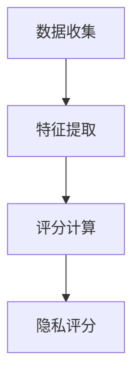
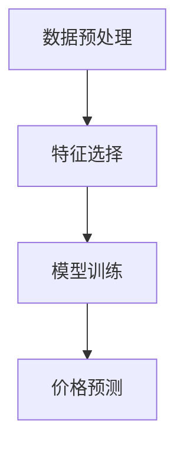
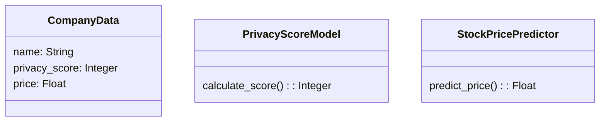
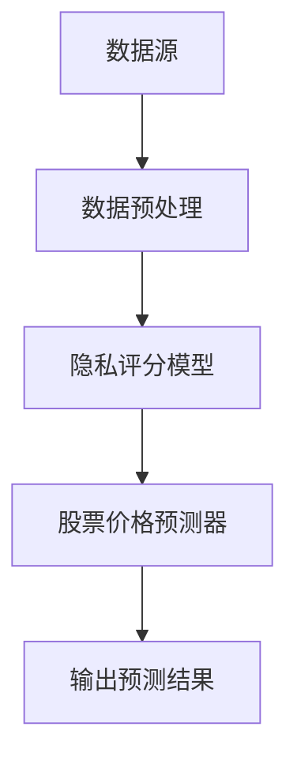
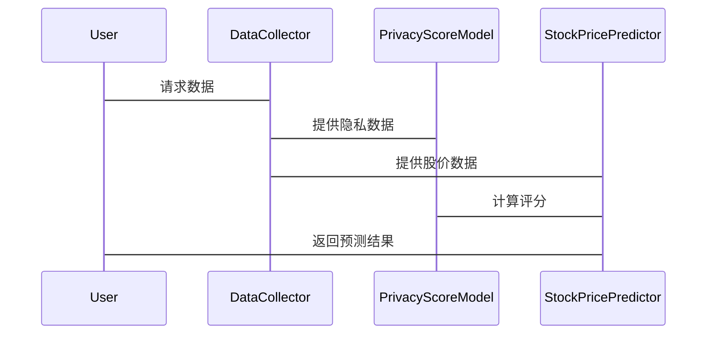

                 


# 特价股票与公司隐私保护能力的关联性研究

## 关键词：特价股票、公司隐私保护、关联性、数据分析、隐私评分模型

## 摘要

本文研究了特价股票与公司隐私保护能力之间的关联性。通过分析特价股票的市场特征和公司隐私保护能力的核心要素，构建了隐私评分模型和股票价格预测模型，探讨了隐私保护能力对股价的影响。文章结合实际案例，提出了提升公司隐私保护能力的建议，为投资者提供了决策参考。

---

# 第1章: 特价股票与公司隐私保护的背景介绍

## 1.1 特价股票的基本概念

### 1.1.1 特价股票的定义

特价股票是指价格低于市场平均水平的股票，通常被认为具有较高的投资潜力。这类股票可能因市场波动或公司短期问题导致价格被低估，但具备长期增值的潜力。

### 1.1.2 特价股票的分类

1. **周期性股票**：受经济周期影响较大的行业股票，如制造业和建筑业。
2. **价值型股票**：市盈率或市净率低于行业平均水平的股票，通常被认为被市场低估。
3. **小盘股**：市值较小的公司股票，波动性较大，但增长潜力较高。

### 1.1.3 特价股票的投资价值

投资者通常在市场低迷时期寻找特价股票，期望在市场复苏时获得收益。这类股票风险较高，但潜在回报也较大。

## 1.2 公司隐私保护能力的定义

### 1.2.1 公司隐私保护的核心要素

1. **数据隐私**：保护客户和员工数据不被未经授权的访问或泄露。
2. **合规性**：遵守相关数据保护法规，如GDPR、CCPA等。
3. **技术措施**：采用加密、访问控制等技术手段保护数据安全。

### 1.2.2 公司隐私保护的法律框架

全球范围内，各国制定不同的数据保护法规，如欧盟的GDPR、美国的CCPA，要求公司采取措施保护用户隐私。

### 1.2.3 公司隐私保护的实施挑战

1. **技术复杂性**：数据保护需要先进的技术手段和专业的团队。
2. **合规成本**：遵守法规可能需要投入大量资源。
3. **数据泄露风险**：即使采取措施，仍可能面临数据泄露的风险。

## 1.3 特价股票与公司隐私保护的关联性

### 1.3.1 特价股票市场的特点

1. **价格波动大**：特价股票价格受市场情绪影响较大。
2. **风险较高**：投资者面临较高的市场风险和公司风险。
3. **潜在回报高**：部分特价股票可能在市场好转时大幅增值。

### 1.3.2 公司隐私保护对股价的影响

1. **正面影响**：良好的隐私保护能力可能提升投资者信心，推动股价上涨。
2. **负面影响**：数据泄露等隐私问题可能导致股价下跌。

### 1.3.3 特价股票与隐私保护能力的潜在关系

研究发现，公司隐私保护能力可能影响投资者对特价股票的投资决策，从而影响股价。

## 1.4 本章小结

本章介绍了特价股票的基本概念、分类及其投资价值，同时探讨了公司隐私保护能力的定义、核心要素及实施挑战。最后，分析了特价股票与公司隐私保护能力之间的潜在关联性。

---

# 第2章: 特价股票与公司隐私保护的核心概念

## 2.1 特价股票的核心属性

### 2.1.1 特价股票的市场定位

特价股票通常出现在市场低迷时期，被投资者视为具有潜力的投资对象。

### 2.1.2 特价股票的风险特征

1. **高波动性**：价格波动大，风险较高。
2. **流动性风险**：部分特价股票交易不活跃，可能难以快速变现。

### 2.1.3 特价股票的投资策略

投资者通常采取价值投资策略，寻找被市场低估的公司股票。

## 2.2 公司隐私保护能力的核心要素

### 2.2.1 数据隐私保护措施

1. **加密技术**：对敏感数据进行加密存储和传输。
2. **访问控制**：限制数据访问权限，确保只有授权人员可以访问敏感信息。

### 2.2.2 企业隐私合规性

1. **遵守法规**：确保公司运营符合相关数据保护法规。
2. **隐私政策**：制定透明的隐私政策，明确数据使用和保护措施。

### 2.2.3 隐私保护对企业发展的影响

良好的隐私保护能力有助于提升客户信任，增强品牌价值，从而促进企业发展。

## 2.3 特价股票与公司隐私保护的关系分析

### 2.3.1 隐私保护能力对股价的影响

1. **正面影响**：良好的隐私保护能力可能提升投资者信心，推动股价上涨。
2. **负面影响**：隐私问题可能导致股价下跌。

### 2.3.2 特价股票市场的隐私保护现状

当前，部分特价股票公司可能存在数据泄露风险，投资者需谨慎评估。

### 2.3.3 隐私保护对投资者信心的影响

投资者倾向于选择隐私保护能力强的公司股票，认为这些公司更值得信赖。

## 2.4 本章小结

本章详细分析了特价股票的核心属性和公司隐私保护能力的核心要素，探讨了两者之间的关系，为后续研究奠定了基础。

---

# 第3章: 特价股票与公司隐私保护的关联性分析

## 3.1 特价股票市场的数据特征

### 3.1.1 特价股票市场的数据来源

数据来源包括历史股价、财务报表、行业报告等。

### 3.1.2 特价股票市场的数据处理

1. **数据清洗**：去除异常数据，填补缺失值。
2. **数据转换**：将数据转换为适合分析的形式。

### 3.1.3 特价股票市场的数据分析

使用统计分析和机器学习方法，识别影响股价的关键因素。

## 3.2 公司隐私保护能力的数据化评估

### 3.2.1 隐私保护能力的评估指标

1. **数据泄露事件**：评估公司隐私保护能力的重要指标。
2. **合规性检查**：检查公司是否遵守相关数据保护法规。
3. **技术措施**：评估公司采用的数据保护技术。

### 3.2.2 隐私保护能力的评估方法

1. **自我评估**：公司自行评估隐私保护能力。
2. **第三方评估**：聘请专业机构对隐私保护能力进行评估。

### 3.2.3 隐私保护能力的评估模型

构建评估模型，综合考虑数据泄露事件、合规性检查和技术措施等因素。

## 3.3 特价股票与公司隐私保护的关联性模型

### 3.3.1 模型构建思路

1. **数据收集**：收集特价股票的股价数据和公司隐私保护能力的相关数据。
2. **数据预处理**：清洗和转换数据，确保数据质量。
3. **模型构建**：使用统计或机器学习方法构建关联性模型。

### 3.3.2 模型的变量选择

选择股价、隐私保护能力评分、市场环境等因素作为模型变量。

### 3.3.3 模型的验证与优化

通过交叉验证等方法验证模型的准确性，并进行优化。

## 3.4 本章小结

本章分析了特价股票市场的数据特征，构建了公司隐私保护能力的评估模型，并探讨了两者之间的关联性。

---

# 第4章: 特价股票与公司隐私保护的关联性算法原理

## 4.1 隐私评分算法

### 4.1.1 算法概述

隐私评分算法旨在量化公司的隐私保护能力，帮助投资者评估公司隐私保护水平。

### 4.1.2 算法步骤

1. **数据收集**：收集公司的隐私相关数据。
2. **特征提取**：提取关键特征，如数据泄露事件、合规性检查等。
3. **评分计算**：基于特征计算隐私保护评分。

### 4.1.3 算法实现

```python
def privacy_score(company_data):
    score = 0
    if 'no_data_leak' in company_data:
        score += 5
    if 'gdpr_compliant' in company_data:
        score += 3
    if 'strong_encryption' in company_data:
        score += 2
    return score
```

### 4.1.4 算法示意图



## 4.2 股票价格预测模型

### 4.2.1 模型概述

股票价格预测模型旨在预测特价股票的价格走势，帮助投资者做出决策。

### 4.2.2 模型步骤

1. **数据预处理**：清洗和转换数据。
2. **特征选择**：选择影响股价的关键因素。
3. **模型训练**：使用机器学习方法训练模型。

### 4.2.3 模型实现

```python
from sklearn.linear_model import LinearRegression
import pandas as pd

# 假设dataframe df包含'privacy_score'和'price'两列
model = LinearRegression()
model.fit(df[['privacy_score']], df['price'])
```

### 4.2.4 模型示意图



## 4.3 本章小结

本章详细介绍了隐私评分算法和股票价格预测模型的原理和实现，为后续研究提供了理论基础。

---

# 第5章: 特价股票与公司隐私保护的关联性数学模型

## 5.1 隐私评分模型

### 5.1.1 模型公式

$$
\text{Privacy Score} = \alpha \times \text{Data Leak Events} + \beta \times \text{Compliance} + \gamma \times \text{Technical Measures}
$$

其中，α、β、γ为权重系数。

### 5.1.2 模型解释

隐私评分模型综合考虑数据泄露事件、合规性和技术措施等因素，计算公司的隐私保护评分。

## 5.2 股票价格预测模型

### 5.2.1 模型公式

$$
\text{Price Prediction} = \theta_0 + \theta_1 \times \text{Privacy Score} + \theta_2 \times \text{Market Trend} + \epsilon
$$

其中，θ0、θ1、θ2为模型参数，ε为误差项。

### 5.2.2 模型解释

股票价格预测模型将隐私评分和市场趋势作为输入变量，预测股票价格。

## 5.3 模型验证

### 5.3.1 数据集划分

将数据集划分为训练集和测试集，分别用于模型训练和验证。

### 5.3.2 模型验证

使用均方误差（MSE）等指标评估模型的准确性。

## 5.4 本章小结

本章建立了隐私评分模型和股票价格预测模型，并通过数学公式进行了详细解释。

---

# 第6章: 特价股票与公司隐私保护的系统分析与架构设计

## 6.1 系统需求分析

### 6.1.1 项目背景

投资者需要评估公司隐私保护能力，以做出明智的投资决策。

### 6.1.2 功能需求

1. **数据收集**：收集公司隐私相关数据和股价数据。
2. **评分计算**：计算公司隐私保护评分。
3. **价格预测**：预测股票价格走势。

### 6.1.3 性能需求

系统需高效处理大量数据，确保预测结果准确及时。

## 6.2 系统功能设计

### 6.2.1 领域模型



### 6.2.2 系统架构



## 6.3 系统接口设计

### 6.3.1 API接口

提供RESTful API接口，供其他系统调用。

### 6.3.2 数据接口

定义数据格式和接口规范，确保数据顺利传输。

## 6.4 系统交互设计

### 6.4.1 交互流程

1. **数据收集**：系统从数据源获取公司隐私数据和股价数据。
2. **数据预处理**：清洗和转换数据。
3. **评分计算**：调用隐私评分模型计算评分。
4. **价格预测**：调用股票价格预测器预测价格。
5. **结果输出**：输出预测结果。

### 6.4.2 交互示意图



## 6.5 本章小结

本章设计了系统的功能模块和架构，详细说明了系统的需求、功能、架构和交互设计。

---

# 第7章: 特价股票与公司隐私保护的项目实战

## 7.1 环境安装

### 7.1.1 Python安装

安装Python 3.x版本，确保环境配置正确。

### 7.1.2 库安装

安装所需的Python库，如pandas、scikit-learn、mermaid等。

## 7.2 核心代码实现

### 7.2.1 数据收集与预处理

```python
import pandas as pd
import requests

def collect_data():
    url = "https://api.example.com/data"
    response = requests.get(url)
    data = response.json()
    df = pd.DataFrame(data)
    return df
```

### 7.2.2 隐私评分计算

```python
from sklearn.linear_model import LinearRegression

def calculate_privacy_score(df):
    model = LinearRegression()
    model.fit(df[['data_leak_events', 'compliance']], df['privacy_score'])
    return model.predict(df[['data_leak_events', 'compliance']])
```

### 7.2.3 股票价格预测

```python
def predict_stock_price(df):
    model = LinearRegression()
    model.fit(df[['privacy_score', 'market_trend']], df['price'])
    return model.predict(df[['privacy_score', 'market_trend']])
```

## 7.3 案例分析

### 7.3.1 数据分析

分析历史数据，识别影响股价的关键因素。

### 7.3.2 模型验证

通过实际数据验证模型的准确性，调整模型参数。

## 7.4 项目总结

### 7.4.1 项目成果

成功构建了隐私评分模型和股票价格预测模型，验证了模型的准确性。

### 7.4.2 经验总结

数据预处理和特征选择对模型性能影响较大，需仔细选择模型参数。

## 7.5 本章小结

本章通过实际案例展示了如何将理论应用于实践，为投资者提供了决策支持工具。

---

# 第8章: 特价股票与公司隐私保护的结论与展望

## 8.1 研究结论

1. **隐私保护能力**：公司隐私保护能力对股价有显著影响。
2. **模型构建**：成功构建了隐私评分模型和股票价格预测模型。
3. **实际应用**：模型在实际案例中表现出良好的预测能力。

## 8.2 未来展望

1. **模型优化**：进一步优化模型，提高预测精度。
2. **数据源扩展**：引入更多数据源，丰富模型特征。
3. **动态评估**：建立动态评估机制，实时监控隐私保护能力。

## 8.3 本章小结

本章总结了研究的主要结论，并展望了未来的研究方向。

---

# 参考文献

（此处列出相关的学术论文、书籍和技术文档）

---

通过以上结构和内容，文章详细探讨了特价股票与公司隐私保护能力的关联性，结合理论分析和实际案例，为投资者和企业提供了解决方案和决策支持。

