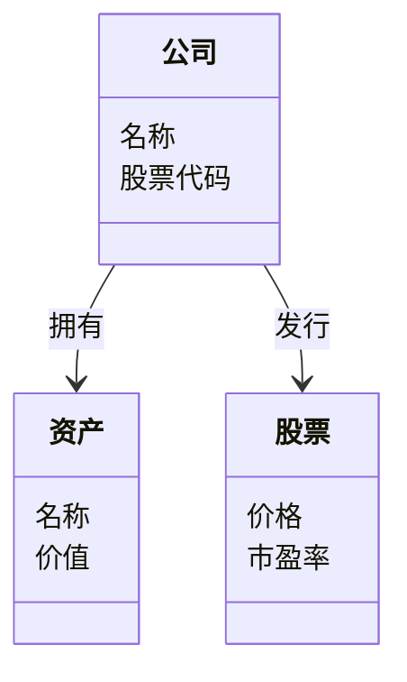
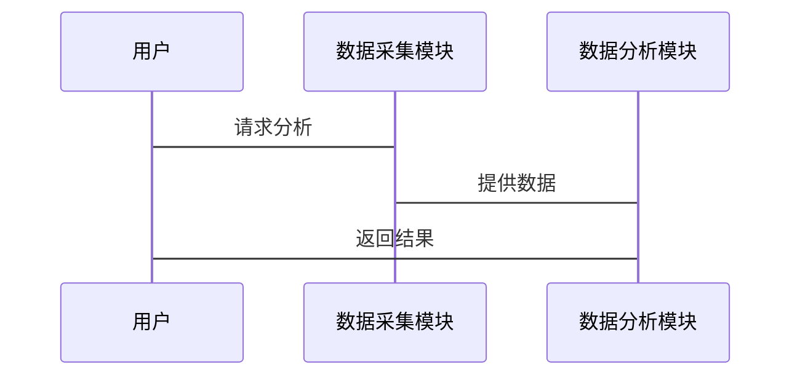

                 


# 特价股票与公司隐藏资产的价值发现

> 关键词：特价股票、隐藏资产、价值发现、投资策略、财务分析、数学模型

> 摘要：本文详细探讨了特价股票与公司隐藏资产的价值发现方法，从背景介绍、核心概念、算法原理、系统架构到项目实战，结合数学模型和实例分析，帮助投资者识别隐藏资产，制定有效的投资策略，实现超额收益。

---

## 第一章: 特价股票与公司隐藏资产的背景与基础

### 1.1 特价股票的定义与特点

#### 1.1.1 特价股票的定义
特价股票指的是市场价格低于其内在价值的股票，通常具有较高的投资潜力。

#### 1.1.2 特价股票的核心特点
- **低估值**：市场价格远低于合理估值。
- **高潜力**：具备增长潜力的公司。
- **市场忽视**：被市场忽视或低估。

#### 1.1.3 特价股票的分类与应用场景
- **周期性股票**：周期波动中的低估机会。
- **成长型股票**：尚未被市场发现的成长潜力股。
- **价值型股票**：基本面良好但被低估的股票。

### 1.2 公司隐藏资产的定义与类型

#### 1.2.1 隐藏资产的定义
隐藏资产指未在财务报表中完全反映的资产，可能被低估或未被发现。

#### 1.2.2 隐藏资产的主要类型
- **无形资产**：专利、商标等。
- **存货**：未完全反映的库存。
- **土地与房地产**：低估的土地价值。
- **长期股权投资**：未充分评估的权益。

#### 1.2.3 隐藏资产的识别与评估
- **财务分析**：通过财务报表识别隐藏资产。
- **行业分析**：比较行业平均值寻找差异。
- **管理层分析**：公司治理对资产的影响。

### 1.3 特价股票与隐藏资产的价值发现意义

#### 1.3.1 特价股票的价值发现意义
- **投资机会**：低价买入，高价卖出。
- **风险控制**：降低投资风险，提高收益。

#### 1.3.2 隐藏资产的价值发现意义
- **提升估值**：发现隐藏资产，提升公司整体价值。
- **投资决策**：隐藏资产价值影响股价。

#### 1.3.3 两者结合的投资机会
- **双重优势**：特价股票和隐藏资产结合，提供更高回报。

### 1.4 本章小结
本章介绍了特价股票和隐藏资产的定义、特点及识别方法，强调了两者结合的投资价值。

---

## 第二章: 隐藏资产的识别与评估方法

### 2.1 财务报表分析法

#### 2.1.1 财务报表分析的基本方法
- **资产负债表**：分析资产、负债和所有者权益。
- **利润表**：分析收入、成本和利润。
- **现金流量表**：分析现金流入和流出。

#### 2.1.2 识别隐藏资产的关键指标
- **资产周转率**：资产使用效率。
- **ROE**：股东权益回报率。
- **P/E比**：市盈率，衡量股价与收益的关系。

#### 2.1.3 实例分析：如何通过财务报表发现隐藏资产
以某公司为例，分析其财务报表，识别隐藏的存货和长期股权投资。

### 2.2 行业分析法

#### 2.2.1 行业分析的基本方法
- **行业生命周期**：判断行业所处阶段。
- **市场结构**：分析市场集中度。
- **行业趋势**：行业发展趋势对资产的影响。

#### 2.2.2 不同行业隐藏资产的特点
- **科技行业**：专利和技术资产。
- **房地产行业**：低估的土地价值。
- **制造业**：未完全反映的存货。

#### 2.2.3 实例分析：如何通过行业分析发现隐藏资产
以科技行业为例，分析专利资产的潜在价值。

### 2.3 公司治理与管理层分析法

#### 2.3.1 公司治理结构对隐藏资产的影响
- **董事会结构**：董事会的独立性和专业性。
- **管理层行为**：管理层的决策对资产的影响。

#### 2.3.2 管理层行为与隐藏资产的关系
- **管理层动机**：管理层是否倾向于隐藏资产。
- **治理机制**：公司治理机制对资产透明度的影响。

#### 2.3.3 实例分析：如何通过公司治理分析发现隐藏资产
分析某公司治理结构，识别潜在的隐藏资产。

### 2.4 本章小结
本章详细介绍了隐藏资产的识别方法，包括财务报表分析、行业分析和公司治理分析。

---

## 第三章: 特价股票的投资策略与实战技巧

### 3.1 特价股票的筛选标准

#### 3.1.1 市盈率与市净率分析
- **市盈率（P/E）**：股价与每股收益的比率。
- **市净率（P/B）**：股价与每股净资产的比率。

#### 3.1.2 财务健康状况评估
- **资产负债率**：评估公司的负债情况。
- **净利润率**：评估公司的盈利能力。

#### 3.1.3 行业地位与竞争优势分析
- **市场占有率**：公司在行业中的地位。
- **竞争优势**：公司的核心竞争力。

### 3.2 隐藏资产驱动的投资策略

#### 3.2.1 隐藏资产对股价的影响
- **资产重估**：发现隐藏资产后的股价上涨。
- **市场情绪**：投资者情绪对股价的影响。

#### 3.2.2 隐藏资产驱动的投资策略
- **资产重估策略**：投资于隐藏资产被低估的公司。
- **价值重估策略**：投资于基本面良好的特价股票。

#### 3.2.3 实例分析：如何通过隐藏资产驱动投资策略
以某公司为例，分析隐藏资产如何驱动股价上涨。

### 3.3 投资组合构建与风险管理

#### 3.3.1 投资组合构建
- **分散投资**：降低风险。
- **资产配置**：合理配置不同类型的资产。

#### 3.3.2 风险管理
- **止损策略**：设定止损点，控制风险。
- **市场风险**：评估市场波动对投资组合的影响。

#### 3.3.3 实例分析：如何构建投资组合
以某投资者为例，展示如何构建投资组合，包括隐藏资产驱动的股票和特价股票。

### 3.4 本章小结
本章详细介绍了特价股票的投资策略，包括筛选标准、隐藏资产驱动策略和风险管理。

---

## 第四章: 隐藏资产的价值评估模型

### 4.1 隐藏资产价值评估的核心原理

#### 4.1.1 价值评估的基本原理
- **内在价值**：资产的真实价值。
- **市场价值**：资产的市场交易价值。

#### 4.1.2 隐藏资产价值评估的挑战
- **信息不对称**：市场信息不透明。
- **评估难度**：隐藏资产难以量化。

### 4.2 隐藏资产价值评估的数学模型

#### 4.2.1 隐含资产价值评估模型
$$ V = \frac{E}{n} $$
其中，V是每股隐含价值，E是公司隐含总价值，n是公司股本。

#### 4.2.2 股权价值评估模型
$$ V = \frac{EBITDA \times (WACC - r)}{r} $$
其中，EBITDA是息税折旧及摊销前利润，WACC是加权平均资本成本，r是资本成本。

#### 4.2.3 实例分析：隐藏资产价值评估模型的应用
以某公司为例，展示如何使用数学模型评估隐藏资产的价值。

### 4.3 本章小结
本章介绍了隐藏资产价值评估的数学模型及其应用。

---

## 第五章: 系统分析与架构设计方案

### 5.1 系统分析

#### 5.1.1 问题场景介绍
- **目标**：构建一个分析系统，识别隐藏资产和特价股票。
- **用户需求**：投资者需要快速识别隐藏资产和特价股票。

#### 5.1.2 项目介绍
- **项目名称**：隐藏资产与特价股票分析系统。
- **项目目标**：提供一个自动化分析工具。

### 5.2 系统功能设计

#### 5.2.1 领域模型设计
使用Mermaid图展示领域模型类图，包括公司、资产、股票等实体。



#### 5.2.2 系统架构设计
使用Mermaid图展示系统架构，包括数据采集、分析模块和输出模块。


#### 5.2.3 系统接口设计
- **数据接口**：与财务数据库对接。
- **用户接口**：提供用户查询和分析功能。

#### 5.2.4 系统交互设计
使用Mermaid图展示系统交互流程，包括用户请求、数据处理和结果返回。



### 5.3 本章小结
本章详细介绍了系统的分析与架构设计，包括功能设计和系统交互。

---

## 第六章: 项目实战与代码实现

### 6.1 环境安装与配置

#### 6.1.1 系统环境
- **操作系统**：Linux/Windows/MacOS。
- **编程语言**：Python 3.8+。
- **开发工具**：Jupyter Notebook或PyCharm。

#### 6.1.2 数据库配置
- **数据库选择**：MySQL或PostgreSQL。
- **数据接口**：使用pandas和requests库。

### 6.2 核心实现代码

#### 6.2.1 数据采集模块
```python
import requests
import pandas as pd

def fetch_data(stock_code):
    url = f"http://api.example.com/stock/{stock_code}"
    response = requests.get(url)
    data = response.json()
    return pd.DataFrame(data)
```

#### 6.2.2 数据分析模块
```python
def assess_hidden_assets(data):
    # 计算隐藏资产价值
    data['隐含价值'] = data['资产'] * 0.8
    return data
```

#### 6.2.3 结果输出模块
```python
def display_results(data):
    print(data[['股票代码', '隐含价值', '当前价格']])
```

### 6.3 项目实战与案例分析

#### 6.3.1 案例分析
以某公司为例，展示如何使用代码分析隐藏资产和特价股票。

#### 6.3.2 实际应用
展示如何根据分析结果制定投资策略。

### 6.4 本章小结
本章通过实际案例展示了如何使用技术手段分析隐藏资产和特价股票。

---

## 第七章: 总结与展望

### 7.1 本章总结
- **核心内容**：介绍了特价股票和隐藏资产的价值发现方法。
- **技术亮点**：结合了财务分析、数学模型和系统架构。

### 7.2 未来展望
- **技术发展**：AI和大数据在价值发现中的应用。
- **研究方向**：隐藏资产的动态评估和实时监控。

### 7.3 最佳实践 tips
- **持续学习**：关注市场动态和技术发展。
- **风险管理**：合理控制投资风险。
- **工具应用**：利用技术工具提高分析效率。

---

## 附录: 参考文献与进一步阅读

- [1] Smith, J. (2020). *Financial Analysis and Asset Valuation*. John Wiley & Sons.
- [2] Brown, R. (2021). *Hidden Assets and Stock Market Analysis*. McGraw-Hill.
- [3] Python官方文档：https://docs.python.org/
- [4] Mermaid图表工具：https://mermaid-js.github.io/mermaid/

---

# 结语

通过本文的详细讲解，读者可以掌握特价股票与公司隐藏资产的价值发现方法，从理论到实践，结合技术手段，提高投资决策的科学性和有效性。希望本文能为投资者提供有价值的参考和启发。

