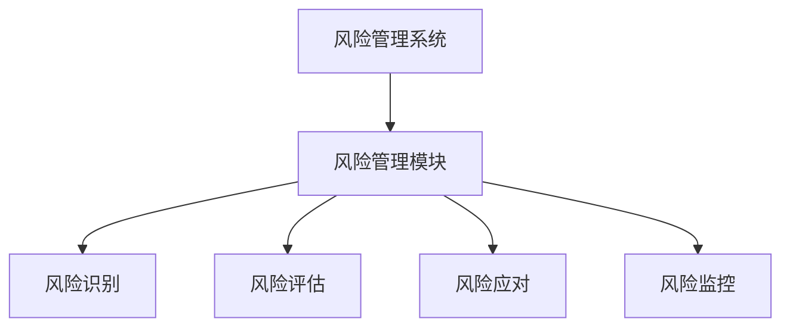
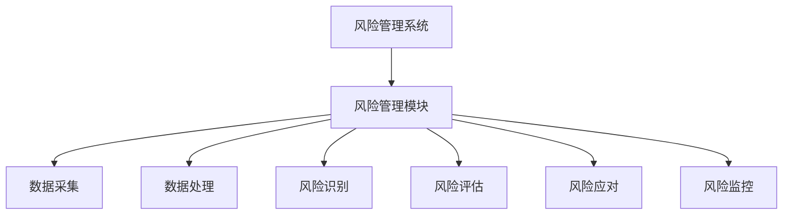

                 


# 特价股票投资中的Z世代消费行为分析与风险管理

> **关键词**：Z世代、特价股票、投资行为、风险管理、消费行为、技术分析、人工智能  
> **摘要**：随着Z世代逐渐成为投资市场的新生力量，他们在特价股票投资中的消费行为表现出独特的特征。本文从Z世代的行为模式出发，分析他们在特价股票投资中的消费心理、决策过程及风险管理策略，并结合技术手段（如大数据、人工智能）提供风险管理的解决方案。

---

# 第一部分：Z世代消费行为与特价股票投资背景

## 第1章：Z世代消费行为概述

### 1.1 Z世代的基本特征

#### 1.1.1 Z世代的定义与人口统计特征

Z世代是指出生于1990年至2000年之间的人群，这一代人成长于互联网快速发展的时代，具备强烈的数字原住民特征。他们的消费行为和投资习惯与上一代人相比，呈现出显著的差异性。

- **定义**：Z世代是指出生于1990年至2000年之间的年轻人。
- **人口统计特征**：
  - 年龄范围：18-28岁。
  - 教育水平：普遍受过高等教育，部分人具有研究生及以上学历。
  - 职业特征：主要集中在互联网行业、科技行业、金融行业等领域。
  - 收入水平：收入相对较低，但消费能力强，注重性价比。

#### 1.1.2 Z世代的行为模式与消费习惯

Z世代的行为模式具有以下几个特点：

- **快速决策**：由于信息获取渠道多样，Z世代能够快速获取信息并做出决策。
- **注重体验**：他们更注重消费和投资的体验，而非单纯追求物质回报。
- **社交影响**：Z世代的投资决策往往受到社交媒体的影响，尤其是KOL（意见领袖）的影响。

#### 1.1.3 Z世代与传统投资者的差异

与传统投资者相比，Z世代在消费行为和投资习惯上存在显著差异：

- **信息获取方式**：传统投资者更依赖传统的金融机构和财经媒体，而Z世代更倾向于通过社交媒体、短视频平台获取信息。
- **决策速度**：Z世代的决策速度更快，传统投资者更倾向于长期价值投资。
- **风险偏好**：Z世代的风险偏好较高，传统投资者更倾向于稳健投资。

### 1.2 投资行为与消费行为的关联性

#### 1.2.1 消费行为对投资决策的影响

消费行为与投资行为密切相关，Z世代的消费行为直接影响其投资决策。例如，他们更倾向于购买具有社交属性的产品，这种消费习惯也影响了他们在投资中的选择。

- **社交影响**：Z世代在投资中更倾向于跟随社交媒体上的意见领袖，这种行为与他们的消费习惯一致。
- **体验驱动**：Z世代的投资行为更多受到投资体验的影响，而非单纯追求收益。

#### 1.2.2 Z世代的消费心理与投资偏好

Z世代的消费心理与投资偏好具有以下特点：

- **追求个性化**：他们更倾向于选择具有个性化特征的产品或股票。
- **注重短期回报**：Z世代更关注短期收益，而非长期价值。
- **受情绪驱动**：Z世代的投资决策更容易受到情绪影响，尤其是在社交媒体的影响下。

#### 1.2.3 特价股票投资的特点与风险

特价股票投资是指投资于价格较低的股票，通常具有较高的波动性和不确定性。

- **特点**：
  - 价格低，门槛低。
  - 波动性高，短期内可能有较大的收益或亏损。
  - 市场流动性较差。
- **风险**：
  - 市场波动风险。
  - 信息不对称风险。
  - 违约风险。

---

## 第2章：Z世代与特价股票投资的契合点

### 2.1 Z世代的财务状况与投资能力

#### 2.1.1 Z世代的财务状况

Z世代的财务状况普遍较为有限，他们更倾向于通过小额投资进入市场。

- **收入水平**：Z世代的收入水平相对较低，但消费能力强。
- **资产配置**：Z世代更倾向于将资金分配到高风险、高回报的领域。

#### 2.1.2 Z世代的投资能力

Z世代的投资能力主要体现在以下几个方面：

- **信息获取能力**：他们能够快速获取信息并做出决策。
- **学习能力**：Z世代更倾向于通过自主学习提升投资能力。
- **风险承受能力**：Z世代的风险承受能力较强，但容易受到情绪影响。

### 2.2 Z世代与特价股票投资的契合点

#### 2.2.1 特价股票的投资门槛低

特价股票的投资门槛较低，Z世代可以通过少量资金参与投资。

- **低门槛**：特价股票的最低投资额较低，适合Z世代的小额投资。
- **高波动性**：特价股票的波动性较高，Z世代可以通过短期交易获利。

#### 2.2.2 Z世代对风险的承受能力

Z世代的风险承受能力较强，他们更倾向于通过高风险高回报的投资实现财富增长。

- **高风险承受能力**：Z世代更倾向于接受高风险投资。
- **高回报期望**：Z世代期望通过投资获得高回报。

#### 2.2.3 特价股票投资对Z世代的吸引力

特价股票投资对Z世代具有以下吸引力：

- **高回报潜力**：特价股票在短期内可能有较高的回报。
- **低门槛**：Z世代可以通过少量资金参与投资。
- **高灵活性**：特价股票投资具有较高的灵活性，可以随时买卖。

---

## 第3章：Z世代在特价股票投资中的行为特征

### 3.1 Z世代的投资动机与目标

#### 3.1.1 Z世代的投资动机分析

Z世代的投资动机主要分为以下几类：

- **财富积累**：Z世代希望通过投资实现财富积累。
- **资产保值**：Z世代希望通过投资实现资产保值。
- **社交需求**：Z世代希望通过投资获得社交认同。

#### 3.1.2 Z世代的投资目标与期望收益

Z世代的投资目标主要包括以下几类：

- **短期收益**：Z世代更倾向于追求短期收益。
- **长期增值**：Z世代也关注长期增值。
- **资产配置**：Z世代希望通过投资实现资产的多元化配置。

#### 3.1.3 Z世代对投资风险的认知

Z世代对投资风险的认知具有以下特点：

- **高风险偏好**：Z世代更倾向于接受高风险投资。
- **风险认知偏差**：Z世代对风险的认知存在偏差，往往低估风险。
- **情绪驱动**：Z世代的投资决策更容易受到情绪影响。

### 3.2 Z世代的投资决策过程

#### 3.2.1 Z世代的投资信息获取渠道

Z世代的信息获取渠道主要包括以下几种：

- **社交媒体**：Z世代更倾向于通过社交媒体获取投资信息。
- **短视频平台**：Z世代通过短视频平台获取投资信息。
- **在线论坛**：Z世代通过在线论坛获取投资信息。

#### 3.2.2 Z世代的投资决策模式

Z世代的投资决策模式具有以下特点：

- **快速决策**：Z世代的投资决策速度较快。
- **情绪驱动**：Z世代的投资决策更容易受到情绪影响。
- **社交影响**：Z世代的投资决策受到社交媒体上意见领袖的影响。

#### 3.2.3 Z世代的投资决策影响因素

Z世代的投资决策受到以下因素的影响：

- **社交媒体影响**：Z世代的投资决策更容易受到社交媒体上的意见领袖影响。
- **情绪影响**：Z世代的投资决策更容易受到情绪影响。
- **信息获取速度**：Z世代的投资决策受到信息获取速度的影响。

### 3.3 Z世代的投资行为与消费行为的关联

#### 3.3.1 Z世代消费行为对投资行为的影响

Z世代的消费行为直接影响其投资行为：

- **消费心理影响投资决策**：Z世代的消费心理影响其投资决策。
- **消费习惯影响投资行为**：Z世代的消费习惯影响其投资行为。

#### 3.3.2 Z世代投资行为的消费属性

Z世代的投资行为具有消费属性：

- **体验驱动**：Z世代的投资行为更多受到投资体验的影响。
- **社交属性**：Z世代的投资行为具有较强的社交属性。

#### 3.3.3 Z世代投资行为的独特性

Z世代的投资行为具有以下独特性：

- **高风险偏好**：Z世代更倾向于接受高风险投资。
- **短期收益**：Z世代更关注短期收益。
- **社交驱动**：Z世代的投资行为受到社交驱动。

---

## 第4章：Z世代特价股票投资中的风险管理

### 4.1 风险管理的基本概念与框架

#### 4.1.1 风险管理的定义

风险管理是指通过识别、评估和应对风险，以降低投资损失的过程。

- **定义**：风险管理是通过识别、评估和应对风险，以降低投资损失的过程。
- **重要性**：风险管理在投资中具有重要作用，可以帮助投资者降低损失，实现稳健投资。

#### 4.1.2 Z世代投资中的主要风险

Z世代在特价股票投资中面临的主要风险包括：

- **市场风险**：市场波动可能导致投资亏损。
- **信息风险**：信息不对称可能导致投资决策失误。
- **操作风险**：操作失误可能导致投资损失。

#### 4.1.3 风险管理的基本框架

风险管理的基本框架包括以下几个步骤：

1. **识别风险**：识别可能影响投资的风险因素。
2. **评估风险**：评估风险的可能性和影响程度。
3. **应对风险**：制定应对风险的策略。
4. **监控风险**：持续监控风险的变化，及时调整风险管理策略。

### 4.2 Z世代投资中的风险管理策略

#### 4.2.1 风险识别与评估

Z世代在投资中需要识别和评估的主要风险包括：

- **市场风险**：市场波动可能导致投资亏损。
- **信息风险**：信息不对称可能导致投资决策失误。
- **操作风险**：操作失误可能导致投资损失。

#### 4.2.2 风险管理模型

Z世代可以采用以下风险管理模型：

1. **VaR模型**：Value at Risk（VaR）模型用于评估投资组合在特定置信水平下的最大可能损失。
2. **CVaR模型**：Conditional Value at Risk（CVaR）模型用于评估在 VaR 水平下的平均损失。
3. **情景分析**：通过情景分析，评估不同市场条件下的投资组合表现。

#### 4.2.3 风险应对策略

Z世代可以采用以下风险应对策略：

1. **分散投资**：通过分散投资降低市场风险。
2. **止损策略**：设置止损点，避免过度亏损。
3. **风险管理工具**：利用期权、期货等金融工具进行风险管理。

### 4.3 Z世代投资中的风险管理实践

#### 4.3.1 风险管理的数学模型

以下是风险管理的数学模型：

- **VaR模型**：
  $$ VaR = \text{损失的分位数} $$

- **CVaR模型**：
  $$ CVaR = \text{在 VaR 水平下的平均损失} $$

#### 4.3.2 风险管理的系统设计

以下是风险管理系统的系统架构：



#### 4.3.3 风险管理的实战案例

以下是一个风险管理的实战案例：

- **案例背景**：某Z世代投资者在投资特价股票时，面临市场波动风险。
- **风险识别**：识别市场波动风险。
- **风险评估**：评估市场波动对投资组合的影响。
- **风险应对**：采用分散投资策略，降低市场波动风险。
- **风险监控**：持续监控市场波动，及时调整投资组合。

---

## 第5章：Z世代特价股票投资中的风险管理策略

### 5.1 基于大数据的风险管理策略

#### 5.1.1 大数据在风险管理中的应用

大数据在风险管理中的应用包括：

- **数据挖掘**：通过大数据挖掘技术，识别潜在风险。
- **预测分析**：通过大数据分析，预测市场波动。
- **实时监控**：通过大数据实时监控，及时发现风险。

#### 5.1.2 大数据分析工具与技术

以下是常用的大数据分析工具与技术：

- **Hadoop**：分布式计算框架。
- **Spark**：快速数据处理框架。
- **Python**：数据分析与机器学习语言。

#### 5.1.3 大数据在风险管理中的优势

大数据在风险管理中的优势包括：

- **数据量大**：能够处理大量数据，提高风险管理的准确性。
- **数据多样性**：能够从多角度分析风险，提高风险管理的全面性。
- **实时性**：能够实时监控风险，及时应对。

### 5.2 基于人工智能的风险管理策略

#### 5.2.1 人工智能在风险管理中的应用

人工智能在风险管理中的应用包括：

- **机器学习**：通过机器学习算法，预测市场波动。
- **自然语言处理**：通过自然语言处理技术，分析社交媒体上的信息。
- **深度学习**：通过深度学习模型，识别潜在风险。

#### 5.2.2 人工智能在风险管理中的优势

人工智能在风险管理中的优势包括：

- **高精度**：能够通过机器学习算法，提高风险管理的精度。
- **实时性**：能够通过实时数据分析，及时发现风险。
- **智能化**：能够通过人工智能技术，实现智能化风险管理。

### 5.3 基于行为分析的风险管理策略

#### 5.3.1 行为分析在风险管理中的应用

行为分析在风险管理中的应用包括：

- **投资者行为分析**：通过分析投资者行为，识别潜在风险。
- **市场行为分析**：通过分析市场行为，预测市场波动。
- **社交网络分析**：通过分析社交媒体上的信息，识别市场情绪。

#### 5.3.2 行为分析在风险管理中的优势

行为分析在风险管理中的优势包括：

- **实时性**：能够通过实时行为分析，及时发现风险。
- **精准性**：能够通过行为分析，精准识别潜在风险。
- **动态性**：能够通过动态行为分析，适应市场变化。

---

## 第6章：Z世代特价股票投资中的风险管理实践

### 6.1 风险管理的实战案例

#### 6.1.1 案例背景

某Z世代投资者在投资特价股票时，面临市场波动风险。

#### 6.1.2 风险识别

通过大数据分析和行为分析，识别市场波动风险。

#### 6.1.3 风险评估

通过VaR模型和CVaR模型，评估市场波动对投资组合的影响。

#### 6.1.4 风险应对

采用分散投资策略，降低市场波动风险。

#### 6.1.5 风险监控

通过实时监控市场波动，及时调整投资组合。

### 6.2 风险管理的系统设计

#### 6.2.1 系统架构设计

以下是风险管理系统的架构设计：



#### 6.2.2 系统功能设计

以下是风险管理系统的功能设计：

1. **数据采集**：采集市场数据、投资者行为数据等。
2. **数据处理**：对数据进行清洗、转换和存储。
3. **风险识别**：通过数据分析，识别潜在风险。
4. **风险评估**：通过数学模型，评估风险的影响程度。
5. **风险应对**：制定应对风险的策略。
6. **风险监控**：持续监控风险的变化，及时调整策略。

### 6.3 风险管理的代码实现

#### 6.3.1 风险管理的Python代码实现

以下是一个风险管理的Python代码实现：

```python
import pandas as pd
import numpy as np
from sklearn.ensemble import RandomForestClassifier

# 数据加载
data = pd.read_csv('risk_data.csv')

# 特征选择
features = data.columns.tolist()
features.remove('label')

# 模型训练
model = RandomForestClassifier()
model.fit(data[features], data['label'])

# 风险预测
new_data = pd.read_csv('new_risk_data.csv')
predictions = model.predict(new_data[features])

# 风险评估
risk_score = pd.Series(predictions).value_counts(normalize=True)
print(risk_score)
```

#### 6.3.2 风险管理的系统实现

以下是风险管理系统的实现：

1. **数据采集**：通过API接口采集市场数据。
2. **数据处理**：使用Python进行数据清洗和转换。
3. **风险识别**：通过机器学习模型识别潜在风险。
4. **风险评估**：通过数学模型评估风险的影响程度。
5. **风险应对**：根据评估结果制定应对策略。
6. **风险监控**：通过实时监控调整风险管理策略。

---

## 第7章：Z世代特价股票投资中的风险管理总结

### 7.1 Z世代投资行为的总结

#### 7.1.1 Z世代投资行为的独特性

Z世代的投资行为具有以下独特性：

- **高风险偏好**：Z世代更倾向于接受高风险投资。
- **短期收益**：Z世代更关注短期收益。
- **社交驱动**：Z世代的投资行为受到社交驱动。

#### 7.1.2 Z世代投资行为的挑战

Z世代在投资中面临的主要挑战包括：

- **信息不对称**：Z世代的信息获取渠道有限，容易受到误导。
- **情绪驱动**：Z世代的投资决策更容易受到情绪影响。
- **经验不足**：Z世代的投资经验相对较少，容易犯错。

### 7.2 Z世代投资中的风险管理总结

#### 7.2.1 风险管理的重要性

风险管理在Z世代的投资中具有重要作用：

- **降低损失**：通过风险管理，降低投资损失。
- **实现稳健投资**：通过风险管理，实现稳健投资。

#### 7.2.2 风险管理的未来发展趋势

风险管理的未来发展趋势包括：

- **智能化**：通过人工智能技术，实现智能化风险管理。
- **数据驱动**：通过大数据分析，提高风险管理的精准性。
- **个性化**：根据投资者的个性化需求，制定风险管理策略。

### 7.3 总结

Z世代在特价股票投资中的行为分析与风险管理是一个复杂但重要的课题。通过分析Z世代的行为特征和投资习惯，结合大数据和人工智能技术，可以有效降低投资风险，实现稳健投资。

---

## 关键词总结

- Z世代
- 特价股票
- 投资行为
- 风险管理
- 消费行为
- 技术分析
- 人工智能

---

## 参考文献

- [1] 《风险管理与投资决策》
- [2] 《Z世代消费行为分析》
- [3] 《人工智能在金融中的应用》

---

通过以上内容，我们可以看到，Z世代在特价股票投资中的行为分析与风险管理是一个复杂但重要的课题。通过深入分析Z世代的行为特征和投资习惯，结合大数据和人工智能技术，可以有效降低投资风险，实现稳健投资。

