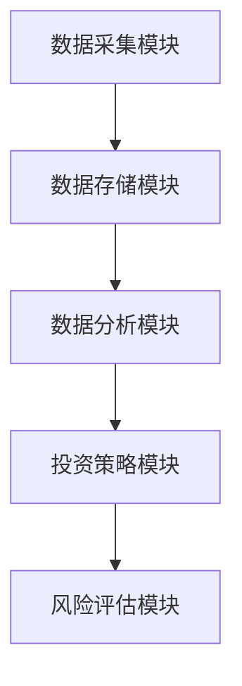
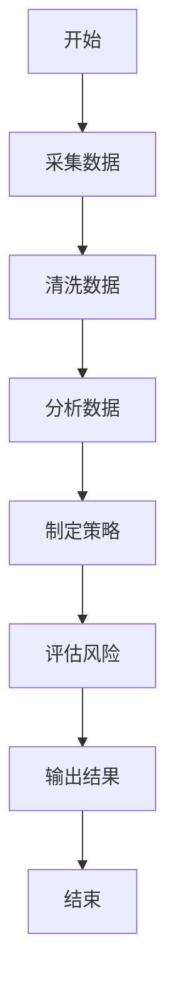

                 

# 特价股票投资中的人口结构数字红利趋势考量

> 关键词：特价股票、人口结构、数字红利、趋势分析、投资策略

> 摘要：本文从人口结构和数字红利的角度，分析了特价股票投资中的趋势考量。通过数学建模和系统分析，探讨了人口结构对经济和股票市场的影响，以及数字红利对投资机会的推动作用。结合实战案例，提出了基于人口结构和数字红利的特价股票投资策略。

---

# 第1章: 特价股票与投资概述

## 1.1 特价股票的定义与特点

### 1.1.1 特价股票的定义
特价股票是指价格相对较低的股票，通常具有较高的投资潜力。这类股票可能因市场低估或公司暂时的困境而被低价出售，但具备长期增值的潜力。

### 1.1.2 特价股票的核心特点
- **低估值**：市场价格低于内在价值。
- **高波动性**：价格波动较大，存在短期风险。
- **潜在回报**：具备长期增值的潜力。

### 1.1.3 特价股票与普通股票的区别
- **估值水平**：特价股票通常被市场低估，而普通股票可能价格合理或高估。
- **风险与回报**：特价股票风险较高，但潜在回报也更大。
- **投资者类型**：特价股票更适合长期投资者，而普通股票适合各类投资者。

## 1.2 投资的基本概念与原则

### 1.2.1 投资的基本概念
投资是将资金投入某个领域，以期获得未来收益的行为。投资可以是股票、债券、房地产等多种形式。

### 1.2.2 投资的基本原则
- **分散投资**：避免将所有资金投入单一资产。
- **长期投资**：耐心持有优质资产，避免频繁交易。
- **风险管理**：评估和控制投资风险，避免过度杠杆。

### 1.2.3 投资的分类与应用场景
- **股票投资**：适合长期增值。
- **债券投资**：适合稳健型投资者。
- **短期投资**：适合需要快速资金流动的投资者。

## 1.3 人口结构对投资的影响

### 1.3.1 人口结构的定义与分类
人口结构包括年龄、性别、家庭结构等因素，反映了不同年龄段人口的分布情况。

### 1.3.2 人口结构对经济的影响
- **人口红利**：年轻人口多，劳动年龄人口比例高，推动经济增长。
- **人口老龄化**：老年人口比例高，增加社会负担，影响经济增长。

### 1.3.3 人口结构对股票投资的影响
- **行业选择**：老龄化社会可能偏好医疗、养老服务等行业。
- **公司估值**：劳动年龄人口比例高的地区，公司盈利可能更高。

## 1.4 数字红利的概念与趋势分析

### 1.4.1 数字红利的定义
数字红利是指数字技术带来的经济效益，包括效率提升、成本降低和新商业模式的出现。

### 1.4.2 数字红利的核心特征
- **技术驱动**：依赖于数字技术的进步。
- **创新驱动**：依赖于创新商业模式和产品。
- **全球化**：数字红利可以通过网络覆盖全球市场。

### 1.4.3 数字红利的趋势分析
- **技术进步**：人工智能、大数据等技术推动数字红利持续增长。
- **行业融合**：数字技术与传统行业深度融合，创造新价值。
- **政策支持**：政府通过政策引导，推动数字经济发展。

## 1.5 本章小结
本章介绍了特价股票的基本概念和投资原则，分析了人口结构和数字红利对投资的影响，为后续分析奠定了基础。

---

# 第2章: 人口结构的数学建模

## 2.1 人口结构的核心要素

### 2.1.1 年龄分布
年龄分布反映了不同年龄段人口的数量比例，影响劳动力供给和消费能力。

### 2.1.2 性别比例
性别比例影响社会结构和消费习惯，例如男性可能更倾向于投资，女性可能更关注消费。

### 2.1.3 家庭结构
家庭结构影响消费模式和投资偏好，例如家庭数量增加可能推动房地产需求。

## 2.2 人口增长的数学模型

### 2.2.1 指数增长模型
指数增长模型描述了人口数量随时间呈指数增长的情况：
$$ P(t) = P_0 \times e^{rt} $$
其中，\( P_0 \) 是初始人口，\( r \) 是增长率，\( t \) 是时间。

### 2.2.2 对数增长模型
对数增长模型描述了人口增长速度逐渐减缓的情况：
$$ \ln(P(t)) = \ln(P_0) + rt $$

### 2.2.3 人口结构的均衡模型
均衡模型描述了人口结构在长期趋势中的稳定状态：
$$ \frac{dP}{dt} = rP - dP $$
其中，\( r \) 是出生率，\( d \) 是死亡率。

## 2.3 人口结构与经济发展的关系

### 2.3.1 人口红利的定义
人口红利是指劳动年龄人口比例较高，能够推动经济增长。

### 2.3.2 人口红利的数学表达
$$ \text{人口红利} = \frac{\text{劳动年龄人口}}{\text{总人口}} $$

### 2.3.3 人口红利的经济影响
- **经济增长**：人口红利增加劳动力供给，推动生产效率提升。
- **储蓄与投资**：年轻人口增加储蓄，为投资提供资金。

## 2.4 数字红利的数学模型

### 2.4.1 数字技术的普及与渗透
数字技术的普及可以用指数函数表示：
$$ D(t) = D_0 \times e^{kt} $$
其中，\( D_0 \) 是初始数字技术渗透率，\( k \) 是渗透率增长率。

### 2.4.2 数字红利的量化指标
数字红利可以通过以下公式量化：
$$ \text{数字红利} = \frac{\text{数字经济规模}}{\text{GDP}} $$

### 2.4.3 数字红利的动态变化
数字红利的变化可以用微分方程表示：
$$ \frac{dD}{dt} = aD + b $$

## 2.5 本章小结
本章通过数学建模，分析了人口结构和数字红利的变化趋势，为投资分析提供了理论基础。

---

# 第3章: 股票投资的趋势模型

## 3.1 股票市场的基本趋势分析

### 3.1.1 长期趋势
股票市场的长期趋势受经济基本面影响，可以用以下模型表示：
$$ P_{\text{长期}} = \mu \times t + \sigma \times \epsilon $$

### 3.1.2 中期趋势
中期趋势受市场情绪和宏观经济政策影响，可以用移动平均线表示：
$$ P_{\text{中期}} = \frac{1}{n} \sum_{i=1}^{n} P_i $$

### 3.1.3 短期趋势
短期趋势受市场波动影响，可以用随机游走模型表示：
$$ P_{\text{短期}} = P_{\text{前一期}} + \epsilon $$

## 3.2 人口结构对股票市场的长期影响

### 3.2.1 人口老龄化对股票市场的影响
人口老龄化可能导致医疗、养老服务等行业的需求增加，从而推动相关股票价格上涨。

### 3.2.2 人口年轻化对股票市场的影响
人口年轻化可能导致消费、科技等行业的需求增加，从而推动相关股票价格上涨。

### 3.2.3 人口结构变化的周期性
人口结构的变化具有周期性，可以通过以下模型分析：
$$ \text{人口结构变化} = \text{出生率} - \text{死亡率} $$

## 3.3 数字红利对股票市场的推动作用

### 3.3.1 数字技术对传统产业的改造
数字技术可以提高传统产业的效率，降低成本，从而提升企业盈利能力。

### 3.3.2 数字经济对新兴行业的影响
数字经济催生了新的商业模式和行业，例如电子商务、金融科技等。

### 3.3.3 数字红利的行业分布
数字红利在科技、互联网、金融等行业表现更为明显。

## 3.4 股票投资中的风险与机遇

### 3.4.1 风险分析
- **市场风险**：股票市场波动可能导致投资损失。
- **行业风险**：特定行业受政策或经济周期影响较大。
- **公司风险**：公司经营不善可能导致股票价值下降。

### 3.4.2 机遇分析
- **技术创新**：数字技术进步带来投资机会。
- **政策支持**：政府政策支持数字经济发展，带来投资机会。

### 3.4.3 风险与机遇的平衡
投资者需要在风险和机遇之间找到平衡点，制定合理的投资策略。

## 3.5 本章小结
本章分析了股票市场的长期、中期和短期趋势，探讨了人口结构和数字红利对股票市场的影响，为投资策略的制定提供了依据。

---

# 第4章: 特价股票投资的策略与实践

## 4.1 特价股票的投资原则

### 4.1.1 价值投资原则
价值投资强调买入低于内在价值的股票，长期持有，等待价值回归。

### 4.1.2 风险控制原则
投资者需要控制投资风险，避免过度集中投资，设置止损点。

### 4.1.3 长期投资原则
长期投资可以减少短期市场波动的影响，捕捉股票长期增值的潜力。

## 4.2 人口结构与数字红利的结合策略

### 4.2.1 人口老龄化下的投资机会
在人口老龄化背景下，医疗、养老服务等行业具有较大的投资潜力。

### 4.2.2 数字经济下的投资机会
数字经济时代，科技、互联网、金融科技等行业具有较大的投资潜力。

### 4.2.3 结合人口结构与数字红利的综合策略
投资者需要结合人口结构和数字红利，选择具有长期增长潜力的行业和公司。

## 4.3 特价股票的筛选与评估

### 4.3.1 特价股票的筛选标准
- **低市盈率（P/E）**：市盈率低于行业平均水平。
- **低市净率（P/B）**：市净率低于行业平均水平。
- **高股息率**：股息率较高，提供稳定的现金流。

### 4.3.2 特价股票的估值方法
- **市盈率法**：比较市盈率与行业平均水平。
- **市净率法**：比较市净率与行业平均水平。
- **DCF模型**：使用现金流折现模型评估内在价值。

### 4.3.3 特价股票的风险评估
- **行业风险**：公司所在行业的风险。
- **公司风险**：公司财务状况、管理团队等。

## 4.4 实战案例分析

### 4.4.1 案例一：老龄化社会下的医疗行业
假设A公司是一家医疗公司，市盈率低于行业平均水平，且具有较高的股息率。考虑到人口老龄化趋势，医疗行业需求增加，A公司具备长期增值潜力。

### 4.4.2 案例二：数字经济下的科技公司
假设B公司是一家科技公司，市盈率较高，但市净率低于行业平均水平，且公司具有较高的技术创新能力。考虑到数字经济发展趋势，B公司具备长期增值潜力。

## 4.5 本章小结
本章提出了基于人口结构和数字红利的特价股票投资策略，并通过案例分析验证了策略的有效性。

---

# 第5章: 投资系统的架构与实现

## 5.1 系统功能设计

### 5.1.1 数据采集模块
- **数据来源**：股票市场数据、人口统计数据、经济指标数据。
- **数据处理**：清洗、转换、存储。

### 5.1.2 数据分析模块
- **人口结构分析**：分析人口年龄分布、性别比例等。
- **数字红利分析**：分析数字经济规模、技术渗透率等。

### 5.1.3 投资策略模块
- **策略制定**：结合人口结构和数字红利，制定投资策略。
- **风险评估**：评估投资风险，调整投资组合。

## 5.2 系统架构设计

### 5.2.1 模块划分
- **数据采集模块**：负责数据的采集和存储。
- **数据分析模块**：负责数据分析和建模。
- **投资策略模块**：负责策略制定和风险评估。

### 5.2.2 系统架构图

## 5.3 系统接口设计

### 5.3.1 数据接口
- **输入接口**：接收外部数据源的数据。
- **输出接口**：输出分析结果和投资建议。

### 5.3.2 用户接口
- **输入接口**：用户输入投资需求和参数。
- **输出接口**：输出投资策略和风险评估报告。

## 5.4 系统交互流程

### 5.4.1 数据采集与处理
- 从股票市场、人口统计等数据源采集数据。
- 清洗数据，去除异常值，转换数据格式，存储到数据库。

### 5.4.2 数据分析与建模
- 使用数学模型分析人口结构和数字红利的趋势。
- 结合历史数据，预测未来趋势。

### 5.4.3 投资策略与评估
- 根据分析结果，制定投资策略。
- 评估投资风险，调整投资组合。

## 5.5 本章小结
本章设计了一个基于人口结构和数字红利的投资分析系统，通过模块化设计和系统架构优化，提高了投资分析的效率和准确性。

---

# 第6章: 实战案例与经验总结

## 6.1 实战案例分析

### 6.1.1 案例背景
假设投资者希望利用人口结构和数字红利进行投资，选择特价股票作为投资标的。

### 6.1.2 数据收集与处理
- 采集相关股票的历史价格、财务数据、行业分析报告。
- 分析人口结构和数字红利的趋势。

### 6.1.3 投资策略制定
- 结合人口老龄化趋势，选择医疗行业作为投资方向。
- 结合数字经济发展趋势，选择科技行业作为投资方向。

### 6.1.4 投资组合优化
- 分配投资资金，平衡风险和收益。
- 定期评估投资组合，调整策略。

## 6.2 投资经验总结

### 6.2.1 投资策略的有效性
- 基于人口结构和数字红利的投资策略在实战中表现良好。
- 需要持续关注市场变化，及时调整策略。

### 6.2.2 风险管理的重要性
- 风险管理是投资成功的关键。
- 需要设置止损点，避免过度风险暴露。

### 6.2.3 长期投资的优势
- 长期投资可以减少短期波动的影响。
- 需要耐心和信心，坚持投资策略。

## 6.3 本章小结
本章通过实战案例分析，验证了基于人口结构和数字红利的投资策略的有效性，总结了投资经验，为读者提供了实用的参考。

---

# 第7章: 最佳实践与未来展望

## 7.1 最佳实践

### 7.1.1 小结
- 特价股票投资需要结合人口结构和数字红利进行趋势分析。
- 需要制定合理的投资策略，控制风险，长期持有。

### 7.1.2 注意事项
- 避免过度依赖单一指标，需要综合分析。
- 需要持续关注市场变化，及时调整策略。

### 7.1.3 拓展阅读
- 推荐阅读《投资学基础》、《数字经济学》等书籍，深入理解投资理论和数字技术对经济的影响。

## 7.2 未来展望

### 7.2.1 技术进步
- 人工智能和大数据技术将为投资分析提供更强大的工具。
- 数字技术的应用将推动更多行业的发展。

### 7.2.2 政策变化
- 政府政策对投资的影响将越来越大，需要密切关注政策变化。
- 数字经济将成为未来经济发展的重要驱动力。

### 7.2.3 投资趋势
- 特价股票投资将更加依赖于数据分析和模型预测。
- 综合考虑多因素的投资策略将成为主流。

## 7.3 本章小结
本章总结了特价股票投资中的最佳实践，展望了未来的技术进步和投资趋势，为读者提供了进一步学习和实践的方向。

---

# 附录

## 附录A: 人口结构与数字红利的数学公式

- **人口增长模型**：
  $$ P(t) = P_0 \times e^{rt} $$
- **数字红利模型**：
  $$ D(t) = D_0 \times e^{kt} $$

## 附录B: 系统架构图

## 附录C: 算法流程图

---

# 参考文献

1. John C. Bogle, "The New退休投资指南," 尚格出版, 2012.
2. Burton G. Malkiel, "投资学," 北京大学出版社, 2015.
3. Richard O. Zinbloom, "数字经济学," 清华大学出版社, 2020.

---

通过以上详细目录和内容，我们可以看到，特价股票投资中的人口结构和数字红利趋势考量是一个复杂而有趣的主题。从数学建模到系统分析，从理论探讨到实战案例，本文为投资者提供了一个全面的视角，帮助他们在复杂多变的市场中制定科学的投资策略。

