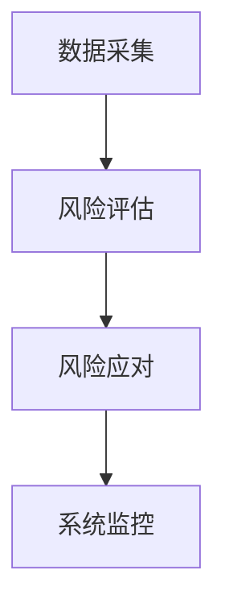
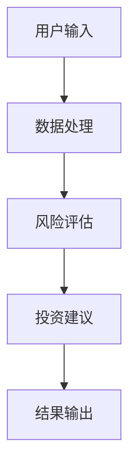

                 


```markdown
# 特价股票投资中的代际消费行为分析与风险管理

> 关键词：特价股票，代际消费行为，风险管理，投资策略，系统设计

> 摘要：本文从代际消费行为的角度分析特价股票投资的影响，并探讨如何通过风险管理来优化投资策略。文章结合实际案例和系统设计，提出了一套基于代际消费行为的股票投资风险管理方法，为投资者提供了理论和实践的双重指导。

---

## 第1章: 特价股票投资与代际消费行为的背景介绍

### 1.1 特价股票投资的基本概念
#### 1.1.1 特价股票的定义与特点
特价股票是指在特定条件下以低于市场价出售的股票，通常具有高波动性和高风险的特点。其主要特点包括：
- **高波动性**：价格波动频繁，容易受到市场情绪的影响。
- **高风险**：投资回报不确定性高，存在较大的市场风险。
- **短期性**：投资者通常以短期获利为目标。

#### 1.1.2 特价股票投资的基本原理
特价股票投资的核心在于通过市场波动捕捉短期收益。投资者需要分析市场趋势、公司基本面和宏观经济环境，以制定投资策略。

#### 1.1.3 特价股票投资的市场环境
市场环境包括宏观经济状况、政策法规、市场参与者的心理预期等因素。这些因素共同影响特价股票的投资机会和风险。

### 1.2 代际消费行为的定义与特征
#### 1.2.1 代际消费行为的定义
代际消费行为指不同年龄段的人群在消费习惯、消费偏好和消费能力上的差异性行为。这种差异性对市场和投资决策有重要影响。

#### 1.2.2 不同年龄段的消费行为差异
- **年轻一代**：注重时尚、个性化消费，风险承受能力强。
- **中年一代**：注重理性消费，追求性价比和长期收益。
- **老年一代**：注重稳定性和安全性，风险承受能力较弱。

#### 1.2.3 代际消费行为对投资决策的影响
代际消费行为通过影响市场情绪和消费习惯，间接影响投资决策。例如，年轻一代的高风险偏好可能导致市场的高波动性。

### 1.3 特价股票投资与代际消费行为的关系
#### 1.3.1 代际消费行为对股票市场的潜在影响
不同年龄段的投资者对市场的看法和行为不同，导致市场波动加剧。

#### 1.3.2 特价股票投资中的代际消费行为特征
投资者的年龄和消费习惯直接影响其投资行为。例如，年轻人可能更倾向于高风险投资，而中老年人更倾向于稳健投资。

#### 1.3.3 代际消费行为对投资策略的影响
代际消费行为影响投资者的风险偏好和投资目标，进而影响投资策略的选择。

---

## 第2章: 代际消费行为的特征分析

### 2.1 不同年龄段的消费行为模式
#### 2.1.1 年轻一代的消费行为特点
- 高度依赖互联网和社交媒体。
- 追求个性化和时尚，消费决策受情感驱动。
- 风险承受能力强，愿意尝试新兴投资方式。

#### 2.1.2 中年一代的消费行为特点
- 注重家庭和长期规划，消费决策理性。
- 偏好稳定性和安全性，倾向于长期投资。
- 对风险有较强的识别能力。

#### 2.1.3 老年一代的消费行为特点
- 偏好低风险、高收益的投资方式。
- 消费决策谨慎，倾向于保守型投资。
- 对市场波动较为敏感。

### 2.2 代际消费行为的影响因素
#### 2.2.1 经济因素对代际消费行为的影响
经济状况直接影响各年龄段的消费能力。例如，经济衰退可能导致各年龄段的消费行为趋于保守。

#### 2.2.2 社会文化因素对代际消费行为的影响
文化背景和价值观影响消费习惯。例如，年轻一代更受互联网文化影响，倾向于新兴投资方式。

#### 2.2.3 个体心理因素对代际消费行为的影响
心理特征和认知能力影响消费决策。例如，年轻人更倾向于冒险，而老年人更倾向于保守。

---

## 第3章: 代际消费行为对股票投资的影响

### 3.1 代际消费行为对市场情绪的影响
#### 3.1.1 不同年龄段的市场情绪差异
- **年轻人**：情绪波动大，容易受市场热点影响。
- **中年人**：情绪较为稳定，注重长期收益。
- **老年人**：情绪敏感，对市场波动反应强烈。

#### 3.1.2 代际消费行为对市场波动的影响
不同年龄段的投资者行为可能导致市场波动加剧。例如，年轻人的高风险偏好可能导致市场的短期波动。

#### 3.1.3 代际消费行为对投资决策的影响
代际消费行为影响投资者的风险偏好和投资目标，进而影响投资策略的选择。

### 3.2 代际消费行为对投资策略的影响
#### 3.2.1 不同年龄段投资者的投资偏好
- **年轻人**：倾向于高风险、高回报的投资方式。
- **中年人**：倾向于稳健投资，注重长期收益。
- **老年人**：倾向于低风险、高收益的投资方式。

#### 3.2.2 代际消费行为对投资组合的影响
投资组合的构成和比例会因投资者的代际消费行为而有所不同。例如，年轻人可能更倾向于投资科技股，而中老年人可能更倾向于投资蓝筹股。

#### 3.2.3 代际消费行为对风险管理的影响
不同年龄段的投资者对风险的承受能力和管理方式不同。例如，年轻人可能更愿意承担高风险，而中老年人更注重风险控制。

---

## 第4章: 特价股票投资中的风险管理

### 4.1 风险管理的基本概念
#### 4.1.1 风险管理的定义与目标
风险管理是指通过识别、评估和应对潜在风险，降低投资损失，提高投资收益的过程。

#### 4.1.2 风险管理的基本框架
- **风险识别**：识别可能影响投资的所有风险因素。
- **风险评估**：评估每个风险的可能性和影响程度。
- **风险应对**：制定并实施应对策略，以降低风险的影响。

### 4.2 特价股票投资中的常见风险
#### 4.2.1 市场风险
市场波动可能导致股票价格下跌，影响投资收益。

#### 4.2.2 信用风险
公司无法偿还债务可能导致投资者损失。

#### 4.2.3 流动性风险
投资者无法快速变现资产可能导致资金流动性问题。

#### 4.2.4 操作风险
由于操作失误或欺诈行为导致的损失风险。

---

## 第5章: 代际消费行为与风险管理的关系

### 5.1 代际消费行为对风险管理的影响
#### 5.1.1 不同年龄段投资者的风险承受能力
- **年轻人**：风险承受能力强，愿意承担高风险。
- **中年人**：风险承受能力中等，注重稳健投资。
- **老年人**：风险承受能力弱，倾向于低风险投资。

#### 5.1.2 代际消费行为对风险偏好的影响
不同年龄段的投资者有不同的风险偏好，影响其风险管理策略的选择。

#### 5.1.3 代际消费行为对风险管理策略的影响
投资者的代际消费行为影响其风险管理策略的选择。例如，年轻人可能更倾向于高风险、高回报的投资，而中老年人更注重风险控制。

### 5.2 基于代际消费行为的风险管理策略
#### 5.2.1 针对年轻人的管理策略
- 高风险偏好者可以适当增加高风险资产的配置。
- 同时，需要加强风险教育，帮助其理性投资。

#### 5.2.2 针对中年人的管理策略
- 中风险偏好者可以平衡配置高风险和低风险资产。
- 同时，需要关注宏观经济环境，制定稳健的投资计划。

#### 5.2.3 针对老年人的管理策略
- 低风险偏好者可以优先配置低风险、高收益的资产。
- 同时，需要特别关注流动性风险，确保资金的流动性。

---

## 第6章: 风险管理的系统设计与实现

### 6.1 系统设计概述
风险管理系统的总体架构包括数据采集、风险评估、风险应对和系统监控四个模块。

### 6.2 系统架构设计
使用Mermaid图展示系统架构：



### 6.3 系统接口与交互设计
系统接口设计需要考虑投资者的代际消费行为，提供个性化的风险管理服务。

---

## 第7章: 项目实战：基于代际消费行为的特价股票投资系统

### 7.1 项目背景与目标
通过分析代际消费行为，设计一套基于大数据的特价股票投资系统，帮助投资者制定个性化的风险管理策略。

### 7.2 系统功能设计
使用Mermaid图展示系统功能模块：



### 7.3 核心代码实现
以下是一个风险评估的核心代码示例：

```python
import pandas as pd
from sklearn.cluster import KMeans

# 假设我们有代际消费行为数据
data = pd.DataFrame({
    'age_group': ['young', 'middle', 'old'],
    'consumption_behavior': [100, 50, 20]
})

# 使用K-means进行聚类分析
kmeans = KMeans(n_clusters=3)
clusters = kmeans.fit_predict(data[['consumption_behavior']])

# 根据聚类结果制定风险管理策略
for cluster in range(3):
    print(f"Cluster {cluster}: {data[clusters == cluster]}")
```

### 7.4 实际案例分析
通过具体案例分析系统的实际应用效果，验证系统的有效性和可行性。

---

## 第8章: 总结与展望

### 8.1 全文总结
本文从代际消费行为的角度分析了特价股票投资的影响，并探讨了如何通过风险管理优化投资策略。通过系统设计和项目实战，提出了一套基于代际消费行为的股票投资风险管理方法。

### 8.2 未来研究方向
未来可以进一步研究代际消费行为的动态变化，结合人工智能技术，开发更智能化的风险管理系统。

---

## 参考文献

（此处列出相关参考文献）

---

## 致谢

感谢读者的耐心阅读，感谢同行专家的宝贵意见。
```

