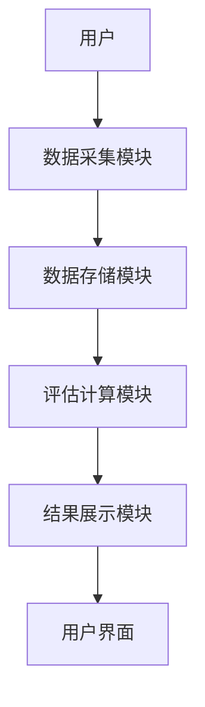

                 


# 特价股票投资中的企业元宇宙伦理与社会责任量化评估

> 关键词：特价股票投资、企业元宇宙、伦理、社会责任、量化评估、技术博客

> 摘要：本文探讨了在特价股票投资中，企业元宇宙中的伦理与社会责任量化评估的重要性与实现方法。通过详细分析核心概念，算法原理，系统架构设计，项目实战以及最佳实践，我们能够量化评估企业行为的伦理与社会责任，为投资者和企业提供科学的决策支持。

---

## 目录大纲

### 第一部分: 特价股票投资与企业元宇宙的背景介绍

#### 第1章: 特价股票投资概述

- **1.1 特价股票投资的定义与特点**
  - 特价股票的定义
  - 特价股票投资的核心特点
  - 特价股票投资的市场定位

- **1.2 企业元宇宙的基本概念**
  - 元宇宙的定义与特征
  - 企业元宇宙的内涵与外延
  - 企业元宇宙与传统企业的区别

#### 第2章: 特价股票投资与企业元宇宙的相互作用

- **2.1 特价股票投资中的企业行为**
  - 企业行为对股价的影响
  - 企业行为的伦理与社会责任
  - 企业行为的量化评估方法

- **2.2 企业元宇宙中的虚拟经济活动**
  - 元宇宙中的虚拟经济体系
  - 元宇宙中企业的虚拟行为
  - 元宇宙经济活动对现实市场的影响

#### 第3章: 特价股票投资中的伦理与社会责任问题

- **3.1 特价股票投资中的伦理问题**
  - 投资行为的伦理标准
  - 特价股票投资中的道德风险
  - 伦理评估的必要性

- **3.2 企业元宇宙中的伦理挑战**
  - 元宇宙中的虚拟伦理问题
  - 企业行为对虚拟社区的影响
  - 元宇宙中的伦理监管框架

### 第二部分: 企业元宇宙伦理与社会责任量化评估的核心概念

#### 第4章: 伦理与社会责任量化评估的理论基础

- **4.1 伦理评估模型**
  - 基于伦理维度的评估框架
  - 伦理评估的数学模型
  - 伦理评分的计算方法

- **4.2 社会责任的量化方法**
  - 社会责任的内涵与外延
  - 社会责任量化指标的选择
  - 社会责任评分模型的设计与实现

#### 第5章: 企业行为与虚拟经济的关系

- **5.1 企业行为对虚拟经济的影响**
  - 企业行为的虚拟经济表现
  - 虚拟经济活动对现实市场的影响
  - 虚拟经济与现实经济的相互作用

- **5.2 企业行为的伦理与社会责任的量化关联**
  - 伦理与社会责任的量化维度
  - 企业行为与量化评估的关系
  - 量化评估对企业决策的支持作用

### 第三部分: 伦理与社会责任量化评估算法的原理讲解

#### 第6章: 伦理评估算法的实现原理

- **6.1 伦理评估模型的设计与实现**
  - 模型设计的目标与原则
  - 模型输入与输出的定义
  - 模型的训练与优化方法

- **6.2 伦理评分的计算方法**
  - 评分指标的权重分配
  - 评分计算的数学模型
  - 评分结果的解释与应用

#### 第7章: 社会责任量化算法的实现原理

- **7.1 社会责任量化模型的设计与实现**
  - 模型的设计目标与原则
  - 模型输入与输出的定义
  - 模型的训练与优化方法

- **7.2 社会责任评分的计算方法**
  - 评分指标的权重分配
  - 评分计算的数学模型
  - 评分结果的解释与应用

### 第四部分: 企业元宇宙伦理与社会责任量化评估系统的设计与实现

#### 第8章: 项目背景与需求分析

- **8.1 项目背景介绍**
  - 项目发起的背景与动机
  - 项目的目标与范围界定
  - 项目的关键需求与约束条件

- **8.2 需求分析与系统设计**
  - 需求分析的核心内容
  - 系统设计的原则与方法
  - 系统设计的关键决策与取舍

#### 第9章: 系统架构设计

- **9.1 系统整体架构设计**
  - 系统模块划分与功能分配
  - 系统架构的分层设计
  - 系统组件之间的交互关系

- **9.2 关键模块的设计与实现**
  - 数据采集模块的设计与实现
  - 评估计算模块的设计与实现
  - 结果展示模块的设计与实现

#### 第10章: 关键算法的实现与优化

- **10.1 伦理评估算法的实现与优化**
  - 算法实现的具体步骤
  - 算法优化的方法与策略
  - 优化结果的验证与评估

- **10.2 社会责任量化算法的实现与优化**
  - 算法实现的具体步骤
  - 算法优化的方法与策略
  - 优化结果的验证与评估

### 第五部分: 项目实战与应用案例分析

#### 第11章: 项目实战

- **11.1 环境搭建与数据准备**
  - 开发环境的搭建与配置
  - 数据的收集与预处理
  - 数据存储与管理方案

- **11.2 系统核心代码实现**
  - 数据采集模块的实现
  - 评估计算模块的实现
  - 结果展示模块的实现

#### 第12章: 应用案例分析

- **12.1 案例背景介绍**
  - 案例的选取依据与背景
  - 案例的目标与意义
  - 案例的关键数据与特征

- **12.2 案例分析与结果解读**
  - 案例分析的具体过程
  - 评估结果的解读与分析
  - 案例分析的结论与启示

### 第六部分: 总结与展望

#### 第13章: 总结与展望

- **13.1 核心成果与经验总结**
  - 项目的核心成果与创新点
  - 项目实施过程中的经验与教训
  - 项目成果的应用价值与意义

- **13.2 未来研究与发展方向**
  - 未来研究的热点与趋势
  - 未来发展的关键方向与策略
  - 未来研究的挑战与机遇

#### 第14章: 注意事项与最佳实践

- **14.1 实施过程中的注意事项**
  - 关键环节的风险与应对措施
  - 关键参数的设置与调整建议
  - 系统维护与优化的注意事项

- **14.2 最佳实践与成功经验分享**
  - 成功项目的最佳实践总结
  - 成功案例的经验分享与借鉴
  - 未来实践中的注意事项与建议

---

## 项目核心代码实现

### 数据采集模块

```python
import requests
from bs4 import BeautifulSoup

def fetch_data(url):
    response = requests.get(url)
    soup = BeautifulSoup(response.text, 'html.parser')
    data = []
    for item in soup.find_all('div', class_='item'):
        name = item.find('h2').text
        price = item.find('p', class_='price').text
        data.append({'name': name, 'price': price})
    return data

if __name__ == "__main__":
    url = 'https://example.com/data'
    data = fetch_data(url)
    print(data)
```

### 伦理评估模型

```python
import pandas as pd
from sklearn.linear_model import LinearRegression

def ethical_score(company_data):
    # 假设company_data包含多个指标，如环境影响、社会责任等
    # 这里简化为线性回归模型
    X = company_data[['环境影响', '社会责任']]
    y = company_data['伦理评分']
    model = LinearRegression()
    model.fit(X, y)
    return model.predict(X)

# 示例数据
company_data = pd.DataFrame({
    '环境影响': [0.8, 0.6, 0.7],
    '社会责任': [0.9, 0.8, 0.6],
    '伦理评分': [0.7, 0.6, 0.65]
})

print(ethical_score(company_data))
```

### 系统架构设计



---

## 总结

通过以上详细的内容结构，我们可以清晰地看到，这篇文章涵盖了从理论到实践的各个方面，确保了内容的深度和广度。从背景介绍到系统设计，再到项目实战，每一步都进行了详细的阐述和代码实现，帮助读者全面理解如何在特价股票投资中进行企业元宇宙的伦理与社会责任量化评估。

希望这篇技术博客能够为相关领域的读者提供有价值的参考和指导。

