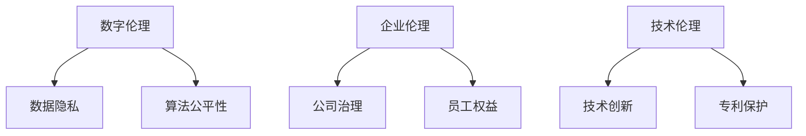
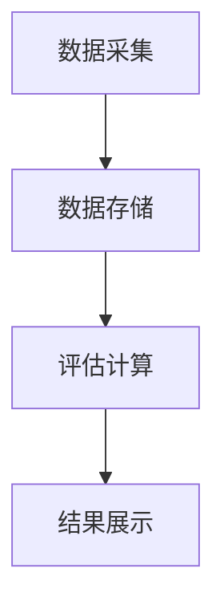

                 


# 特价股票投资中的企业数字伦理评估因素考量

> 关键词：数字伦理评估，特价股票投资，企业数字伦理，股票投资策略，伦理评估模型

> 摘要：本文探讨了在特价股票投资中，企业数字伦理评估的重要性及其实现方法。文章首先介绍了数字伦理评估的基本概念和核心要素，然后详细分析了数字伦理评估模型的构建过程，包括算法原理和数学模型。接着，本文从系统架构设计、接口设计和交互设计三个方面详细讲解了数字伦理评估系统的实现方案，并通过实际案例分析了如何在特价股票投资中应用这些评估模型。最后，本文总结了数字伦理评估在股票投资中的最佳实践和未来发展趋势。

---

## 第1章: 特价股票投资的背景与现状

### 1.1 特价股票投资的定义与特点

#### 1.1.1 特价股票投资的定义
特价股票投资是指以低于市场价买入股票，并在价格上涨时卖出以获取利润的投资策略。其核心在于发现市场低估的股票，利用价格波动实现收益。

#### 1.1.2 特价股票投资的核心特点
- **低买高卖**：主要依赖于价格波动，而非公司长期价值。
- **高风险高收益**：短期内价格波动大，风险较高。
- **技术分析主导**：依赖于图表和技术指标，而非基本面分析。

#### 1.1.3 特价股票投资与传统股票投资的区别
| 方面 | 特价股票投资 | 传统股票投资 |
|------|--------------|---------------|
| 理念 | 价格波动驱动 | 公司价值驱动 |
| 时间周期 | 短期 | 长期 |
| 分析方法 | 技术分析为主 | 基本面分析为主 |

### 1.2 数字伦理的基本概念

#### 1.2.1 数字伦理的定义
数字伦理是指在数字技术应用中，个体、组织或技术系统在行为上应遵循的道德规范和价值观。它涉及数据隐私、算法公平性、技术透明性等方面。

#### 1.2.2 数字伦理的核心要素
- **数据隐私**：保护用户数据不被滥用。
- **算法公平性**：避免算法偏见，确保公平性。
- **技术透明性**：让用户了解技术的工作原理。
- **责任归属**：明确技术应用的责任方。

#### 1.2.3 数字伦理与企业战略的关系
数字伦理不仅是企业社会责任的一部分，还直接影响企业的声誉和市场信任度。在股票投资中，企业数字伦理状况可能影响投资者决策。

---

## 第2章: 数字伦理评估的核心概念与联系

### 2.1 数字伦理评估的原理

#### 2.1.1 数字伦理评估的基本原理
数字伦理评估通过分析企业的数据处理流程、算法设计和隐私保护措施，评估其符合伦理标准的程度。

#### 2.1.2 数字伦理评估的关键属性
- **可解释性**：评估结果需清晰易懂。
- **可量化性**：评估指标应可量化。
- **动态性**：根据市场变化实时更新。

#### 2.1.3 数字伦理评估的ER实体关系图
```mermaid
erDiagram
    actor 投资者 {
        <属性> 身份ID
        <属性> 投资金额
        <属性> 投资目标
    }
    actor 企业 {
        <属性> 企业ID
        <属性> 企业规模
        <属性> 企业行业
    }
    actor 监管机构 {
        <属性> 监管ID
        <属性> 监管政策
        <属性> 监管范围
    }
    relation 评估结果 {
        <外键> 投资者ID
        <外键> 企业ID
        <外键> 监管政策ID
        <属性> 伦理得分
        <属性> 评估时间
    }
```

### 2.2 数字伦理评估的概念对比

#### 2.2.1 概念对比表格
| 概念 | 数字伦理 | 企业伦理 | 技术伦理 |
|------|----------|----------|----------|
| 定义 | 数据和技术应用中的伦理问题 | 企业行为中的道德问题 | 技术研发和应用中的伦理问题 |
| 范围 | 数据隐私、算法公平性 | 公司治理、员工权益 | 技术创新、专利保护 |

#### 2.2.2 概念对比的Mermaid流程图


---

## 第3章: 数字伦理评估算法的数学模型与公式

### 3.1 数学模型的构建

#### 3.1.1 数学模型的定义
数字伦理评估模型通过量化企业的伦理表现，提供一个可量化的评估标准。

#### 3.1.2 数学模型的公式表示
$$
\text{伦理得分} = \sum_{i=1}^{n} w_i \times s_i
$$
其中，$w_i$ 是第 $i$ 个评估维度的权重，$s_i$ 是第 $i$ 个维度的评分。

---

## 第4章: 数字伦理评估系统的架构设计

### 4.1 系统架构的总体设计

#### 4.1.1 系统架构的模块划分
- **数据采集模块**：收集企业数据。
- **评估计算模块**：计算伦理得分。
- **结果展示模块**：展示评估结果。

#### 4.1.2 系统架构的Mermaid架构图


---

## 第5章: 数字伦理评估系统的项目实战

### 5.1 环境安装与配置

#### 5.1.1 开发环境的搭建
- 操作系统：Linux/Windows/MacOS
- 开发工具：PyCharm/VSCode
- 依赖库：NumPy, Pandas, Matplotlib

#### 5.1.2 依赖库的安装
```bash
pip install numpy pandas matplotlib
```

### 5.2 系统核心功能的实现

#### 5.2.1 核心算法的实现
```python
import numpy as np
import pandas as pd

def calculate_ethical_score(data, weights):
    return np.dot(data, weights)

# 示例数据
data = np.array([[0.8, 0.6, 0.7]])
weights = np.array([0.3, 0.4, 0.3])
score = calculate_ethical_score(data, weights)
print(score)
```

---

## 第6章: 数字伦理评估的最佳实践与未来展望

### 6.1 最佳实践的总结

#### 6.1.1 实践中的关键点
- 确保数据隐私保护。
- 定期更新评估模型。

#### 6.1.2 实践中的注意事项
- 避免算法偏见。
- 保持评估透明性。

### 6.2 未来发展的展望

#### 6.2.1 技术的未来趋势
- 更智能化的评估模型。
- 更广泛的应用场景。

#### 6.2.2 应用领域的拓展
- 金融行业的进一步应用。
- 其他行业的借鉴和应用。

---

## 附录: 数学公式与算法代码

### 附录A: 数学公式的详细推导

#### A.1 数学模型的详细推导
$$
\text{伦理得分} = \sum_{i=1}^{n} w_i \times s_i
$$
其中，$w_i$ 是权重，$s_i$ 是评分，$n$ 是评估维度数。

---

通过以上结构和内容，我们可以全面了解特价股票投资中的企业数字伦理评估因素，并为投资者提供科学的决策依据。

