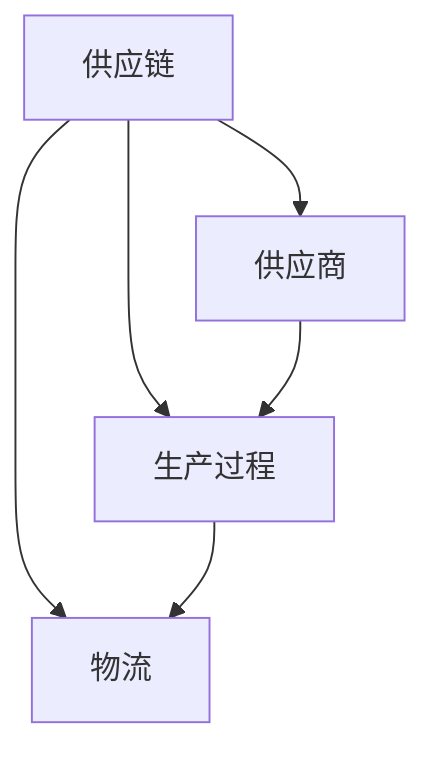
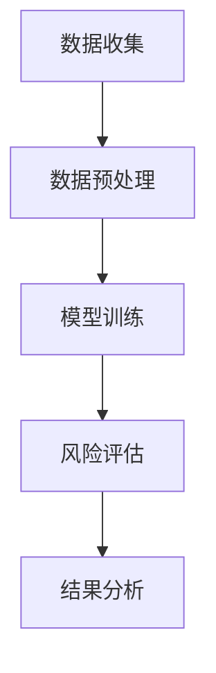
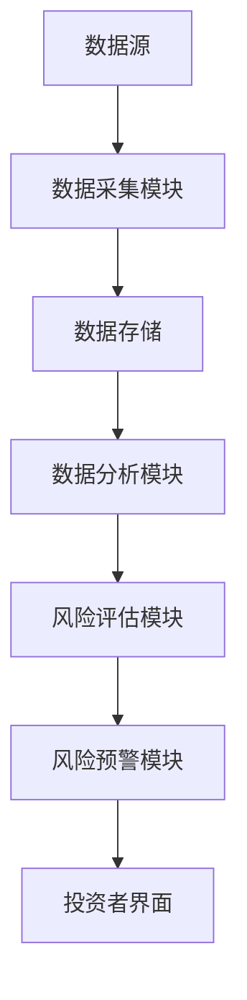

                 


# 特价股票投资中的供应链风险评估

> 关键词：特价股票、供应链风险、投资评估、数据分析、风险管理、套利机会、市场波动

> 摘要：在股票投资领域，特价股票因其低买高卖的套利机会而备受关注。然而，投资决策不仅依赖于市场波动和价格变化，还需考虑供应链风险对股票价值的影响。本文深入分析了供应链风险在特价股票投资中的重要性，结合数据分析、建模和系统架构设计，提出了有效的风险评估方法，为投资者提供了科学决策的依据。

---

## 第1章: 特价股票投资与供应链风险概述

### 1.1 特价股票投资的定义与特点
#### 1.1.1 特价股票的定义
特价股票是指以低于市场价买入的股票，通常出现在市场低估或公司暂时困境时。投资者期望在股价回升时卖出，获得利润。

#### 1.1.2 特价股票投资的核心特点
- **低买高卖**：投资者利用价格波动在低价买入、高价卖出。
- **套利机会**：通过市场价差或信息不对称获利。
- **高风险高回报**：价格波动大，风险较高，但潜在回报也高。

#### 1.1.3 特价股票投资的市场背景
近年来，市场波动加剧，投资者 increasingly pursue特价股票投资，特别是在经济不确定性增加时，特价股票成为吸引投资者的焦点。

### 1.2 供应链风险的基本概念
#### 1.2.1 供应链的定义与构成
供应链包括从原材料采购到产品交付的全过程，涉及供应商、制造商、分销商和零售商等多个环节。

#### 1.2.2 供应链风险的类型
- **原材料风险**：原材料价格波动或供应中断。
- **物流风险**：运输延迟或成本增加。
- **供应商风险**：供应商财务状况不稳定或合作关系中断。

#### 1.2.3 供应链风险对企业的影响
供应链问题可能导致生产延误、成本增加，进而影响公司业绩和股价。

### 1.3 特价股票投资中的供应链风险
#### 1.3.1 特价股票投资与供应链的关联
供应链风险直接影响公司业绩和股价，投资者需关注供应链稳定性。

#### 1.3.2 供应链风险对股票价格的影响
供应链问题可能导致股价下跌，投资者需评估供应链风险对股票价值的影响。

#### 1.3.3 特价股票投资中的供应链风险特征
- 风险的隐蔽性：供应链问题可能未被市场充分反映。
- 风险的突发性：供应链中断可能突然发生，影响股价。

### 1.4 本章小结
本章介绍了特价股票投资和供应链风险的基本概念，并分析了两者之间的关联，为后续风险评估奠定了基础。

---

## 第2章: 供应链风险评估的核心概念与联系

### 2.1 核心概念原理
#### 2.1.1 供应链风险的评估指标
- **供应稳定性**：供应商的可靠性和交货准时率。
- **成本波动**：原材料和物流成本的变化。
- **市场敏感性**：行业竞争和市场需求变化。

#### 2.1.2 特价股票投资中的供应链风险评估模型
评估模型结合了供应链风险和股票价格波动，通过数据分析预测供应链问题对股价的影响。

### 2.2 核心概念属性特征对比表格
| 概念       | 特性1 | 特性2 | 特性3 |
|------------|-------|-------|-------|
| 供应链风险 | 客观性 | 可量化 | 动态性 |
| 特价股票   | 价格敏感性 | 市场波动性 | 投资风险性 |

### 2.3 ER实体关系图架构


### 2.4 本章小结
本章通过对比分析和实体关系图，明确了供应链风险和特价股票投资之间的联系，为后续分析提供了理论基础。

---

## 第3章: 供应链风险评估的算法原理

### 3.1 算法原理概述
#### 3.1.1 基于概率的供应链风险评估
通过概率模型预测供应链中断的可能性，评估对股价的影响。

#### 3.1.2 基于机器学习的供应链风险预测
使用机器学习算法（如随机森林、XGBoost）预测供应链风险。

### 3.2 算法流程图


### 3.3 算法实现代码
```python
import pandas as pd
from sklearn.model_selection import train_test_split
from sklearn.linear_model import LinearRegression

# 数据加载
data = pd.read_csv('supply_chain.csv')

# 数据预处理
X = data[['supply_delay', 'price_fluctuation']]
y = data['risk_score']

# 数据分割
X_train, X_test, y_train, y_test = train_test_split(X, y, test_size=0.2, random_state=42)

# 模型训练
model = LinearRegression()
model.fit(X_train, y_train)

# 预测与评估
predictions = model.predict(X_test)
print('预测结果:', predictions)
print('真实值:', y_test)
```

### 3.4 算法数学模型
供应链风险评估模型可表示为：
$$ \text{风险评分} = \beta_0 + \beta_1 \times \text{供应延迟} + \beta_2 \times \text{价格波动} + \epsilon $$
其中，$\beta_0$为截距，$\beta_1$和$\beta_2$为回归系数，$\epsilon$为误差项。

### 3.5 本章小结
本章通过算法流程图和代码示例，详细讲解了供应链风险评估的实现方法，为投资者提供了量化工具。

---

## 第4章: 系统分析与架构设计

### 4.1 问题场景介绍
供应链风险评估系统需实时监控供应链数据，分析风险对股价的影响。

### 4.2 系统功能设计
- 数据采集模块：收集供应链相关数据。
- 数据分析模块：使用机器学习模型评估风险。
- 风险预警模块：向投资者发出预警信号。

### 4.3 系统架构设计


### 4.4 系统接口设计
- 数据接口：与供应链数据源对接。
- 用户接口：向投资者展示风险评估结果。

### 4.5 本章小结
本章设计了供应链风险评估系统的架构，为实现风险评估提供了技术方案。

---

## 第5章: 项目实战

### 5.1 环境安装
安装Python、Pandas、Scikit-learn等工具。

### 5.2 系统核心实现
```python
import pandas as pd
from sklearn.model_selection import train_test_split
from sklearn.linear_model import LinearRegression

# 数据加载
data = pd.read_csv('supply_chain.csv')

# 数据预处理
X = data[['supply_delay', 'price_fluctuation']]
y = data['risk_score']

# 数据分割
X_train, X_test, y_train, y_test = train_test_split(X, y, test_size=0.2, random_state=42)

# 模型训练
model = LinearRegression()
model.fit(X_train, y_train)

# 预测与评估
predictions = model.predict(X_test)
print('预测结果:', predictions)
print('真实值:', y_test)
```

### 5.3 案例分析
分析某公司的供应链数据，预测股价波动。

### 5.4 结果解读
评估模型准确率，优化模型参数。

### 5.5 本章小结
本章通过实战案例，展示了供应链风险评估系统的实现过程。

---

## 第6章: 总结与展望

### 6.1 最佳实践 Tips
- 定期监控供应链数据。
- 结合市场趋势分析供应链风险。
- 使用多种模型进行风险评估。

### 6.2 小结
供应链风险是影响特价股票投资的重要因素，通过数据分析和建模，投资者可以有效评估和管理风险。

### 6.3 注意事项
- 数据质量和完整性影响模型准确性。
- 模型需定期更新以适应市场变化。

### 6.4 拓展阅读
建议阅读供应链管理和风险管理相关书籍，深入学习相关理论和技术。

---

## 关键词索引
- 供应链风险
- 特价股票
- 投资评估
- 数据分析
- 风险管理
- 套利机会
- 市场波动

---

通过以上结构，文章系统地介绍了特价股票投资中的供应链风险评估，结合理论分析和实战案例，为投资者提供了科学的决策依据。

