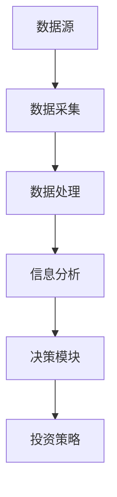

                 


# 特价股票投资中的信息优势如何获取

## 关键词：特价股票、信息优势、数据挖掘、技术分析、投资策略

## 摘要：本文详细探讨了在特价股票投资中如何有效获取信息优势。通过分析信息优势的来源、信息分析策略、系统架构设计以及实战案例，文章为投资者提供了从理论到实践的全面指导，帮助他们在竞争激烈的市场中获取投资优势。

---

## 第一部分：信息优势的背景与定义

### 第1章：信息优势的背景与定义

#### 1.1 特价股票的基本概念
- **1.1.1 特价股票的定义与特点**
  特价股票通常指那些价格低于市场平均值的股票，具有较高的投资吸引力。其特点包括低估值、高潜在回报和较高的市场波动性。

- **1.1.2 特价股票与普通股票的区别**
  普通股票的价格受多种因素影响，而特价股票则通常因市场低迷或公司特定问题导致价格下跌，提供了较高的买入机会。

- **1.1.3 特价股票的投资价值分析**
  投资者可以通过分析公司基本面、行业地位和市场前景，识别具有长期增长潜力的特价股票。

#### 1.2 信息优势的定义与作用
- **1.2.1 信息优势的定义**
  信息优势是指投资者能够比其他人更早或更准确地获取市场信息，从而做出更优的投资决策。

- **1.2.2 信息优势在投资中的作用**
  信息优势帮助投资者识别市场趋势、发现投资机会，并在竞争中占据优势。

- **1.2.3 信息优势与投资决策的关系**
  信息优势直接影响投资决策的准确性和及时性，是投资成功的关键因素之一。

---

## 第二部分：信息优势的来源

### 第2章：市场结构与信息优势

#### 2.1 市场结构对信息优势的影响
- **2.1.1 市场结构的多样性**
  不同的市场结构（如一级市场、二级市场）对信息流动和获取有不同的影响。

- **2.1.2 市场结构对信息流动的影响**
  高效的市场结构促进信息快速流动，而低效的市场结构可能导致信息滞后。

#### 2.2 投资者行为与信息优势
- **2.2.1 投资者行为的多样性**
  不同投资者（机构投资者、个人投资者）的行为模式影响信息流动。

- **2.2.2 信息优势在投资者行为中的体现**
  具备信息优势的投资者能够在市场波动中及时调整策略，捕捉投资机会。

#### 2.3 数据挖掘与信息优势
- **2.3.1 数据挖掘技术的应用**
  利用数据挖掘技术从大量数据中提取有用信息，帮助投资者做出更优决策。

- **2.3.2 数据挖掘在信息优势中的具体应用**
  通过分析历史数据、预测市场趋势，数据挖掘为投资者提供有力支持。

---

## 第三部分：信息分析策略

### 第3章：基本面分析与信息优势

#### 3.1 基本面分析的核心要素
- **3.1.1 公司财务状况**
  分析公司的盈利能力、资产负债情况和现金流状况，评估其财务健康。

- **3.1.2 行业地位与竞争优势**
  评估公司在行业中的地位、市场占有率和竞争优势。

#### 3.2 技术分析与信息优势
- **3.2.1 技术分析的核心指标**
  包括移动平均线、相对强弱指数（RSI）、成交量等技术指标。

- **3.2.2 技术分析在信息优势中的应用**
  通过技术指标预测价格走势，识别买入和卖出时机。

#### 3.3 市场情绪分析与信息优势
- **3.3.1 市场情绪分析的方法**
  利用新闻、社交媒体和投资者情绪指标（如恐慌指数）分析市场情绪。

- **3.3.2 市场情绪分析的应用**
  结合市场情绪与基本面分析，优化投资策略。

---

## 第四部分：系统架构设计

### 第4章：信息优势的系统架构

#### 4.1 系统架构的核心模块
- **4.1.1 数据采集模块**
  负责从多种数据源采集股票信息，包括实时数据和历史数据。

- **4.1.2 数据处理模块**
  对采集的数据进行清洗、转换和标准化处理，为后续分析提供高质量数据。

#### 4.2 信息分析与决策模块
- **4.2.1 分析算法**
  使用机器学习算法（如随机森林、支持向量机）进行预测和分类。

- **4.2.2 决策模块**
  根据分析结果生成投资策略，指导实际操作。

#### 4.3 系统架构图


---

## 第五部分：实战案例

### 第5章：信息优势的实战应用

#### 5.1 实战案例分析
- **5.1.1 案例背景**
  某公司因行业低迷导致股价下跌，成为特价股票。

- **5.1.2 数据分析过程**
  通过基本面和技术分析，评估该公司投资价值。

#### 5.2 实战代码实现
```python
import pandas as pd
import numpy as np

# 示例数据
data = {'price': [10, 12, 8, 14, 13], 'volume': [100, 80, 120, 90, 110]}
df = pd.DataFrame(data)

# 计算移动平均线
df['MA'] = df['price'].rolling(3).mean()

print(df)
```

#### 5.3 案例结果与总结
- **案例结果**
  通过分析，发现该公司具备较高的投资价值，股价有望回升。

- **总结**
  信息优势的应用能够有效识别投资机会，提升投资收益。

---

## 总结与展望

### 总结
本文详细探讨了特价股票投资中的信息优势获取方法，从信息来源、分析策略到系统设计，为投资者提供了全面的指导。

### 展望
未来，随着技术的进步，信息优势的应用将更加广泛和精准。投资者可以通过不断优化系统架构和分析算法，进一步提升投资效果。

---

通过以上步骤和内容，我希望能够撰写一篇结构清晰、内容详实的技术博客文章，帮助读者在特价股票投资中获取信息优势。

