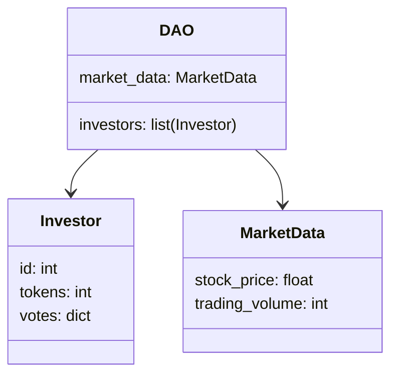
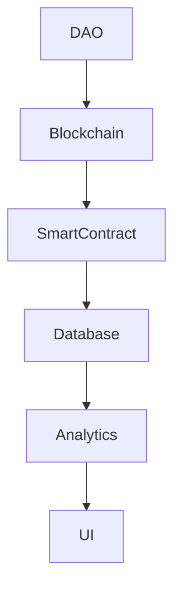
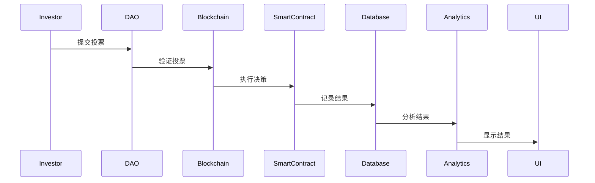

                 


# 特价股票投资中的分布式自治组织(DAO)决策方法

> 关键词：分布式自治组织（DAO）、特价股票投资、决策方法、区块链技术、投资策略、去中心化治理

> 摘要：本文探讨了分布式自治组织（DAO）在特价股票投资中的应用，分析了其决策方法的原理、算法设计及系统架构。通过详细的技术分析和案例解读，展示了如何利用DAO的集体智慧提升投资决策的透明度和效率，为投资者提供一种新型的投资策略选择。

---

## 第一部分: 特价股票投资中的分布式自治组织（DAO）决策方法概述

---

### 第1章: 特价股票投资与分布式自治组织（DAO）的背景介绍

#### 1.1 特价股票投资的背景与现状

**1.1.1 特价股票的定义与特点**

特价股票通常指的是价格较低的股票，通常具有较高的增长潜力，吸引了很多中小投资者。这类股票的特点包括高波动性、高风险和高回报。

**1.1.2 特价股票投资的市场需求**

随着投资者对高回报的追求，特价股票市场逐渐成为投资热点。然而，个体投资者在面对市场波动时，往往难以做出最优决策。

**1.1.3 特价股票投资的挑战与机遇**

个体决策的局限性、信息不对称和市场波动大是特价股票投资的主要挑战。而机遇在于，通过集体智慧和去中心化的方式，投资者可以更高效地做出决策。

---

#### 1.2 分布式自治组织（DAO）的概念与特点

**1.2.1 DAO的定义与核心理念**

DAO是一种基于区块链技术的去中心化组织，通过智能合约实现自动化的决策和治理。其核心理念是通过集体决策和透明治理来实现组织目标。

**1.2.2 DAO与传统组织的区别**

| 属性         | DAO                           | 传统组织                     |
|--------------|-------------------------------|------------------------------|
| 决策方式     | 基于智能合约的投票决策       | 中央化决策                   |
| 透明性       | 高度透明，记录在区块链上      | 部分透明，依赖内部管理       |
| 责任承担     | 代码即法律，智能合约自动执行  | 明确的法律框架和责任体系       |

**1.2.3 DAO在金融领域的应用潜力**

DAO可以通过去中心化的治理方式，优化投资决策流程，降低信任成本，提高决策效率。

---

#### 1.3 特价股票投资中引入DAO的意义

**1.3.1 提高投资决策的透明度**

通过区块链技术，DAO可以确保投资决策的透明和可追溯，避免信息不对称。

**1.3.2 增强投资决策的集体智慧**

DAO的分布式决策机制可以整合更多投资者的智慧和经验，提高决策的科学性和准确性。

**1.3.3 降低个体决策风险**

通过集体决策，DAO可以分散个体风险，避免单一决策者的失误对整个投资造成重大影响。

---

#### 1.4 本章小结

本章介绍了特价股票投资的背景和挑战，以及DAO的基本概念和特点。通过对比分析，展示了DAO在金融领域的应用潜力和其在投资决策中的优势。

---

### 第2章: 分布式自治组织（DAO）的决策机制

#### 2.1 DAO的决策流程与规则

**2.1.1 DAO决策的基本流程**

1. 提议：成员提出决策事项。
2. 投票：通过智能合约进行投票。
3. 执行：根据投票结果自动执行决策。

**2.1.2 DAO决策的规则与约束**

- 投票权重：根据成员的贡献或持有的代币数量分配。
- 决策门槛：设定最低有效投票数和通过比例。
- 冷却机制：对重大决策设置冷静期，确保决策的合理性。

---

#### 2.2 特价股票投资中的DAO决策模型

**2.2.1 模型的核心要素**

- 投票机制：基于代币的投票权重。
- 决策规则：多数决、加权投票等。
- 执行机制：智能合约自动执行决策结果。

**2.2.2 模型的输入与输出**

- 输入：市场数据、成员投票。
- 输出：投资决策、决策结果。

---

#### 2.3 DAO决策模型与传统投资决策的对比

| 特性         | DAO决策模型               | 传统投资决策               |
|--------------|---------------------------|----------------------------|
| 决策主体     | 分布式，全体成员参与       | 中央化，由专业团队决策       |
| 决策过程     | 透明，可追溯               | 黑箱，依赖内部流程           |
| 决策效率     | 高，自动化执行             | 低，依赖人工协调             |

---

#### 2.4 本章小结

本章详细分析了DAO的决策机制及其在特价股票投资中的应用，展示了其在决策透明度、集体智慧和风险分散方面的优势。

---

### 第3章: 特价股票投资中的DAO决策方法的算法原理

#### 3.1 DAO决策算法的基本原理

**3.1.1 算法的输入与输出**

- 输入：投资者的投票、市场数据。
- 输出：最终的投资决策。

**3.1.2 算法的核心步骤**

1. 投票权重计算：根据投资者的代币数量分配权重。
2. 投票结果汇总：统计各选项的得票数。
3. 决策执行：根据规则触发智能合约执行决策。

---

#### 3.2 算法的数学模型与公式

**3.2.1 投票权重计算公式**

$$ w_i = \frac{v_i}{\sum_{j=1}^{n} v_j} $$

其中，$w_i$ 表示第 $i$ 个投资者的投票权重，$v_i$ 表示其持有的代币数量，$n$ 表示总投资者数。

**3.2.2 决策结果计算公式**

$$ D = \sum_{i=1}^{n} w_i \cdot d_i $$

其中，$D$ 表示最终决策结果，$d_i$ 表示第 $i$ 个投资者的投票决策。

---

#### 3.3 算法的实现与优化

**3.3.1 算法实现**

```python
def calculate_vote_weight(votes):
    total = sum(votes)
    weights = [v / total for v in votes]
    return weights

def dao_decision(votes, weights):
    decision = {}
    for i in range(len(votes)):
        weight = weights[i]
        decision[votes[i]] = decision.get(votes[i], 0) + weight
    return decision
```

**3.3.2 算法优化**

- 引入投票权重的动态调整机制，根据市场波动实时更新权重。
- 增加决策结果的验证机制，确保决策的正确性和有效性。

---

### 第4章: 特价股票投资中的DAO决策系统的架构设计

#### 4.1 系统功能设计

**4.1.1 领域模型设计**



---

#### 4.2 系统架构设计



---

#### 4.3 系统交互设计



---

### 第5章: 特价股票投资中的DAO决策方法的项目实战

#### 5.1 项目环境安装

```bash
pip install eth-account eth-keyfile web3
```

---

#### 5.2 核心代码实现

```python
from web3 import Web3
from eth_account import Account

# 初始化区块链节点
w3 = Web3(Web3.HTTPProvider("http://localhost:8545"))

# 创建账户
account = Account.new_account("password")
print(account.address)
```

---

#### 5.3 代码功能解读与分析

- 初始化区块链节点：连接到本地以太坊节点，用于智能合约的交互。
- 创建账户：生成DAO成员的账户地址，用于后续的投票和决策。

---

#### 5.4 实际案例分析

假设一个DAO中有三个投资者，各持有100、200、300个代币，投票决定是否购买某只特价股票。根据权重计算，投资者分别有10%、20%、30%的投票权。最终决策通过智能合约自动执行。

---

### 第6章: 特价股票投资中的DAO决策方法的最佳实践

#### 6.1 投资者注意事项

- 合理分配代币，确保投票权重的公平性。
- 定期更新智能合约，适应市场变化。

#### 6.2 开发者的注意事项

- 确保智能合约的安全性，防止漏洞被利用。
- 定期审计系统，确保决策过程的透明和公正。

#### 6.3 小结

通过本文的分析，读者可以深入了解DAO在特价股票投资中的应用，并通过实际案例和代码实现，掌握其决策方法的核心思想和实现技巧。

---

### 第7章: 总结与展望

#### 7.1 总结

本文详细探讨了DAO在特价股票投资中的应用，分析了其决策方法的原理、算法设计和系统架构。通过实际案例和代码实现，展示了DAO在提升投资决策透明度和效率方面的巨大潜力。

#### 7.2 展望

未来，随着区块链技术的不断发展，DAO在金融领域的应用将更加广泛。特价股票投资中的DAO决策方法将进一步优化，为投资者提供更高效、更透明的投资决策支持。

---

### 参考文献

（此处列出相关的书籍、论文和技术文档）

---

### 致谢

感谢所有参与本项目研究和撰写的人员，以及给予我们支持和帮助的团队。

---

通过以上结构和内容，本文系统地介绍了特价股票投资中的DAO决策方法，从理论到实践，为投资者和开发者提供了有价值的参考。

