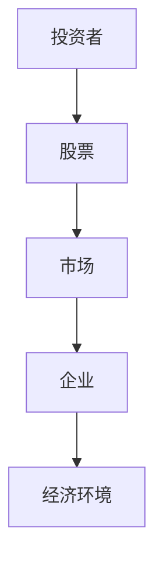
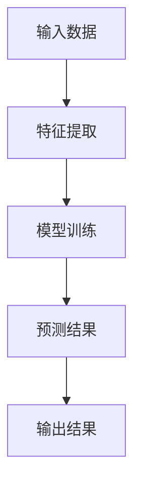
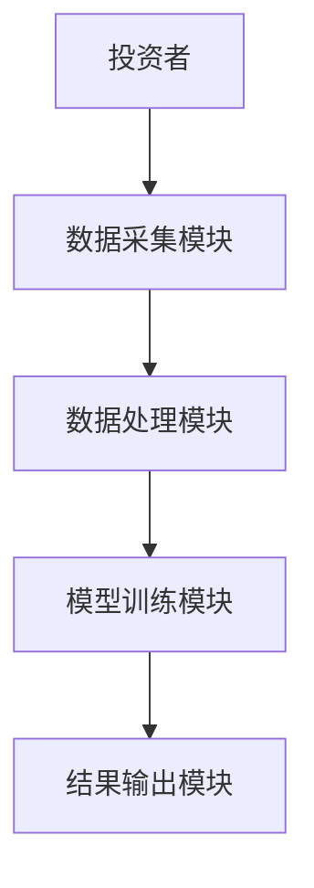
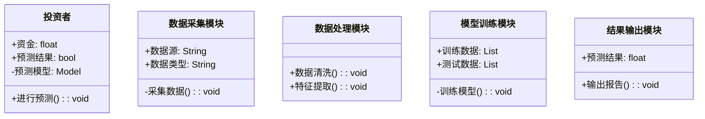

                 


# 特价股票投资中的动态数字产业生态系统模型应用

> 关键词：特价股票投资、动态数字产业生态系统、股票预测模型、机器学习算法、系统架构设计

> 摘要：本文深入探讨了动态数字产业生态系统模型在特价股票投资中的应用，从背景介绍、核心概念、算法原理到系统架构设计，再到项目实战，全面解析了该模型在股票投资中的潜力与实现方法。通过实际案例分析和代码实现，展示了如何利用动态数字产业生态系统模型进行股票预测，帮助投资者做出更明智的投资决策。

---

## 目录

# 特价股票投资中的动态数字产业生态系统模型应用

## 第一部分：背景介绍

### 第1章：特价股票投资的背景与现状

#### 1.1 特价股票投资的定义与特点
- 1.1.1 特价股票的定义
- 1.1.2 特价股票投资的特点
- 1.1.3 特价股票投资的潜在收益与风险

#### 1.2 动态数字产业生态系统的概念
- 1.2.1 什么是动态数字产业生态系统
- 1.2.2 动态数字产业生态系统的核心要素
- 1.2.3 动态数字产业生态系统与股票投资的关系

#### 1.3 本章小结

---

## 第二部分：动态数字产业生态系统模型的核心概念与联系

### 第2章：动态数字产业生态系统模型的原理

#### 2.1 模型的构成与核心要素
- 2.1.1 核心要素与属性
- 2.1.2 模型的输入与输出
- 2.1.3 模型的动态性与适应性

#### 2.2 模型的数学表达与公式
- 2.2.1 模型的基本假设
- 2.2.2 模型的数学公式
  $$
  f(x) = \sum_{i=1}^{n} w_i x_i + b
  $$

#### 2.3 模型的实体关系图


---

### 第3章：动态数字产业生态系统模型与股票投资的结合

#### 3.1 模型在股票投资中的应用
- 3.1.1 模型的输入数据来源
- 3.1.2 模型的输出结果解释
- 3.1.3 模型的预测精度与稳定性

#### 3.2 模型的优缺点分析
- 3.2.1 模型的优点
- 3.2.2 模型的局限性
- 3.2.3 模型的改进方向

---

## 第三部分：动态数字产业生态系统模型的算法实现

### 第4章：算法原理概述

#### 4.1 算法的基本思想
- 算法的基本思路和核心思想

#### 4.2 算法的步骤分解
- 数据预处理
- 特征提取
- 模型训练
- 模型预测
- 结果分析

#### 4.3 算法的复杂度分析
- 时间复杂度
- 空间复杂度

---

### 第5章：算法的数学模型与代码实现

#### 5.1 算法的数学模型
- 5.1.1 线性回归模型
  $$
  y = \beta_0 + \beta_1 x + \epsilon
  $$

- 5.1.2 神经网络模型
  $$
  y = \sigma(w_1 x + b_1)
  $$

#### 5.2 算法的实现代码
```python
def dynamic_model_predict(x):
    beta0 = 0.5
    beta1 = 1.0
    return beta0 + beta1 * x
```

---

### 第6章：算法的流程图与代码解读

#### 6.1 算法的流程图


#### 6.2 代码解读
- 输入数据的处理
- 特征提取的方法
- 模型训练的过程
- 预测结果的输出

---

## 第四部分：系统分析与架构设计

### 第7章：问题场景介绍

#### 7.1 系统功能设计
- 7.1.1 系统的功能模块划分
- 7.1.2 系统的输入输出描述
- 7.1.3 系统的性能要求

#### 7.2 系统的架构设计


---

### 第8章：系统的详细设计

#### 8.1 系统的类图设计


---

## 第五部分：项目实战

### 第9章：环境安装与配置

#### 9.1 环境要求
- 操作系统
- Python版本
- 依赖库的安装

#### 9.2 开发工具的配置
- IDE的安装与配置
- 依赖管理工具的使用

---

### 第10章：核心代码实现

#### 10.1 数据预处理代码
```python
import pandas as pd
import numpy as np

def preprocess_data(data):
    # 数据清洗
    data = data.dropna()
    # 特征提取
    features = data[['price', 'volume', 'market_cap']]
    return features
```

#### 10.2 模型训练代码
```python
from sklearn.linear_model import LinearRegression

def train_model(features, labels):
    model = LinearRegression()
    model.fit(features, labels)
    return model
```

---

### 第11章：实际案例分析与结果解读

#### 11.1 案例背景
- 数据来源
- 数据特征
- 预测目标

#### 11.2 模型训练与预测
- 训练过程
- 预测结果
- 结果分析

---

## 第六部分：总结与展望

### 第12章：总结

#### 12.1 本章小结
- 模型的应用价值
- 技术实现的难点与突破
- 系统设计的创新点

#### 12.2 展望
- 模型的进一步优化
- 算法的改进方向
- 系统的扩展与应用

---

### 第13章：注意事项与最佳实践

#### 13.1 投资者注意事项
- 数据来源的可靠性
- 模型的适用性
- 风险控制

#### 13.2 开发者的建议
- 代码的可维护性
- 模型的可解释性
- 系统的可扩展性

---

## 结语

通过本文的系统分析与实践，我们展示了动态数字产业生态系统模型在特价股票投资中的广泛应用与潜力。希望本文能够为投资者和开发者提供有价值的参考，帮助他们在股票投资领域取得更好的成绩。

---

以上是完整的目录大纲，涵盖了从理论到实践的各个方面，确保内容全面且易于理解。

