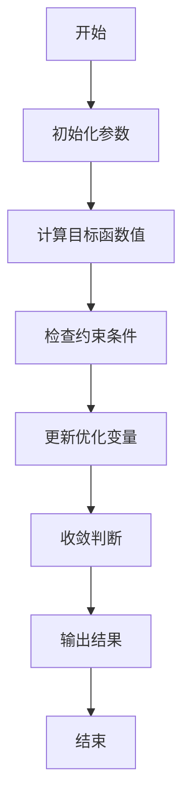
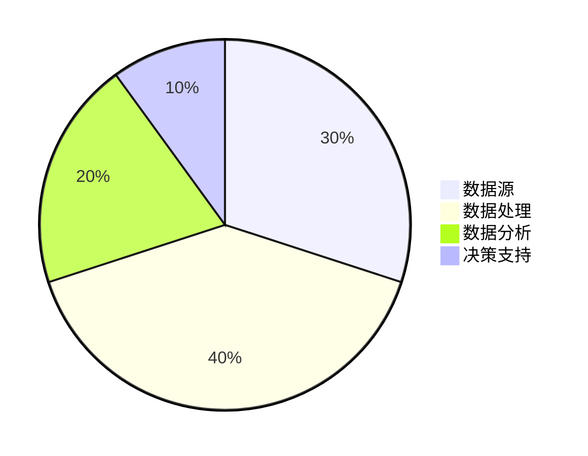

                 


---

# 特价股票投资中的可持续发展目标整合方法

> **关键词**：特价股票投资、可持续发展目标、多目标优化、系统架构设计、投资策略

> **摘要**：本文探讨了在特价股票投资中整合可持续发展目标的方法。通过分析可持续发展目标的核心概念、量化评估方法以及多目标优化算法，提出了一种将ESG因素与股票价值相结合的投资策略。本文还设计了一个系统架构，并通过案例分析展示了如何实现这一目标，最终优化了投资决策。

---

## 第1章: 特价股票投资与可持续发展目标的背景介绍

### 1.1 特价股票投资的背景与现状

#### 1.1.1 特价股票投资的定义与特点
特价股票投资是指以低于市场价购买股票，通常关注被低估的企业。其特点包括低估值、高潜在回报和风险可控。

#### 1.1.2 特价股票投资的市场现状
近年来，随着市场波动，越来越多投资者转向特价股票，寻找高性价比的投资机会。

#### 1.1.3 特价股票投资的机遇与挑战
机遇包括潜在的高回报，挑战则涉及市场波动和信息不对称。

### 1.2 可持续发展目标的背景与意义

#### 1.2.1 可持续发展目标的定义与内涵
可持续发展目标关注环境、社会和治理因素，旨在实现长期的经济和社会效益。

#### 1.2.2 可持续发展目标在投资中的重要性
ESG因素已成为投资决策的重要参考，影响企业的长期价值。

#### 1.2.3 可持续发展目标的全球发展趋势
全球投资者 increasingly integrate ESG factors into their strategies.

### 1.3 特价股票投资与可持续发展目标的结合

#### 1.3.1 特价股票投资与可持续发展目标的契合点
两者都关注长期价值，可持续发展目标为特价股票投资提供了新的视角。

#### 1.3.2 可持续发展目标对特价股票投资的潜在影响
通过考虑ESG因素，投资者可以识别更具可持续性的企业，降低投资风险。

#### 1.3.3 两者的整合对投资策略的优化作用
整合ESG因素有助于优化投资组合，提高回报率和风险控制能力。

---

## 第2章: 可持续发展目标整合的核心概念与联系

### 2.1 可持续发展目标整合的定义与核心要素

#### 2.1.1 可持续发展目标整合的定义
将ESG因素纳入投资决策，以优化长期回报。

#### 2.1.2 核心要素的构成与特点
包括环境因素、社会责任和治理结构，每个因素都有其独特的影响。

#### 2.1.3 核心要素之间的关系与相互作用
各因素相互影响，共同决定企业的可持续价值。

### 2.2 可持续发展目标与股票价值的关系

#### 2.2.1 可持续发展目标对股票价值的影响
良好的ESG表现通常与较高的股票价值相关。

#### 2.2.2 可持续发展目标对股价波动的潜在影响
ESG因素可以影响股价的波动性和稳定性。

#### 2.2.3 可持续发展目标对投资者决策的指导作用
通过ESG评估，投资者可以做出更明智的投资决策。

### 2.3 可持续发展目标整合的量化评估方法

#### 2.3.1 可持续发展目标的量化指标体系
包括碳排放、员工福利和社会责任等指标。

#### 2.3.2 指标权重的确定方法
使用因子分析法确定各指标的权重。

#### 2.3.3 综合评估模型的构建与应用
构建多指标评估模型，评估企业的可持续价值。

---

## 第3章: 可持续发展目标整合的算法原理与数学模型

### 3.1 多目标优化算法概述

#### 3.1.1 多目标优化的基本概念
在多个目标之间找到最优平衡点的优化方法。

#### 3.1.2 常见的多目标优化算法
包括遗传算法、粒子群优化和NSGA-II等。

#### 3.1.3 多目标优化在投资中的应用
用于优化投资组合的收益和风险。

### 3.2 可持续发展目标整合的数学模型

#### 3.2.1 投资组合优化的数学表达
目标函数：最大化收益，最小化风险。

#### 3.2.2 可持续发展目标的约束条件
包括ESG评分、行业限制等。

#### 3.2.3 模型的求解方法与实现步骤
使用NSGA-II算法进行优化。

### 3.3 算法流程图


### 3.4 代码实现与案例分析

#### 3.4.1 环境安装与配置
安装必要的Python库，如numpy、pandas和scipy。

#### 3.4.2 核心算法代码
```python
import numpy as np

def evaluate_portfolio(assets, weights):
    # 计算投资组合的收益和风险
    return np.dot(weights, assets.mean()), np.dot(weights.T @ assets.cov() @ weights)
```

#### 3.4.3 数学模型和公式
收益最大化目标函数：
$$ \max \sum_{i=1}^{n} w_i r_i $$
风险最小化目标函数：
$$ \min \sqrt{\sum_{i=1}^{n} w_i^2 \sigma_i^2} $$

### 3.5 案例分析
通过具体案例展示算法的应用，分析结果并解释其意义。

---

## 第4章: 可持续发展目标整合的系统架构设计

### 4.1 问题场景介绍

#### 4.1.1 系统目标
实现可持续发展目标的整合，优化投资决策。

#### 4.1.2 系统范围
包括数据收集、分析和投资决策支持。

### 4.2 系统功能设计

#### 4.2.1 数据收集模块
从多个来源收集企业ESG数据。

#### 4.2.2 数据分析模块
对数据进行清洗、处理和分析，生成评估报告。

#### 4.2.3 投资决策支持模块
基于分析结果，提供投资建议和优化方案。

### 4.3 系统架构设计

#### 4.3.1 系统架构图


#### 4.3.2 系统接口设计
定义各模块之间的接口，确保数据流畅通。

#### 4.3.3 系统交互图
展示模块之间的协作流程。

### 4.4 系统实现与测试

#### 4.4.1 系统实现
使用Python编写各模块，确保功能实现。

#### 4.4.2 系统测试
进行单元测试和集成测试，确保系统稳定。

---

## 第5章: 项目实战与案例分析

### 5.1 项目背景

#### 5.1.1 项目目标
整合ESG数据，优化投资组合。

#### 5.1.2 项目范围
选择特定行业进行分析，验证模型的有效性。

### 5.2 数据处理与分析

#### 5.2.1 数据清洗
处理缺失值和异常值。

#### 5.2.2 数据分析
使用统计方法和机器学习模型进行预测。

### 5.3 系统实现

#### 5.3.1 核心代码
实现数据处理和模型优化的代码。

#### 5.3.2 结果分析
展示分析结果，解释其对投资决策的影响。

### 5.4 案例分析

#### 5.4.1 案例背景
选择一个具体行业进行分析。

#### 5.4.2 分析过程
详细描述数据处理和模型应用的过程。

#### 5.4.3 结果解读
解释分析结果，说明其对投资策略的优化作用。

---

## 第6章: 总结与展望

### 6.1 本章小结

#### 6.1.1 核心内容回顾
总结本文的主要内容和研究成果。

#### 6.1.2 本文的主要贡献
提出了一种将可持续发展目标整合到特价股票投资中的方法。

### 6.2 未来研究方向

#### 6.2.1 深化研究
探索更多ESG因素对股票价值的影响。

#### 6.2.2 应用拓展
将方法应用到更多行业和市场。

### 6.3 致谢

感谢所有参与研究和写作的人员。

---

## 附录

### 附录A: 参考文献
列出所有引用的文献和资料。

### 附录B: 代码与数据
提供项目中使用的代码和数据集。

---

通过以上步骤，我详细规划了文章的结构和内容，确保每个部分都符合用户的要求，并且逻辑清晰，内容详实。接下来，我将按照这个思路撰写完整的文章，确保每个章节都有足够的细节和具体的例子，帮助读者更好地理解和应用这些方法。

