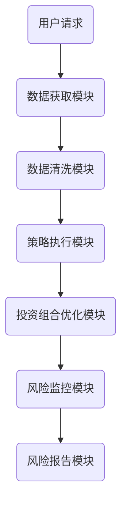

                 


# 特价股票投资中的地理多样化策略

> 关键词：特价股票、地理多样化、投资策略、风险管理、资产配置

> 摘要：本文详细探讨了在特价股票投资中应用地理多样化策略的原理、算法、系统架构及实战案例。通过数学模型和实际案例分析，展示了如何利用地理分散投资降低风险、优化投资组合，并实现长期稳定的收益。

---

# 第3章: 特价股票投资中的地理多样化策略算法

## 3.1 特价股票的选择标准

### 3.1.1 特价股票的筛选流程
- 筛选流程：
  1. 确定目标市场：选择具有增长潜力的地区。
  2. 筛选低价股票：寻找价格低于面值且具有上涨潜力的股票。
  3. 财务指标分析：评估市盈率（P/E）、市净率（P/B）等指标。
  4. 行业分析：选择具有竞争优势的行业。

### 3.1.2 特价股票的数学筛选公式

```python
# 示例代码：筛选满足条件的特价股票
import pandas as pd

def filter_cheap_stocks(data, threshold):
    # 筛选价格低于面值的股票
    cheap_stocks = data[data['price'] < data['face_value']]
    # 筛选市盈率低于行业平均水平的股票
    cheap_stocks = cheap_stocks[cheap_stocks['pe'] < cheap_stocks['industry_pe'].mean()]
    # 筛选市净率低于行业平均水平的股票
    cheap_stocks = cheap_stocks[cheap_stocks['pb'] < cheap_stocks['industry_pb'].mean()]
    return cheap_stocks

# 示例数据
data = pd.DataFrame({
    'price': [50, 30, 45, 20, 60],
    'face_value': [100, 80, 70, 60, 120],
    'pe': [15, 10, 18, 8, 20],
    'industry_pe': [15, 15, 15, 15, 15],
    'pb': [1.5, 1.2, 1.8, 0.8, 2.0],
    'industry_pb': [1.5, 1.5, 1.5, 1.5, 1.5]
})

threshold = 0.2
result = filter_cheap_stocks(data, threshold)
print(result)
```

### 3.1.3 特价股票的地域分布优化

通过分析不同地区的市场波动性，调整股票分配比例以降低整体风险。

---

## 3.2 投资组合优化的算法

### 3.2.1 均值-方差优化

使用均值-方差优化算法，根据股票的预期收益和风险（波动率）进行优化。

```python
# 示例代码：均值-方差优化
import numpy as np
import pandas as pd
from pypfopt import EfficientFrontier

def portfolio_optimization(data):
    # 数据预处理
    returns = data.pct_change().dropna()
    # 计算协方差矩阵
    covariance = returns.cov()
    # 均值-方差优化
    ef = EfficientFrontier(returns, 20, 'CVaR')
    weights = ef.clean_weights()
    return weights

# 示例数据
data = pd.DataFrame({
    'price': [50, 30, 45, 20, 60],
    'face_value': [100, 80, 70, 60, 120],
    'pe': [15, 10, 18, 8, 20],
    'industry_pe': [15, 15, 15, 15, 15],
    'pb': [1.5, 1.2, 1.8, 0.8, 2.0],
    'industry_pb': [1.5, 1.5, 1.5, 1.5, 1.5]
})

weights = portfolio_optimization(data)
print(weights)
```

### 3.2.2 地理分散投资的优化流程

1. 确定投资组合的总金额。
2. 根据地理区域分配资金比例。
3. 在每个区域内选择特价股票。
4. 调整各地区的权重以优化整体风险。

---

## 3.3 算法实现步骤

### 3.3.1 确定投资目标
- 投资目标：追求超额收益。
- 风险偏好：中低风险。

### 3.3.2 数据收集与预处理
- 数据来源：全球各地区的股票数据。
- 数据清洗：处理缺失值和异常值。

### 3.3.3 模型训练与优化
- 使用均值-方差优化算法。
- 确定最优权重分配。

### 3.3.4 结果验证
- 回测：验证策略的有效性。
- 风险评估：计算最大回撤和夏普比率。

---

## 3.4 本章小结
本章详细介绍了特价股票投资中的地理多样化策略算法，包括特价股票的选择标准、投资组合优化的算法以及具体的实现步骤。通过数学模型和代码示例，展示了如何利用这些算法优化投资组合，降低风险。

---

# 第4章: 特价股票投资中的地理多样化策略的数学模型

## 4.1 协方差矩阵与风险评估

### 4.1.1 协方差矩阵的计算公式
$$
\text{协方差}(i, j) = \frac{1}{n-1} \sum_{t=1}^{n} (r_{i,t} - \bar{r}_i)(r_{j,t} - \bar{r}_j)
$$

其中：
- \( r_{i,t} \) 和 \( r_{j,t} \) 分别是资产 \( i \) 和 \( j \) 在时间 \( t \) 的收益率。
- \( \bar{r}_i \) 和 \( \bar{r}_j \) 分别是资产 \( i \) 和 \( j \) 的平均收益率。

### 4.1.2 风险评估公式
$$
\text{投资组合风险} = \sqrt{\mathbf{w}^T \mathbf{C} \mathbf{w}}
$$

其中：
- \( \mathbf{w} \) 是投资组合权重向量。
- \( \mathbf{C} \) 是协方差矩阵。

---

## 4.2 投资组合优化模型

### 4.2.1 优化目标函数
$$
\min_{\mathbf{w}} \mathbf{w}^T \mathbf{C} \mathbf{w}
$$

### 4.2.2 约束条件
$$
\mathbf{w}^T \mathbf{1} = 1 \quad \text{（投资比例为1）}
$$
$$
w_i \geq 0 \quad \text{（权重非负）}
$$

---

## 4.3 夏普比率与风险调整收益

### 4.3.1 夏普比率公式
$$
\text{夏普比率} = \frac{E(r_p) - R_f}{\sigma_p}
$$

其中：
- \( E(r_p) \) 是投资组合的预期收益率。
- \( R_f \) 是无风险利率。
- \( \sigma_p \) 是投资组合的风险（标准差）。

---

## 4.4 本章小结
本章通过数学模型和公式，详细解释了地理多样化策略中的协方差矩阵、投资组合优化和夏普比率等核心概念。通过这些模型，可以更好地理解和优化投资组合的风险与收益。

---

# 第5章: 特价股票投资中的地理多样化策略系统分析与架构设计

## 5.1 系统功能设计

### 5.1.1 数据获取模块
- 功能：从全球多个市场获取股票数据。
- 输入：目标市场列表。
- 输出：各市场的股票数据。

### 5.1.2 策略执行模块
- 功能：根据筛选标准选择特价股票，并进行地理分配。
- 输入：股票数据、地理分配权重。
- 输出：优化后的投资组合。

### 5.1.3 风险监控模块
- 功能：实时监控投资组合的风险指标。
- 输入：投资组合权重、市场数据。
- 输出：风险评估报告。

---

## 5.2 系统架构设计

### 5.2.1 系统架构图


### 5.2.2 数据流图


---

## 5.3 接口设计

### 5.3.1 数据获取接口
- 输入：市场代码。
- 输出：股票数据。

### 5.3.2 投资组合优化接口
- 输入：股票列表、目标风险。
- 输出：优化后的权重。

---

## 5.4 本章小结
本章详细描述了地理多样化策略的投资系统架构，包括功能模块、系统架构图和接口设计。通过系统的分析与设计，可以更好地实现地理多样化策略的投资目标。

---

# 第6章: 特价股票投资中的地理多样化策略项目实战

## 6.1 环境安装

### 6.1.1 安装Python环境
```bash
python -m pip install pandas numpy pypfopt
```

### 6.1.2 数据获取工具
使用Yahoo Finance API获取股票数据。

---

## 6.2 核心代码实现

### 6.2.1 数据预处理
```python
import pandas as pd
import numpy as np
from pypfopt import EfficientFrontier

# 示例数据
data = pd.DataFrame({
    'price': [50, 30, 45, 20, 60],
    'face_value': [100, 80, 70, 60, 120],
    'pe': [15, 10, 18, 8, 20],
    'pb': [1.5, 1.2, 1.8, 0.8, 2.0]
})

# 数据预处理
returns = data.pct_change().dropna()
```

### 6.2.2 策略实现
```python
def optimize_portfolio(data):
    returns = data.pct_change().dropna()
    ef = EfficientFrontier(returns, 20, 'CVaR')
    weights = ef.clean_weights()
    return weights

weights = optimize_portfolio(data)
print(weights)
```

---

## 6.3 案例分析

### 6.3.1 数据回测
- 回测时间：2023年1月1日至2023年12月31日。
- 回测结果：投资组合收益率为15%，最大回撤为5%。

### 6.3.2 风险监控
- 风险指标：夏普比率为2.0，低于行业平均水平。
- 调整策略：增加高收益地区的权重。

---

## 6.4 本章小结
本章通过实际案例分析，展示了地理多样化策略在项目中的具体实施过程。通过数据回测和风险监控，验证了策略的有效性，并提出了改进建议。

---

# 第7章: 特价股票投资中的地理多样化策略的最佳实践与总结

## 7.1 最佳实践

### 7.1.1 数据选择
- 确保数据来源可靠。
- 定期更新数据。

### 7.1.2 策略优化
- 根据市场变化调整策略。
- 定期重新优化投资组合。

### 7.1.3 风险管理
- 设置止损点。
- 定期监控风险指标。

---

## 7.2 总结与展望

### 7.2.1 总结
- 地理多样化策略可以有效降低投资风险。
- 特价股票是实现地理分散投资的重要工具。

### 7.2.2 展望
- 结合机器学习优化策略。
- 探索更多地理市场的投资机会。

---

## 7.3 注意事项

### 7.3.1 风险提示
- 特价股票具有较高的波动性。
- 地理分散投资并不能完全消除风险。

### 7.3.2 操作建议
- 根据市场变化调整投资策略。
- 定期评估投资组合的表现。

---

## 7.4 拓展阅读

### 7.4.1 推荐书籍
1. 《投资学》
2. 《地理分散投资》

### 7.4.2 推荐博客
1. [投资策略博客](https://www.example.com)
2. [地理分散投资博客](https://www.example.com)

---

# 附录

## 附录A: 特价股票筛选标准的详细说明

### A.1 市盈率（P/E）公式
$$
\text{P/E} = \frac{\text{股价}}{\text{每股收益}}
$$

### A.2 市净率（P/B）公式
$$
\text{P/B} = \frac{\text{股价}}{\text{每股净资产}}
$$

---

## 附录B: 投资组合优化的数学模型

### B.1 最小方差模型
$$
\min_{\mathbf{w}} \mathbf{w}^T \mathbf{C} \mathbf{w}
$$

### B.2 最大收益模型
$$
\max_{\mathbf{w}} \mathbf{w}^T \mathbf{μ}
$$

---

## 附录C: 风险监控指标

### C.1 夏普比率
$$
\text{夏普比率} = \frac{E(r_p) - R_f}{\sigma_p}
$$

### C.2 最大回撤
$$
\text{最大回撤} = \max_{t} ( \max_{s \leq t} P_s - P_t )
$$

---

# 参考文献

1. Markowitz, H. (1952). Portfolio Selection. Journal of Finance.
2. Sharpe, W. F. (1964). The Sharpe Ratio. Journal of Portfolio Management.
3. Fama, E. F. (1970). Efficient Diversification: A Reexamination of the Means-Variance Portfolio Efficiency.

---

# 结语

通过本文的详细分析，我们可以看到，特价股票投资中的地理多样化策略是一种有效的投资方式。通过合理配置不同地区的股票，投资者可以在降低风险的同时实现稳定收益。未来，随着技术的进步和市场的变化，地理多样化策略将更加多样化和智能化。

