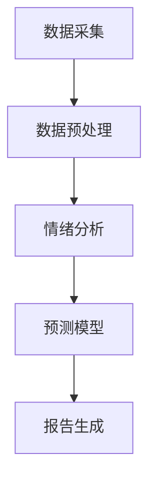

                 


# 特价股票投资中的心理学因素分析

> 关键词：特价股票，心理学因素，认知偏差，情绪影响，行为偏差，投资决策

> 摘要：本文从心理学的角度分析特价股票投资中的心理因素，探讨认知偏差、情绪影响和行为偏差对投资者决策的影响，揭示如何通过理解和克服这些心理障碍来提升投资效果。

---

## 第一部分：背景介绍

### 第1章：特价股票投资的基本概念

#### 1.1 特价股票的定义与特征

- **定义**：特价股票指那些市场价格低于其内在价值的股票，通常被认为被市场低估。
- **特征**：
  - 低估值：市盈率、市净率等指标远低于行业平均水平。
  - 高潜力：公司基本面良好，但暂时被市场忽视。
  - 低流动性：交易量小，价格波动大。

#### 1.2 投资者心理与股票价格的关系

- **投资者心理对股票价格的影响**：
  - 集体情绪波动导致价格偏离基本面。
  - 个体情绪影响投资决策，进而影响市场整体走势。
- **特价股票吸引投资者的原因**：
  - 价格便宜，潜在收益高。
  - 投资者渴望发现“价值洼地”。

#### 1.3 特价股票与普通股票的区别

- **区别**：
  - 价格：特价股票价格远低于其内在价值。
  - 风险：特价股票通常风险较高，波动性大。
  - 机会：潜在回报高，但需要长期持有。

---

### 第2章：投资者心理与市场行为

#### 2.1 投资者心理对市场行为的影响

- **心理偏差**：
  - 确认偏差：投资者倾向于寻找支持自己观点的信息。
  - 过度自信：认为自己能预测市场走势。
  - 从众心理：跟随市场趋势，而非独立判断。

#### 2.2 特价股票投资中的心理偏差

- **贪婪与恐惧**：
  - 贪婪导致高估潜在回报。
  - 恐惧导致错失买入机会或过早卖出。

#### 2.3 心理因素对投资决策的影响

- **情绪化决策**：
  - 情绪波动导致短期决策失误。
  - 情绪稳定者更可能长期持有。

---

## 第二部分：认知偏差与投资决策

### 第3章：认知偏差的基本概念

#### 3.1 认知偏差的定义

- **定义**：认知偏差是人们对信息处理的系统性错误。
- **类型**：
  - 确认偏差：只关注支持自己观点的信息。
  - 代表性偏差：用典型案例代表整体情况。
  - 锚定效应：过度依赖初始信息。

#### 3.2 投资者常见的认知偏差

- **确认偏差**：
  - 投资者倾向于寻找支持自己判断的信息，忽视反面证据。
- **代表性偏差**：
  - 根据过去经验判断未来，忽视概率。
- **锚定效应**：
  - 投资者过度依赖初始价格，影响后续决策。

#### 3.3 认知偏差对特价股票投资的影响

- **影响**：
  - 错误评估股票价值，导致买入高价股或卖出低价股。
  - 低估风险，导致过度投资。

---

### 第4章：情绪对投资行为的影响

#### 4.1 情绪对投资决策的影响

- **情绪波动**：
  - 情绪高涨时高估股票价值。
  - 情绪低落时低估股票价值。
- **情绪与决策的关系**：
  - 情绪驱动短期决策，理性主导长期决策。

#### 4.2 特价股票投资中的常见情绪

- **贪婪**：
  - 追求短期高回报，导致高位买入。
- **恐惧**：
  - 害怕损失，导致低位卖出。
- **乐观偏差**：
  - 过度自信，低估风险。

#### 4.3 情绪管理的重要性

- **控制情绪**：
  - 制定明确的投资策略，避免情绪干扰。
  - 定期复盘，调整心态。

---

## 第三部分：行为偏差与投资策略

### 第5章：行为偏差的基本概念

#### 5.1 行为偏差的定义

- **定义**：行为偏差是投资者在决策过程中表现出的非理性行为。
- **类型**：
  - 交易行为偏差：频繁交易。
  - 信息处理偏差：信息处理不全面。
  - 风险偏好偏差：过度追求或规避风险。

#### 5.2 投资者常见的行为偏差

- **交易行为偏差**：
  - 过度交易：频繁买卖，增加成本。
  - 从众交易：跟随市场趋势，缺乏独立判断。
- **信息处理偏差**：
  - 过滤信息：只关注对自己有利的信息。
  - 信息过载：无法处理大量信息，导致决策延迟。
- **风险偏好偏差**：
  - 过度冒险：低估风险。
  - 过度保守：错失机会。

#### 5.3 行为偏差对特价股票投资的影响

- **影响**：
  - 频繁交易增加成本，降低收益。
  - 从众行为导致错失独特机会。
  - 过度冒险或保守导致投资失败。

---

## 第四部分：数学模型与实证分析

### 第6章：心理因素的数学模型

#### 6.1 情绪指数模型

- **模型**：将投资者情绪量化为指数，反映市场整体情绪。
  - 公式：$$E = \alpha \cdot V + \beta \cdot T + \gamma \cdot D$$
  - 其中，$V$是成交量，$T$是交易量，$D$是波动性。

#### 6.2 认知偏差对模型的影响

- **分析**：认知偏差导致情绪指数偏离实际市场情况。
  - 确认偏差：模型中只选择支持情绪的信息。
  - 代表性偏差：用局部情况代表整体市场。

#### 6.3 实证分析

- **数据来源**：选取某段时间的市场数据，计算情绪指数。
  - 例如：使用2020年新冠疫情后的市场数据进行分析。
- **结果**：情绪指数与股票价格波动高度相关。

---

## 第五部分：系统架构与项目实战

### 第7章：系统架构设计

#### 7.1 系统功能设计

- **模块划分**：
  - 数据采集：收集市场数据。
  - 情绪分析：计算情绪指数。
  - 预测模型：预测股票价格。
  - 报告生成：输出分析报告。

#### 7.2 系统架构图



#### 7.3 接口设计

- **API接口**：
  - 数据接口：获取市场数据。
  - 分析接口：返回情绪指数。
  - 预测接口：返回预测结果。

---

### 第8章：项目实战

#### 8.1 环境安装

- **工具**：
  - Python：数据处理和建模。
  - Pandas：数据处理。
  - Matplotlib：数据可视化。
  - Scikit-learn：机器学习模型。

#### 8.2 核心代码实现

```python
import pandas as pd
import numpy as np
from sklearn.linear_model import LinearRegression

# 数据加载
data = pd.read_csv('stock_data.csv')

# 情绪指数计算
def calculate_emotion_index(data):
    emotion_index = []
    for i in range(len(data)):
        volume = data['volume'][i]
        price_change = data['price_change'][i]
        emotion = 0.3 * volume + 0.7 * price_change
        emotion_index.append(emotion)
    return emotion_index

# 模型训练
model = LinearRegression()
model.fit(data[['emotion_index']], data['price'])

# 预测结果
predicted_price = model.predict(data[['emotion_index']])

# 结果输出
print('Predicted Price:', predicted_price)
```

---

## 第六部分：最佳实践与总结

### 第9章：最佳投资策略

#### 9.1 心理因素管理

- **保持冷静**：避免情绪化决策。
- **理性分析**：结合基本面和技术面分析。
- **分散投资**：降低风险。

#### 9.2 长期投资心态

- **耐心**：等待合适时机。
- **坚持**：不因短期波动改变策略。
- **学习**：不断优化投资策略。

#### 9.3 小结与注意事项

- **小结**：心理因素对投资决策有重要影响。
- **注意事项**：
  - 避免过度自信。
  - 控制情绪波动。
  - 定期复盘。

---

## 参考文献

- [1] 哈佛商学院：《行为金融学》
- [2] 纳西姆·塔勒布：《黑天鹅》
- [3] 约翰·诺里曼：《投资者心理学》

---

**结束语**：通过理解心理因素在特价股票投资中的作用，投资者可以更好地管理情绪和认知偏差，做出更理性的投资决策。心理因素分析不仅有助于提高投资成功率，还能帮助投资者在市场波动中保持冷静。

