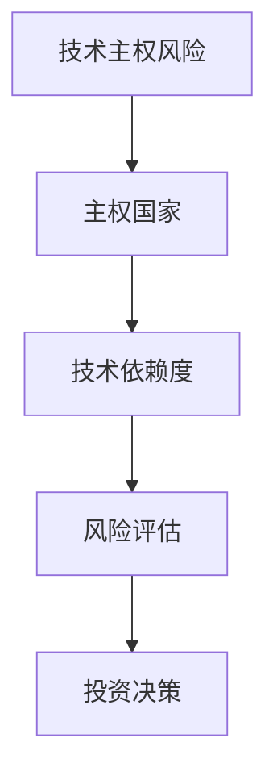
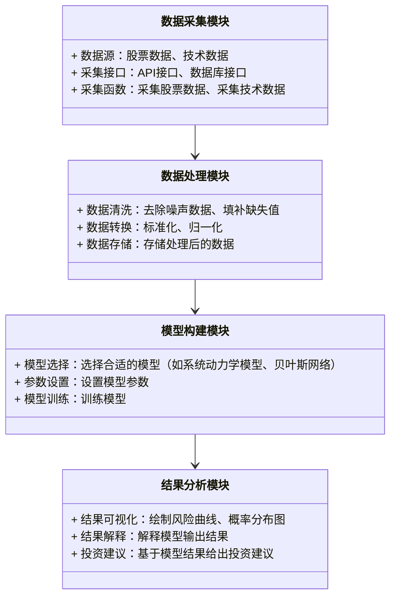

                 


# 特价股票投资中的技术主权风险评估

> 关键词：技术主权风险、股票投资、风险评估、系统动力学模型、贝叶斯网络、投资决策

> 摘要：本文探讨了在特价股票投资中技术主权风险的评估方法，通过系统动力学模型和贝叶斯网络等算法，分析了技术主权风险的核心要素及其对投资决策的影响。文章详细介绍了技术主权风险的定义、评估指标、数学模型，并通过实际案例展示了如何利用这些方法进行风险评估和投资决策优化。

---

# 第1章: 特价股票投资与技术主权风险概述

## 1.1 特价股票投资的背景与特点

### 1.1.1 特价股票投资的定义与特点
特价股票投资是指在特定市场条件下，投资者以低于市场价买入股票，期望在市场回升时卖出获利的投资策略。其特点包括高波动性、高风险性和短期收益潜力。

### 1.1.2 特价股票投资的市场现状
近年来，随着市场波动加剧，特价股票投资逐渐成为投资者关注的焦点。然而，这种投资方式面临的市场风险和技术风险也在增加。

### 1.1.3 技术主权风险的定义与内涵
技术主权风险是指因技术依赖或技术限制而导致的国家或企业层面的经济风险。在股票投资中，技术主权风险可能影响企业的盈利能力和股票价值。

## 1.2 技术主权风险的背景与问题

### 1.2.1 技术主权风险的定义
技术主权风险是指因技术依赖或技术限制而导致的国家或企业层面的经济风险。在股票投资中，技术主权风险可能影响企业的盈利能力和股票价值。

### 1.2.2 技术主权风险的核心要素
技术主权风险的核心要素包括技术依赖度、技术可控性、技术替代性和技术发展速度。

### 1.2.3 技术主权风险与股票投资的关系
技术主权风险直接影响企业的市场竞争力和股票价值。投资者需要评估技术主权风险，以制定合理的投资策略。

## 1.3 技术主权风险评估的必要性

### 1.3.1 技术主权风险对股票投资的影响
技术主权风险可能影响企业的市场竞争力和股票价值。投资者需要评估技术主权风险，以制定合理的投资策略。

### 1.3.2 技术主权风险评估的现实意义
通过技术主权风险评估，投资者可以更好地识别投资风险，优化投资组合，提高投资收益。

### 1.3.3 技术主权风险评估的边界与外延
技术主权风险评估的边界包括企业的技术依赖度、技术可控性、技术替代性和技术发展速度。其外延包括技术风险、市场风险和政治风险。

## 1.4 技术主权风险评估的核心概念

### 1.4.1 技术主权风险评估的框架
技术主权风险评估的框架包括风险识别、风险量化和风险应对。

### 1.4.2 技术主权风险评估的关键指标
技术主权风险的关键指标包括技术依赖度、技术可控性、技术替代性和技术发展速度。

### 1.4.3 技术主权风险评估的流程与方法
技术主权风险评估的流程包括数据收集、模型构建、风险量化和结果分析。

---

# 第2章: 技术主权风险评估的核心概念与联系

## 2.1 技术主权风险评估的核心原理

### 2.1.1 技术主权风险评估的基本原理
技术主权风险评估的基本原理包括数据驱动、模型构建和风险量化。

### 2.1.2 技术主权风险评估的关键算法
技术主权风险评估的关键算法包括系统动力学模型和贝叶斯网络。

### 2.1.3 技术主权风险评估的数学模型
系统动力学模型的数学表达为：
$$\frac{dS}{dt} = k_1 \cdot S - k_2 \cdot R$$
其中，$S$ 表示技术主权风险，$R$ 表示投资回报率，$k_1$ 和 $k_2$ 是常数。

## 2.2 技术主权风险评估的核心概念对比

### 2.2.1 技术主权风险与经济风险的对比
技术主权风险关注技术依赖性，而经济风险关注整体经济波动。

### 2.2.2 技术主权风险与政治风险的对比
技术主权风险关注技术限制，而政治风险关注政策变化。

### 2.2.3 技术主权风险与市场风险的对比
技术主权风险关注技术对企业的影响，而市场风险关注整体市场波动。

## 2.3 技术主权风险评估的ER实体关系图



---

# 第3章: 技术主权风险评估的算法原理

## 3.1 系统动力学模型

### 3.1.1 系统动力学模型的定义
系统动力学模型是一种基于系统理论的数学模型，用于描述复杂系统的动态行为。

### 3.1.2 系统动力学模型的构建步骤
系统动力学模型的构建步骤包括问题识别、变量定义、模型构建、仿真分析和结果验证。

### 3.1.3 系统动力学模型的数学表达
系统动力学模型的数学表达为：
$$\frac{dS}{dt} = k_1 \cdot S - k_2 \cdot R$$
其中，$S$ 表示技术主权风险，$R$ 表示投资回报率，$k_1$ 和 $k_2$ 是常数。

## 3.2 贝叶斯网络

### 3.2.1 贝叶斯网络的定义
贝叶斯网络是一种基于概率论的图形化模型，用于表示变量之间的依赖关系。

### 3.2.2 贝叶斯网络的构建步骤
贝叶斯网络的构建步骤包括变量定义、概率分布、模型构建和结果分析。

### 3.2.3 贝叶斯网络的数学表达
贝叶斯网络的数学表达为：
$$P(A|B) = \frac{P(B|A) \cdot P(A)}{P(B)}$$
其中，$P(A|B)$ 表示在$B$发生的条件下，$A$发生的概率。

## 3.3 算法实现与代码示例

### 3.3.1 系统动力学模型的Python代码实现
```python
import numpy as np
from scipy.integrate import odeint

def system_dynamics(y, t, k1, k2):
    S = y[0]
    R = y[1]
    dSdt = k1 * S - k2 * R
    dRdt = 0
    return [dSdt, dRdt]

t = np.linspace(0, 10, 100)
k1 = 0.1
k2 = 0.2
y0 = [1, 0]
solution = odeint(system_dynamics, y0, t, args=(k1, k2))
S = solution[:, 0]
R = solution[:, 1]

import matplotlib.pyplot as plt
plt.plot(t, S, label='S')
plt.plot(t, R, label='R')
plt.xlabel('Time')
plt.ylabel('Value')
plt.legend()
plt.show()
```

### 3.3.2 贝叶斯网络的Python代码实现
```python
from sklearn.naive_bayes import GaussianNB

X = np.array([[1, 1], [2, 2], [3, 3]])
y = np.array([0, 1, 2])

model = GaussianNB()
model.fit(X, y)

new_point = np.array([[2.5, 2.5]])
print(model.predict(new_point))  # 输出预测结果
```

---

# 第4章: 技术主权风险评估的系统架构与设计

## 4.1 系统功能设计

### 4.1.1 系统功能模块划分
技术主权风险评估系统包括数据采集模块、数据处理模块、模型构建模块和结果分析模块。

### 4.1.2 系统功能模块的类图


## 4.2 系统架构设计

### 4.2.1 系统架构图


## 4.3 系统接口设计

### 4.3.1 数据接口
系统提供API接口，用于数据采集和数据处理。

### 4.3.2 模型接口
系统提供API接口，用于模型训练和模型预测。

## 4.4 系统交互设计

### 4.4.1 用户与系统的交互流程
用户通过Web界面提交投资需求，系统返回风险评估结果和投资建议。

### 4.4.2 系统内部的交互流程
系统内部通过API接口进行数据处理、模型训练和结果分析。

---

# 第5章: 技术主权风险评估的项目实战

## 5.1 环境配置与数据准备

### 5.1.1 环境配置
安装Python、NumPy、Scipy、Matplotlib和Scikit-learn等工具。

### 5.1.2 数据准备
收集股票数据和技术数据，进行数据清洗和数据转换。

## 5.2 系统核心实现

### 5.2.1 数据采集模块实现
使用API接口采集股票数据和技术数据。

### 5.2.2 数据处理模块实现
使用NumPy和Pandas进行数据清洗和数据转换。

### 5.2.3 模型构建模块实现
使用Scipy构建系统动力学模型，使用Scikit-learn构建贝叶斯网络。

### 5.2.4 结果分析模块实现
使用Matplotlib进行结果可视化，并生成投资建议。

## 5.3 实际案例分析

### 5.3.1 案例背景
某科技公司因技术依赖度高，面临较高的技术主权风险。

### 5.3.2 数据分析
通过系统动力学模型和贝叶斯网络，分析该公司的技术主权风险。

### 5.3.3 模型结果
系统动力学模型显示，该公司的技术主权风险较高，贝叶斯网络预测其股票价格可能下跌。

### 5.3.4 投资建议
建议投资者规避该公司的股票，或采取分散投资策略。

## 5.4 项目小结

---

# 第6章: 总结与展望

## 6.1 总结
本文探讨了技术主权风险评估的方法，通过系统动力学模型和贝叶斯网络等算法，分析了技术主权风险的核心要素及其对投资决策的影响。

## 6.2 展望
未来的研究方向包括开发更复杂的模型、引入更多数据源和优化投资策略。

---

# 结语

技术主权风险评估是特价股票投资中的重要环节，通过科学的方法和技术手段，投资者可以更好地识别和应对风险，优化投资决策，提高投资收益。

