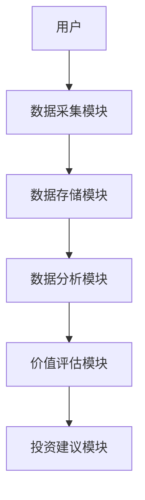

                 


# 特价股票投资中的数字产业互联网价值链分析方法

## 关键词
特价股票投资、数字产业、互联网价值链、机器学习、股票分析、数据挖掘

## 摘要
本文将深入探讨特价股票投资中的数字产业互联网价值链分析方法。通过结合数字产业与互联网技术，分析股票市场中的价值链条，寻找潜在的投资机会。文章从背景介绍、核心概念、算法原理、系统架构、项目实战等方面进行详细讲解，帮助读者理解如何利用数字技术优化股票投资策略。

## 第一章：特价股票投资的背景与现状

### 1.1 特价股票投资的定义与特点
- **定义**：特价股票指市场价低于其内在价值的股票，通常被认为具有投资潜力。
- **特点**：价格被低估、潜在回报高、风险与收益并存。

### 1.2 数字产业互联网的基本概念
- **定义**：数字产业互联网是利用互联网技术连接数字产业各环节的生态系统。
- **组成部分**：数据采集、处理、分析、应用。

### 1.3 数字产业互联网与股票投资的关系
- **数据支持**：通过大数据分析，识别市场趋势和投资机会。
- **技术应用**：利用AI和机器学习优化投资决策。

## 第二章：数字产业互联网价值链分析方法

### 2.1 价值链分析的基本原理
- **定义**：分析企业价值链中的关键环节，优化资源配置。
- **数字产业中的应用**：通过数据驱动优化各个环节。

### 2.2 核心要素
- **数据预处理**：清洗、转换、标准化。
- **特征提取**：选择影响股票价值的关键因素。
- **价值评估**：建立模型评估股票的内在价值。

## 第三章：算法原理与实现

### 3.1 数据预处理
- **步骤**：数据清洗、特征选择、标准化。
- **代码示例**：
  ```python
  import pandas as pd
  data = pd.read_csv('stock_data.csv')
  data.dropna()
  data['price'] = (data['price'] - data['price'].mean()) / data['price'].std()
  ```

### 3.2 机器学习算法
- **线性回归**：预测股票价格。
- **随机森林**：分类和回归分析。
- **代码示例**：
  ```python
  from sklearn.ensemble import RandomForestRegressor
  model = RandomForestRegressor()
  model.fit(X_train, y_train)
  ```

### 3.3 模型评估
- **指标**：准确率、召回率、F1分数。
- **优化**：调整参数、集成学习。

## 第四章：系统架构设计

### 4.1 功能模块
- **数据采集**：从API获取股票数据。
- **数据分析**：处理和建模。
- **价值评估**：生成投资建议。

### 4.2 架构图


### 4.3 接口设计
- **REST API**：提供数据获取和分析接口。
- **交互设计**：用户界面友好，实时反馈。

## 第五章：项目实战

### 5.1 项目背景
- **目标**：分析特定股票，识别投资机会。
- **数据来源**：Yahoo Finance API。

### 5.2 实战步骤
- **环境搭建**：安装Python、数据处理库。
- **代码实现**：
  ```python
  import yfinance as yf
  data = yf.download('AAPL', start='2020-01-01', end='2023-01-01')
  ```

### 5.3 结果分析
- **可视化**：使用matplotlib绘制股票走势。
- **投资建议**：基于模型预测，给出买入或卖出信号。

## 第六章：总结与展望

### 6.1 总结
- **价值**：数字技术优化股票投资决策。
- **意义**：提升投资效率和准确性。

### 6.2 展望
- **未来趋势**：AI在股票分析中的应用深化。
- **改进方向**：实时数据分析、个性化投资策略。

### 6.3 最佳实践
- **数据质量**：确保数据准确和及时。
- **算法选择**：根据需求选择合适模型。
- **系统优化**：提升处理速度和稳定性。

---

通过以上步骤，文章详细讲解了特价股票投资中的数字产业互联网价值链分析方法，从理论到实践，帮助读者全面理解并应用这些方法优化投资策略。

