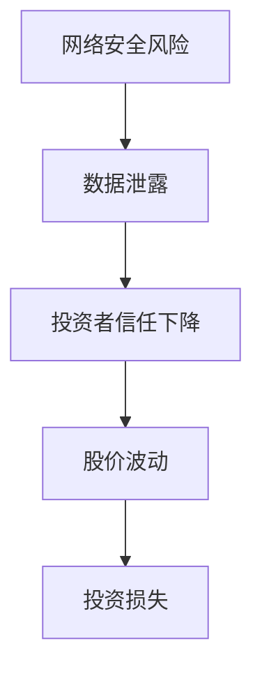
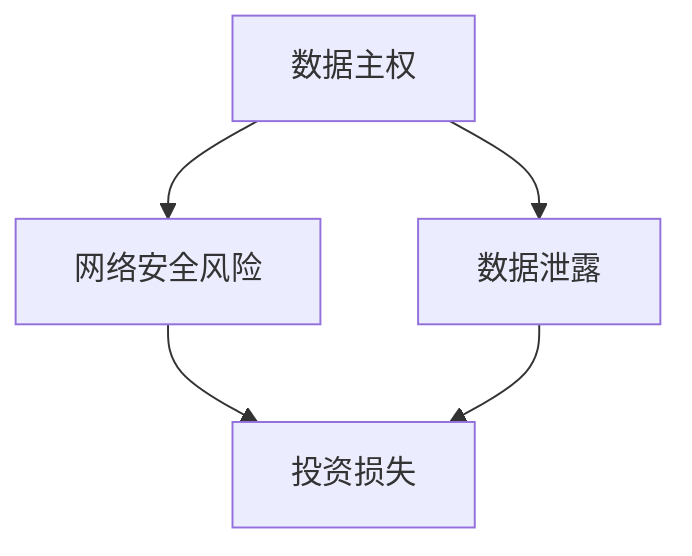

                 

# 特价股票投资中的数据主权与网络安全风险传导评估方法

## 关键词：
特价股票投资、数据主权、网络安全风险、风险传导、评估方法

## 摘要：
本文探讨了在特价股票投资中，数据主权与网络安全风险之间的关联性，分析了网络安全风险对投资决策的影响，并提出了基于数据主权的网络安全风险传导评估方法。文章通过构建数学模型和算法流程，详细阐述了如何在实际投资中评估和应对数据主权相关的网络安全风险，为投资者提供科学的决策支持。

---

# 第1章: 特价股票投资与数据主权概述

## 1.1 特价股票投资的背景与特点

### 1.1.1 特价股票投资的定义与核心概念
特价股票投资是一种以低于市场价买入股票的投资策略，核心在于识别市场低估的股票并进行长期持有，以期在市场回升时获得超额收益。这种投资策略依赖于对市场数据的深度分析和对风险的精准评估。

### 1.1.2 特价股票投资的市场现状与发展趋势
随着金融市场的发展，投资者对数据分析和风险管理的需求日益增加。特价股票投资在量化交易和大数据分析的推动下，逐渐成为机构投资者和高净值个人的重要策略之一。然而，随之而来的数据主权和网络安全问题也日益突出。

### 1.1.3 数据主权在投资中的重要性
数据主权是指数据的控制权和使用权，涉及数据的存储、处理和传输等多个环节。在投资领域，数据主权直接影响投资者对数据来源和可靠性的信任，从而影响投资决策的准确性。

---

## 1.2 数据主权的定义与特征

### 1.2.1 数据主权的基本概念
数据主权是指数据的拥有者对数据具有完全的控制权，包括数据的存储、处理、传输和访问权限。在投资中，数据主权的保障是确保投资决策基于可靠和合法的数据来源。

### 1.2.2 数据主权的核心属性与特征对比
以下是数据主权的核心属性对比表：

| 属性      | 描述                                                                 |
|-----------|----------------------------------------------------------------------|
| 数据控制  | 数据的拥有者对数据具有完全的控制权。                                 |
| 数据存储  | 数据可以存储在本地或第三方服务器，需符合相关法律法规。             |
| 数据处理  | 数据处理需遵循明确的规则和流程，避免数据泄露或滥用。               |
| 数据访问  | 数据访问权限需严格控制，确保仅授权人员可以访问。                   |

### 1.2.3 数据主权的法律与伦理问题
数据主权的法律问题主要涉及数据跨境流动、数据保护和隐私权。伦理问题则包括数据使用是否符合社会道德和公平性原则。

---

# 第2章: 网络安全风险与风险传导机制

## 2.1 网络安全风险的定义与分类

### 2.1.1 网络安全风险的基本概念
网络安全风险是指由于网络攻击、数据泄露或其他安全事件导致的信息系统受损，进而对投资决策产生负面影响的可能性。

### 2.1.2 网络安全风险的主要分类
以下是网络安全风险的主要分类表：

| 类型          | 描述                                                                 |
|---------------|----------------------------------------------------------------------|
| 未授权访问    | 黑客攻击导致的未经授权访问。                                           |
| 数据泄露      | 敏感数据被非法获取或公开。                                             |
| 拒绝服务攻击  | 攻击者通过大量请求使系统无法正常运作。                                   |
| 资料篡改      | 数据被非法篡改，导致投资决策失误。                                       |
| 软件漏洞      | 系统中存在的安全漏洞被攻击者利用。                                     |

### 2.1.3 网络安全风险的评估方法
网络安全风险的评估方法包括定性和定量分析。定性分析主要基于经验和专家判断，而定量分析则通过数学模型计算风险的概率和影响程度。

---

## 2.2 风险传导机制的原理

### 2.2.1 风险传导的基本原理
风险传导是指网络安全风险从一个环节或系统传递到另一个环节或系统的机制。例如，数据泄露可能导致投资者信任度下降，进而影响股价波动。

### 2.2.2 风险传导的关键路径分析
以下是风险传导的关键路径图：

### 2.2.3 风险传导的数学模型
以下是风险传导的数学模型：

$$ R = \sum_{i=1}^{n} P_i \times I_i $$

其中：
- \( R \) 表示总风险
- \( P_i \) 表示第 \( i \) 种风险发生的概率
- \( I_i \) 表示第 \( i \) 种风险的影响程度

---

# 第3章: 数据主权与网络安全风险的关联性分析

## 3.1 数据主权与网络安全风险的关系

### 3.1.1 数据主权对网络安全风险的影响
数据主权的强弱直接影响网络安全风险的大小。例如，数据存储在本地服务器可以降低数据泄露的风险。

### 3.1.2 网络安全风险对数据主权的反作用
网络安全风险可能导致数据主权受损，例如数据泄露可能影响投资者对数据来源的信任。

### 3.1.3 数据主权与网络安全风险的协同效应
数据主权和网络安全风险是相互关联的。数据主权的保障可以降低网络安全风险，而网络安全风险的控制可以增强数据主权。

---

## 3.2 数据主权与网络安全风险的关联模型

### 3.2.1 关联模型的构建
以下是数据主权与网络安全风险的关联模型：

### 3.2.2 关联模型的验证与优化
通过实证分析和案例研究，可以验证模型的准确性，并根据实际情况进行优化。

---

# 第4章: 特价股票投资中的数据主权与网络安全风险评估方法

## 4.1 数据主权评估方法

### 4.1.1 数据主权评估的指标体系
以下是数据主权评估的主要指标：

| 指标          | 描述                                                                 |
|---------------|----------------------------------------------------------------------|
| 数据控制权    | 数据的拥有者是否对数据具有完全的控制权。                                 |
| 数据存储地    | 数据存储的位置是否符合相关法律法规。                                     |
| 数据处理流程  | 数据处理是否遵循明确的规则和流程。                                       |
| 数据访问权限  | 数据访问权限是否严格控制。                                               |

### 4.1.2 数据主权评估的数学模型
以下是数据主权评估的数学模型：

$$ S = \sum_{i=1}^{n} w_i \times x_i $$

其中：
- \( S \) 表示数据主权指数
- \( w_i \) 表示第 \( i \) 个指标的权重
- \( x_i \) 表示第 \( i \) 个指标的评分

### 4.1.3 数据主权评估的实施步骤
以下是数据主权评估的实施步骤：

1. **确定评估指标**：根据投资需求选择合适的指标。
2. **收集数据**：收集相关数据并进行预处理。
3. **计算评分**：根据权重和评分计算数据主权指数。
4. **分析结果**：根据结果进行投资决策。

---

## 4.2 网络安全风险评估方法

### 4.2.1 网络安全风险评估的指标体系
以下是网络安全风险评估的主要指标：

| 指标          | 描述                                                                 |
|---------------|----------------------------------------------------------------------|
| 数据泄露风险    | 数据泄露的可能性。                                                     |
| 网络攻击风险    | 网络攻击的可能性。                                                     |
| 系统漏洞风险    | 系统漏洞的可能性。                                                     |
| 数据完整性风险  | 数据完整性被破坏的可能性。                                             |

### 4.2.2 网络安全风险评估的数学模型
以下是网络安全风险评估的数学模型：

$$ R = \sum_{i=1}^{n} P_i \times I_i $$

其中：
- \( R \) 表示总风险
- \( P_i \) 表示第 \( i \) 种风险发生的概率
- \( I_i \) 表示第 \( i \) 种风险的影响程度

### 4.2.3 网络安全风险评估的实施步骤
以下是网络安全风险评估的实施步骤：

1. **识别风险源**：识别可能的网络安全风险。
2. **评估风险概率**：评估每种风险发生的概率。
3. **评估风险影响**：评估每种风险的影响程度。
4. **计算总风险**：根据公式计算总风险。
5. **制定应对策略**：根据结果制定应对策略。

---

## 4.3 数据主权与网络安全风险的综合评估方法

### 4.3.1 综合评估模型的构建
以下是数据主权与网络安全风险的综合评估模型：

$$ C = S \times (1 - R) $$

其中：
- \( C \) 表示综合评估指数
- \( S \) 表示数据主权指数
- \( R \) 表示网络安全风险

### 4.3.2 综合评估模型的验证与优化
通过实证分析和案例研究，验证模型的准确性，并根据实际情况进行优化。

---

## 4.4 项目实战：基于综合评估模型的投资决策

### 4.4.1 项目背景
某机构投资者计划投资于一只特价股票，但担心数据主权和网络安全风险可能影响投资决策。

### 4.4.2 数据收集与预处理
收集相关数据，包括股票的历史价格、市场数据、法律法规等。

### 4.4.3 模型计算
根据综合评估模型计算数据主权指数和网络安全风险，并计算综合评估指数。

### 4.4.4 投资决策
根据综合评估指数，决定是否进行投资。

---

# 第5章: 总结与展望

## 5.1 总结
本文详细探讨了特价股票投资中的数据主权与网络安全风险之间的关联性，并提出了基于数据主权的网络安全风险传导评估方法。通过构建数学模型和算法流程，为投资者提供了科学的决策支持。

## 5.2 展望
未来的研究可以进一步完善评估模型，探索更多数据主权与网络安全风险的关联性，为投资者提供更全面的风险管理工具。

---

通过本文的分析，投资者可以更好地理解数据主权与网络安全风险的重要性，并在实际投资中做出更明智的决策。

