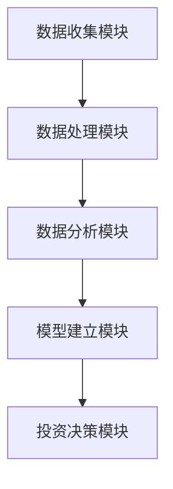
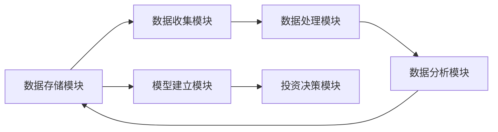

                 


# 特价股票投资中的数据分析和大数据应用

---

## 关键词：特价股票、数据分析、大数据、股票投资、机器学习、数据挖掘

---

## 摘要

在股票投资领域，特价股票因其价格优势而备受关注。然而，要在众多特价股票中找到真正的投资机会，离不开数据分析和大数据技术的支持。本文将从数据分析的基础知识、大数据技术的应用、核心算法的原理、系统架构的设计以及项目实战等多个方面，详细探讨如何利用数据分析和大数据技术在特价股票投资中获得优势。通过本文的学习，读者将能够掌握从数据收集到模型建立的全过程，从而在复杂的市场环境中做出更明智的投资决策。

---

# 第1章: 特价股票投资概述

## 1.1 特价股票的定义与特点

### 1.1.1 特价股票的定义

特价股票是指在特定时间或特定市场环境下，价格低于正常市场价的股票。这些股票可能是由于市场波动、公司业绩不佳或其他外部因素导致的。特价股票的投资机会通常具有短期性和不确定性，因此需要投资者具备敏锐的洞察力和快速的反应能力。

### 1.1.2 特价股票的特点

- **价格优势**：特价股票的价格通常低于市场平均价格，具有较高的性价比。
- **短期性**：特价股票的价格优势往往昙花一现，难以长期维持。
- **高风险**：由于价格波动大，特价股票的投资风险较高。
- **稀缺性**：特价股票的数量有限，投资者需要快速决策。

### 1.1.3 特价股票的投资价值

尽管特价股票价格低廉，但其投资价值取决于公司的基本面、行业前景和市场环境。投资者需要通过数据分析和市场研究，找到具有长期增长潜力的特价股票。

---

## 1.2 数据分析在股票投资中的作用

### 1.2.1 数据分析的基本概念

数据分析是指通过收集、处理和分析数据，提取有价值的信息的过程。在股票投资中，数据分析可以帮助投资者发现市场趋势、识别投资机会和评估风险。

### 1.2.2 数据分析在股票投资中的应用

- **市场趋势分析**：通过分析历史数据，预测未来市场走势。
- **投资机会识别**：通过数据挖掘，发现具有潜力的股票。
- **风险评估**：通过数据分析，评估投资组合的风险。

### 1.2.3 大数据技术对股票投资的影响

大数据技术的应用使得投资者能够处理和分析海量数据，发现传统方法难以察觉的市场规律和投资机会。大数据技术还可以提高交易效率和决策速度，帮助投资者在竞争激烈的市场中占据优势。

---

## 1.3 本章小结

本章介绍了特价股票的定义和特点，分析了数据分析在股票投资中的作用，并探讨了大数据技术对股票投资的影响。通过对这些内容的学习，读者可以理解特价股票的投资价值和数据分析的重要性。

---

# 第2章: 数据分析基础

## 2.1 数据收集与清洗

### 2.1.1 数据收集方法

数据收集是数据分析的第一步。在股票投资中，数据来源包括：

- **公开数据**：如公司财务报表、市场报告等。
- **社交媒体数据**：如投资者在社交媒体上的讨论和评论。
- **交易数据**：如股票价格、成交量等实时数据。

### 2.1.2 数据清洗流程

数据清洗是确保数据质量的重要步骤。常见的数据清洗方法包括：

- **去重**：去除重复数据。
- **处理缺失值**：填充或删除缺失数据。
- **异常值处理**：识别并处理异常值。

### 2.1.3 数据预处理工具

常用的 数据预处理工具包括：

- **Python**：使用Pandas库进行数据清洗和处理。
- **SQL**：用于从数据库中提取和处理数据。

---

## 2.2 数据特征工程

### 2.2.1 数据特征的提取

数据特征是指能够反映数据本质的特征。在股票投资中，常见的特征包括：

- **技术指标**：如K线图、MACD等。
- **财务指标**：如市盈率、市净率等。
- **市场情绪指标**：如投资者情绪指数。

### 2.2.2 数据特征的筛选

特征筛选是为了提高模型的准确性和效率。常用的方法包括：

- **相关性分析**：去除相关性较低的特征。
- **逐步回归**：逐步筛选出重要的特征。

### 2.2.3 数据特征的标准化

标准化是为了消除不同特征之间的量纲影响。常用的方法包括：

- **Z-score标准化**：将数据标准化为均值为0，方差为1。
- **Min-Max标准化**：将数据缩放到0到1之间。

---

## 2.3 数据可视化

### 2.3.1 数据可视化的工具

常用的 数据可视化工具包括：

- **Matplotlib**：用于绘制各种图表。
- **Seaborn**：用于绘制统计图表。
- **Tableau**：用于创建交互式数据仪表盘。

### 2.3.2 数据可视化的技巧

- **选择合适的图表类型**：如折线图、柱状图、散点图等。
- **突出重点信息**：通过颜色、大小等视觉效果突出重要信息。
- **保持简洁清晰**：避免图表过于复杂，确保信息传达清晰。

### 2.3.3 数据可视化在股票分析中的应用

- **趋势分析**：通过绘制股价走势，分析市场趋势。
- **风险评估**：通过绘制波动率图表，评估投资风险。
- **投资决策支持**：通过可视化分析，辅助投资者做出决策。

---

## 2.4 本章小结

本章介绍了数据分析的基础知识，包括数据收集与清洗、特征工程和数据可视化。通过这些方法，投资者可以更好地理解和分析股票数据，为投资决策提供支持。

---

# 第3章: 大数据技术基础

## 3.1 大数据的定义与特点

### 3.1.1 大数据的定义

大数据是指数据量大、类型多样、处理速度快的海量数据。大数据的特征可以用“4V”来描述：Volume（数据量大）、Variety（数据类型多样）、Velocity（数据处理速度快）和Value（数据价值密度低）。

### 3.1.2 大数据的特征

- **数据量大**：PB级甚至更大的数据量。
- **数据类型多样**：包括结构化数据、半结构化数据和非结构化数据。
- **数据处理速度快**：需要实时或近实时处理数据。
- **数据价值密度低**：数据价值需要通过分析挖掘才能体现。

---

## 3.2 大数据处理技术

### 3.2.1 Hadoop框架

Hadoop是一个分布式的文件存储系统，适合处理海量数据。Hadoop的核心组件包括：

- **Hadoop Distributed File System (HDFS)**：分布式文件系统。
- **MapReduce**：并行计算框架。

### 3.2.2 Spark框架

Spark是一个快速、通用的大数据分析框架。相比Hadoop，Spark具有更高的计算效率和更丰富的计算模型。

### 3.2.3 其他大数据处理工具

- **Flink**：用于流数据处理。
- **Storm**：用于实时流处理。

---

## 3.3 大数据存储与计算

### 3.3.1 分布式存储

分布式存储是大数据存储的核心技术。常见的分布式存储系统包括：

- **HDFS**：Hadoop分布式文件系统。
- **HBase**：分布式列式数据库。
- ** Cassandra**：分布式键值数据库。

### 3.3.2 分布式计算框架

分布式计算框架用于处理大规模数据计算任务。常见的框架包括：

- **MapReduce**：Hadoop的核心计算框架。
- **Spark**：快速的分布式计算框架。
- **Flink**：流数据处理框架。

### 3.3.3 大数据存储优化

存储优化是提高数据处理效率的重要手段。常用的方法包括：

- **分区存储**：将数据按一定规则分区存储，提高查询效率。
- **压缩存储**：对数据进行压缩存储，节省存储空间。
- **归档存储**：将不再需要实时访问的数据归档存储。

---

## 3.4 本章小结

本章介绍了大数据的基本概念和处理技术，包括Hadoop、Spark等分布式计算框架，以及分布式存储系统。通过这些技术，投资者可以高效地处理和分析海量股票数据。

---

# 第4章: 股票数据分析的核心算法

## 4.1 回归分析

### 4.1.1 线性回归

线性回归是一种简单而常用的回归分析方法。其基本假设是因变量与自变量之间存在线性关系。线性回归的数学模型可以表示为：

$$ y = \beta_0 + \beta_1 x + \epsilon $$

其中，$y$ 是因变量，$x$ 是自变量，$\beta_0$ 和 $\beta_1$ 是回归系数，$\epsilon$ 是误差项。

### 4.1.2 逻辑回归

逻辑回归用于分类问题，特别适用于二分类问题。其数学模型可以表示为：

$$ P(Y=1|X) = \frac{e^{\beta_0 + \beta_1 x}}{1 + e^{\beta_0 + \beta_1 x}} $$

### 4.1.3 回归分析在股票预测中的应用

回归分析可以用于股票价格预测，通过分析历史数据，预测未来股价走势。

---

## 4.2 分类算法

### 4.2.1 支持向量机

支持向量机（SVM）是一种监督学习算法，适用于分类和回归问题。SVM的核心思想是通过找到一个超平面，将数据点分成不同的类别。

### 4.2.2 决策树

决策树是一种基于树状结构的分类算法。其优点是易于理解和实现，适合处理复杂的数据关系。

### 4.2.3 分类算法在股票分析中的应用

分类算法可以用于股票市场的分类预测，如判断某只股票是上涨还是下跌。

---

## 4.3 聚类分析

### 4.3.1 K-means算法

K-means是一种常见的聚类算法，适用于将数据分成K个簇。其核心思想是通过迭代优化，使得簇内数据点的相似性最大化。

### 4.3.2 层次聚类

层次聚类是一种逐步合并或分割数据点的聚类方法。其优点是不需要预先指定簇的数量。

### 4.3.3 聚类分析在股票市场中的应用

聚类分析可以用于市场细分，识别具有相似特征的股票群体。

---

## 4.4 本章小结

本章介绍了回归分析、分类算法和聚类分析的核心原理和应用。通过这些算法，投资者可以更好地理解和分析股票市场数据，为投资决策提供支持。

---

# 第5章: 大数据在股票投资中的应用

## 5.1 数据挖掘

### 5.1.1 数据挖掘的基本概念

数据挖掘是从大量数据中提取有价值信息的过程。在股票投资中，数据挖掘可以帮助投资者发现市场规律和投资机会。

### 5.1.2 数据挖掘在股票分析中的应用

- **市场趋势分析**：通过挖掘历史数据，预测未来市场走势。
- **投资机会识别**：通过挖掘数据，发现具有潜力的股票。
- **风险评估**：通过挖掘数据，评估投资组合的风险。

---

## 5.2 预测模型

### 5.2.1 预测模型的基本概念

预测模型是通过历史数据预测未来趋势的模型。在股票投资中，预测模型可以帮助投资者预测股价走势。

### 5.2.2 预测模型的建立与优化

- **模型建立**：选择合适的算法，建立预测模型。
- **模型优化**：通过调整参数和优化算法，提高模型的预测精度。

---

## 5.3 算法策略

### 5.3.1 算法策略的基本概念

算法策略是指利用算法进行投资决策的策略。在股票投资中，算法策略通常基于技术指标和市场数据。

### 5.3.2 算法策略的实现

- **数据获取**：获取实时股票数据。
- **信号生成**：通过算法生成买入或卖出信号。
- **交易执行**：根据信号执行交易。

---

## 5.4 本章小结

本章介绍了大数据在股票投资中的应用，包括数据挖掘、预测模型和算法策略。通过这些方法，投资者可以更好地利用大数据技术，提高投资决策的准确性和效率。

---

# 第6章: 机器学习在股票分析中的应用

## 6.1 回归分析

### 6.1.1 线性回归

线性回归是一种简单而常用的回归分析方法。其基本假设是因变量与自变量之间存在线性关系。线性回归的数学模型可以表示为：

$$ y = \beta_0 + \beta_1 x + \epsilon $$

其中，$y$ 是因变量，$x$ 是自变量，$\beta_0$ 和 $\beta_1$ 是回归系数，$\epsilon$ 是误差项。

### 6.1.2 逻辑回归

逻辑回归用于分类问题，特别适用于二分类问题。其数学模型可以表示为：

$$ P(Y=1|X) = \frac{e^{\beta_0 + \beta_1 x}}{1 + e^{\beta_0 + \beta_1 x}} $$

### 6.1.3 回归分析在股票预测中的应用

回归分析可以用于股票价格预测，通过分析历史数据，预测未来股价走势。

---

## 6.2 分类算法

### 6.2.1 支持向量机

支持向量机（SVM）是一种监督学习算法，适用于分类和回归问题。SVM的核心思想是通过找到一个超平面，将数据点分成不同的类别。

### 6.2.2 决策树

决策树是一种基于树状结构的分类算法。其优点是易于理解和实现，适合处理复杂的数据关系。

### 6.2.3 分类算法在股票分析中的应用

分类算法可以用于股票市场的分类预测，如判断某只股票是上涨还是下跌。

---

## 6.3 聚类分析

### 6.3.1 K-means算法

K-means是一种常见的聚类算法，适用于将数据分成K个簇。其核心思想是通过迭代优化，使得簇内数据点的相似性最大化。

### 6.3.2 层次聚类

层次聚类是一种逐步合并或分割数据点的聚类方法。其优点是不需要预先指定簇的数量。

### 6.3.3 聚类分析在股票市场中的应用

聚类分析可以用于市场细分，识别具有相似特征的股票群体。

---

## 6.4 本章小结

本章介绍了机器学习在股票分析中的应用，包括回归分析、分类算法和聚类分析。通过这些算法，投资者可以更好地理解和分析股票市场数据，为投资决策提供支持。

---

# 第7章: 项目实战——利用大数据分析特价股票投资机会

## 7.1 项目背景

在本章中，我们将通过一个实际项目来展示如何利用数据分析和大数据技术进行特价股票投资。我们将从数据收集、处理、分析到模型建立的全过程进行详细讲解。

---

## 7.2 系统功能设计

### 7.2.1 数据收集模块

数据收集模块负责从多个数据源收集股票数据，包括历史价格、交易量、财务数据等。

### 7.2.2 数据处理模块

数据处理模块负责对收集到的数据进行清洗、特征提取和标准化处理。

### 7.2.3 数据分析模块

数据分析模块负责对数据进行分析，包括趋势分析、风险评估和投资机会识别。

### 7.2.4 模型建立模块

模型建立模块负责根据分析结果，建立预测模型，并进行模型优化。

### 7.2.5 投资决策模块

投资决策模块根据模型预测结果，生成投资策略，并指导实际交易。

---

## 7.3 系统架构设计

### 7.3.1 系统架构图



### 7.3.2 数据流图



---

## 7.4 项目实现

### 7.4.1 环境搭建

- **安装Python**：需要安装Python 3.6或更高版本。
- **安装数据处理库**：如Pandas、NumPy、Matplotlib等。
- **安装大数据处理工具**：如Hadoop、Spark等。

### 7.4.2 数据收集与处理

```python
import pandas as pd
import numpy as np

# 数据收集
def collect_data():
    # 从数据库中查询数据
    data = pd.read_sql(...)
    return data

# 数据清洗
def clean_data(data):
    # 处理缺失值
    data = data.dropna()
    # 处理异常值
    data = data[abs(data['price'] - data['price'].mean()) < 3 * data['price'].std()]
    return data
```

### 7.4.3 模型建立与优化

```python
from sklearn.linear_model import LinearRegression
from sklearn.metrics import mean_squared_error

# 建立线性回归模型
model = LinearRegression()
model.fit(X_train, y_train)

# 模型评估
y_pred = model.predict(X_test)
mse = mean_squared_error(y_test, y_pred)
print('均方误差:', mse)
```

---

## 7.5 项目小结

通过本项目，我们从数据收集到模型建立的全过程进行了详细讲解。通过实际操作，读者可以掌握如何利用数据分析和大数据技术进行特价股票投资。

---

# 第8章: 总结与展望

## 8.1 总结

本文从数据分析和大数据技术的角度，详细探讨了特价股票投资的方法和策略。通过本文的学习，读者可以掌握从数据收集到模型建立的全过程，为投资决策提供支持。

## 8.2 未来展望

随着大数据和人工智能技术的不断发展，股票投资将更加依赖数据分析和算法模型。未来，我们可以进一步研究更复杂的算法和模型，提高投资决策的准确性和效率。

## 8.3 投资策略的注意事项

- **风险管理**：投资者需要合理配置资产，分散投资风险。
- **持续学习**：股票市场变化莫测，投资者需要不断学习和更新知识。
- **技术与策略结合**：投资者需要将技术分析和基本分析结合起来，做出更明智的投资决策。

---

# 附录: 参考文献

1. 刘军. 大数据技术与应用[M]. 北京: 清华大学出版社, 2018.
2. 李明. 数据分析与机器学习实战[M]. 北京: 人民邮电出版社, 2019.
3. 张伟. 股票投资策略与技术分析[M]. 上海: 上海财经大学出版社, 2020.

--- 

通过以上内容，您可以系统地了解特价股票投资中的数据分析和大数据应用，掌握从数据收集到模型建立的全过程，为实际投资决策提供参考和指导。

