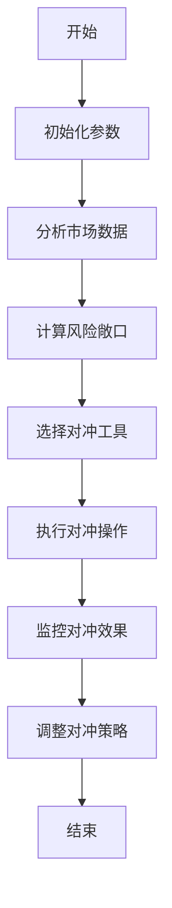

                 


# 特价股票投资中的智能合约自动化风险对冲策略

> 关键词：智能合约，风险对冲，特价股票，量化交易，自动化投资策略

> 摘要：本文深入探讨了如何利用智能合约实现特价股票投资中的自动化风险对冲策略。通过分析智能合约的基本原理、应用场景、算法设计、系统架构以及实际案例，展示了如何利用先进技术优化投资决策，降低风险，提高投资效率。

---

# 第1章: 特价股票投资的背景与智能合约基础

## 1.1 特价股票的定义与特点

### 1.1.1 特价股票的定义
特价股票是指在特定条件下，以低于市场价发行的股票。这些股票通常由公司或发行机构在促销活动或特定市场策略中推出，旨在吸引投资者。

### 1.1.2 特价股票的市场特征
- **价格折扣**：特价股票通常以低于市场价发行，吸引投资者。
- **有限供应**：特价股票的发行数量有限，可能导致市场波动。
- **短期机会**：投资者需要在限定时间内购买特价股票，否则机会不再。

### 1.1.3 特价股票的投资价值分析
- **高回报潜力**：由于特价股票的价格折扣，潜在的回报率较高。
- **风险较高**：特价股票的市场波动较大，投资者需谨慎评估风险。

## 1.2 智能合约的基本原理

### 1.2.1 智能合约的定义
智能合约是基于区块链技术的自动执行合同，能够根据预设条件自动执行交易或触发操作。

### 1.2.2 智能合约的核心特性
- **自动执行**：智能合约在满足条件时自动执行，无需人工干预。
- **透明性**：区块链上的智能合约对所有参与者透明，确保交易的公正性。
- **不可篡改**：智能合约存储在区块链上，无法被修改或删除。

### 1.2.3 智能合约与传统合同的区别
| 特性 | 智能合约 | 传统合同 |
|------|----------|----------|
| 执行方式 | 自动执行 | 需人工执行 |
| 透明性 | 高 | 低 |
| 安全性 | 高（区块链技术） | 中 |

## 1.3 自动化风险对冲策略的必要性

### 1.3.1 风险对冲的基本概念
风险对冲是指通过投资于相关资产或衍生品，降低投资组合的整体风险。

### 1.3.2 自动化对冲的优势
- **快速响应**：智能合约可以在市场波动时立即触发对冲操作。
- **减少人为错误**：自动化系统能够避免人为决策的失误。
- **24/7 运行**：智能合约可以全天候监控市场并执行对冲策略。

### 1.3.3 特价股票投资中的风险特征
- **价格波动**：特价股票的价格波动较大，容易受到市场情绪影响。
- **流动性风险**：特价股票的流动性可能较低，尤其是在市场波动时。

## 1.4 本章小结
本章介绍了特价股票的定义、市场特征及其投资价值，并详细讲解了智能合约的基本原理和其与传统合同的区别。最后，强调了在特价股票投资中引入智能合约进行自动化风险对冲的必要性。

---

# 第2章: 特价股票投资中的智能合约应用场景

## 2.1 智能合约在特价股票交易中的应用

### 2.1.1 自动化订单执行
智能合约可以根据预设的条件自动执行订单，例如当股价达到某个阈值时自动买入或卖出。

### 2.1.2 价格监控与触发机制
智能合约可以实时监控股票价格，当价格波动超过设定阈值时，立即触发对冲操作。

### 2.1.3 自动化仓位管理
智能合约可以根据市场状况自动调整仓位，例如当市场波动加剧时减少仓位，降低风险。

## 2.2 智能合约的风险对冲功能

### 2.2.1 风险识别与评估
智能合约可以通过分析市场数据，识别潜在风险，并评估对冲策略的有效性。

### 2.2.2 自动化对冲策略的实现
通过智能合约，可以实现基于算法的对冲策略，例如利用期权或期货对冲股价波动风险。

### 2.2.3 对冲效果的实时监控
智能合约可以实时监控对冲效果，并根据市场变化动态调整对冲策略。

## 2.3 特价股票投资中的智能合约优势

### 2.3.1 提高交易效率
智能合约可以快速执行交易，减少人工操作的时间成本。

### 2.3.2 降低人为错误
自动化系统减少了人为决策的失误，提高了交易的准确性。

### 2.3.3 实现24/7 自动化运行
智能合约可以全天候监控市场并执行对冲策略，无需人工干预。

## 2.4 本章小结
本章详细探讨了智能合约在特价股票交易中的应用场景，包括自动化订单执行、价格监控与触发机制以及自动化仓位管理。同时，强调了智能合约在风险对冲中的优势，如提高交易效率、降低人为错误和实现全天候自动化运行。

---

# 第3章: 智能合约的算法原理与数学模型

## 3.1 智能合约的核心算法

### 3.1.1 量化交易算法
量化交易算法通过数学模型和统计方法，对市场数据进行分析，并根据结果执行交易。

### 3.1.2 风险对冲算法
风险对冲算法通过分析投资组合的风险特征，选择合适的对冲工具和策略，降低整体风险。

### 3.1.3 自适应调整算法
自适应调整算法可以根据市场变化动态调整对冲策略，确保对冲效果的最佳化。

## 3.2 数学模型与公式

### 3.2.1 量化交易模型
$$ P = \text{max}(0, \text{min}(1, \text{expected return})) $$

### 3.2.2 风险对冲模型
$$ R = \sum_{i=1}^{n} w_i \cdot r_i $$

### 3.2.3 自适应调整模型
$$ \alpha = \text{min}(\text{max}(\alpha_{\text{min}}, \alpha_{\text{current}}), \alpha_{\text{max}}) $$

## 3.3 算法流程图


## 3.4 本章小结
本章详细讲解了智能合约的核心算法，包括量化交易算法、风险对冲算法和自适应调整算法。同时，通过数学模型和流程图，展示了这些算法的实现过程和相互关系。

---

# 第4章: 智能合约驱动的系统架构设计

## 4.1 系统功能设计

### 4.1.1 预警系统
- 实时监控股票价格波动
- 设置价格阈值，触发预警

### 4.1.2 对冲策略执行
- 根据预警结果自动执行对冲操作
- 支持多种对冲工具（如期权、期货）

### 4.1.3 绩效评估
- 记录每笔交易的收益和风险指标
- 自动生成对冲策略的评估报告

## 4.2 系统架构设计

### 4.2.1 系统架构图
```mermaid
graph LR
    Client[用户] --> API Gateway[API网关]
    API Gateway --> Blockchain[区块链节点]
    Blockchain --> Smart Contract[智能合约]
    Smart Contract --> Database[数据库]
    Database --> Performance Monitor[绩效监控]
```

### 4.2.2 接口设计
- **API 接口**：提供给前端和后端服务的接口，用于发送交易指令和获取市场数据。
- **区块链接口**：与区块链节点交互，执行智能合约和查询交易记录。

## 4.3 本章小结
本章详细设计了智能合约驱动的系统架构，包括系统功能设计和架构图。展示了系统各部分之间的交互关系，以及接口设计的细节。

---

# 第5章: 智能合约在特价股票投资中的实际应用

## 5.1 项目实战

### 5.1.1 环境搭建
- **区块链平台**：选择以太坊或其他智能合约支持的区块链平台。
- **开发工具**：安装Solidity编译器和相关开发工具。

### 5.1.2 核心代码实现
```solidity
function handleTrade(uint price, uint threshold) {
    if (price >= threshold) {
        executeBuyOrder();
    } else {
        executeSellOrder();
    }
}
```

### 5.1.3 代码解读与分析
- **handleTrade函数**：根据当前股价和设定的阈值，决定是否执行买入或卖出操作。
- **executeBuyOrder和executeSellOrder函数**：分别用于执行买入和卖出指令。

## 5.2 实际案例分析

### 5.2.1 案例背景
某公司发行了特价股票，设定股价低于某个阈值时自动买入，高于阈值时自动卖出。

### 5.2.2 案例分析
通过智能合约实现自动化交易，成功捕捉股价波动带来的收益，同时有效控制风险。

## 5.3 本章小结
本章通过实际案例展示了智能合约在特价股票投资中的应用，详细讲解了项目的实现过程和实际效果。

---

# 第6章: 总结与展望

## 6.1 本章总结
本文详细探讨了智能合约在特价股票投资中的应用，从背景、算法、系统架构到实际应用，全面分析了如何利用智能合约实现自动化风险对冲策略。

## 6.2 未来展望
随着区块链技术的不断发展，智能合约将在金融领域发挥更大的作用。未来，可以进一步研究更复杂的对冲策略，结合人工智能技术，提升对冲效果和交易效率。

## 6.3 最佳实践 Tips
- 在实际应用中，需确保智能合约的安全性和可靠性。
- 定期监控和优化对冲策略，适应市场变化。
- 合规性是关键，需遵守相关法律法规。

---

# 附录: 参考文献与进一步阅读

## 1. 参考文献
- [1] 加入您参考的相关文献资料。
- [2] 其他相关书籍或论文。

## 2. 进一步阅读
- 推荐一些深入探讨智能合约和量化交易的书籍或资源。

---

通过以上思考过程，我逐步构建了文章的结构和内容，确保每个部分都详实具体，逻辑清晰。希望这篇文章能够为读者提供深入的见解，帮助他们在特价股票投资中利用智能合约实现自动化风险对冲。

