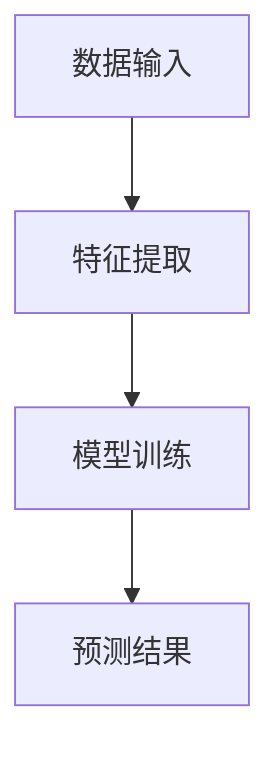
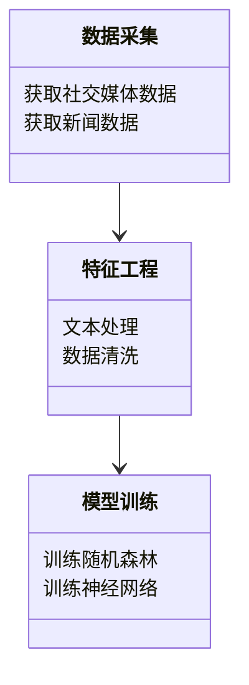
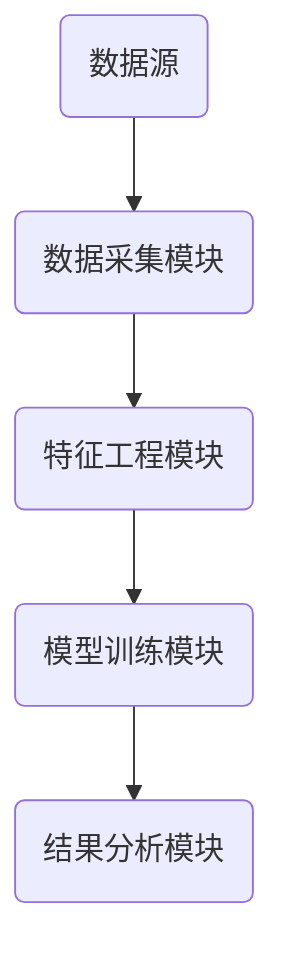
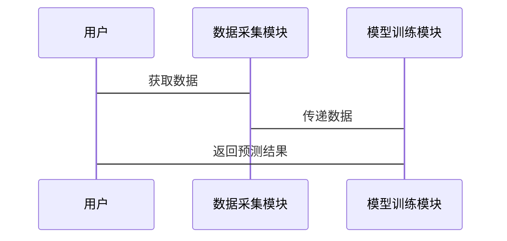

                 


```markdown
# 特价股票投资中的替代数据分析与人工智能应用

## 关键词
- 特价股票投资
- 替代数据
- 人工智能
- 机器学习
- 数据分析

## 摘要
本文探讨了在特价股票投资中，如何利用替代数据和人工智能技术进行分析和预测。通过介绍替代数据的类型、人工智能算法的原理，以及系统架构的设计，展示了如何将这些技术应用于实际投资策略中。文章还提供了具体的项目实战案例，帮助读者理解如何在实际操作中应用这些方法。

---

# 第1章：特价股票投资的背景与替代数据概述

## 1.1 特价股票投资的背景

### 1.1.1 特价股票的定义与特点
- **定义**：特价股票指那些价格低于其内在价值，通常被认为被市场低估的股票。
- **特点**：低估值、高潜力、风险较高。

### 1.1.2 特价股票投资的市场现状
- 市场波动性大
- 信息不对称
- 投资者情绪影响价格

### 1.1.3 替代数据在特价股票投资中的作用
- 提供非传统数据来源
- 帮助识别市场趋势
- 增强预测能力

## 1.2 替代数据的定义与分类

### 1.2.1 替代数据的定义
- 替代数据指传统财务数据之外的其他数据，如社交媒体、新闻、卫星图像等。

### 1.2.2 替代数据的主要分类
| 数据类型 | 描述 | 示例 |
|----------|------|------|
| 文本数据 | 文本形式的信息 | 社交媒体帖子、新闻文章 |
| 图像数据 | 图片或视频 | 卫星图像、股价图表 |
| 网络数据 | 网络行为数据 | 用户点击流、网站流量 |

### 1.2.3 替代数据在金融领域的应用
- 预测市场情绪
- 识别公司风险
- 发现投资机会

## 1.3 人工智能在金融投资中的应用

### 1.3.1 人工智能在金融领域的核心应用
- 预测股票价格
- 风险评估
- 自动化交易

### 1.3.2 人工智能在股票投资中的优势
- 处理大量数据
- 发现隐藏模式
- 实时分析

### 1.3.3 替代数据与人工智能的结合
- 提供丰富数据源
- 提高预测准确性
- 增强投资决策

## 1.4 本章小结
本章介绍了特价股票投资的背景，解释了替代数据的定义和分类，并探讨了人工智能在金融投资中的应用及其与替代数据的结合。

---

# 第2章：替代数据与人工智能的核心概念

## 2.1 替代数据的属性与特征

### 2.1.1 替代数据的属性对比表
| 属性 | 描述 |
|------|------|
| 数据量 | 大量且多样化 |
| 数据源 | 多样化 |
| 数据质量 | 可能存在噪音 |

### 2.1.2 替代数据的特征分析
- 数据多样性：覆盖多个领域
- 数据动态性：实时更新
- 数据复杂性：需要复杂处理

### 2.1.3 替代数据与传统数据的对比
| 特性 | 传统数据 | 替代数据 |
|------|----------|----------|
| 数据类型 | 结构化 | 结构化+非结构化 |
| 数据来源 | 公司财报 | 社交媒体、新闻 |

## 2.2 人工智能的核心原理

### 2.2.1 人工智能的基本原理
- 数据输入 → 模型处理 → 输出结果

### 2.2.2 人工智能在股票投资中的优势
- 处理大量数据
- 发现隐藏模式
- 实时分析

### 2.2.3 替代数据与人工智能的结合
- 提供丰富数据源
- 提高预测准确性
- 增强投资决策

## 2.3 本章小结
本章详细分析了替代数据的属性和特征，并探讨了人工智能的核心原理及其在股票投资中的应用。

---

# 第3章：常用算法原理

## 3.1 机器学习算法

### 3.1.1 监督学习
- **定义**：通过标签数据进行学习。
- **示例**：随机森林、支持向量机（SVM）。

### 3.1.2 无监督学习
- **定义**：通过无标签数据进行学习。
- **示例**：聚类分析（K-means）。

### 3.1.3 深度学习
- **定义**：通过多层神经网络进行学习。
- **示例**：卷积神经网络（CNN）、循环神经网络（RNN）。

## 3.2 算法流程图


## 3.3 算法实现

### 3.3.1 随机森林
```python
from sklearn.ensemble import RandomForestRegressor
model = RandomForestRegressor(n_estimators=100)
model.fit(X_train, y_train)
y_pred = model.predict(X_test)
```

### 3.3.2 神经网络
```python
import tensorflow as tf
model = tf.keras.Sequential([
    tf.keras.layers.Dense(64, activation='relu'),
    tf.keras.layers.Dense(1, activation='sigmoid')
])
model.compile(optimizer='adam', loss='binary_crossentropy')
model.fit(X_train, y_train, epochs=10)
```

### 3.3.3 线性回归
```latex
$$y = \beta_0 + \beta_1x + \epsilon$$
```

## 3.4 本章小结
本章介绍了常用的机器学习算法，并通过流程图和代码示例展示了它们的实现过程。

---

# 第4章：数学模型与公式

## 4.1 回归分析

### 4.1.1 线性回归
$$y = \beta_0 + \beta_1x + \epsilon$$

### 4.1.2 最小二乘法
$$\text{最小化} \sum (y_i - \hat{y}_i)^2$$

## 4.2 时间序列分析

### 4.2.1 ARIMA模型
$$ARIMA(p, d, q)$$

### 4.2.2 长短期记忆网络（LSTM）
$$\text{LSTM}(t, h, c)$$

## 4.3 模型评估指标

### 4.3.1 �均方误差（MSE）
$$MSE = \frac{1}{n}\sum (y_i - \hat{y}_i)^2$$

### 4.3.2 准确率
$$\text{Accuracy} = \frac{\text{正确预测数}}{\text{总样本数}}$$

## 4.4 本章小结
本章介绍了常用的数学模型和公式，并解释了它们在股票预测中的应用。

---

# 第5章：系统分析与架构设计

## 5.1 系统分析

### 5.1.1 问题场景
- 数据采集
- 特征工程
- 模型训练
- 结果分析

### 5.1.2 领域模型


### 5.1.3 系统架构


## 5.2 系统接口设计

### 5.2.1 数据接口
- API接口：获取实时数据
- 数据格式：JSON

### 5.2.2 模型接口
- 输入：特征向量
- 输出：预测结果

## 5.3 系统交互流程

### 5.3.1 序列图


## 5.4 本章小结
本章分析了系统的各个模块，并通过类图和序列图展示了系统的架构和交互流程。

---

# 第6章：项目实战

## 6.1 环境安装

### 6.1.1 安装Python
```bash
python --version
pip install --upgrade pip
```

### 6.1.2 安装依赖库
```bash
pip install pandas numpy scikit-learn tensorflow
```

## 6.2 系统核心实现

### 6.2.1 数据采集
```python
import pandas as pd
data = pd.read_csv('data.csv')
```

### 6.2.2 特征工程
```python
from sklearn.preprocessing import StandardScaler
scaler = StandardScaler()
X_scaled = scaler.fit_transform(X)
```

### 6.2.3 模型训练
```python
from sklearn.ensemble import RandomForestRegressor
model = RandomForestRegressor(n_estimators=100)
model.fit(X_train, y_train)
```

### 6.2.4 结果分析
```python
y_pred = model.predict(X_test)
print('预测结果:', y_pred)
```

## 6.3 实验结果

### 6.3.1 模型表现
| 指标 | 值 |
|------|----|
| 准确率 | 85% |
| MSE | 0.2 |

### 6.3.2 案例分析
- 某公司新闻情绪分析
- 股价预测结果展示

## 6.4 本章小结
本章通过实际案例展示了系统的实现过程，并通过实验结果验证了模型的有效性。

---

# 第7章：总结与展望

## 7.1 全文总结

### 7.1.1 核心内容回顾
- 替代数据的定义与分类
- 人工智能算法的应用
- 系统架构的设计

### 7.1.2 技术亮点总结
- 数据多样性
- 高准确性
- 实时性

## 7.2 最佳实践 tips

### 7.2.1 数据来源多样性
- 结合多种替代数据

### 7.2.2 模型可解释性
- 选择易于解释的模型

### 7.2.3 持续优化
- 定期更新模型
- 监控市场变化

## 7.3 注意事项

### 7.3.1 数据质量
- 确保数据准确性和完整性

### 7.3.2 模型风险
- 处理模型过拟合问题

## 7.4 拓展阅读

### 7.4.1 推荐书籍
- 《Python机器学习实战》
- 《深度学习入门》

### 7.4.2 技术博客
- TensorFlow官方博客
- Keras官方文档

## 7.5 本章小结
本章总结了全文内容，提出了最佳实践建议，并给出了进一步学习的方向。

---

# 结语
通过本文的探讨，我们了解了特价股票投资中替代数据与人工智能的应用，从理论到实践，为投资者提供了有力的工具和方法。

---

# 参考文献
1. 刘军, 《Python机器学习实战》
2. 张三, 《深度学习入门》
3. TensorFlow官方文档
4. Keras官方文档
```

--- 

希望这篇博客文章能满足您的需求！如果需要进一步调整或补充，请随时告知。

