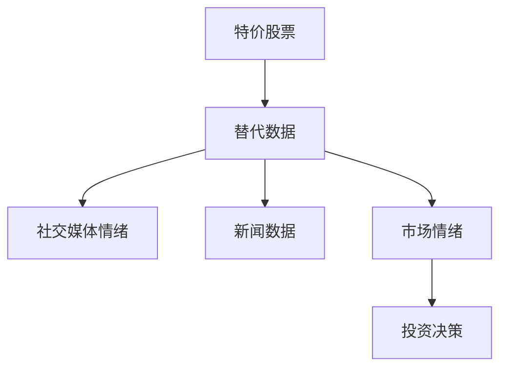
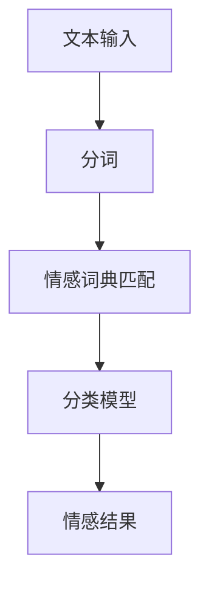
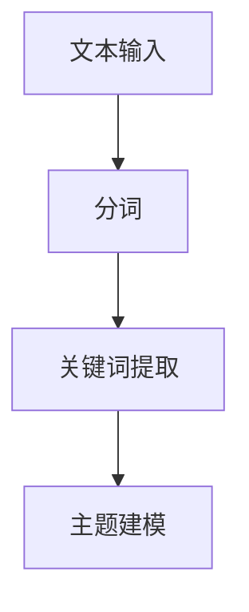
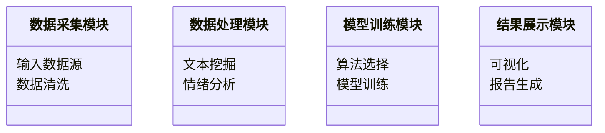
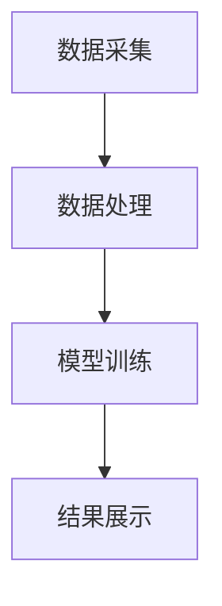

                 


# 特价股票投资中的替代数据分析与应用

> 关键词：特价股票，替代数据，数据分析，投资策略，机器学习，文本挖掘，股票预测

> 摘要：本文探讨了在特价股票投资中如何利用替代数据进行分析和应用。通过背景介绍、核心概念、算法原理、系统架构设计、项目实战和最佳实践等多方面的分析，详细阐述了替代数据在特价股票投资中的重要性及其应用场景。文章结合实际案例，使用专业技术语言，深入分析了如何利用文本挖掘、情绪分析、时间序列分析等技术，构建有效的投资策略，帮助投资者在市场中获取超额收益。

---

## 第1章：特价股票与替代数据的背景介绍

### 1.1 特价股票的定义与特点
特价股票通常指价格低于面值的股票，也被称为“仙股”或“垃圾股”。这类股票通常具有高波动性和高风险，但也可能存在投资机会。

### 1.2 替代数据的概念与分类
替代数据是指除传统财务数据之外的其他数据，包括社交媒体情绪、新闻数据、专利申请、供应链信息等。这些数据可以帮助投资者更全面地分析市场动态。

### 1.3 传统数据分析的局限性
传统数据分析主要依赖财务数据，但其局限性在于无法捕捉市场情绪和非结构化信息。替代数据的引入弥补了这一不足。

### 1.4 替代数据在投资中的潜力
替代数据能够捕捉市场情绪、行业趋势和潜在风险，帮助投资者做出更明智的决策。

---

## 第2章：替代数据的核心概念与联系

### 2.1 替代数据的类型与特征
- **文本数据**：包括新闻、社交媒体帖子、公司财报等。
- **网络数据**：包括网页抓取数据、论坛讨论等。
- **情绪数据**：通过自然语言处理提取的市场情绪指标。

### 2.2 替代数据的属性对比
| 数据类型 | 数据来源 | 数据特征 | 应用场景 |
|----------|-----------|----------|----------|
| 文本数据 | 社交媒体、新闻 | 非结构化、情感丰富 | 情绪分析 |
| 网络数据 | 网页、论坛 | 结构化、信息分散 | 行业趋势 |
| 情绪数据 | 文本挖掘 | 情感指标 | 投资决策 |

### 2.3 替代数据的实体关系图


---

## 第3章：替代数据分析的核心算法

### 3.1 情绪分析算法
情绪分析通过自然语言处理技术，从文本中提取情感倾向。常用算法包括基于词袋模型的分类和深度学习模型。

#### 3.1.1 情绪分析流程图


#### 3.1.2 情绪分析代码实现
```python
import pandas as pd
from sklearn.feature_extraction.text import TfidfVectorizer
from sklearn.linear_model import LogisticRegression

# 加载数据
data = pd.read_csv('tweets.csv')

# 特征提取
vectorizer = TfidfVectorizer(max_features=5000)
X = vectorizer.fit_transform(data['text'])

# 模型训练
model = LogisticRegression()
model.fit(X, data['sentiment'])

# 预测
def predict_emotion(text):
    text_vec = vectorizer.transform([text])
    return model.predict(text_vec)[0]
```

### 3.2 文本挖掘技术
文本挖掘包括信息提取、关键词提取和主题建模等技术，用于从大量文本数据中提取有价值的信息。

#### 3.2.1 文本挖掘流程图


### 3.3 时间序列分析
时间序列分析用于分析历史数据，预测未来趋势。常用模型包括ARIMA和LSTM。

#### 3.3.1 时间序列分析代码实现
```python
from statsmodels.tsa.arima_model import ARIMA

# 加载数据
data = pd.read_csv('stock_prices.csv')

# 模型训练
model = ARIMA(data['price'], order=(5,1,0))
model_fit = model.fit()

# 预测
forecast = model_fit.forecast(steps=5)
print(forecast)
```

---

## 第4章：数学模型与公式

### 4.1 时间序列模型
ARIMA模型的公式为：
$$ ARIMA(p, d, q) = \phi(B)^p (1 - B)^d Y_t = \theta(B)^q \epsilon_t $$

### 4.2 机器学习模型
LSTM的结构如下：
$$
f_t = \text{LSTM}(x_t, f_{t-1})
$$
其中，$x_t$ 是输入，$f_{t-1}$ 是前一时刻的隐藏状态。

---

## 第5章：系统架构设计

### 5.1 系统功能模块


### 5.2 系统架构图


---

## 第6章：项目实战

### 6.1 环境搭建
安装Python和相关库：
```bash
pip install pandas numpy tensorflow
```

### 6.2 核心代码实现
```python
import tensorflow as tf
from tensorflow.keras import layers

# 情绪分类模型
model = tf.keras.Sequential([
    layers.Embedding(10000, 16),
    layers.SimpleRNN(32),
    layers.Dense(2, activation='softmax')
])
model.compile(optimizer='adam', loss='sparse_categorical_crossentropy')
model.fit(X_train, y_train, epochs=10)
```

### 6.3 实例分析
以某段时间内的社交媒体数据为例，分析情绪指标对股价的影响，并展示结果。

---

## 第7章：最佳实践与小结

### 7.1 小结
替代数据的应用能够显著提升特价股票投资的效率和准确性。

### 7.2 注意事项
- 数据质量和来源需谨慎选择。
- 模型需定期更新和验证。

### 7.3 拓展阅读
推荐相关书籍和论文，进一步深入学习。

---

通过以上分析，我们可以看到替代数据在特价股票投资中的巨大潜力。结合算法、系统架构和实际案例，投资者可以更好地利用这些数据，制定有效的投资策略。

