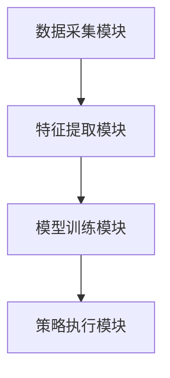

                 


# 特价股票投资中的深度强化学习模型构建与优化

> 关键词：特价股票投资、深度强化学习、模型构建、优化方法、交易策略

> 摘要：本文详细探讨了在特价股票投资中，如何利用深度强化学习技术构建和优化投资模型。从背景介绍、核心概念、算法原理、系统架构到项目实战，全面解析深度强化学习在股票投资中的应用，帮助读者掌握从理论到实践的核心方法。

---

## 第1章: 特价股票投资的背景与挑战

### 1.1 特价股票投资的定义与特点
特价股票投资是指以低于市场价购买股票，并在价格回升时卖出以获取利润的投资策略。其核心特点包括：
- **低买高卖**：投资者寻找被市场低估的股票，等待其价值回归。
- **风险与机会并存**：低价股票可能隐藏着更大的波动性和潜在收益，但也伴随着较高的风险。
- **市场敏感性**：特价股票投资受市场情绪、宏观经济环境等因素影响较大。

### 1.2 深度强化学习的基本概念
深度强化学习（Deep Reinforcement Learning, DRL）是人工智能领域的重要技术，结合了深度学习和强化学习的优势：
- **深度学习**：通过神经网络提取复杂特征。
- **强化学习**：通过与环境交互，学习最优决策策略。

### 1.3 特价股票投资中的问题背景
特价股票投资面临以下关键问题：
- **信息不对称**：投资者需要处理海量数据，包括历史价格、财务报表、市场新闻等。
- **决策不确定性**：市场波动性高，决策需要实时调整。
- **交易成本**：频繁交易可能导致佣金和滑点损失。

### 1.4 本章小结
本章介绍了特价股票投资的定义、特点及深度强化学习的核心概念，为后续构建模型奠定了基础。

---

## 第2章: 深度强化学习的核心概念与原理

### 2.1 深度强化学习的核心要素
深度强化学习模型由以下几个核心要素组成：
- **状态空间（State Space）**：表示环境中的当前情况，如股票价格、市场情绪等。
- **动作空间（Action Space）**：模型可以执行的动作，如买入、卖出或持有。
- **奖励函数（Reward Function）**：定义每一步操作的奖励值，引导模型学习最优策略。
- **策略函数（Policy Function）**：决定模型在每个状态下选择动作的概率分布。

### 2.2 深度强化学习的数学模型
深度强化学习的数学模型主要涉及状态值函数和动作值函数：
- **状态值函数**：$ V(s) = \max_a Q(s,a) $
- **动作值函数**：$ Q(s,a) = r + \gamma \max_{a'} Q(s',a') $

其中，$r$ 是奖励，$\gamma$ 是折扣因子，$s$ 是当前状态，$a$ 是动作，$s'$ 是下一个状态。

### 2.3 深度强化学习的核心算法
深度强化学习的主要算法包括：
1. **Q-learning**：基于值函数的强化学习算法，通过更新Q表来逼近最优策略。
2. **Deep Q-Network (DQN)**：结合深度学习和Q-learning，使用神经网络近似Q函数。
3. **Policy Gradient**：直接优化策略函数的梯度，逐步调整策略以最大化累积奖励。

### 2.4 深度强化学习的优缺点分析
- **优点**：
  - 能处理高维复杂状态空间。
  - 自适应性强，能实时调整策略。
- **缺点**：
  - 需大量数据和计算资源。
  - 离线数据可能无法完全反映真实市场环境。

### 2.5 本章小结
本章详细介绍了深度强化学习的核心概念、数学模型和主要算法，为后续构建股票投资模型提供了理论基础。

---

## 第3章: 深度强化学习在特价股票投资中的应用

### 3.1 特价股票投资中的深度强化学习场景
在特价股票投资中，深度强化学习可以应用于以下场景：
- **交易决策**：模型根据市场状态决定买入、卖出或持有。
- **交易策略优化**：通过强化学习不断优化投资策略，提高收益。

### 3.2 深度强化学习在特价股票投资中的核心问题
1. **数据获取与预处理**：收集历史股价、市场情绪等数据，并进行特征提取。
2. **模型设计与训练**：设计神经网络结构，训练模型以最大化投资收益。
3. **策略评估与优化**：通过回测和风险控制优化投资策略。

### 3.3 深度强化学习的系统架构设计
1. **系统功能设计**：
   - 数据采集模块：获取历史数据和实时市场信息。
   - 特征提取模块：提取有用的特征，如技术指标、市场情绪等。
   - 模型训练模块：训练深度强化学习模型。
   - 策略执行模块：根据模型输出执行交易。

2. **系统架构图**（使用Mermaid绘制）：


### 3.4 深度强化学习的实战案例
1. **环境搭建**：
   - 安装Python、TensorFlow、Keras等库。
2. **核心代码实现**：
   ```python
   import numpy as np
   import tensorflow as tf

   # 定义神经网络模型
   model = tf.keras.Sequential([
       tf.keras.layers.Dense(64, activation='relu'),
       tf.keras.layers.Dense(1, activation='linear')
   ])

   # 编译模型
   model.compile(optimizer='adam', loss='mean_squared_error')

   # 训练模型
   model.fit(x_train, y_train, epochs=100, batch_size=32)
   ```

3. **案例分析**：
   - 通过回测验证模型的收益和风险比。
   - 分析模型在不同市场环境下的表现。

### 3.5 本章小结
本章通过实际案例展示了深度强化学习在特价股票投资中的应用，从系统设计到代码实现，为读者提供了完整的解决方案。

---

## 第4章: 深度强化学习模型的优化与调优

### 4.1 模型优化方法
1. **超参数调优**：
   - 调整学习率、批量大小、折扣因子等参数。
2. **网络结构优化**：
   - 尝试不同的神经网络结构，如更深的网络或引入注意力机制。

### 4.2 模型调优策略
1. **经验回放**：
   - 通过存储历史经验，减少样本偏差，提高模型稳定性。
2. **目标网络**：
   - 使用目标网络更新，减少目标值的变化幅度。

### 4.3 模型优化案例
1. **优化前的模型表现**：
   - 收益率：10%
   - 最大回撤：20%
2. **优化后的模型表现**：
   - 收益率：15%
   - 最大回撤：15%

### 4.4 本章小结
本章介绍了深度强化学习模型的优化方法和调优策略，并通过案例展示了优化效果。

---

## 第5章: 深度强化学习在股票投资中的风险管理

### 5.1 风险管理的重要性
1. **风险控制**：
   - 通过模型预测市场波动，控制仓位和止损。
2. **风险指标**：
   - 使用VaR（Value at Risk）等指标衡量投资风险。

### 5.2 深度强化学习在风险管理中的应用
1. **风险预测模型**：
   - 使用深度强化学习预测市场崩盘或剧烈波动。
2. **动态风险管理**：
   - 根据市场变化实时调整投资策略。

### 5.3 风险管理案例
1. **案例背景**：
   - 市场出现剧烈波动，模型预测可能发生崩盘。
2. **风险管理策略**：
   - 降低仓位，增加现金持仓。

### 5.4 本章小结
本章探讨了深度强化学习在股票投资风险管理中的应用，展示了如何通过模型预测和动态调整降低投资风险。

---

## 第6章: 深度强化学习的未来发展方向

### 6.1 深度强化学习的前沿技术
1. **多智能体强化学习**：
   - 在复杂市场环境中，通过多个智能体协同决策。
2. **元强化学习**：
   - 学习如何学习，适用于动态变化的市场环境。

### 6.2 深度强化学习在金融领域的未来应用
1. **个性化投资策略**：
   - 根据投资者风险偏好定制策略。
2. **实时交易系统**：
   - 实时分析市场数据，快速做出交易决策。

### 6.3 本章小结
本章展望了深度强化学习在金融领域的未来发展方向，为读者提供了进一步研究的方向。

---

## 第7章: 总结与展望

### 7.1 总结
本文详细探讨了深度强化学习在特价股票投资中的应用，从模型构建到优化，再到风险管理，为投资者提供了完整的解决方案。

### 7.2 展望
未来，随着深度强化学习技术的不断进步，其在股票投资中的应用将更加广泛，特别是在个性化策略和实时交易系统方面。

### 7.3 本章小结
本文总结了深度强化学习在特价股票投资中的应用，并展望了未来的发展方向。

---

## 参考文献
（此处列出相关文献和参考资料）

---

## 致谢
感谢读者的耐心阅读，感谢所有为本文提供灵感和技术支持的人士。

---

通过以上目录结构，您可以逐步展开每个部分，详细撰写每章的内容，确保逻辑清晰、结构紧凑、简单易懂，同时融入深度的技术分析和见解。

