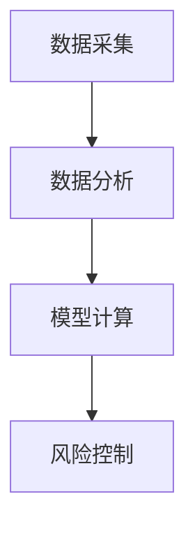

                 


# 特价股票投资中的监管套利策略

> **关键词**: 监管套利，股票投资，特价股票，风险管理，数学模型

> **摘要**: 本文深入探讨了特价股票投资中的监管套利策略，从监管套利的定义、原理到实施步骤、数学模型，再到风险管理、系统设计与实战案例，全面解析了如何利用监管套利策略在股票投资中获取超额收益。文章内容详实，结合理论与实践，为投资者提供了有价值的参考。

---

## 第一部分: 特价股票投资中的监管套利策略背景与基础

### 第1章: 监管套利策略的定义与核心概念

#### 1.1 监管套利的定义
##### 1.1.1 监管套利的基本概念
监管套利是指投资者利用不同地区或市场之间的监管差异，通过合法或半合法的方式，以较低的成本获取收益的一种投资策略。它通常涉及对监管政策的深刻理解，以及对市场规则的灵活运用。

##### 1.1.2 监管套利的类型与特点
监管套利可以分为以下几种类型：
- **跨市场套利**：利用不同市场之间的价格差异进行套利。
- **跨产品套利**：利用不同金融产品之间的价格差异进行套利。
- **监管 arbitrage**：利用监管政策的差异进行套利。

其特点包括低风险、高收益、隐蔽性强等。

##### 1.1.3 监管套利在股票投资中的应用
在股票投资中，监管套利通常用于以下场景：
- 利用上市规则差异进行套利。
- 利用税收政策差异进行套利。
- 利用市场流动性差异进行套利。

#### 1.2 监管套利的核心概念
##### 1.2.1 监管套利的市场环境
监管套利的市场环境包括：
- 全球化市场的监管差异。
- 市场参与者的多样性。
- 监管政策的不透明性。

##### 1.2.2 监管套利的原理与机制
监管套利的原理在于利用监管政策的差异，通过套利行为实现无风险或低风险的收益。其机制包括：
1. 识别监管差异。
2. 利用价格差异进行套利。
3. 通过市场机制实现收益。

##### 1.2.3 监管套利与股票投资的关系
监管套利是股票投资的一种高级策略，它通过利用监管政策的差异，帮助投资者在市场中寻找价格低估的股票，从而实现超额收益。

---

### 第2章: 特价股票投资的基本原理

#### 2.1 特价股票的定义
##### 2.1.1 特价股票的定义与特征
特价股票是指市场价格低于其内在价值的股票。其特征包括：
- 市场价格低于账面价值。
- 市场流动性较低。
- 市场参与者较少。

##### 2.1.2 特价股票的投资价值评估
特价股票的投资价值可以通过以下方法进行评估：
- 市盈率（P/E）分析。
- 市净率（P/B）分析。
- 股息率分析。

##### 2.1.3 特价股票与市场周期的关系
特价股票的投资机会通常出现在市场周期的低谷期，此时市场参与者较少，股票价格被低估。

#### 2.2 特价股票的投资策略
##### 2.2.1 价值投资与特价股票
价值投资是特价股票投资的核心策略，投资者需要通过基本面分析，寻找被市场低估的股票。

##### 2.2.2 技术分析与特价股票
技术分析是另一种常用的策略，通过分析股票价格走势，寻找套利机会。

##### 2.2.3 风险控制与特价股票投资
风险控制是特价股票投资的重要组成部分，投资者需要通过合理的仓位管理和止损策略，降低投资风险。

---

## 第二部分: 监管套利策略的实施与分析

### 第3章: 监管套利策略的实施步骤

#### 3.1 监管套利的市场分析
##### 3.1.1 市场环境分析
市场环境分析包括对全球市场的监管政策、市场流动性、市场参与者的分析。

##### 3.1.2 监管政策分析
监管政策分析是监管套利的核心，需要对不同市场的监管政策进行深入研究。

##### 3.1.3 市场参与者行为分析
市场参与者行为分析包括对机构投资者、个人投资者、监管机构的行为进行分析。

#### 3.2 监管套利机会的识别
##### 3.2.1 监管套利机会的识别方法
监管套利机会的识别方法包括：
- 监管政策差异分析。
- 市场价格差异分析。
- 市场参与者行为分析。

##### 3.2.2 监管套利机会的评估指标
监管套利机会的评估指标包括：
- 套利空间的大小。
- 套利成本的高低。
- 套利风险的大小。

##### 3.2.3 监管套利机会的案例分析
通过实际案例分析，说明如何利用监管套利策略在股票投资中获取收益。

---

### 第4章: 监管套利策略的数学模型与公式

#### 4.1 监管套利的数学模型
##### 4.1.1 监管套利的收益计算公式
$$ \text{收益} = \text{卖出价} - \text{买入价} $$

##### 4.1.2 监管套利的风险评估模型
$$ \text{风险} = \sqrt{\text{VaR}^2 + \text{CVaR}^2} $$

##### 4.1.3 监管套利的优化算法
- 监管套利的优化算法包括：
  1. 线性规划。
  2. 非线性规划。
  3. 遗传算法。

#### 4.2 监管套利的数学公式
##### 4.2.1 监管套利的收益公式
$$ \text{收益} = \text{卖出价} - \text{买入价} $$

##### 4.2.2 监管套利的风险公式
$$ \text{风险} = \text{标准差} \times \sqrt{\text{时间}} $$

---

## 第三部分: 监管套利策略的风险管理

### 第5章: 监管套利的风险管理

#### 5.1 监管套利的主要风险
##### 5.1.1 市场风险
市场风险是监管套利的主要风险之一，包括市场价格波动、市场流动性不足等。

##### 5.1.2 流动性风险
流动性风险是指在市场流动性不足的情况下，投资者无法以合理价格买卖股票的风险。

##### 5.1.3 法律风险
法律风险是指由于监管政策的变化或法律的不确定性，导致投资者面临法律风险。

#### 5.2 监管套利的风险控制策略
##### 5.2.1 风险控制的体系构建
风险控制体系的构建包括：
- 风险评估体系。
- 风险预警体系。
- 风险应对体系。

##### 5.2.2 风险控制的具体措施
风险控制的具体措施包括：
- 设置止损点。
- 分散投资。
- 定期评估投资组合。

---

## 第四部分: 监管套利策略的系统设计与实现

### 第6章: 监管套利的系统设计

#### 6.1 监管套利的系统架构设计
##### 6.1.1 系统功能设计
系统功能设计包括：
- 数据采集模块。
- 数据分析模块。
- 模型计算模块。
- 风险控制模块。

##### 6.1.2 系统架构图


#### 6.2 监管套利的算法设计
##### 6.2.1 监管套利的算法流程
- 数据采集：收集相关市场的监管政策、股票价格等数据。
- 数据分析：分析数据，识别监管套利机会。
- 模型计算：利用数学模型计算套利收益和风险。
- 风险控制：制定风险控制策略，确保投资安全。

##### 6.2.2 监管套利的Python代码实现
```python
import numpy as np
import pandas as pd

# 数据采集
data = pd.read_csv('market_data.csv')

# 数据分析
def calculate_arbitrage_opportunity(data):
    # 计算套利机会
    return data['卖出价'] - data['买入价']

# 模型计算
def calculate_risk(arbitrage_opportunity):
    # 计算风险
    return np.std(arbitrage_opportunity) * np.sqrt(len(arbitrage_opportunity))

# 风险控制
def risk_management(arbitrage_opportunity):
    # 设置止损点
    return arbitrage_opportunity.where(arbitrage_opportunity > 0, 0)
```

---

## 第五部分: 监管套利策略的实战与案例分析

### 第7章: 监管套利的实战案例分析

#### 7.1 监管套利的案例分析
##### 7.1.1 案例背景
- 某市场A和市场B的监管政策差异。
- 某股票在市场A和市场B的价格差异。

##### 7.1.2 案例分析
通过数据分析和模型计算，识别监管套利机会，并计算套利收益和风险。

##### 7.1.3 案例总结
总结案例中的经验和教训，提炼最佳实践。

#### 7.2 监管套利的项目小结
通过实际案例分析，验证监管套利策略的有效性，并总结其在实际投资中的应用。

---

## 附录: 监管套利策略的相关资料

### 附录1: 监管套利的术语表
- 监管套利：利用监管政策差异进行套利。
- 套利机会：市场价格差异带来的收益机会。
- 风险管理：通过策略降低投资风险。

### 附录2: 监管套利的法律合规要点
- 遵守相关法律法规。
- 避免操纵市场价格。
- 保护投资者利益。

### 附录3: 监管套利的进一步阅读
- 推荐书籍：《监管套利与金融创新》。
- 推荐文章：《监管套利的经济学分析》。

---

通过以上内容，本文系统地介绍了特价股票投资中的监管套利策略，从理论到实践，从风险到系统设计，为投资者提供了全面的指导。希望读者能够通过本文，更好地理解监管套利的策略和方法，并在实际投资中取得成功。

