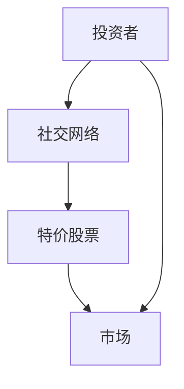
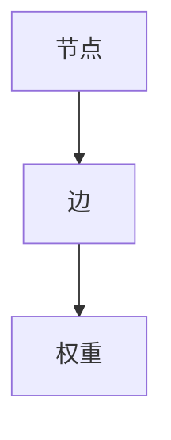
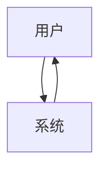

                 


---

# 特价股票投资中的社交图谱动态分析与应用

## 关键词：特价股票投资，社交图谱，动态分析，情感分析，网络分析，机器学习

## 摘要：本文探讨了在特价股票投资中，利用社交图谱进行动态分析的应用。通过社交网络数据，分析投资者情绪和市场动态，构建预测模型，帮助投资者做出更明智的投资决策。文章详细介绍了核心概念、算法原理、系统架构设计及项目实战，为读者提供全面的技术指导。

---

## 第一部分: 特价股票投资的背景与问题分析

### 第1章: 特价股票投资的背景与问题分析

#### 1.1 特价股票投资的背景

##### 1.1.1 什么是特价股票
特价股票通常指价格较低的股票，具有高增长潜力，吸引了不少投资者。这类股票通常来自中小型企业，风险较高，但回报潜力大。

##### 1.1.2 特价股票投资的现状
随着金融市场的波动，越来越多的投资者转向特价股票，希望通过低价买入高价卖出获利。然而，市场风险和信息不对称问题依然存在。

##### 1.1.3 特价股票投资的意义
通过分析特价股票的市场动态，投资者可以发现潜在的投资机会，优化投资组合，提高收益率。

#### 1.2 社交图谱分析的背景

##### 1.2.1 社交图谱的基本概念
社交图谱是指社交网络中用户之间的关系图，节点代表用户，边代表关系。通过分析图谱结构，可以发现用户行为和情感趋势。

##### 1.2.2 社交图谱在金融领域的应用
社交图谱被广泛应用于金融市场的投资者行为分析、风险评估和趋势预测。通过分析社交网络数据，投资者可以更好地理解市场情绪。

##### 1.2.3 特价股票与社交图谱的结合
通过社交图谱分析特价股票投资者的行为和情绪，可以帮助投资者预测市场动态，优化投资策略。

#### 1.3 特价股票投资中的问题描述

##### 1.3.1 信息不对称问题
投资者难以获取准确的市场信息，导致投资决策失误。

##### 1.3.2 市场波动性大
特价股票价格波动剧烈，增加了投资的不确定性和风险。

##### 1.3.3 投资者行为复杂
投资者情绪受多种因素影响，难以准确预测和分析。

#### 1.4 社交图谱动态分析的解决思路

##### 1.4.1 利用社交网络数据
通过分析社交网络中的投资者行为和情感，捕捉市场动态。

##### 1.4.2 构建动态预测模型
基于社交图谱数据，构建动态预测模型，帮助投资者做出更明智的决策。

##### 1.4.3 实时监控和反馈
通过实时监控市场动态，及时调整投资策略，降低风险。

#### 1.5 边界与外延

##### 1.5.1 定义边界
限定分析范围，只关注直接影响特价股票的因素，如投资者情绪、市场趋势等。

##### 1.5.2 界定外延
扩展分析范围，考虑宏观经济、政策变化等外部因素对市场的影响。

---

## 第二部分: 特价股票投资中的社交图谱动态分析的核心概念

### 第2章: 特价股票投资中的社交图谱动态分析的核心概念

#### 2.1 社交图谱动态分析的定义

##### 2.1.1 动态分析的含义
动态分析是指对社交图谱中的数据进行实时更新和分析，捕捉市场变化趋势。

##### 2.1.2 社交图谱动态分析的特点
数据实时性高、分析复杂度高、结果具有前瞻性。

##### 2.1.3 动态分析在特价股票投资中的作用
帮助投资者及时捕捉市场变化，优化投资策略。

#### 2.2 核心概念与联系

##### 2.2.1 核心概念
社交图谱、动态分析、投资者情绪、市场趋势。

##### 2.2.2 概念属性特征对比
| 概念 | 属性 | 特征 |
|------|-------|------|
| 社交图谱 | 结构 | 节点、边 |
| 动态分析 | 方法 | 实时更新、预测模型 |
| 投资者情绪 | 指标 | 情感强度、情绪变化率 |

##### 2.2.3 ER实体关系图
通过ER图展示特价股票投资中的关键实体关系。



---

## 第三部分: 社交图谱动态分析的算法原理

### 第3章: 社交图谱动态分析的算法原理

#### 3.1 网络分析算法

##### 3.1.1 网络分析的基本原理
通过分析社交图谱的结构特征，识别关键节点和社区。

##### 3.1.2 网络分析在社交图谱中的应用
用于识别投资者群体、分析信息传播路径。

##### 3.1.3 网络分析算法的实现
使用Python的NetworkX库进行网络分析。



代码示例：

```python
import networkx as nx
G = nx.Graph()
G.add_nodes_from(['A', 'B', 'C'])
G.add_edges_from([('A', 'B'), ('B', 'C')])
print(G.nodes())
```

##### 3.1.4 网络分析算法的数学模型
网络分析中的节点度数计算公式：

$$度数 = \sum_{v \in V} adj(v, u)$$

其中，$V$是节点集合，$adj(v, u)$是节点$v$和$u$之间的边数。

#### 3.2 情感分析算法

##### 3.2.1 情感分析的基本原理
通过自然语言处理技术，分析文本中的情感倾向。

##### 3.2.2 情感分析在社交图谱中的应用
用于分析投资者对特价股票的情感态度，预测市场情绪。

##### 3.2.3 情感分析算法的实现
使用Python的TextBlob库进行情感分析。

代码示例：

```python
from textblob import TextBlob
text = "This stock is a great buy!"
blob = TextBlob(text)
print(blob.sentiment.polarity)
```

##### 3.2.4 情感分析算法的数学模型
情感极性计算公式：

$$极性 = \frac{\sum_{i=1}^{n} w_i \cdot s_i}{\sum_{i=1}^{n} w_i}$$

其中，$w_i$是词的权重，$s_i$是词的情感值。

#### 3.3 时间序列分析算法

##### 3.3.1 时间序列分析的基本原理
分析历史数据，预测未来趋势。

##### 3.3.2 时间序列分析在社交图谱中的应用
用于分析投资者情绪的时间变化，预测市场趋势。

##### 3.3.3 时间序列分析算法的实现
使用Python的ARIMA模型进行预测。

代码示例：

```python
import pandas as pd
from statsmodels.tsa.arima_model import ARIMA

data = pd.Series([1, 2, 3, 4, 5])
model = ARIMA(data, order=(1, 1, 1))
model_fit = model.fit()
 forecast = model_fit.forecast(steps=5)
print(forecast)
```

##### 3.3.4 时间序列分析算法的数学模型
ARIMA模型公式：

$$ARIMA(p, d, q)$$

其中，$p$是自回归阶数，$d$是差分阶数，$q$是移动平均阶数。

---

## 第四部分: 特价股票投资中的社交图谱动态分析系统架构设计

### 第4章: 特价股票投资中的社交图谱动态分析系统架构设计

#### 4.1 系统功能设计

##### 4.1.1 数据采集模块
从社交媒体平台获取投资者行为数据。

##### 4.1.2 社交图谱构建模块
基于采集的数据，构建社交图谱。

##### 4.1.3 情感分析模块
分析投资者对特价股票的情感态度。

##### 4.1.4 预测模型构建模块
基于社交图谱数据，构建预测模型。

#### 4.2 系统架构设计

##### 4.2.1 分层架构
- 数据层：负责数据的存储和管理。
- 业务逻辑层：负责数据处理和分析。
- 用户界面层：负责与用户的交互。

##### 4.2.2 接口设计
- 数据接口：用于数据的输入和输出。
- 分析接口：用于调用分析算法。

##### 4.2.3 交互设计
- 用户输入：投资者输入关注的股票。
- 系统反馈：系统返回预测结果和投资建议。

#### 4.3 系统交互设计

##### 4.3.1 交互流程图
展示系统与用户之间的交互流程。



#### 4.4 系统功能实现

##### 4.4.1 数据采集
从社交媒体平台获取投资者行为数据。

##### 4.4.2 数据预处理
清洗数据，去除噪音。

##### 4.4.3 数据分析
使用算法对数据进行分析，生成预测结果。

##### 4.4.4 结果展示
将分析结果以可视化形式展示给用户。

---

## 第五部分: 特价股票投资中的社交图谱动态分析项目实战

### 第5章: 特价股票投资中的社交图谱动态分析项目实战

#### 5.1 环境安装

##### 5.1.1 安装Python
安装Python 3.8及以上版本。

##### 5.1.2 安装依赖库
安装NetworkX、TextBlob、ARIMA等库。

##### 5.1.3 安装开发工具
安装Jupyter Notebook或PyCharm等开发工具。

#### 5.2 核心代码实现

##### 5.2.1 数据采集代码
从社交媒体平台获取数据。

##### 5.2.2 数据预处理代码
清洗数据，去除噪音。

##### 5.2.3 数据分析代码
使用算法对数据进行分析，生成预测结果。

##### 5.2.4 结果展示代码
将分析结果以可视化形式展示。

#### 5.3 代码解读与分析

##### 5.3.1 数据采集代码解读
解释代码的功能和实现细节。

##### 5.3.2 数据预处理代码解读
解释数据清洗的过程和方法。

##### 5.3.3 数据分析代码解读
解释算法实现的原理和步骤。

##### 5.3.4 结果展示代码解读
解释可视化结果的意义和用途。

#### 5.4 实际案例分析

##### 5.4.1 案例背景
介绍案例的背景和目标。

##### 5.4.2 案例数据
展示案例数据的来源和结构。

##### 5.4.3 案例分析过程
详细描述分析过程和步骤。

##### 5.4.4 分析结果
展示分析结果和预测模型的表现。

#### 5.5 项目小结

##### 5.5.1 项目总结
总结项目的实现过程和成果。

##### 5.5.2 经验与教训
分享项目中的经验和教训。

##### 5.5.3 项目意义
说明项目的实际应用价值和对未来工作的启示。

---

## 第六部分: 特价股票投资中的社交图谱动态分析总结与展望

### 第6章: 特价股票投资中的社交图谱动态分析总结与展望

#### 6.1 小结

##### 6.1.1 核心内容回顾
总结全文的核心内容和主要观点。

##### 6.1.2 主要结论
强调社交图谱动态分析在特价股票投资中的重要性和应用价值。

#### 6.2 最佳实践 tips

##### 6.2.1 数据来源选择
建议选择可靠的社交媒体平台获取数据。

##### 6.2.2 模型优化建议
建议采用更复杂的算法提高预测精度。

##### 6.2.3 结果验证方法
建议采用回测和实证分析验证模型的有效性。

#### 6.3 未来研究方向

##### 6.3.1 新算法研究
探索更高效的算法和模型。

##### 6.3.2 数据扩展
研究更多数据源和数据特征。

##### 6.3.3 应用场景拓展
探索社交图谱动态分析在其他金融领域的应用。

#### 6.4 注意事项

##### 6.4.1 数据隐私问题
提醒读者注意数据隐私和合规性问题。

##### 6.4.2 模型局限性
提醒读者模型的局限性和可能的误差。

##### 6.4.3 投资风险
提醒读者投资有风险，需谨慎决策。

#### 6.5 拓展阅读

##### 6.5.1 推荐书籍
推荐相关领域的书籍和文献。

##### 6.5.2 推荐博客
推荐相关的技术博客和资源。

##### 6.5.3 推荐工具
推荐相关的开发工具和平台。

---

## 作者介绍

---

感谢您的阅读！希望本文对您在特价股票投资中的社交图谱动态分析与应用的研究有所帮助。如果您有任何问题或建议，欢迎随时联系我。

---

**附录**
- 附录A: 相关代码片段
- 附录B: 数据来源说明
- 附录C: 参考文献与延伸阅读

---

通过以上内容，您可以逐步深入理解特价股票投资中的社交图谱动态分析与应用的各个方面。希望这篇文章对您有所帮助！

