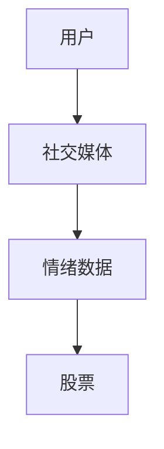
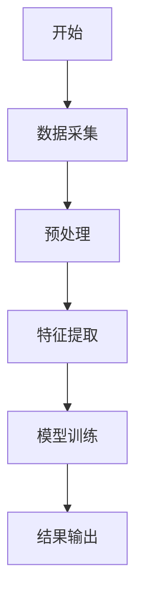
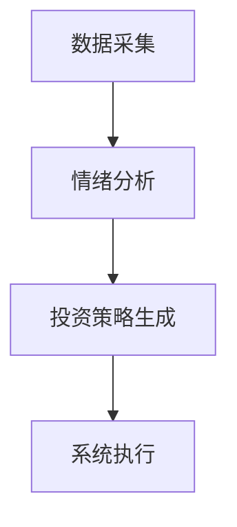

                 


# 特价股票投资中的社交媒体情绪动态分析与应用

> **关键词**: 特价股票投资, 社交媒体情绪分析, 情绪动态, 投资策略, 金融数据分析

> **摘要**: 本文探讨了在特价股票投资中，如何利用社交媒体上的情绪数据进行动态分析，并将其应用于投资策略的制定。通过分析社交媒体上的用户情绪，结合自然语言处理和时间序列分析等技术，本文提出了一种基于情绪动态的股票投资方法，并展示了其实现过程和实际案例。

---

## 第1章: 特价股票投资的背景与现状

### 1.1 特价股票投资的背景

#### 1.1.1 特价股票的定义与特点

**特价股票**是指在特定市场环境下，价格被市场低估的股票。这类股票通常具有较高的潜在回报，但可能伴随着较高的风险。特价股票的特点包括：

- **低估值**: 相对于其内在价值，市场价格较低。
- **高波动性**: 价格波动较大，容易受到市场情绪的影响。
- **周期性**: 特价股票的投资机会往往出现在市场低迷或特定经济周期中。

#### 1.1.2 特价股票投资的市场现状

近年来，随着金融市场的波动加剧，投资者对特价股票的兴趣显著增加。尤其是在2020年全球疫情后，许多企业面临价值重估，投资者开始关注那些被市场低估的股票。然而，特价股票的投资难度较大，主要原因是其价格波动性高，且受到市场情绪的影响。

#### 1.1.3 特价股票投资的机遇与挑战

**机遇**: 特价股票可能带来超额收益，尤其是在市场反转时。

**挑战**: 
- 市场情绪的不确定性。
- 信息不对称。
- 价格波动可能导致短期亏损。

---

### 1.2 社交媒体情绪分析的背景

#### 1.2.1 社交媒体在金融领域的应用

社交媒体已成为金融信息的重要来源。投资者通过社交媒体获取实时信息、分享观点、分析市场趋势。例如，Twitter、Reddit和雪球等平台上的讨论可以帮助投资者了解市场情绪。

#### 1.2.2 情绪分析技术的发展历程

情绪分析技术起源于自然语言处理（NLP），其发展经历了以下几个阶段:

1. **传统方法**: 基于规则的关键词匹配。
2. **统计方法**: 使用机器学习模型（如SVM、随机森林）进行分类。
3. **深度学习方法**: 基于神经网络（如LSTM、Transformer）的模型。

#### 1.2.3 情绪分析在股票投资中的潜力

社交媒体上的情绪数据可以帮助投资者预测市场走势。例如，当社交媒体上的情绪从看跌转向看涨时，可能预示着股价的上涨。

---

### 1.3 特价股票投资与社交媒体情绪分析的结合

#### 1.3.1 情绪分析如何影响投资决策

通过分析社交媒体上的情绪数据，投资者可以:

- 识别市场趋势。
- 发现市场情绪拐点。
- 判断股票的潜在价值。

#### 1.3.2 特价股票投资中的情绪动态特征

特价股票的投资机会往往与市场情绪的波动密切相关。例如，当市场情绪从悲观转向乐观时，特价股票可能迎来上涨。

#### 1.3.3 情绪分析在特价股票投资中的应用价值

情绪分析可以帮助投资者:

- 识别低估的股票。
- 把握市场情绪拐点。
- 制定动态投资策略。

---

## 第2章: 特价股票投资中的情绪动态分析核心概念

### 2.1 情绪分析的基本原理

#### 2.1.1 情绪分析的定义与分类

**情绪分析**: 是指通过自然语言处理技术，分析文本中的情感倾向（如正面、负面、中性）。

**分类**: 基于情感强度（从-1到1）或情感类别（如积极、消极、中性）。

#### 2.1.2 情感分析的关键技术

- **文本预处理**: 分词、去停用词、词干提取。
- **特征提取**: 词袋模型、词嵌入（如Word2Vec）。
- **模型训练**: 基于机器学习或深度学习的分类模型。

#### 2.1.3 情感分析的评价指标

| 指标 | 定义 |
|------|------|
| 准确率 | 正确预测的比例。 |
| 召回率 | 正确预测的正样本比例。 |
| F1值 | 准确率和召回率的调和平均数。 |

---

#### 2.2 情绪动态分析的特征与属性

### 2.2.1 情绪动态分析的特征对比表格

| 特征 | 描述 |
|------|------|
| 时间性 | 情绪随时间变化。 |
| 波动性 | 情绪变化幅度大。 |
| 关联性 | 情绪与股价相关。 |

### 2.2.2 情绪动态分析的ER实体关系图



### 2.2.3 情绪动态分析的流程图



---

### 2.3 情绪动态分析的数学模型

#### 2.3.1 情感强度计算公式

$$ \text{情感强度} = \frac{\sum (\text{情感得分}_i)}{n} $$

其中，$\text{情感得分}_i$ 是每个文本的情感得分，$n$ 是文本数量。

#### 2.3.2 情绪传播模型

$$ \text{情绪传播} = \alpha \cdot \text{当前情绪} + (1 - \alpha) \cdot \text{外部情绪} $$

其中，$\alpha$ 是情绪传播的权重。

---

## 第3章: 情绪动态分析的算法原理

### 3.1 情绪分析算法的实现流程

#### 3.1.1 文本预处理

1. 分词: 使用分词工具（如jieba）对文本进行分词。
2. 去停用词: 删除无意义的词汇（如“的”、“了”）。
3. 词干提取: 提取词汇的词干（如“股票” -> “股票”）。

#### 3.1.2 特征提取

1. 词袋模型: 将文本表示为词频向量。
2. 词嵌入: 使用Word2Vec生成词向量。

#### 3.1.3 模型训练与预测

1. 训练模型: 使用深度学习模型（如LSTM）进行训练。
2. 预测情感: 对新文本进行情感分类。

#### 3.1.4 结果评估

1. 计算准确率、召回率和F1值。
2. 可视化结果: 使用混淆矩阵进行分析。

---

### 3.2 情绪动态分析的数学模型

#### 3.2.1 情感强度计算公式

$$ \text{情感强度} = \frac{\sum (\text{情感得分}_i)}{n} $$

其中，$\text{情感得分}_i$ 是每个文本的情感得分，$n$ 是文本数量。

#### 3.2.2 情绪传播模型

$$ \text{情绪传播} = \alpha \cdot \text{当前情绪} + (1 - \alpha) \cdot \text{外部情绪} $$

其中，$\alpha$ 是情绪传播的权重。

---

## 第4章: 情绪动态分析的系统架构设计

### 4.1 系统功能设计

#### 4.1.1 数据采集模块

1. 从社交媒体获取数据。
2. 提取文本、用户信息等。

#### 4.1.2 情绪分析模块

1. 对文本进行预处理。
2. 使用模型进行情感分类。

#### 4.1.3 投资策略生成模块

1. 根据情绪分析结果生成投资策略。
2. 结合其他因素（如基本面分析）优化策略。

#### 4.1.4 系统执行模块

1. 执行投资策略。
2. 监控系统运行状态。

---

### 4.2 系统架构设计

#### 4.2.1 系统架构图



#### 4.2.2 模块交互流程图


---

## 第5章: 情绪动态分析的项目实战

### 5.1 项目环境搭建

1. 安装必要的库（如Python、TensorFlow、jieba）。
2. 准备数据集。

### 5.2 系统核心实现源代码

```python
import tensorflow as tf
from tensorflow.keras import layers

# 数据预处理
def preprocess(text):
    # 分词
    words = jieba.lcut(text)
    # 去停用词
    filtered_words = [word for word in words if word not in stop_words]
    return ' '.join(filtered_words)

# 模型训练
model = tf.keras.Sequential([
    layers.Embedding(vocab_size, 100),
    layers.LSTM(64),
    layers.Dense(1, activation='sigmoid')
])

model.compile(optimizer='adam', loss='binary_crossentropy', metrics=['accuracy'])
model.fit(train_data, train_labels, epochs=10, batch_size=32)
```

### 5.3 代码解读与分析

1. **数据预处理**: 使用分词工具对文本进行分词，并去除停用词。
2. **模型训练**: 使用LSTM模型进行情感分类。
3. **结果评估**: 计算准确率、召回率和F1值。

---

### 5.4 案例分析与详细讲解

假设我们有一个社交媒体数据集，包含以下内容：

| 用户ID | 文本内容         | 情感标签 |
|--------|------------------|----------|
| 1      | 这只股票很好     | 正向     |
| 2      | 这只股票很差     | 负向     |
| 3      | 这只股票一般     | 中性     |

通过情绪分析模型，我们可以将文本内容的情感进行分类，并生成投资策略。

---

## 第6章: 最佳实践与小结

### 6.1 最佳实践 tips

1. 数据质量: 确保数据的完整性和准确性。
2. 模型优化: 不断优化模型以提高准确率。
3. 风险控制: 设定止损点以控制风险。

### 6.2 小结

通过社交媒体情绪动态分析，投资者可以更好地把握市场情绪，制定有效的投资策略。然而，情绪分析仅是投资决策的一部分，还需要结合其他因素（如基本面分析）进行综合判断。

### 6.3 注意事项

- 情绪分析结果仅供参考，不构成投资建议。
- 投资者需具备相关知识，谨慎决策。

### 6.4 拓展阅读

- 《算法交易: 基于Python的量化投资》
- 《自然语言处理实战: 基于Python的文本分析》

---

**总结**: 本文通过分析社交媒体情绪动态，为特价股票投资提供了一种新的思路。通过情绪分析技术，投资者可以更好地把握市场情绪，制定有效的投资策略。

