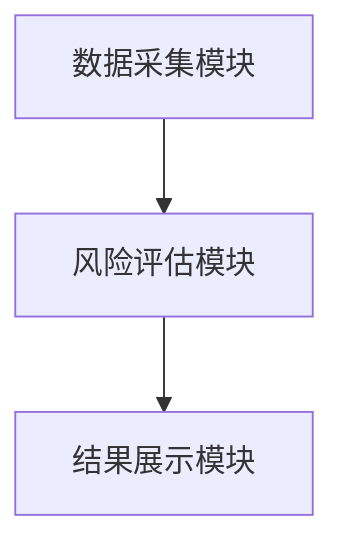
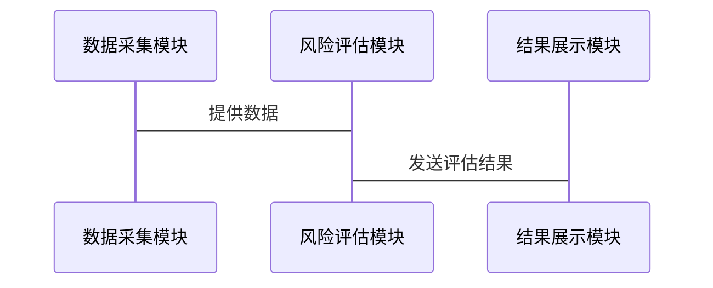

                 


# 特价股票投资中的网络安全风险评估方法

## 关键词：网络安全、风险评估、特价股票、金融数据、算法模型、系统架构、投资策略

## 摘要：本文系统地探讨了特价股票投资中的网络安全风险评估方法。文章从网络安全在金融领域的现状出发，详细分析了特价股票投资的特点和网络安全需求。通过介绍网络安全风险评估的基本原理，包括概率模型和影响分析，本文提供了具体的数学模型和算法实现。最后，结合实际案例，文章展示了如何通过系统架构设计和项目实战，为投资者提供科学的决策支持。

---

# 特价股票投资中的网络安全风险评估方法

## 第1章：网络安全在金融领域的现状

### 1.1 网络安全的挑战

网络安全在金融领域的威胁日益加剧，数据泄露和网络攻击对投资者的信任和资产安全构成严重威胁。特价股票投资因其高波动性和短期收益特性，成为黑客攻击的焦点。

### 1.2 特价股票投资的特点

特价股票是指价格低于其内在价值的股票，通常具有较高的增长潜力。其特点包括高波动性、高风险和高回报，这些特点使得投资者在决策时需要更加谨慎。

### 1.3 网络安全需求

在特价股票投资中，网络安全需求主要体现在数据保护、风险管理和合规性方面。投资者需要确保数据的安全性，避免因网络攻击导致的损失。

---

## 第2章：网络安全风险评估的基本原理

### 2.1 核心概念

- **风险**：可能事件的发生概率及其影响的组合。
- **威胁**：可能破坏系统安全的事件或行为。
- **漏洞**：系统中存在的弱点，可能被威胁利用。

### 2.2 风险来源

- **市场风险**：市场波动导致股票价格下跌。
- **信用风险**：上市公司违约的风险。
- **操作风险**：交易过程中的错误或欺诈行为。
- **法律风险**：政策变化或合规问题。

### 2.3 评估框架

采用层次分析法（AHP）进行风险评估，结合概率模型和影响分析，构建综合评估模型。

---

## 第3章：网络安全风险评估的方法

### 3.1 概率模型

使用贝叶斯定理计算风险发生的概率：

$$ P(A|B) = \frac{P(B|A)P(A)}{P(B)} $$

其中，A表示风险发生，B表示相关证据。

### 3.2 影响分析

通过层次分析法评估风险的影响程度：

1. 确定影响因素，如财务损失、声誉损失等。
2. 构建比较判断矩阵。
3. 计算各因素的权重。

### 3.3 综合评估

综合概率和影响，计算风险值：

$$ R = P \times I $$

其中，P是风险发生的概率，I是影响程度。

---

## 第4章：系统架构设计

### 4.1 系统功能模块

- **数据采集模块**：采集市场数据和交易信息。
- **风险评估模块**：应用算法模型进行风险评估。
- **结果展示模块**：以可视化方式展示评估结果。

### 4.2 架构设计

采用微服务架构，确保系统的可扩展性和灵活性。系统架构图如下：



### 4.3 接口设计

定义各模块之间的接口，确保数据流的顺畅。交互序列图如下：



---

## 第5章：项目实战

### 5.1 环境安装

安装Python和相关库：

```bash
pip install numpy pandas scikit-learn
```

### 5.2 核心代码实现

实现风险评估算法的Python代码：

```python
import numpy as np
from sklearn.metrics import pairwise_distances

def calculate_probability(matrix):
    # 计算概率矩阵
    return np.max(matrix, axis=1)

def assess_impact(features):
    # 评估影响
    impact = pairwise_distances(features)
    return impact

# 示例数据
data = np.array([[0.2, 0.3], [0.4, 0.5]])
prob = calculate_probability(data)
impact = assess_impact(data)
```

### 5.3 实际案例分析

以某公司为例，分析其网络安全风险，计算风险值并提出应对策略。

---

## 第6章：最佳实践与总结

### 6.1 小结

本文详细介绍了特价股票投资中的网络安全风险评估方法，结合理论和实践，为投资者提供科学的决策支持。

### 6.2 注意事项

- 定期更新模型，适应市场变化。
- 注意数据隐私和合规性。
- 结合其他风险管理工具，全面控制风险。

### 6.3 拓展阅读

推荐阅读《网络安全风险管理》和《投资学原理》，深入学习相关知识。

---

通过以上结构，文章系统地介绍了网络安全风险评估的方法和应用，为投资者在特价股票投资中提供了重要的参考和指导。

