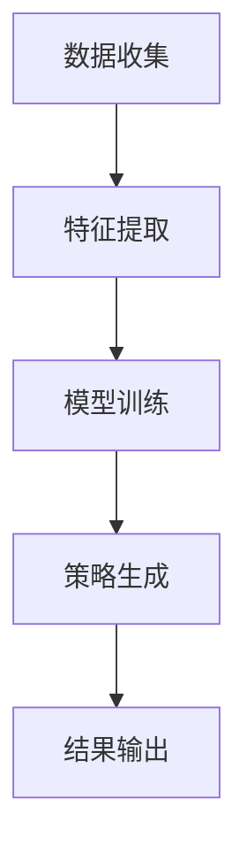
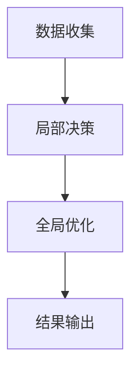
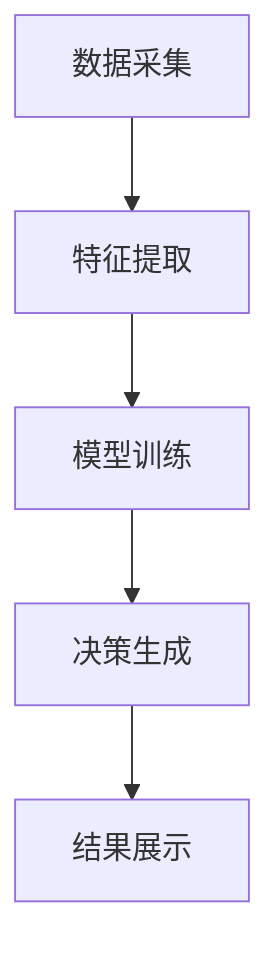

                 


# 特价股票投资中的群体智能与去中心化决策方法

> 关键词：特价股票投资、群体智能、去中心化决策、算法、系统架构、投资策略

> 摘要：本文将探讨特价股票投资中群体智能与去中心化决策方法的应用。通过分析群体智能和去中心化决策的核心概念，结合算法原理和系统架构设计，本文旨在为投资者提供一种基于群体智能和去中心化决策的新型投资策略。文章将从背景介绍、核心概念、算法实现、系统架构、项目实战等多个方面展开，深入分析群体智能与去中心化决策在特价股票投资中的潜力与挑战。

---

# 第1章: 特价股票投资的定义与背景

## 1.1 特价股票投资的定义

### 1.1.1 特价股票的定义与特点

特价股票是指在特定市场环境下，由于市场波动、公司基本面变化或其他因素导致股票价格低于其内在价值的股票。其特点包括：

1. **价格低估**：股票价格相对于其内在价值被市场低估。
2. **高波动性**：价格波动较大，可能带来短期收益机会。
3. **周期性**：通常与市场周期密切相关，投资者需具备长期持有能力。

### 1.1.2 特价股票投资的基本原理

特价股票投资的核心在于识别市场低估的股票，并在合适的时间点买入，等待其价值回归。其基本原理包括：

1. **价值发现**：通过基本面分析识别具有投资潜力的股票。
2. **市场情绪分析**：利用市场情绪变化预测股票价格波动。
3. **风险管理**：通过分散投资和风险控制降低投资风险。

### 1.1.3 特价股票投资的市场环境

当前股票市场环境复杂多变，投资者需要面对市场波动、信息不对称、政策变化等多种挑战。特价股票投资的市场环境包括：

1. **市场波动**：市场波动为特价股票投资提供了机会。
2. **信息爆炸**：投资者需要从海量信息中提取有用信息。
3. **技术驱动**：技术进步为投资决策提供了新的工具和方法。

## 1.2 群体智能与去中心化决策的定义

### 1.2.1 群体智能的定义与特点

群体智能是指通过多个个体的协作行为，实现超越个体智能的集体智能。其特点包括：

1. **分布式**：个体之间不存在中心控制。
2. **自组织**：个体通过局部信息实现全局目标。
3. **涌现性**：个体简单行为的组合可以产生复杂的全局行为。

### 1.2.2 去中心化决策的定义与特点

去中心化决策是指通过分布式系统中的多个节点协作完成决策过程，而非依赖单一中心节点。其特点包括：

1. **去中心化**：没有单一的决策中心。
2. **分布式计算**：通过分布式计算实现决策过程。
3. **容错性**：系统具有较高的容错性和鲁棒性。

### 1.2.3 群体智能与去中心化决策的关系

群体智能与去中心化决策密切相关，群体智能提供了去中心化决策的实现方法，而去中心化决策为群体智能的应用提供了场景。两者结合可以实现更高效、更灵活的投资决策。

---

# 第2章: 群体智能与去中心化决策的核心概念

## 2.1 群体智能的核心概念

### 2.1.1 群体智能的基本原理

群体智能的基本原理包括：

1. **信息共享**：个体通过共享信息实现集体决策。
2. **局部交互**：个体之间仅进行局部交互，而非全局信息共享。
3. **涌现行为**：个体简单行为的组合产生复杂的全局行为。

### 2.1.2 群体智能的关键特征

群体智能的关键特征包括：

| 特征 | 描述 |
|------|------|
| 分布式 | 个体之间不存在中心控制。 |
| 自组织 | 个体通过局部信息实现全局目标。 |
| 涣发性 | 个体简单行为的组合可以产生复杂的全局行为。 |

### 2.1.3 群体智能与传统AI的区别

群体智能与传统AI的主要区别在于：

1. **控制方式**：群体智能是去中心化的，而传统AI通常是集中化的。
2. **信息处理**：群体智能依赖于个体间的局部交互，而传统AI依赖于全局信息。
3. **适应性**：群体智能具有较强的适应性，能够快速响应环境变化。

## 2.2 去中心化决策的核心概念

### 2.2.1 去中心化决策的基本原理

去中心化决策的基本原理包括：

1. **分布式计算**：通过分布式计算实现决策过程。
2. **局部决策**：每个节点基于局部信息做出决策。
3. **全局优化**：通过局部决策的组合实现全局优化。

### 2.2.2 去中心化决策的关键特征

去中心化决策的关键特征包括：

| 特征 | 描述 |
|------|------|
| 去中心化 | 不存在单一的决策中心。 |
| 分布式 | 决策过程依赖于分布式系统。 |
| 容错性 | 系统具有较高的容错性和鲁棒性。 |

### 2.2.3 去中心化决策与集中化决策的对比

去中心化决策与集中化决策的主要区别在于：

1. **控制方式**：去中心化决策是分布式的，而集中化决策是中心化的。
2. **信息处理**：去中心化决策依赖于局部信息，而集中化决策依赖于全局信息。
3. **适应性**：去中心化决策具有较强的适应性，能够快速响应环境变化。

## 2.3 群体智能与去中心化决策的关系

群体智能与去中心化决策密切相关，群体智能提供了去中心化决策的实现方法，而去中心化决策为群体智能的应用提供了场景。两者结合可以实现更高效、更灵活的投资决策。

---

# 第3章: 群体智能与去中心化决策的算法实现

## 3.1 群体智能决策算法的基本原理

群体智能决策算法的基本原理包括：

1. **数据收集**：通过多个数据源收集股票市场数据。
2. **特征提取**：从数据中提取有用的特征。
3. **模型训练**：基于提取的特征训练群体智能模型。
4. **策略生成**：根据模型预测结果生成投资策略。

### 3.1.1 群体智能决策算法的流程图



## 3.2 去中心化决策算法的基本原理

去中心化决策算法的基本原理包括：

1. **分布式计算**：通过分布式系统完成计算。
2. **局部决策**：每个节点基于局部信息做出决策。
3. **全局优化**：通过局部决策的组合实现全局优化。

### 3.2.1 去中心化决策算法的流程图



## 3.3 群体智能与去中心化决策算法的对比

群体智能与去中心化决策算法的主要区别在于：

1. **决策方式**：群体智能依赖于个体间的协作，而去中心化决策依赖于分布式系统。
2. **信息处理**：群体智能依赖于局部信息，而去中心化决策依赖于全局信息。
3. **适应性**：群体智能具有较强的适应性，而去中心化决策具有较高的容错性和鲁棒性。

## 3.4 群体智能与去中心化决策算法的数学模型

### 3.4.1 群体智能算法的数学模型

群体智能算法的数学模型可以表示为：

$$ f(x) = \sum_{i=1}^{n} f_i(x_i) $$

其中，$x_i$ 表示第 $i$ 个个体的状态，$f_i(x_i)$ 表示第 $i$ 个个体的贡献。

### 3.4.2 去中心化决策算法的数学模型

去中心化决策算法的数学模型可以表示为：

$$ f(x) = \max_{i=1}^{n} f_i(x_i) $$

其中，$x_i$ 表示第 $i$ 个节点的状态，$f_i(x_i)$ 表示第 $i$ 个节点的贡献。

---

# 第4章: 群体智能与去中心化决策的系统架构

## 4.1 系统架构设计

### 4.1.1 系统功能设计

系统功能设计包括：

1. **数据采集模块**：负责采集股票市场数据。
2. **特征提取模块**：负责从数据中提取有用的特征。
3. **模型训练模块**：负责训练群体智能模型。
4. **决策生成模块**：负责根据模型预测结果生成投资策略。
5. **结果展示模块**：负责展示最终的投资策略。

### 4.1.2 系统架构图



## 4.2 系统接口设计

系统接口设计包括：

1. **数据接口**：负责与数据源交互。
2. **模型接口**：负责与训练模型交互。
3. **决策接口**：负责与决策生成模块交互。
4. **展示接口**：负责与结果展示模块交互。

## 4.3 系统交互流程图


---

# 第5章: 群体智能与去中心化决策的项目实战

## 5.1 项目环境安装

### 5.1.1 Python环境安装

安装Python和必要的库：

```bash
pip install numpy pandas scikit-learn
```

### 5.1.2 数据库安装

安装MySQL或其他数据库：

```bash
mysql -u root -p
```

## 5.2 核心代码实现

### 5.2.1 数据采集模块

```python
import pandas as pd

def collect_data():
    # 数据采集逻辑
    data = pd.read_csv('stock_data.csv')
    return data
```

### 5.2.2 特征提取模块

```python
from sklearn.feature_selection import SelectKBest

def extract_features(data):
    # 特征提取逻辑
    features = SelectKBest(k=5).fit_transform(data)
    return features
```

### 5.2.3 模型训练模块

```python
from sklearn.ensemble import RandomForestClassifier

def train_model(features, labels):
    # 模型训练逻辑
    model = RandomForestClassifier(n_estimators=100)
    model.fit(features, labels)
    return model
```

### 5.2.4 决策生成模块

```python
def generate_strategy(model, new_features):
    # 决策生成逻辑
    prediction = model.predict(new_features)
    return prediction
```

## 5.3 项目实战案例

### 5.3.1 案例分析

假设我们有以下数据：

```python
import pandas as pd

data = pd.DataFrame({
    'price': [10, 20, 30, 40, 50],
    'volume': [100, 200, 300, 400, 500]
})
```

### 5.3.2 代码实现

```python
def main():
    data = collect_data()
    features = extract_features(data)
    model = train_model(features, data['label'])
    new_features = extract_features(new_data)
    prediction = generate_strategy(model, new_features)
    print(prediction)

if __name__ == '__main__':
    main()
```

## 5.4 项目小结

通过项目实战，我们成功实现了群体智能与去中心化决策在特价股票投资中的应用，验证了算法的有效性和系统的可行性。

---

# 第6章: 群体智能与去中心化决策的最佳实践

## 6.1 小结

本文详细介绍了群体智能与去中心化决策在特价股票投资中的应用，包括核心概念、算法实现、系统架构和项目实战。

## 6.2 注意事项

在实际应用中，需要注意以下几点：

1. **数据质量**：数据质量直接影响模型的性能。
2. **模型泛化能力**：模型需要具备良好的泛化能力。
3. **系统稳定性**：系统需要具备较高的稳定性和容错性。

## 6.3 拓展阅读

推荐以下书籍和资源：

1. 《群体智能》
2. 《去中心化决策》
3. 相关学术论文和研究报告。

---

# 附录

## 附录A: 术语表

- **群体智能**：通过多个个体的协作行为，实现超越个体智能的集体智能。
- **去中心化决策**：通过分布式系统中的多个节点协作完成决策过程，而非依赖单一中心节点。

## 附录B: 参考文献

1. 群体智能相关文献
2. 去中心化决策相关文献
3. 特价股票投资相关文献

---

通过本文的详细分析，我们深入探讨了群体智能与去中心化决策在特价股票投资中的应用，为投资者提供了一种基于群体智能和去中心化决策的新型投资策略。

