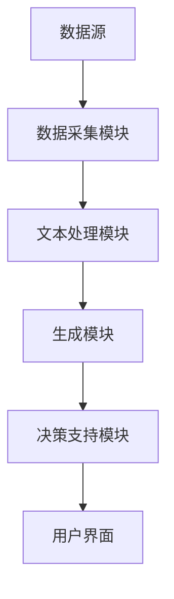

                 


# 特价股票投资中的自然语言生成辅助决策系统

> 关键词：自然语言生成，股票投资，决策系统，文本生成，金融分析

> 摘要：本文探讨了自然语言生成技术在特价股票投资中的应用，详细介绍了系统的设计与实现，包括核心算法、数学模型、系统架构以及项目实战案例。通过本篇文章，读者将深入了解如何利用自然语言生成技术辅助股票投资决策，提升投资效率与准确性。

---

## 第一部分: 特价股票投资中的自然语言生成辅助决策系统概述

### 第1章: 特价股票投资的背景与挑战

#### 1.1 特价股票投资的背景

在现代金融市场中，股票投资已成为个人和机构投资者的主要财富增值手段之一。然而，股票市场的波动性和复杂性使得投资决策变得极具挑战性。特价股票（Specialty Stocks）通常指那些具有特定行业属性、市场特性或投资策略的股票，例如低价股、成长股或周期性股票。投资者在面对海量信息和复杂市场环境时，需要借助先进的技术手段来提高决策效率和准确性。

**关键术语解释：**

- **特价股票**：指具有特定投资策略或市场特性的股票，如低价股、成长股等。
- **投资决策**：投资者基于市场分析和信息判断，做出买入、卖出或持有某只股票的决定。
- **自然语言生成**：一种人工智能技术，能够自动生成符合人类语言表达的文本。

**问题背景：**

投资者在面对大量非结构化数据（如新闻、公告、社交媒体等）时，难以快速提取关键信息并转化为决策依据。传统的数据分析方法难以处理文本数据的复杂性，因此需要借助自然语言生成技术来辅助决策。

**问题解决：**

通过自然语言生成技术，系统能够自动分析文本数据，生成简明扼要的投资分析报告，帮助投资者快速获取关键信息并做出决策。

---

### 第2章: 自然语言生成辅助决策系统的概念与框架

#### 2.1 自然语言生成辅助决策系统的定义

自然语言生成辅助决策系统是一种结合自然语言处理和机器学习技术的智能系统，能够根据输入的文本数据生成符合人类语言习惯的分析报告、市场评论或投资建议，从而辅助投资者做出更明智的决策。

**核心概念：**

- **自然语言处理（NLP）**：涉及文本的理解、分析和生成，是自然语言生成的基础。
- **生成式AI**：基于深度学习的模型，能够生成与人类语言相似的文本。
- **投资决策支持**：通过生成文本信息，为投资者提供决策依据。

**框架设计：**

- **数据输入**：包括新闻、公告、社交媒体等文本数据。
- **模型训练**：使用生成式模型对数据进行训练，生成符合投资主题的文本。
- **决策输出**：系统生成的文本作为决策依据，帮助投资者做出投资决策。

---

### 第3章: 系统的核心算法与数学模型

#### 3.1 自然语言生成算法的选择

在自然语言生成辅助决策系统中，选择合适的生成式模型至关重要。目前，主流的生成模型包括：

1. **基于规则的生成模型**：通过预定义的规则生成文本，适用于简单场景。
2. **统计机器学习模型**：基于概率统计方法，如马尔可夫链。
3. **深度学习模型**：如循环神经网络（RNN）、变体自注意力机制（Transformer）。

**模型选择依据：**

- **训练数据规模**：深度学习模型需要大量数据，适合大数据场景。
- **生成效果**：Transformer模型在文本生成任务中表现优异。
- **计算资源**：模型复杂度与计算资源需求成正比。

**算法实现步骤：**

1. **数据预处理**：清洗、分词、去除停用词。
2. **模型训练**：使用生成式模型训练生成器。
3. **生成文本**：根据输入条件生成目标文本。

**代码示例：**

```python
import tensorflow as tf
from tensorflow.keras import layers

# 定义生成器模型
def build_generator(vocab_size, embedding_dim, hidden_dim):
    model = tf.keras.Sequential()
    model.add(layers.Input(shape=(None,)))
    model.add(layers.Embedding(vocab_size, embedding_dim))
    model.add(layers.GRU(hidden_dim, return_sequences=True))
    model.add(layers.Dense(vocab_size, activation='softmax'))
    return model
```

---

### 第4章: 系统的架构设计与实现

#### 4.1 系统架构设计

**模块划分：**

- **数据采集模块**：从多种来源获取文本数据，如新闻、公告。
- **文本处理模块**：清洗、分词、情感分析。
- **生成模块**：使用生成式模型生成分析文本。
- **决策支持模块**：根据生成文本提供投资建议。

**系统架构图：**



---

### 第5章: 项目实战与案例分析

#### 5.1 环境搭建与数据准备

**环境安装：**

- 安装Python、TensorFlow、Keras等工具。
- 配置GPU加速（如NVIDIA GPU）。

**数据准备：**

- 收集相关股票新闻、公告文本。
- 数据清洗与标注。

---

#### 5.2 系统核心实现

**生成模型实现：**

```python
import tensorflow as tf
from tensorflow.keras import layers

# 定义生成器模型
def build_generator(vocab_size, embedding_dim, hidden_dim):
    model = tf.keras.Sequential()
    model.add(layers.Input(shape=(None,)))
    model.add(layers.Embedding(vocab_size, embedding_dim))
    model.add(layers.GRU(hidden_dim, return_sequences=True))
    model.add(layers.Dense(vocab_size, activation='softmax'))
    return model
```

**训练过程：**

```python
# 训练生成器
def train_generator(generator, batch_size, epochs):
    for epoch in range(epochs):
        for _ in range(len(train_data) // batch_size):
            x = train_data[_batch]
            y = train_labels[_batch]
            loss = generator.train_on_batch(x, y)
            print(f"Epoch {epoch}, Loss: {loss}")
```

---

### 第6章: 最佳实践与总结

**小结：**

自然语言生成辅助决策系统能够有效提高股票投资的效率和准确性，帮助投资者快速获取关键信息。

**注意事项：**

- 数据质量对生成效果影响重大，需确保数据清洗和标注的准确性。
- 模型调优需要结合实际应用场景，不断优化参数和结构。

**扩展阅读：**

- 深入学习自然语言生成技术，探索更多应用场景。
- 关注金融市场动态，了解最新投资策略和工具。

---

通过以上步骤，我们详细介绍了特价股票投资中的自然语言生成辅助决策系统的实现过程，从背景到算法，再到系统设计和项目实战，为读者提供了全面的指导和深入的分析。希望这篇文章能够帮助您更好地理解如何利用自然语言生成技术提升股票投资决策的效率与准确性。

