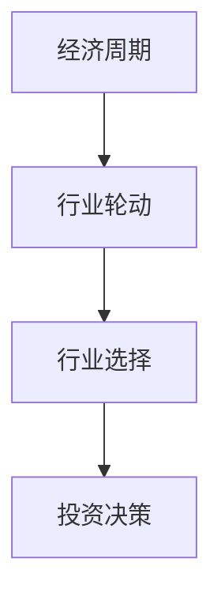
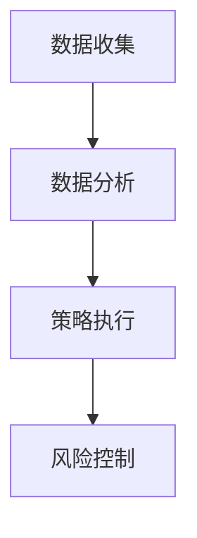

                 


### 文章标题：特价股票投资中的行业轮动策略

#### 关键词：特价股票、行业轮动、投资策略、技术分析、量化投资

#### 摘要：
本文深入探讨了特价股票投资中的行业轮动策略，从基础概念到高级算法，结合实际案例和系统架构设计，全面解析如何通过行业轮动策略在特价股票投资中获取超额收益。文章首先介绍了特价股票和行业轮动的基本概念，然后分析了市场周期对行业轮动的影响，详细讲解了行业轮动策略的核心要素和具体实施方法。接着，通过技术分析和量化模型，展示了如何利用数学公式和算法优化投资决策。最后，结合系统架构设计和项目实战，提供了完整的投资系统实现方案，并总结了最佳实践和注意事项。

---

### 第一部分：特价股票投资中的行业轮动策略基础

#### 第1章：特价股票投资的背景与概念

##### 1.1 特价股票的定义与特点

###### 1.1.1 特价股票的定义
特价股票是指价格远低于其内在价值的股票，通常具有较高的投资潜力。这类股票可能因市场波动、行业周期或公司暂时困境而被低估。

###### 1.1.2 特价股票的特点
- **低估值**：市盈率、市净率等指标远低于行业平均水平。
- **高潜力**：公司基本面良好，行业前景广阔。
- **波动性**：价格波动较大，短期内可能被市场忽视。

###### 1.1.3 特价股票与普通股票的区别
| 属性         | 特价股票                     | 普通股票                     |
|--------------|------------------------------|------------------------------|
| 估值         | 低于市场平均水平             | 接近或高于市场平均水平       |
| 波动性       | 高                          | 中或低                      |
| 投资风险     | 较高                        | 较低                        |
| 投资回报     | 较高                        | 中或低                      |

##### 1.2 行业轮动策略的定义与原理

###### 1.2.1 行业轮动的定义
行业轮动策略是指根据市场周期和行业基本面的变化，动态调整投资组合中各行业权重的策略。

###### 1.2.2 行业轮动的原理
行业轮动的核心在于识别行业周期性变化，通过买入处于上升周期的行业，卖出处于下降周期的行业，从而实现超额收益。

###### 1.2.3 行业轮动与市场周期的关系
市场周期对行业轮动的影响可以通过以下关系图表示：



---

#### 第2章：市场周期与行业轮动的关系

##### 2.1 市场周期的定义与分类

###### 2.1.1 市场周期的定义
市场周期是指经济活动的波动性变化，通常包括复苏、扩张、衰退和萧条四个阶段。

##### 2.1.2 不同市场周期对行业轮动的影响
| 市场阶段         | 适合投资的行业               |
|------------------|----------------------------|
| 萧条             | 周期性行业（如能源、材料）    |
| 复苏             | 周期性行业                   |
| 扩张             | 非周期性行业（如科技、消费）|
| 衰退             | 非周期性行业                 |

##### 2.2 行业轮动的驱动因素

###### 2.2.1 经济周期对行业轮动的影响
经济周期的变化直接影响行业景气度。例如，在经济衰退期间，能源行业的需求可能下降，而科技行业的需求可能上升。

###### 2.2.2 政策变化对行业轮动的影响
政策变化（如行业补贴、税收优惠）会影响行业景气度，从而影响行业轮动策略。

###### 2.2.3 行业自身发展对轮动的影响
行业内部的技术进步、竞争格局变化等也会影响行业轮动。

---

### 第二部分：特价股票投资中的行业轮动策略分析

#### 第3章：特价股票投资的核心概念与策略

##### 3.1 特价股票投资的基本原理

###### 3.1.1 特价股票投资的逻辑
特价股票投资的核心逻辑在于“价值发现”。通过识别被市场低估的股票，投资者可以在股价回升时获得收益。

##### 3.1.2 特价股票投资的误区
- 过度关注低价：价格过低可能意味着公司基本面差，而非暂时被低估。
- 忽视行业周期：忽视行业周期可能导致投资失败。

##### 3.1.3 特价股票投资的长期性
投资特价股票需要耐心，股价回升通常需要时间。

##### 3.2 行业轮动策略的核心要素

###### 3.2.1 行业选择标准
- **行业景气度**：选择处于上升周期的行业。
- **行业估值**：选择估值低于行业平均水平的行业。
- **行业前景**：选择具有广阔市场前景的行业。

###### 3.2.2 股票筛选方法
- **市盈率（PE）**：选择PE低于行业平均水平的股票。
- **市净率（PB）**：选择PB低于行业平均水平的股票。
- **市值**：选择中等市值股票，兼顾成长性和流动性。

###### 3.2.3 投资组合的构建
- **分散投资**：避免集中投资单一行业或股票。
- **定期调整**：根据市场变化和行业周期，定期调整投资组合。

---

#### 第4章：特价股票投资的行业分析方法

##### 4.1 行业分析的基本步骤

###### 4.1.1 行业定位
确定行业在经济周期中的位置，判断行业景气度。

###### 4.1.2 行业比较
将目标行业与同类行业进行比较，找出具有竞争优势的行业。

###### 4.1.3 行业前景预测
基于行业基本面和技术分析，预测行业未来的发展趋势。

##### 4.2 行业轮动的指标与工具

###### 4.2.1 行业估值指标
- **市盈率（PE）**：衡量行业估值水平。
- **市净率（PB）**：衡量行业估值水平。

###### 4.2.2 行业趋势指标
- **行业指数**：跟踪行业整体表现。
- **相对强弱指数（RSI）**：衡量行业短期强弱。

###### 4.2.3 行业比较工具
- **行业比较图**：通过图表比较不同行业的估值和表现。

---

#### 第5章：特价股票投资的策略与模型

##### 5.1 行业轮动策略的分类

###### 5.1.1 基于经济周期的轮动策略
根据经济周期变化，选择适合投资的行业。

###### 5.1.2 基于行业基本面的轮动策略
通过分析行业基本面，选择具有竞争优势的行业。

###### 5.1.3 基于技术分析的轮动策略
通过技术指标（如移动平均线、MACD）判断行业轮动时机。

##### 5.2 技术分析与量化模型

###### 5.2.1 移动平均线（MA）
移动平均线是常用的技术分析指标，用于判断股票或行业的买卖时机。

公式：
$$ MA_n = \frac{1}{n} \sum_{i=1}^n P_i $$
其中，\( P_i \) 是第 \( i \) 天的价格，\( n \) 是天数。

###### 5.2.2 相对强弱指数（RSI）
RSI用于衡量股票或行业的强弱程度，范围在0到100之间。

公式：
$$ RSI_n = \frac{100}{1 + \frac{\sum_{i=1}^n P_i}{\sum_{i=1}^n V_i}} $$
其中，\( P_i \) 是第 \( i \) 天的价格变动，\( V_i \) 是第 \( i \) 天的成交量。

---

#### 第6章：系统架构设计与项目实战

##### 6.1 系统架构设计

###### 6.1.1 系统功能设计
- 数据收集模块：收集行业数据和股票数据。
- 数据分析模块：分析行业估值、趋势和相对强弱。
- 策略执行模块：根据分析结果生成投资策略。
- 风险控制模块：监控投资风险，及时调整投资组合。

###### 6.1.2 系统架构图


##### 6.2 项目实战

###### 6.2.1 环境安装
- Python 3.8+
- pandas、numpy、scikit-learn等库。

###### 6.2.2 核心代码实现
```python
import pandas as pd
import numpy as np

# 数据收集
data = pd.read_csv('industry_data.csv')

# 行业估值分析
pe_ratio = data['PE'].mean()
pb_ratio = data['PB'].mean()

# 行业趋势分析
ma_20 = data['Price'].rolling(20).mean()
data['信号'] = np.where(data['Price'] > ma_20, '买入', '卖出')

print(pe_ratio, pb_ratio)
print(data['信号'].value_counts())
```

##### 6.2.3 案例分析
以能源行业为例，分析其在经济衰退期间的投资机会。

##### 6.2.4 项目总结
通过系统化的行业轮动策略，投资者可以在特价股票投资中实现稳定收益。

---

#### 第7章：最佳实践与注意事项

##### 7.1 最佳实践
- 定期复盘，及时调整投资策略。
- 避免过度交易，控制交易成本。
- 结合定性和定量分析，提高投资决策的准确性。

##### 7.2 小结
行业轮动策略是特价股票投资中重要的策略之一，通过科学的分析和系统的实施，投资者可以在市场中获得超额收益。

##### 7.3 注意事项
- 投资有风险，入市需谨慎。
- 避免盲目跟风，结合自身风险承受能力制定投资策略。
- 定期学习和更新投资知识，适应市场变化。

---

#### 第8章：拓展阅读与进一步思考

##### 8.1 拓展阅读
- 《投资学基础》
- 《技术分析实战技巧》
- 《量化投资入门》

##### 8.2 进一步思考
- 如何结合人工智能技术优化行业轮动策略？
- 如何在不同市场环境下调整行业轮动策略？

---

通过以上内容，您可以系统地学习和实践特价股票投资中的行业轮动策略，从基础概念到高级算法，再到实际项目实战，帮助您在投资领域取得更好的收益。

