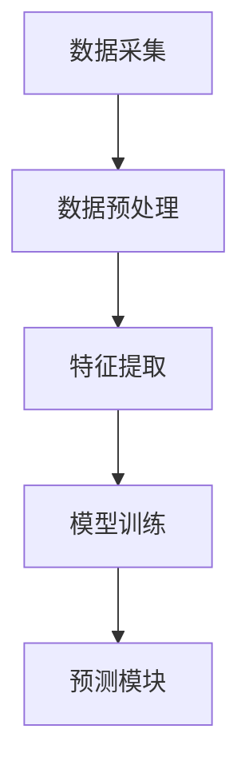

                 


# 特价股票投资中的计算神经科学与行为金融学应用

> 关键词：特价股票，计算神经科学，行为金融学，神经网络，股票预测

> 摘要：本文探讨了计算神经科学与行为金融学在特价股票投资中的应用，结合神经网络算法和投资者心理分析，提出了一种基于神经网络的行为金融学分析系统，并通过实际案例展示了系统的实现与应用。

---

## 第1章: 特价股票投资的背景与概述

### 1.1 特价股票的定义与特点

#### 1.1.1 特价股票的定义
特价股票是指市场价格低于其内在价值的股票。这种股票通常被市场低估，具有较高的投资回报潜力。

#### 1.1.2 特价股票的特点
- 价格低估：市场价格低于内在价值。
- 高回报潜力：由于价格被低估，潜在回报较高。
- 高波动性：市场对低估股票的重新评估可能导致股价波动。

#### 1.1.3 特价股票的投资价值
投资者通过识别和投资于特价股票，可以在市场低估时买入，获得超额收益。

---

### 1.2 计算神经科学与行为金融学的结合

#### 1.2.1 计算神经科学的基本概念
计算神经科学是研究神经系统计算能力的科学，通过数学模型模拟神经网络的运作。

#### 1.2.2 行为金融学的核心理论
行为金融学研究投资者心理和行为对金融市场的影响，认为市场参与者的行为是不完全理性的。

#### 1.2.3 两者的结合与应用
通过计算神经科学的方法，可以模拟和分析投资者的心理行为，帮助识别市场情绪和趋势。

---

## 第2章: 计算神经科学在股票投资中的应用

### 2.1 神经网络的基本结构

#### 2.1.1 神经元模型
神经元通过激活函数对输入信号进行处理和输出。

#### 2.1.2 神经网络的层次结构
神经网络由输入层、隐藏层和输出层组成，每一层负责不同的计算任务。

#### 2.1.3 神经网络的学习机制
神经网络通过调整权重和偏置，学习输入与输出之间的关系。

---

### 2.2 神经网络的训练过程

#### 2.2.1 前向传播
输入信号通过网络逐层传递，最终得到输出结果。

#### 2.2.2 反向传播
通过梯度下降算法，调整权重和偏置，最小化预测误差。

#### 2.2.3 损失函数与优化器
损失函数衡量预测值与真实值的差异，优化器用于调整模型参数。

---

### 2.3 神经网络在股票预测中的应用

#### 2.3.1 时间序列预测
神经网络可以用于预测股票价格的未来走势。

#### 2.3.2 基于神经网络的特征提取
通过神经网络提取股票数据中的深层特征，提高预测准确性。

#### 2.3.3 神经网络的局限性
神经网络需要大量的数据和计算资源，且可能存在过拟合问题。

---

## 第3章: 行为金融学中的神经网络模型

### 3.1 行为金融学的核心理论

#### 3.1.1 心理账户理论
投资者将资金分配到不同的心理账户，影响其投资决策。

#### 3.1.2 框架性思维
投资者在决策过程中受到认知框架的影响，可能导致判断失误。

#### 3.1.3 有限理性理论
投资者在信息处理和决策过程中存在有限理性，可能导致非理性决策。

---

### 3.2 神经网络在行为金融学中的应用

#### 3.2.1 神经网络模拟人类决策过程
通过神经网络模型模拟投资者的决策过程，分析其行为模式。

#### 3.2.2 神经网络预测投资者情绪
通过分析市场数据和投资者行为，预测市场情绪的变化。

#### 3.2.3 神经网络分析市场行为
利用神经网络模型分析市场参与者的互动，预测市场走势。

---

## 第4章: 神经网络算法在股票投资中的实现

### 4.1 神经网络算法的数学模型

#### 4.1.1 神经元的激活函数
$$ f(x) = \sigma(x) = \frac{1}{1 + e^{-x}} $$

#### 4.1.2 神经网络的损失函数
$$ L = -\frac{1}{m} \sum_{i=1}^{m} [y_i \log(a_i) + (1 - y_i) \log(1 - a_i)] $$

#### 4.1.3 优化器的数学模型
$$ \theta = \theta - \eta \frac{\partial L}{\partial \theta} $$

---

### 4.2 神经网络在股票预测中的实现

#### 4.2.1 数据预处理
- 数据清洗：去除缺失值和异常值。
- 数据归一化：将数据标准化，便于模型训练。

---

## 第5章: 神经网络在股票预测中的实现

### 5.1 神经网络模型的实现

#### 5.1.1 模型训练
使用Keras框架训练神经网络模型，进行股票价格预测。

#### 5.1.2 模型评估
通过回测和交叉验证评估模型的预测能力。

---

## 第6章: 系统架构与实现

### 6.1 系统功能设计

#### 6.1.1 数据采集模块
从股票市场获取实时数据。

#### 6.1.2 特征提取模块
提取股票价格、成交量等特征。

#### 6.1.3 模型训练模块
训练神经网络模型，进行股票预测。

#### 6.1.4 预测模块
根据模型预测结果，生成投资建议。

---

### 6.2 系统架构设计

#### 6.2.1 系统架构图


#### 6.2.2 系统接口设计
- 数据接口：获取股票数据。
- 模型接口：调用神经网络模型进行预测。

---

### 6.3 项目实战

#### 6.3.1 环境安装
安装Python、Keras和TensorFlow。

#### 6.3.2 核心实现代码
```python
import numpy as np
from keras.models import Sequential
from keras.layers import Dense

# 数据准备
X = np.random.rand(100, 1)
y = np.random.rand(100, 1)

# 模型定义
model = Sequential()
model.add(Dense(64, activation='relu', input_dim=1))
model.add(Dense(1, activation='sigmoid'))

# 模型编译
model.compile(loss='binary_crossentropy', optimizer='adam', metrics=['accuracy'])

# 模型训练
model.fit(X, y, epochs=100, batch_size=32)
```

---

## 第7章: 小结与展望

### 7.1 本章小结
本文通过计算神经科学和行为金融学的结合，提出了一种基于神经网络的特价股票投资方法。

### 7.2 未来展望
未来可以进一步研究更复杂的神经网络模型，如深度学习和强化学习，提高股票预测的准确性。

---

通过以上思考，我们逐步构建了一个基于计算神经科学和行为金融学的特价股票投资系统，结合理论与实践，为投资者提供了新的思路。

