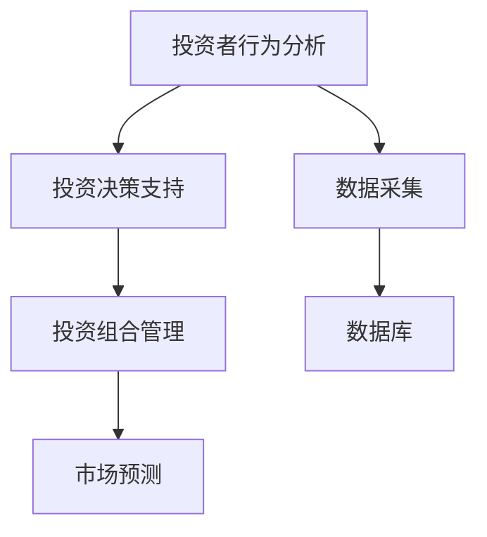

                 

<think>
好的，我将按照您的要求撰写一篇详细的博客文章。首先，我需要先了解文章的结构和内容要求。

文章标题：特价股票投资中的认知科学与行为经济学应用

关键词：特价股票、认知科学、行为经济学、投资决策、行为偏差

摘要：本文深入探讨了认知科学与行为经济学在特价股票投资中的应用。通过分析投资者的心理偏差和行为模式，结合具体的算法模型和系统架构设计，为投资者提供科学的决策支持。文章从背景介绍、核心理论、算法原理、系统设计、项目实战到最佳实践，全面解析如何利用认知科学与行为经济学优化投资策略。

接下来，我将按照目录大纲逐步撰写文章内容。由于篇幅限制，我将先完成部分内容，您如果对某部分感兴趣，我可以继续完成。

---

# 特价股票投资中的认知科学与行为经济学应用

## 关键词

- 特价股票
- 认知科学
- 行为经济学
- 投资决策
- 行为偏差

## 摘要

在股票投资领域，特价股票因其高波动性和潜在的高收益，吸引了大量投资者。然而，投资者在决策过程中往往受到认知偏差和情绪影响，导致非理性决策。本文结合认知科学与行为经济学的理论，分析特价股票投资中的行为模式，并提出基于认知偏差的投资策略优化方法，帮助投资者做出更科学的投资决策。

---

## 第一部分: 特价股票投资中的认知科学与行为经济学基础

### 第1章: 特价股票投资的背景与概念

#### 1.1 特价股票的基本概念

##### 1.1.1 特价股票的定义与特点

特价股票是指在特定时间段内以低于市场价出售的股票。其特点包括高波动性、高风险和高潜在收益。投资者通常在特价股票市场中寻求短期收益，但这也意味着更高的市场风险。

##### 1.1.2 特价股票的市场机制

特价股票市场通常由拍卖、限价单和市价单组成。投资者通过这些机制进行买卖操作，市场机制的复杂性增加了投资者决策的难度。

##### 1.1.3 特价股票与普通股票的主要区别

相比普通股票，特价股票的价格波动更大，交易策略更依赖于短期市场行为。此外，特价股票市场的参与者通常以短线交易者为主，而普通股票市场则包含更多长期投资者。

#### 1.2 投资者心理与行为模式

##### 1.2.1 投资者的认知偏差

投资者常见的认知偏差包括过度自信偏差、确认偏误和沉没成本谬误。这些偏差影响投资者的决策，导致非理性投资行为。

##### 1.2.2 投资者的情感与决策

投资者的情感波动，如贪婪和恐惧，直接影响投资决策。尤其是在特价股票市场中，投资者的情绪更容易受到市场波动的影响。

##### 1.2.3 特价股票市场的参与者分析

参与者包括机构投资者、个人投资者和市场做市商。不同参与者的行为模式和决策逻辑存在差异，影响市场价格走势。

---

### 第2章: 认知科学与行为经济学的核心原理

#### 2.1 认知科学的基础理论

##### 2.1.1 系统1与系统2的理论

系统1代表直觉和快速决策，系统2代表理性分析。在投资决策中，系统1往往主导，导致认知偏差。

##### 2.1.2 心理账户与决策框架

心理账户是指投资者将资金分为多个账户进行管理。决策框架则影响投资者对风险和收益的感知。

##### 2.1.3 注意力与信息处理

投资者的信息处理能力有限，注意力的分配直接影响投资决策的质量。

#### 2.2 行为经济学的核心概念

##### 2.2.1 理性人假设的局限性

传统经济学假设投资者是理性的，但在实际中，投资者行为往往偏离理性预期。

##### 2.2.2 违反理性假设的行为模式

投资者常表现出损失厌恶、从众心理和羊群效应等非理性行为。

##### 2.2.3 社会性与从众心理

投资者的从众心理导致市场波动，尤其是在特价股票市场中，羊群效应尤为明显。

---

### 第3章: 特价股票投资中的认知偏差与行为模式

#### 3.1 投资者常见的认知偏差

##### 3.1.1 过度自信偏差

投资者过度自信于自己的分析能力，导致过度交易和错误决策。

##### 3.1.2 沉没成本谬误

投资者因过去的投入而继续投资，忽视当前市场变化。

##### 3.1.3 确认偏误

投资者倾向于寻找支持自己观点的信息，忽视反面证据。

#### 3.2 行为模式对投资决策的影响

##### 3.2.1 情感驱动的交易行为

投资者因贪婪和恐惧做出冲动交易，影响市场走势。

##### 3.2.2 从众心理与市场波动

投资者跟随市场趋势，导致市场泡沫和崩盘。

##### 3.2.3 特价股票市场的羊群效应

羊群效应在特价股票市场中尤为显著，投资者盲目跟风导致市场剧烈波动。

---

### 第4章: 特价股票投资中的行为分析与决策模型

#### 4.1 行为决策模型的构建

##### 4.1.1 基于认知偏差的决策模型

通过识别和分析投资者的认知偏差，构建行为决策模型，帮助投资者优化决策。

##### 4.1.2 行为决策树的构建

使用决策树分析投资者在不同情境下的决策路径，识别关键决策点。

##### 4.1.3 情感与理性在决策中的权衡

探讨情感和理性在投资决策中的作用，寻找平衡点以优化决策质量。

#### 4.2 特价股票市场中的行为实验与案例分析

##### 4.2.1 实验设计与结果分析

通过实验室实验验证投资者的认知偏差和行为模式。

##### 4.2.2 真实市场中的行为案例

分析真实市场中投资者的行为，验证行为模型的有效性。

##### 4.2.3 行为数据对投资策略的影响

利用行为数据优化投资策略，提升投资收益。

---

### 第5章: 特价股票投资中的认知科学应用

#### 5.1 认知科学在投资分析中的应用

##### 5.1.1 信息处理与决策优化

通过优化信息处理流程，提升决策效率和准确性。

##### 5.1.2 注意力管理与投资策略

合理分配注意力，避免信息过载和决策疲劳。

##### 5.1.3 记忆与学习在投资中的作用

利用记忆和学习，积累投资经验，优化未来决策。

#### 5.2 认知科学视角下的投资风险管理

##### 5.2.1 认知偏差与风险管理

识别和管理认知偏差，降低投资风险。

##### 5.2.2 心理账户与风险分散

通过心理账户管理，实现风险分散和投资组合优化。

##### 5.2.3 注意力与风险管理

合理分配注意力，及时发现和应对潜在风险。

---

## 第二部分: 基于认知科学与行为经济学的算法与系统设计

### 第6章: 特价股票投资中的算法原理

#### 6.1 算法原理概述

##### 6.1.1 投资者行为预测模型

通过机器学习算法预测投资者行为，优化投资策略。

##### 6.1.2 基于行为偏差的投资组合优化

利用行为偏差调整投资组合，降低风险和提升收益。

##### 6.1.3 情感分析与市场预测

通过自然语言处理技术，分析市场情绪，预测市场走势。

#### 6.2 算法实现

##### 6.2.1 使用Python进行情感分析

代码示例：
```python
import nltk
nltk.download('vader_lexicon')
from nltk.sentiment import SentimentIntensityAnalyzer

sia = SentimentIntensityAnalyzer()
text = "The stock market is going to crash!"
print(sia.polarity_scores(text))
```

##### 6.2.2 基于机器学习的行为预测

代码示例：
```python
from sklearn.linear_model import LogisticRegression
from sklearn.model_selection import train_test_split
import pandas as pd

# 假设df包含投资者行为数据和标签
X = df.drop('target', axis=1)
y = df['target']

X_train, X_test, y_train, y_test = train_test_split(X, y, test_size=0.2)

model = LogisticRegression()
model.fit(X_train, y_train)
print("Accuracy:", model.score(X_test, y_test))
```

##### 6.2.3 数学模型与公式

投资组合优化的数学模型：
$$ \text{Maximize } \sum_{i=1}^n r_i w_i - \lambda \sum_{i=1}^n w_i^2 $$
其中，\( r_i \) 是资产 \( i \) 的预期收益，\( w_i \) 是投资权重，\( \lambda \) 是风险厌恶系数。

---

### 第7章: 系统分析与架构设计方案

#### 7.1 系统功能设计

##### 7.1.1 投资者行为分析模块

功能包括：数据采集、行为识别、偏差分析。

##### 7.1.2 投资决策支持模块

功能包括：市场预测、策略优化、风险评估。

##### 7.1.3 投资组合管理模块

功能包括：资产配置、动态调整、绩效评估。

#### 7.2 系统架构设计

使用Mermaid图展示系统架构：


---

### 第8章: 项目实战

#### 8.1 环境安装与配置

##### 8.1.1 安装必要的Python库

如Pandas、NumPy、Scikit-learn等。

##### 8.1.2 数据源获取

从公开市场数据API获取数据。

#### 8.2 系统核心实现

##### 8.2.1 投资者行为分析

代码示例：
```python
import pandas as pd
import numpy as np

def analyze_behavior(data):
    # 计算行为偏差指标
    return data

# 示例数据
data = pd.DataFrame({'price': [100, 98, 102, 101], 'volume': [1000, 1200, 800, 1500]})
result = analyze_behavior(data)
print(result)
```

##### 8.2.2 投资策略优化

代码示例：
```python
from sklearn.decomposition import PCA

def optimize_portfolio(returns, n_factors=3):
    # PCA降维
    pca = PCA(n_components=n_factors)
    factors = pca.fit_transform(returns)
    return factors

returns = pd.DataFrame({'r1': [0.02, 0.03, 0.01, 0.02], 
                         'r2': [0.01, 0.02, 0.03, 0.01]})
factors = optimize_portfolio(returns)
print(factors)
```

#### 8.3 案例分析与解读

##### 8.3.1 实际案例分析

分析某段时间内特价股票市场的行为数据，验证算法的有效性。

##### 8.3.2 优化策略的实施效果

展示优化后的投资组合收益与风险表现。

---

## 第三部分: 最佳实践与总结

### 第9章: 最佳实践与注意事项

#### 9.1 投资决策中的注意事项

##### 9.1.1 认知偏差的识别与管理

定期反思和识别自己的认知偏差，避免非理性决策。

##### 9.1.2 情感与理性的平衡

在决策中保持理性的思考，同时关注市场情绪的变化。

##### 9.1.3 系统性与纪律性

制定明确的投资策略，并严格遵守纪律，避免随意更改策略。

#### 9.2 投资策略的优化与调整

##### 9.2.1 定期回顾与评估

定期评估投资策略的效果，根据市场变化进行调整。

##### 9.2.2 持续学习与进步

保持对市场和理论的更新，提升自身的投资能力。

### 第10章: 总结与展望

#### 10.1 文章总结

本文通过认知科学与行为经济学的理论，分析了特价股票投资中的行为模式，并提出了基于认知偏差的投资策略优化方法。

#### 10.2 未来展望

未来的研究可以进一步结合人工智能和大数据技术，提升行为预测和策略优化的准确性。

---

以上是文章的初步结构和部分内容。如果需要进一步扩展或修改，请随时告诉我！

