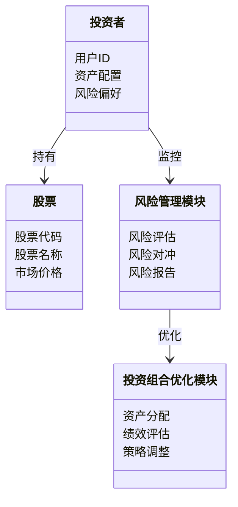
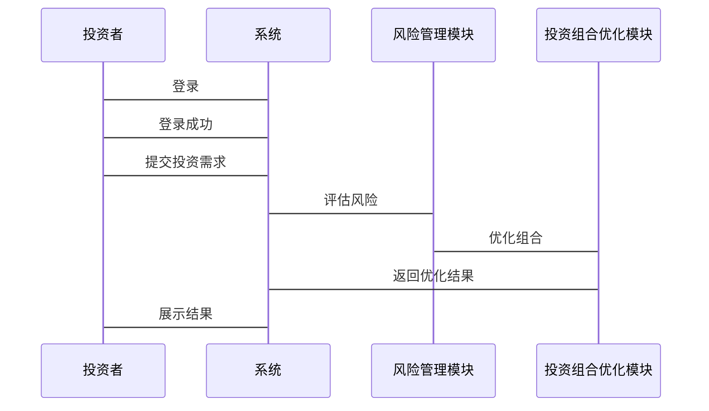

                 


# 特价股票投资中的跨境投资策略与风险管理

## 关键词：
- 特价股票
- 跨境投资
- 风险管理
- 数学模型
- 算法原理
- 系统架构

## 摘要：
本文深入探讨了特价股票投资中的跨境投资策略与风险管理，结合实际案例分析，系统性地介绍了如何通过数学模型和算法原理来优化投资决策，降低风险。文章结构清晰，内容涵盖背景介绍、核心概念、算法实现、系统架构及项目实战，为投资者提供实用的指导。

---

## 第1章：特价股票投资与跨境投资概述

### 1.1 特价股票投资的背景与概念

#### 1.1.1 特价股票的定义与特点
特价股票通常指价格低于市场平均水平的股票，具有高波动性和高风险的特点。其价格波动较大，但潜在收益也较高。

#### 1.1.2 特价股票投资的市场背景
随着全球化进程的加快，投资者开始关注海外市场，寻找低估值的特价股票。这种投资策略在全球经济不景气时尤为受欢迎。

#### 1.1.3 特价股票与传统股票投资的区别
- **价格**：特价股票价格较低，传统股票价格较高。
- **风险**：特价股票风险较高，传统股票风险相对较低。
- **收益**：特价股票潜在收益高，传统股票收益稳定。

### 1.2 跨境投资的定义与特点

#### 1.2.1 跨境投资的定义
跨境投资指投资者在不同国家或地区的金融市场进行投资，包括股票、债券等多种资产。

#### 1.2.2 跨境投资的核心要素
- **市场环境**：各国的经济政策、市场波动。
- **汇率风险**：货币波动对投资收益的影响。
- **法律合规**：各国的法律法规对投资的限制。

### 1.3 特价股票与跨境投资的结合

#### 1.3.1 特价股票在跨境投资中的应用
投资者通过购买海外市场的特价股票，利用价格差异和市场低估获取收益。

#### 1.3.2 跨境投资中特价股票的优势
- **分散风险**：投资不同市场的特价股票，降低市场风险。
- **高收益潜力**：海外市场可能存在未被充分挖掘的低价股票。

#### 1.3.3 跨境投资中特价股票的风险与机遇
- **风险**：汇率波动、政策变化、市场流动性差。
- **机遇**：发现价值被低估的股票，实现超额收益。

---

## 第2章：风险管理核心概念

### 2.1 风险管理的基本原理

#### 2.1.1 风险管理的定义与目标
风险管理是指识别、评估和应对投资中的潜在风险，以实现投资目标。

#### 2.1.2 风险管理的基本原则
- **全面性**：覆盖所有可能的风险来源。
- **及时性**：及时识别和应对风险。
- **可行性**：采用实际可行的管理措施。

### 2.2 跨境投资中的风险类型

#### 2.2.1 市场风险
市场波动导致股票价格下跌的风险。

#### 2.2.2 汇率风险
货币汇率波动对投资收益的影响。

#### 2.2.3 政治风险
政策变化或政治动荡对投资的影响。

#### 2.2.4 法律与合规风险
各国法律变化对投资的影响。

### 2.3 特价股票投资中的风险管理模型

#### 2.3.1 风险评估模型
- **VaR模型**：衡量投资组合的最大可能损失。
- **CVaR模型**：衡量在极端情况下的风险。

#### 2.3.2 风险量化方法
- **标准差**：衡量资产价格波动性。
- **贝塔系数**：衡量资产相对于市场的波动性。

#### 2.3.3 风险对冲策略
- **对冲基金**：利用衍生工具对冲市场风险。
- **分散投资**：通过投资不同资产降低风险。

### 2.4 本章小结
本章介绍了风险管理的基本原理、不同类型风险及其在特价股票投资中的应用，强调了科学的风险管理对投资成功的重要性。

---

## 第3章：跨境投资策略中的数学模型与算法原理

### 3.1 风险评估的数学模型

#### 3.1.1 风险评估公式
$$ \text{风险值} = \sqrt{\text{资产波动性}^2 + \text{市场波动性}^2} $$

#### 3.1.2 风险值计算方法
使用历史数据计算资产的波动性，结合市场波动性进行综合评估。

#### 3.1.3 风险评估的案例分析
通过具体案例展示如何使用VaR模型评估投资组合的风险。

### 3.2 跨境投资中的算法原理

#### 3.2.1 算法原理概述
利用数学模型和统计方法，优化投资组合。

#### 3.2.2 算法实现步骤
1. 收集历史数据。
2. 计算资产的相关性。
3. 构建投资组合。
4. 优化风险和收益。

#### 3.2.3 算法优化与改进
使用现代优化算法（如遗传算法）进一步优化投资组合。

### 3.3 特价股票投资中的数学模型

#### 3.3.1 特价股票定价模型
$$ \text{价格} = \text{基本面价值} \times \text{市场情绪} $$

#### 3.3.2 特价股票收益预测公式
$$ \text{收益} = \text{价格变化} + \text{股息收益} $$

#### 3.3.3 特价股票风险控制模型
$$ \text{风险} = \text{市场风险} + \text{特异风险} $$

### 3.4 本章小结
本章通过数学模型和算法原理，展示了如何量化和控制风险，优化投资策略。

---

## 第4章：跨境投资系统架构与功能设计

### 4.1 问题场景介绍
投资者需要一个系统来监控和管理跨境投资的风险，优化投资组合。

### 4.2 系统功能设计

#### 4.2.1 领域模型（Mermaid类图）


### 4.3 系统架构设计

#### 4.3.1 系统架构图（Mermaid架构图）


### 4.4 系统接口设计
- **输入接口**：用户输入投资目标和风险偏好。
- **输出接口**：生成优化的投资组合和风险报告。

### 4.5 系统交互流程（Mermaid序列图）


### 4.6 本章小结
本章通过系统架构设计，展示了如何实现跨境投资的风险管理，优化投资策略。

---

## 第5章：项目实战

### 5.1 环境安装
安装Python、数据处理库（Pandas、NumPy）、可视化库（Matplotlib、Seaborn）和风险管理库（RiskMetrics）。

### 5.2 核心实现源代码

#### 5.2.1 风险评估代码
```python
import pandas as pd
import numpy as np

def calculate_risk(returns):
    # 计算波动性
    volatility = returns.std()
    # 计算VaR
    var = np.percentile(returns, 5)
    return volatility, var
```

#### 5.2.2 投资组合优化代码
```python
from sklearn import linear_model

def optimize_portfolio(weights, returns, risk_free_rate):
    # 计算夏普比率
    portfolio_return = np.dot(weights, returns.mean())
    portfolio_risk = np.sqrt(np.dot(weights, np.dot(returns.cov(), weights)))
    sharpe_ratio = (portfolio_return - risk_free_rate) / portfolio_risk
    return sharpe_ratio
```

### 5.3 案例分析
分析一个具体的投资组合，展示如何通过代码实现风险评估和投资优化。

### 5.4 本章小结
本章通过实际案例，展示了如何在Python环境中实现跨境投资的风险管理。

---

## 第6章：风险管理模型与策略优化

### 6.1 风险管理模型优化

#### 6.1.1 动态调整模型
根据市场变化，实时调整风险评估参数。

#### 6.1.2 多因子模型
考虑更多影响因素，提高模型的准确性。

### 6.2 策略优化

#### 6.2.1 动态再平衡
定期调整投资组合，保持最优配置。

#### 6.2.2 风险对冲
利用衍生工具对冲市场风险。

### 6.3 本章小结
通过优化风险管理模型和策略，提升投资组合的收益和稳定性。

---

## 第7章：最佳实践与投资策略总结

### 7.1 总结
科学的风险管理和优化的投资策略是实现跨境投资成功的关键。

### 7.2 小结
通过系统的风险管理模型和优化的算法，投资者可以有效控制风险，实现收益最大化。

### 7.3 注意事项
- 定期监控和调整投资组合。
- 注意市场变化和政策调整。

### 7.4 拓展阅读
- 风险管理的经典文献。
- 跨境投资的经典案例分析。

### 7.5 本章小结
本章总结了最佳实践，提供了实际操作中的注意事项和拓展阅读方向。

---

## 附录：Python代码示例

### 附录A：风险评估代码
```python
import pandas as pd
import numpy as np

def calculate_risk(returns):
    # 计算波动性
    volatility = returns.std()
    # 计算VaR
    var = np.percentile(returns, 5)
    return volatility, var

# 示例数据
returns = pd.Series([0.01, -0.02, 0.03, -0.01, 0.02])
volatility, var = calculate_risk(returns)
print(f"波动性: {volatility}")
print(f"VaR: {var}")
```

### 附录B：投资组合优化代码
```python
from sklearn import linear_model

def optimize_portfolio(weights, returns, risk_free_rate):
    # 计算夏普比率
    portfolio_return = np.dot(weights, returns.mean())
    portfolio_risk = np.sqrt(np.dot(weights, np.dot(returns.cov(), weights)))
    sharpe_ratio = (portfolio_return - risk_free_rate) / portfolio_risk
    return sharpe_ratio

# 示例数据
returns = pd.DataFrame({
    '股票A': [0.02, 0.03, -0.01, 0.04],
    '股票B': [0.01, -0.02, 0.03, -0.01]
})
weights = [0.5, 0.5]
risk_free_rate = 0.01
print(f"夏普比率: {optimize_portfolio(weights, returns, risk_free_rate)}")
```

---

## 参考文献
- 风险管理相关书籍和文献。
- 跨境投资的经典案例分析。

---

**本文通过系统性地分析特价股票投资中的跨境投资策略与风险管理，结合数学模型、算法原理和实际案例，为投资者提供了科学的指导和实用的工具，帮助其在复杂多变的市场中实现稳健的投资收益。**

