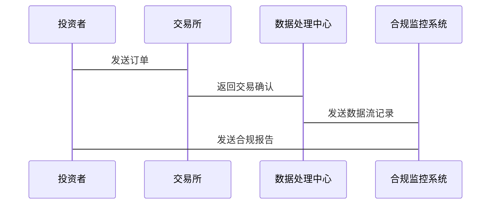

                 


# 特价股票投资中的跨境数据流动与合规策略

> **关键词**：特价股票投资、跨境数据流动、数据隐私、合规策略、股票交易、数据安全

> **摘要**：本文深入探讨了特价股票投资中跨境数据流动的关键问题，并分析了如何在复杂的全球市场环境中实现数据的合规流动。文章从数据流动的背景、机制、合规要求、数学建模和系统架构等多个维度进行分析，提出了基于数学模型的合规策略优化方法，并结合实际案例，为投资者和相关机构提供了实用的合规策略和系统设计建议。

---

## 第1章: 特价股票投资概述

### 1.1 特价股票投资的基本概念
#### 1.1.1 特价股票的定义与特点
特价股票是指价格低于其内在价值的股票，通常被认为是被市场低估的投资标的。其特点包括高性价比、低买高卖的潜在收益、较高的市场波动性和对投资者分析能力的高要求。

#### 1.1.2 特价股票投资的基本原理
特价股票投资的基本原理是通过分析公司的基本面（如盈利能力、财务状况、行业地位）和技术面（如价格走势、成交量）来识别被低估的股票。投资者通过长期持有或短期交易策略来实现收益。

#### 1.1.3 特价股票投资的市场环境
全球化的市场环境使得投资者可以跨越国界进行股票交易。然而，不同国家的市场规则、税收政策和法律法规差异，为跨境数据流动带来了复杂性。

---

### 1.2 股票投资中的跨境数据流动
#### 1.2.1 数据流动的定义与特点
数据流动是指数据从一个地理位置或系统传输到另一个地理位置或系统的过程。在股票投资中，数据流动涉及交易数据、市场数据、公司财报、宏观经济指标等多种类型的数据。

#### 1.2.2 股票投资中的数据流动场景
- 实时交易数据：投资者需要从全球多个交易所获取实时市场数据，进行交易决策。
- 财务数据分析：投资者需要从不同国家获取上市公司的财务数据，进行估值分析。
- 风险评估数据：投资者需要跨国获取宏观经济数据，评估市场风险。

#### 1.2.3 跨境数据流动的挑战与机遇
- **挑战**：数据隐私、传输延迟、法律合规。
- **机遇**：全球化市场提供了更多的投资机会，数据流动的效率提升可以增强投资决策的准确性。

---

### 1.3 合规策略的基本概念
#### 1.3.1 合规的定义与重要性
合规是指在法律、行业标准和道德规范的框架内进行合法、透明的交易。在股票投资中，合规策略是保护投资者和相关机构免受法律风险的核心手段。

#### 1.3.2 股票投资中的合规要求
- 数据隐私：遵守 GDPR（通用数据保护条例）等数据隐私法规。
- 反洗钱：防止通过股票交易进行洗钱活动。
- 市场操纵：防止通过数据流动进行市场操纵。

#### 1.3.3 合规策略的核心要素
- 数据分类：根据敏感性对数据进行分类，确保不同级别的数据得到适当的保护。
- 访问控制：限制数据的访问权限，确保只有授权人员可以接触敏感数据。
- 审计与监控：通过日志记录和实时监控，识别异常数据流动行为。

---

### 1.4 本章小结
本章介绍了特价股票投资的基本概念和跨境数据流动的背景，分析了数据流动在股票投资中的重要性，并提出了合规策略的核心要素。下一章将深入探讨跨境数据流动的机制与影响。

---

## 第2章: 跨境数据流动的机制与影响

### 2.1 数据流动的基本机制
#### 2.1.1 数据流动的路径分析
数据流动的路径包括数据生成、传输、处理和存储。在股票投资中，数据可能从一家交易所传输到投资者的交易系统，再通过数据处理中心进行分析。

#### 2.1.2 数据流动的驱动因素
- 技术驱动：高速网络和云计算技术的进步推动了数据的快速流动。
- 业务驱动：投资者需要实时数据支持决策，推动了数据流动的需求。

#### 2.1.3 数据流动的效率优化
通过优化数据传输路径、使用高效的数据压缩算法和分布式计算技术，可以提升数据流动的效率。

---

### 2.2 股票投资中的数据流动特点
#### 2.2.1 股票数据的实时性要求
实时数据对于股票交易至关重要，任何延迟都可能影响交易决策。

#### 2.2.2 股票数据的敏感性分析
涉及上市公司和投资者的敏感信息，如交易记录、持仓数据等，需要严格保护。

#### 2.2.3 数据流动的跨国性与复杂性
不同国家的法律法规差异使得跨境数据流动更加复杂，需要考虑数据存储地的法律要求。

---

### 2.3 跨境数据流动对股票投资的影响
#### 2.3.1 数据流动对投资决策的影响
实时数据流动能够帮助投资者快速响应市场变化，提高交易效率和收益。

#### 2.3.2 数据流动对市场效率的影响
高效的数据流动能够降低市场的信息不对称，促进价格发现和市场效率。

#### 2.3.3 数据流动对投资风险的影响
数据流动的安全性和合规性直接影响投资风险。数据泄露或违规流动可能导致法律风险和财务损失。

---

### 2.4 本章小结
本章分析了跨境数据流动的机制和对股票投资的影响，强调了数据流动效率和合规性的重要性。下一章将深入探讨股票投资中的合规策略。

---

## 第3章: 股票投资中的合规策略

### 3.1 合规的基本原则
#### 3.1.1 合规的法律依据
遵守 GDPR、《反腐败法》等法律法规，确保数据流动的合法性。

#### 3.1.2 合规的行业标准
遵循金融行业的自律规则，如金融监管机构发布的指引。

#### 3.1.3 合规的道德规范
坚持诚信和透明的原则，避免任何不正当的交易行为。

---

### 3.2 股票投资中的合规要求
#### 3.2.1 数据隐私与保护
- 数据加密：使用 AES 加密算法对敏感数据进行加密。
- 数据访问控制：通过 RBAC（基于角色的访问控制）模型限制数据访问权限。

#### 3.2.2 反洗钱与反腐败
- 交易监控：通过系统监控异常交易行为，防止洗钱。
- 第三方尽职调查：对交易对手进行背景调查，防止腐败行为。

#### 3.2.3 市场操纵与 insider trading 的防范
- 交易行为分析：通过算法识别异常交易模式。
- 内部交易监控：防止公司内部人员利用未公开信息进行交易。

---

### 3.3 合规策略的实施步骤
#### 3.3.1 合规策略的制定
- 制定数据分类标准，明确不同数据的保护级别。
- 建立数据流动的审批流程，确保数据跨境传输的合法性。

#### 3.3.2 合规策略的执行
- 实施数据加密和访问控制技术。
- 建立数据流动的监控系统，实时检测异常行为。

#### 3.3.3 合规策略的监控与优化
- 定期进行合规审计，检查策略的执行情况。
- 根据法律法规的变化，动态调整合规策略。

---

### 3.4 本章小结
本章详细介绍了股票投资中的合规策略，包括数据隐私保护、反洗钱和市场操纵的防范措施。下一章将从数学建模的角度，分析数据流动与合规策略的优化方法。

---

## 第4章: 股票投资中的数据流动与合规策略的数学模型

### 4.1 数据流动的数学建模
#### 4.1.1 数据流动的网络模型
- 数据流动可以看作是一个有向图，节点代表数据源和目的地，边代表数据流动的方向和容量。

#### 4.1.2 数据流动的流量分析
- 使用最大流最小割定理，优化数据流动的路径和容量。

#### 4.1.3 数据流动的路径优化
- 通过 Dijkstra 算法，寻找数据流动的最短路径。

---

### 4.2 合规策略的数学建模
#### 4.2.1 合规风险的量化模型
- 使用概率论方法，量化不同数据流动路径的合规风险。

#### 4.2.2 合规成本的最小化模型
- 使用线性规划，优化合规策略的实施成本。

#### 4.2.3 合规效果的评估模型
- 通过回归分析，评估合规策略对投资收益的影响。

---

### 4.3 数据流动与合规策略的关联分析
#### 4.3.1 数据流动对合规风险的影响
- 数据流动的复杂性增加合规风险，但数据流动的效率提高可以降低合规成本。

#### 4.3.2 合规策略对数据流动的调节作用
- 严格的访问控制策略会降低数据流动的效率，但可以显著降低合规风险。

#### 4.3.3 数据流动与合规策略的协同优化
- 通过协同优化，找到数据流动效率和合规风险的平衡点。

---

### 4.4 本章小结
本章从数学建模的角度，分析了数据流动与合规策略的关系，提出了协同优化的方法。下一章将从系统架构的角度，设计合规策略的实现方案。

---

## 第5章: 股票投资中的数据流动与合规策略的系统架构

### 5.1 系统功能设计
#### 5.1.1 数据采集模块
- 从多个交易所采集实时市场数据和历史数据。

#### 5.1.2 数据处理模块
- 对采集的数据进行清洗、转换和集成，确保数据的准确性和一致性。

#### 5.1.3 数据分析模块
- 使用机器学习算法，对数据进行预测分析，支持投资决策。

#### 5.1.4 合规监控模块
- 实时监控数据流动行为，识别异常交易和合规风险。

---

### 5.2 系统架构设计
#### 5.2.1 分层架构设计
- **数据层**：负责数据的存储和管理。
- **业务逻辑层**：负责数据处理和分析。
- **用户界面层**：提供直观的用户界面，支持投资者的决策。

#### 5.2.2 微服务架构设计
- **数据采集服务**：负责从多个数据源采集数据。
- **数据分析服务**：负责数据的处理和分析。
- **合规监控服务**：负责实时监控数据流动行为。

---

### 5.3 系统接口设计
- 数据接口：与交易所和其他数据源对接，确保数据的实时性和准确性。
- 用户接口：提供直观的用户界面，支持投资者的交易和分析需求。

---

### 5.4 系统交互设计
- 使用 Mermaid 序列图描述系统交互流程：


---

### 5.5 本章小结
本章从系统架构的角度，设计了股票投资中的数据流动与合规策略的实现方案。下一章将通过实际案例，展示合规策略的实施效果。

---

## 第6章: 项目实战与案例分析

### 6.1 环境安装
- **操作系统**：建议使用 Linux 或 macOS。
- **开发工具**：安装 PyCharm 或 VS Code。
- **依赖库安装**：安装 Python 的数据处理库（如 Pandas、NumPy）和可视化库（如 Matplotlib）。

---

### 6.2 系统核心实现源代码
```python
# 数据采集模块
import requests
import pandas as pd

def fetch_data(exchange):
    response = requests.get(f'https://api.{exchange}.com/data')
    return pd.DataFrame(response.json())

# 数据处理模块
def process_data(df):
    df['timestamp'] = pd.to_datetime(df['timestamp'])
    df.set_index('timestamp', inplace=True)
    return df

# 数据分析模块
from sklearn import linear_model

def predict_price(df, days=30):
    model = linear_model.LinearRegression()
    model.fit(df.index.values.reshape(-1, 1), df['price'])
    future_days = pd.date_range(df.index[-1], periods=days)
    future_prices = model.predict(future_days.reshape(-1, 1))
    return future_prices

# 合规监控模块
def monitor_data(flow):
    if flow['size'] > 1000:
        print("异常数据流动！")
```

---

### 6.3 实际案例分析
- **案例背景**：某投资者计划通过跨境数据流动进行特价股票投资。
- **案例实施**：
  - 数据采集：从美国和欧洲的交易所获取数据。
  - 数据处理：清洗和整合数据，消除时区差异。
  - 数据分析：使用线性回归模型预测未来30天的价格。
  - 合规监控：实时监控数据流动行为，发现异常后及时预警。

---

### 6.4 项目小结
本章通过实际案例，展示了合规策略在股票投资中的应用。通过代码实现和案例分析，验证了合规策略的有效性和可行性。

---

## 第7章: 总结与展望

### 7.1 本章总结
本文从多个维度分析了特价股票投资中的跨境数据流动与合规策略，提出了基于数学建模和系统架构的优化方法，并通过实际案例验证了策略的有效性。

### 7.2 未来展望
未来的研究方向包括：
- 更高效的跨境数据流动技术。
- 更智能的合规监控算法。
- 更人性化的用户界面设计。

---

## 附录: 相关工具与资源

### 附录 A: 数据源
- 全球主要交易所的 API 接口。
- 第三方数据供应商（如 Bloomberg、FactSet）。

### 附录 B: 开发工具
- Python 开发工具：PyCharm、VS Code。
- 数据可视化工具：Tableau、Power BI。

### 附录 C: 重要法规
- GDPR（通用数据保护条例）。
- 《反腐败法》。
- 《证券法》。

---

### 附录 D: 免责声明
本文内容仅为学术探讨，不构成投资建议。实际投资需谨慎，建议咨询专业机构。

---

**感谢您的耐心阅读！希望本文对您理解特价股票投资中的跨境数据流动与合规策略有所帮助。**

