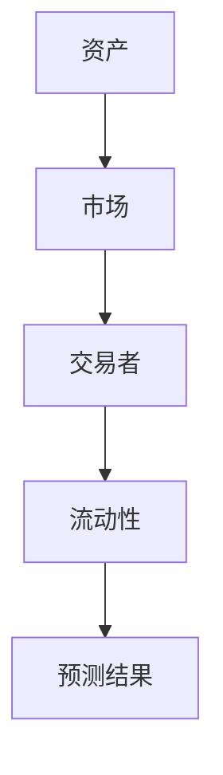
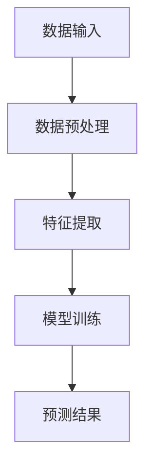
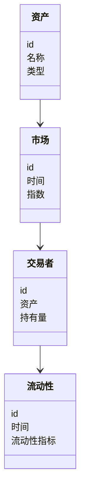
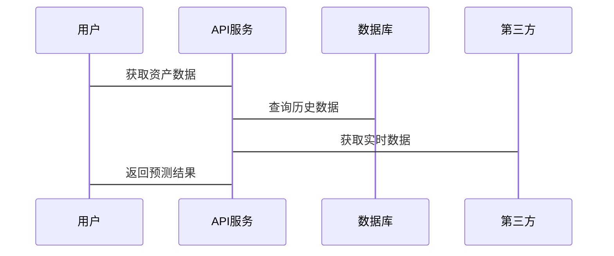

                 


# 特价股票投资中的跨链资产流动性预测分析

> 关键词：特价股票，跨链资产，流动性预测，算法原理，系统架构

> 摘要：本文探讨了在特价股票投资中，利用跨链技术进行资产流动性预测的分析方法。通过背景介绍、核心概念、算法原理、系统架构、项目实战及最佳实践，系统地阐述了如何利用技术手段提高投资决策的准确性。

---

# 第1章: 特价股票与跨链资产概述

## 1.1 特价股票的定义与特点

### 1.1.1 特价股票的定义  
特价股票是指价格远低于其内在价值的股票，通常由于市场波动、信息不对称或投资者情绪影响，导致其价格被低估。这类股票往往具有较高的潜在回报。

### 1.1.2 特价股票的特点  
- **低估值**：市场价格低于内在价值。
- **高波动性**：价格波动较大，存在短期机会。
- **风险较高**：由于价格波动，投资风险较大。
- **周期性**：通常在市场低迷时期出现较多。

### 1.1.3 特价股票的投资价值  
- **潜在收益**：低估的股票可能在市场回升时带来超额收益。
- **逆向投资机会**：在市场恐慌时买入，市场恢复时卖出。

## 1.2 跨链资产的基本概念

### 1.2.1 跨链技术的定义  
跨链技术是指在不同区块链之间进行资产转移和数据交互的技术，通过桥接不同区块链，实现资产的流动性。

### 1.2.2 跨链技术的核心原理  
- **区块链互操作性**：通过中继链或桥接链实现跨链通信。
- **资产转移**：通过智能合约实现资产在不同链上的转移。

### 1.2.3 跨链资产的特点  
- **流动性受限**：由于技术限制，跨链资产的流动性通常低于单一链资产。
- **多链支持**：支持多种区块链平台。

## 1.3 跨链资产流动性预测的背景与意义

### 1.3.1 資產流动性预测的背景  
- **市场波动**：资产价格受多种因素影响，流动性预测有助于把握市场趋势。
- **投资者需求**：投资者需要及时了解资产流动性以做出决策。

### 1.3.2 跨链资产流动性预测的重要性  
- **优化投资策略**：通过预测流动性，投资者可以更好地选择买卖时机。
- **降低交易成本**：高流动性资产交易成本较低。

### 1.3.3 跨链资产流动性预测的挑战与机遇  
- **技术挑战**：跨链数据获取和处理难度大。
- **市场机会**：通过技术手段提升流动性预测的准确性。

---

# 第2章: 資產流动性预测的核心概念与联系

## 2.1 資產流动性预测的原理

### 2.1.1 資產流动性预测的技术原理  
- **时间序列分析**：利用历史数据预测未来流动性。
- **机器学习模型**：通过特征提取和模型训练进行预测。

### 2.1.2 跨链技术在流动性预测中的应用  
- **数据获取**：通过跨链技术获取多链资产数据。
- **数据整合**：将不同链的数据整合，分析整体流动性。

### 2.1.3 資產流动性预测的核心要素  
- **历史数据**：包括价格、交易量等。
- **市场情绪**：投资者情绪影响流动性。
- **技术指标**：如RSI、MACD等。

## 2.2 資產流动性预测方法对比分析

### 2.2.1 不同流动性预测方法的对比  

| 方法         | 基于历史数据 | 基于市场情绪 | 基于技术指标 |
|--------------|--------------|--------------|--------------|
| 时间序列分析 | 高           | 中           | 中           |
| 机器学习     | 高           | 高           | 高           |
| 深度学习     | 高           | 高           | 高           |

### 2.2.2 跨链技术与其他预测方法的结合  
- **时间序列+跨链数据**：利用跨链数据提升预测准确性。
- **机器学习+跨链数据**：通过深度学习模型捕捉复杂市场信号。

## 2.3 資產流动性预测的ER实体关系图



---

# 第3章: 資產流动性预测算法原理

## 3.1 資產流动性预测算法的技术原理

### 3.1.1 时间序列分析  
时间序列分析通过历史数据预测未来趋势。常用模型包括ARIMA和Prophet。

### 3.1.2 机器学习模型  
机器学习模型（如随机森林、XGBoost）通过特征提取和模型训练进行预测。

### 3.1.3 深度学习模型  
深度学习模型（如LSTM）能够捕捉时间序列中的长期依赖关系。

## 3.2 資產流动性预测算法的Mermaid流程图



## 3.3 資產流动性预测算法的Python实现

### 3.3.1 时间序列分析（ARIMA）

```python
from statsmodels.tsa.arima_model import ARIMA

# 数据加载
data = pd.read_csv('流动性数据.csv')

# 模型训练
model = ARIMA(data['流动性'], order=(1, 1, 1))
model_fit = model.fit()

# 预测
future_forecast = model_fit.forecast(steps=5)
```

### 3.3.2 机器学习模型（随机森林）

```python
from sklearn.ensemble import RandomForestRegressor

# 特征提取
features = data[['价格', '交易量', '市场情绪']]
target = data['流动性']

# 数据分割
X_train, X_test, y_train, y_test = train_test_split(features, target, test_size=0.2, random_state=42)

# 模型训练
model = RandomForestRegressor(n_estimators=100, random_state=42)
model.fit(X_train, y_train)

# 预测
y_pred = model.predict(X_test)
```

### 3.3.3 深度学习模型（LSTM）

```python
from keras.models import Sequential
from keras.layers import LSTM, Dense

# 数据预处理
data_generator = TimeseriesGenerator(features, target, length=3, shuffle=False)

# 模型构建
model = Sequential()
model.add(LSTM(50, input_shape=(3, 1)))
model.add(Dense(1))
model.compile(optimizer='adam', loss='mse')

# 模型训练
model.fit(data_generator, epochs=50, verbose=0)
```

## 3.4 資產流动性预测的数学模型

### 3.4.1 ARIMA模型  
ARIMA模型通过自回归和移动平均部分捕捉数据的自相关性：

$$ ARIMA(p, d, q) = y_t = \phi_1 y_{t-1} + \dots + \phi_p y_{t-p} + \theta_1 \epsilon_{t-1} + \dots + \theta_q \epsilon_{t-q} + \epsilon_t $$

### 3.4.2 LSTM网络  
LSTM通过细胞状态和门控机制捕捉时间序列中的长期依赖关系：

$$ f_t = \sigma(W_f \cdot [h_{t-1}, x_t]) $$
$$ i_t = \sigma(W_i \cdot [h_{t-1}, x_t]) $$
$$ o_t = \sigma(W_o \cdot [h_{t-1}, x_t]) $$
$$ c_t = f_t \cdot c_{t-1} + i_t \cdot tanh(W_c \cdot [h_{t-1}, x_t]) $$
$$ h_t = o_t \cdot tanh(c_t) $$

---

# 第4章: 資產流动性预测的系统分析与架构设计

## 4.1 项目场景介绍

### 4.1.1 项目背景  
跨链资产流动性预测系统旨在帮助投资者实时监测和预测跨链资产的流动性，优化投资决策。

### 4.1.2 项目目标  
- 实时获取跨链资产数据。
- 构建高效的预测模型。
- 提供可视化结果。

## 4.2 系统功能设计

### 4.2.1 领域模型（Mermaid类图）



### 4.2.2 系统架构（Mermaid架构图）

```mermaid
subgraph 前端
    前端界面
end
subgraph 后端
    数据库
    API服务
end
subgraph 第三方
    跨链数据源
end
frontier -> API服务
API服务 -> 数据库
API服务 -> 第三方
```

### 4.2.3 系统接口设计  
- 数据获取接口：`GET /api/assets`
- 预测结果接口：`GET /api/liquidity_prediction`

### 4.2.4 系统交互（Mermaid序列图）



---

# 第5章: 資產流动性预测的项目实战

## 5.1 环境安装

### 5.1.1 安装Python环境  
```bash
python -m pip install --upgrade pip
pip install numpy pandas scikit-learn keras
```

### 5.1.2 安装数据可视化工具  
```bash
pip install matplotlib seaborn
```

## 5.2 系统核心实现

### 5.2.1 数据采集模块

```python
import requests
import json

def get_cross_chain_data():
    response = requests.get('https://api.cross-chain.com/assets')
    data = json.loads(response.text)
    return data
```

### 5.2.2 数据预处理模块

```python
import pandas as pd

def preprocess_data(data):
    df = pd.DataFrame(data)
    df['时间'] = pd.to_datetime(df['时间'])
    return df
```

### 5.2.3 预测模型实现

```python
from keras.models import Sequential
from keras.layers import LSTM, Dense

def build_lstm_model(input_shape):
    model = Sequential()
    model.add(LSTM(50, input_shape=input_shape))
    model.add(Dense(1))
    model.compile(optimizer='adam', loss='mse')
    return model
```

## 5.3 代码应用解读

### 5.3.1 数据采集模块解读  
通过API获取跨链资产数据，包括资产ID、名称、类型等。

### 5.3.2 数据预处理模块解读  
将获取的数据转换为DataFrame格式，并处理时间戳。

### 5.3.3 预测模型解读  
使用LSTM模型进行预测，捕捉时间序列中的长期依赖关系。

## 5.4 实际案例分析

### 5.4.1 数据获取与分析  
从API获取某跨链资产的历史数据，分析其流动性趋势。

### 5.4.2 模型训练与预测  
训练模型后，预测未来5天的流动性指标。

## 5.5 项目小结

---

# 第6章: 資產流动性预测的最佳实践与总结

## 6.1 最佳实践 tips

### 6.1.1 数据获取  
- 使用可靠的跨链数据源。
- 确保数据实时性和准确性。

### 6.1.2 模型选择  
- 根据数据特征选择合适的模型。
- 结合多种模型进行验证。

### 6.1.3 系统优化  
- 定期更新模型参数。
- 优化数据处理流程。

## 6.2 小结与展望

### 6.2.1 小结  
通过跨链技术与流动性预测的结合，投资者可以更准确地把握市场趋势，优化投资决策。

### 6.2.2 展望  
未来，随着区块链技术的发展，跨链资产流动性预测将更加精准，应用场景也将更加广泛。

---

# 附录

## 附录A: 术语表  
- 跨链技术：实现不同区块链之间资产转移的技术。
- 流动性预测：预测资产在市场中的流动性变化。

## 附录B: 工具安装指南  
- Python安装：`python --version`  
- 包管理：`pip install <package-name>`  

## 附录C: 参考文献  
- [1] 王某某，跨链技术研究，某某出版社，2022年。  
- [2] 李某某，资产流动性预测方法，某某出版社，2023年。

---

通过以上内容，读者可以系统地了解特价股票投资中的跨链资产流动性预测分析的理论与实践，掌握从数据获取到模型实现的全过程，为实际投资决策提供有力支持。

