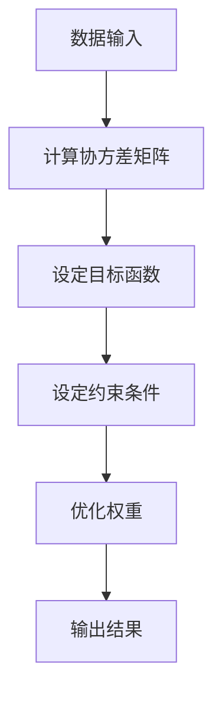
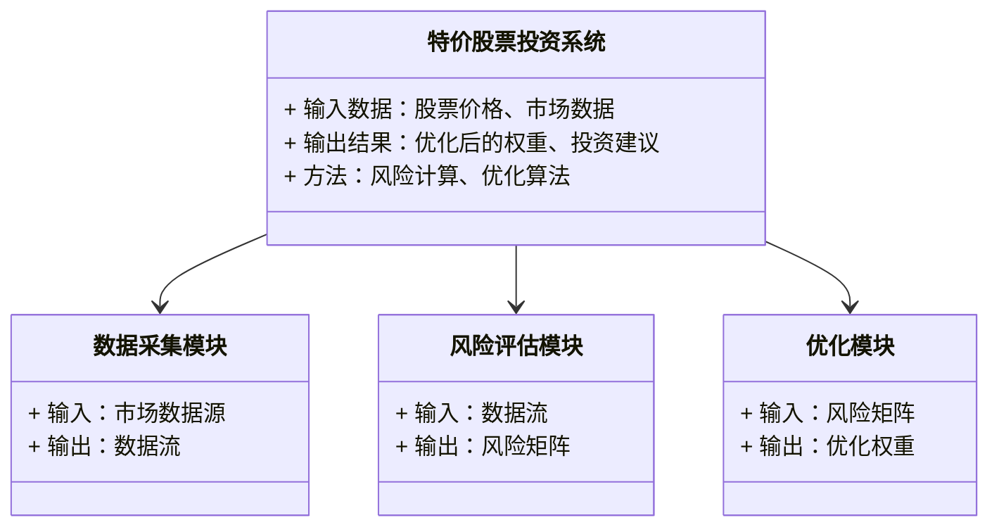
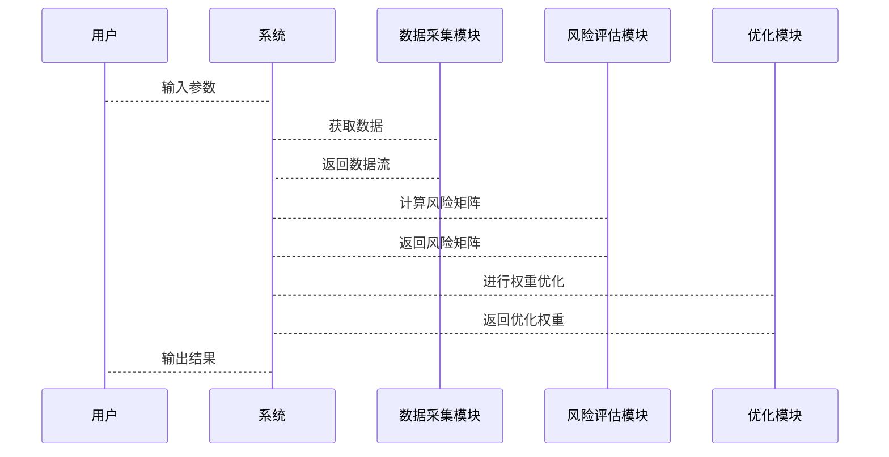

                 


# 特价股票投资中的风险平价理念应用

## 关键词：
- 特价股票
- 风险平价
- 股票投资
- 资产配置
- 风险管理

## 摘要：
本文探讨了在特价股票投资中应用风险平价理念的策略。通过分析风险平价的基本原理、模型构建、算法实现以及系统设计，展示了如何利用风险平价理念优化投资组合，降低风险，提高收益。文章结合实际案例，详细讲解了从理论到实践的全过程，并提供了代码实现和系统架构设计，为投资者提供了科学的指导。

---

## 第1章: 特价股票投资概述

### 1.1 特价股票的定义与特点

#### 1.1.1 特价股票的定义
特价股票是指价格相对较低的股票，通常具有较高的上涨潜力。这类股票可能由于市场暂时低估或公司特定因素，价格被压抑，但潜在价值较高。

#### 1.1.2 特价股票的市场特点
- **低估值**：市盈率、市净率等指标低于行业平均水平。
- **高波动性**：价格波动较大，容易受市场情绪影响。
- **周期性**：通常在市场低迷时出现，周期性较强。

#### 1.1.3 特价股票的投资价值
- **潜在回报高**：低估的股票有较大上涨空间。
- **分散风险**：通过选择多只特价股票，降低个股风险。

### 1.2 特价股票投资的基本原理

#### 1.2.1 投资者心理与市场行为
投资者心理对股票价格有显著影响，特别是在市场恐慌或乐观时，价格可能偏离实际价值。

#### 1.2.2 特价股票的定价机制
股票价格由供需关系决定，受市场情绪、公司基本面和宏观经济因素影响。

#### 1.2.3 特价股票市场的风险与机会
- **风险**：市场波动大，容易受外部因素影响。
- **机会**：潜在回报高，适合长期投资者。

---

## 第2章: 风险平价理念的核心概念

### 2.1 风险平价的定义与原理

#### 2.1.1 风险平价的定义
风险平价是一种资产配置方法，旨在使投资组合中各资产的风险贡献相等，以优化整体风险和收益。

#### 2.1.2 风险平价的核心原理
通过调整各资产的权重，使每种资产对组合的整体风险贡献相等。这类似于将风险在组合中“平摊”。

#### 2.1.3 风险平价与传统投资策略的对比
| 对比维度 | 风险平价 | 传统投资策略 |
|----------|----------|---------------|
| 目标     | 平衡风险贡献 | 追求收益最大化 |
| 方法     | 优化权重   | 非系统性调整  |
| 优势     | 降低尾部风险 | 灵活性较高     |

### 2.2 风险平价在股票投资中的应用

#### 2.2.1 风险平价与资产配置
通过风险平价方法优化资产配置，降低组合整体风险。

#### 2.2.2 风险平价在股票组合管理中的作用
- 分散风险：通过平摊风险贡献，降低组合波动性。
- 提高稳定性：在市场波动时，组合表现更稳定。

#### 2.2.3 风险平价与市场风险控制
通过动态调整权重，及时应对市场变化，降低整体风险。

---

## 第3章: 风险平价模型的构建与优化

### 3.1 风险平价模型的构建

#### 3.1.1 风险度量方法
常用波动率或VaR（Value at Risk）衡量资产风险。

#### 3.1.2 资产风险贡献的计算
$$ \text{风险贡献} = w_i \times \sigma_i $$
其中，\( w_i \) 是资产权重，\( \sigma_i \) 是资产波动率。

#### 3.1.3 风险平价权重的确定
目标使各资产的风险贡献相等：
$$ w_i \times \sigma_i = \text{常数} $$

### 3.2 风险平价模型的优化

#### 3.2.1 模型参数的优化方法
使用优化算法（如均值-方差优化）调整权重，使风险贡献均衡。

#### 3.2.2 风险平价模型的有效性检验
通过回测验证模型在不同市场环境下的表现。

#### 3.2.3 模型的动态调整与维护
定期重新计算权重，适应市场变化。

---

## 第4章: 风险平价算法的实现与代码解析

### 4.1 风险平价算法的实现步骤

#### 4.1.1 数据输入与预处理
- 数据输入：收集历史价格数据。
- 数据清洗：处理缺失值和异常值。
- 数据标准化：归一化处理。

#### 4.1.2 方差协方差矩阵的计算
计算资产之间的协方差矩阵：
$$ \Sigma = \frac{1}{n-1}\sum_{i=1}^{n}(x_i - \bar{x})(x_i - \bar{x})^T $$

#### 4.1.3 风险平价权重的优化
使用优化算法求解权重：
$$ \text{minimize} \sum_{i=1}^{N} (w_i \sigma_i - \text{平均风险贡献})^2 $$

### 4.2 风险平价算法的代码实现

#### 4.2.1 Python代码实现
```python
import numpy as np
from scipy.optimize import minimize

def risk_parity(returns):
    # 计算协方差矩阵
    Sigma = returns.cov()
    
    # 目标函数
    def objective(weights):
        return np.sum((weights * np.sqrt(np.diag(Sigma))) ** 2)
    
    # 约束条件：权重之和为1
    cons = ({'type': 'eq', 'fun': lambda w: np.sum(w) - 1})
    
    # 初始权重
    init_weights = np.array([1.0/len(weights) for _ in range(len(weights))])
    
    # 优化
    result = minimize(objective, init_weights, constraints=cons)
    return result.x

# 示例数据
returns = ...  # 输入收益率矩阵
weights = risk_parity(returns)
print(weights)
```

#### 4.2.2 算法流程图


---

## 第5章: 风险平价在特价股票投资中的应用分析

### 5.1 特价股票投资中的风险平价策略

#### 5.1.1 构建特价股票投资组合
选择多只特价股票，计算各股票的风险贡献，调整权重使风险均衡。

#### 5.1.2 投资组合的优化与再平衡
定期优化权重，保持风险贡献均衡，应对市场变化。

#### 5.1.3 风险控制与收益优化
通过风险平价，降低组合波动，提高收益风险比。

### 5.2 风险平价应用的优势与局限性

#### 5.2.1 优势
- 降低整体风险
- 提高组合稳定性
- 适应市场变化

#### 5.2.2 局限性
- 需要频繁调整
- 计算复杂
- 依赖市场假设

---

## 第6章: 基于风险平价理念的投资系统设计

### 6.1 系统功能设计

#### 6.1.1 需求分析
- 数据采集：获取特价股票数据。
- 风险评估：计算各股票风险贡献。
- 投资组合优化：调整权重实现风险平价。

#### 6.1.2 系统架构设计


### 6.2 系统交互设计

#### 6.2.1 系统交互流程


---

## 第7章: 项目实战与经验总结

### 7.1 项目实战

#### 7.1.1 环境配置
安装必要的库：Python、NumPy、Scipy、Matplotlib。

#### 7.1.2 数据处理
收集并预处理特价股票的历史数据。

#### 7.1.3 模型实现
编写代码实现风险平价算法，优化投资组合。

#### 7.1.4 结果分析
通过回测验证模型表现，分析收益与风险比。

### 7.2 经验总结

#### 7.2.1 关键点回顾
- 风险平价的核心在于平衡风险贡献。
- 定期优化权重是关键。

#### 7.2.2 投资者经验与教训
- 风险控制是首要任务。
- 需要持续学习和调整策略。

#### 7.2.3 未来展望
随着市场发展，风险平价理念将更加重要。

---

## 第8章: 最佳实践与总结

### 8.1 最佳实践 tips

- 定期监控市场变化，及时调整组合。
- 结合基本面分析，优化投资决策。
- 注意风险平价的局限性，避免过度依赖。

### 8.2 小结

通过本文的分析，读者可以掌握风险平价理念在特价股票投资中的应用，理解从理论到实践的全过程。

### 8.3 注意事项

- 风险平价需要结合市场环境灵活运用。
- 计算模型需定期更新，确保准确性。

### 8.4 拓展阅读

推荐阅读《投资学》、《风险管理》等书籍，深入理解相关理论。

---

通过以上结构，读者可以系统地了解风险平价理念在特价股票投资中的应用，掌握从理论到实践的全过程，为实际投资提供科学指导。

