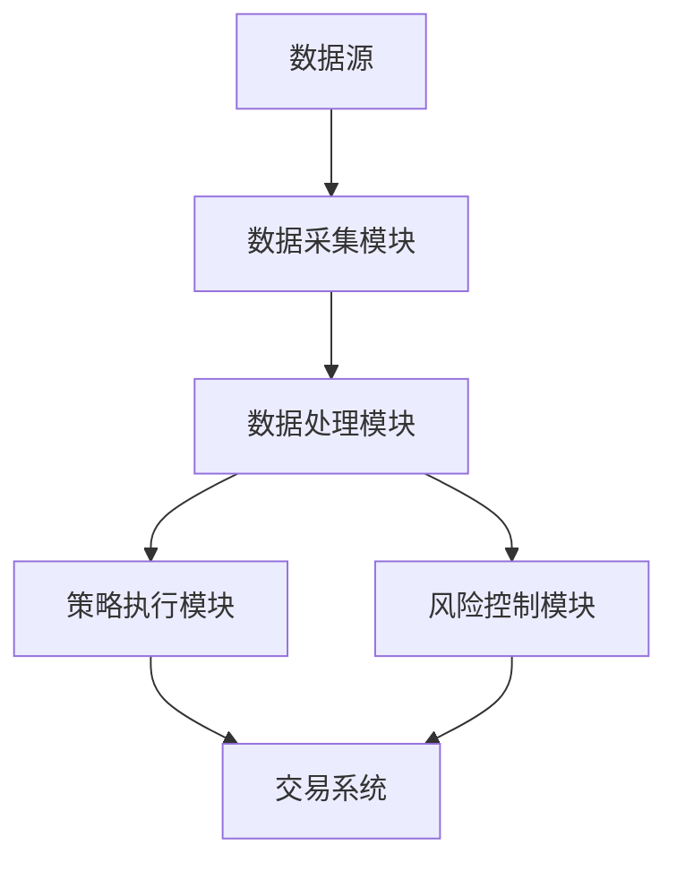
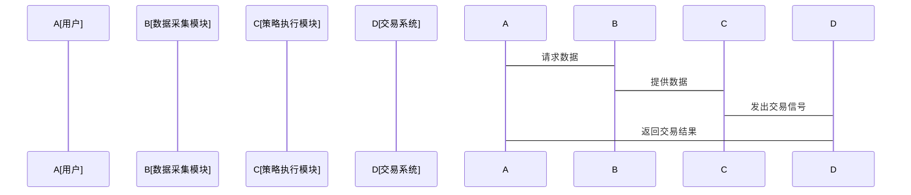

                 


# 特价股票投资中的高频数据分析

> 关键词：高频交易、股票投资、数据分析、算法策略、系统架构

> 摘要：本文深入探讨了高频数据分析在特价股票投资中的应用，从高频交易的背景与定义、数据采集与处理、数据分析与特征提取、高频交易策略与回测分析、系统架构与实现等多个维度展开，结合实际案例和代码实现，全面解析了高频数据分析在特价股票投资中的核心作用和具体应用。文章内容详实，逻辑清晰，旨在为投资者和数据分析从业者提供实用的技术指导和实践参考。

---

# 第1章 高频交易与特价股票投资概述

## 1.1 高频交易的背景与定义

### 1.1.1 高频交易的起源与发展
高频交易（High-Frequency Trading, HFT）起源于20世纪80年代，随着计算机技术的快速发展，交易速度和自动化水平不断提高。高频交易的核心特征是利用算法和计算机技术在极短的时间内完成大量的交易，以捕捉市场中的微小价格波动。

### 1.1.2 高频交易的核心特征
高频交易的特点包括：
1. **高速性**：交易决策和执行都在毫秒级别完成。
2. **自动化**：依赖算法自动执行交易策略。
3. **高频性**：短时间内进行大量的交易。
4. **低延迟**：交易系统需要极低的延迟以确保交易速度。

### 1.1.3 高频交易与传统交易的区别
- **交易频率**：高频交易以秒为单位，传统交易以分钟或小时为单位。
- **决策方式**：高频交易依赖算法，传统交易依赖人工判断。
- **成本**：高频交易成本低，传统交易成本高。

## 1.2 特价股票投资的定义与背景

### 1.2.1 特价股票的定义
特价股票是指价格低于市场公允价值的股票，通常由于市场短期波动、信息不对称或市场参与者的误判导致价格被低估。

### 1.2.2 特价股票投资的背景
特价股票投资的背景包括：
1. **市场波动性**：股票价格受多种因素影响，经常出现短期波动。
2. **价值发现**：投资者通过分析市场数据发现被低估的股票。
3. **交易机会**：利用市场短期波动进行套利。

### 1.2.3 高频交易与特价股票投资的关系
- **高频交易提供机会**：高频交易通过快速捕捉市场波动，帮助投资者发现特价股票。
- **数据驱动**：利用高频数据分析市场数据，发现价格波动规律。
- **策略优化**：通过高频数据分析优化投资策略。

## 1.3 高频数据分析在特价股票投资中的应用

### 1.3.1 数据驱动的交易策略
通过高频数据分析，投资者可以制定基于技术指标、市场情绪和统计套利的交易策略。

### 1.3.2 高频数据对投资决策的影响
高频数据可以帮助投资者快速识别市场趋势和异常情况，从而做出更及时的决策。

### 1.3.3 高频数据分析的需求
- **实时性**：数据处理需要实时完成。
- **准确性**：数据处理必须准确无误。
- **高效性**：数据处理需要高效完成。

---

# 第2章 高频交易中的数据采集与处理

## 2.1 高频交易数据的来源

### 2.1.1 数据源分类
1. **市场数据**：包括股票价格、成交量、订单簿等。
2. **新闻数据**：包括市场新闻、公司公告等。
3. **社交媒体数据**：包括投资者在社交媒体上的讨论和情绪。

### 2.1.2 数据源的获取方式
- **API接口**：通过金融数据服务提供商的API获取实时数据。
- **数据订阅**：通过金融信息服务商订阅市场数据。
- **网络爬取**：通过网页爬虫获取社交媒体和新闻数据。

### 2.1.3 数据源的特征分析
- **实时性**：数据需要实时更新。
- **多样性**：数据来源多样，包括市场数据和非市场数据。
- **高频率**：数据更新频率高，通常以毫秒为单位。

## 2.2 高频数据的采集技术

### 2.2.1 数据采集工具与技术
- **API接口**：如Interactive Brokers API。
- **数据订阅服务**：如RapidAPI、AlphaSense。
- **网络爬虫**：如BeautifulSoup、Scrapy。

### 2.2.2 数据采集的实时性要求
高频交易需要实时数据，数据采集系统必须支持毫秒级的实时更新。

### 2.2.3 数据采集的稳定性与可靠性
- **稳定性**：数据采集系统需要稳定运行，避免中断。
- **可靠性**：数据采集必须准确，避免错误。

## 2.3 数据预处理与特征提取

### 2.3.1 数据清洗与标准化
- **数据清洗**：去除无效数据、填补缺失值。
- **标准化**：将数据归一化处理，方便后续分析。

### 2.3.2 特征提取方法
- **技术指标**：如移动平均线、相对强弱指数（RSI）。
- **统计套利**：如均值回归、动量策略。
- **机器学习特征**：如主成分分析（PCA）、因子分析。

### 2.3.3 数据窗口与滑动窗口技术
- **数据窗口**：选择适当的时间窗口，如5分钟、1小时。
- **滑动窗口**：动态更新窗口，实时分析数据。

---

# 第3章 高频数据分析与特征提取

## 3.1 数据分析的基本方法

### 3.1.1 统计分析方法
- **均值、方差、标准差**：用于描述数据分布。
- **相关性分析**：分析变量之间的关系。
- **时间序列分析**：分析数据的时序特征。

### 3.1.2 数据可视化技术
- **折线图**：显示价格走势。
- **柱状图**：显示成交量分布。
- **散点图**：显示数据点分布。

### 3.1.3 时间序列分析
- **ARIMA模型**：用于预测未来的价格走势。
- **GARCH模型**：用于分析波动性。

## 3.2 高频数据的特征提取

### 3.2.1 技术指标的计算与应用
- **移动平均线（MA）**：计算一定时间内的平均价格。
- **相对强弱指数（RSI）**：衡量资产的超买或超卖状态。
- **MACD指标**：分析价格趋势和动量。

### 3.2.2 统计套利策略的特征提取
- **均值回归**：寻找价格偏离长期均值的机会。
- **动量策略**：利用价格动量效应进行交易。

### 3.2.3 数据特征的动态变化分析
- **实时更新特征**：特征需要动态更新，以反映最新的市场情况。
- **特征组合优化**：通过组合特征提高策略的有效性。

---

# 第4章 高频交易策略与回测分析

## 4.1 高频交易策略的分类

### 4.1.1 基于技术指标的策略
- **移动平均线策略**：根据价格是否突破移动平均线进行交易。
- **RSI策略**：根据RSI指标判断超买超卖机会。

### 4.1.2 基于统计套利的策略
- **均值回归策略**：寻找价格偏离长期均值的机会。
- **动量策略**：利用价格动量效应进行交易。

### 4.1.3 基于机器学习的策略
- **分类模型**：如随机森林、支持向量机（SVM）。
- **回归模型**：如线性回归、LSTM神经网络。

## 4.2 策略回测的基本方法

### 4.2.1 回测框架的构建
- **数据源**：选择回测数据。
- **策略实现**：将交易策略转化为代码。
- **回测指标**：包括收益、回撤、夏普比率等。

### 4.2.2 回测指标的计算
- **收益**：计算策略的累计收益。
- **回撤**：计算策略的最大回撤。
- **夏普比率**：衡量策略的风险调整后收益。

### 4.2.3 回测结果的分析
- **策略有效性**：分析策略在不同市场环境下的表现。
- **风险控制**：分析策略的风险暴露。

## 4.3 策略优化与风险控制

### 4.3.1 策略参数的优化
- **参数调优**：通过回测优化策略参数。
- **网格搜索**：寻找最优参数组合。

### 4.3.2 风险控制的实现
- **头寸 sizing**：控制每笔交易的头寸大小。
- **止损和止盈**：设置止损和止盈点，控制亏损。

---

# 第5章 高频交易系统架构与实现

## 5.1 系统架构设计

### 5.1.1 系统功能设计
- **数据采集模块**：实时采集市场数据。
- **数据处理模块**：对数据进行清洗和特征提取。
- **策略执行模块**：根据策略生成交易信号。
- **风险控制模块**：监控和管理交易风险。

### 5.1.2 系统架构图


## 5.2 系统实现细节

### 5.2.1 数据采集模块
- **实现方式**：使用API接口实时采集数据。
- **技术选型**：使用Python的`ccxt`库连接交易所API。

### 5.2.2 数据处理模块
- **实现方式**：使用Pandas进行数据清洗和特征提取。
- **技术选型**：使用NumPy进行高效的数据计算。

### 5.2.3 策略执行模块
- **实现方式**：编写策略代码，根据数据生成交易信号。
- **技术选型**：使用Backtrader进行回测和策略实现。

### 5.2.4 风险控制模块
- **实现方式**：设置止损和止盈，监控市场风险。
- **技术选型**：使用外部风险管理库。

## 5.3 系统接口设计

### 5.3.1 系统接口
- **数据接口**：提供实时数据接口。
- **交易接口**：提供交易执行接口。
- **监控接口**：提供系统运行状态监控接口。

### 5.3.2 接口交互流程


---

# 第6章 项目实战：基于高频数据分析的特价股票投资系统

## 6.1 项目概述

### 6.1.1 项目目标
通过高频数据分析，构建一个能够自动识别特价股票的交易系统。

### 6.1.2 项目需求
- **实时数据采集**：获取实时股票数据。
- **特征提取**：提取有用的交易特征。
- **策略实现**：基于特征制定交易策略。
- **系统架构**：构建高效的交易系统。

## 6.2 项目环境配置

### 6.2.1 环境要求
- **操作系统**：Windows、Linux或macOS。
- **编程语言**：Python 3.8及以上版本。
- **开发工具**：Jupyter Notebook、PyCharm。

### 6.2.2 依赖安装
```bash
pip install ccxt pandas numpy backtrader
```

## 6.3 核心代码实现

### 6.3.1 数据采集模块
```python
import ccxt

# 初始化交易对
exchange = ccxt.binance()
symbol = 'BTC/USDT'

# 获取实时数据
data = exchange.fetch_ticker(symbol)
print(data)
```

### 6.3.2 数据处理模块
```python
import pandas as pd
import numpy as np

# 生成模拟数据
data = {'price': np.random.rand(100), 'volume': np.random.rand(100)}
df = pd.DataFrame(data)

# 数据清洗
df.dropna(inplace=True)
df = df[~df.duplicated()]
```

### 6.3.3 策略实现模块
```python
from backtrader import Strategy

class MyStrategy(Strategy):
    def __init__(self):
        self.order = None

    def next(self):
        if self.order:
            return
        # 简单的移动平均线策略
        if self.data.close > self.data.close.mean():
            self.order = self.buy()
        else:
            if self.order:
                self.order.close()

    def stop(self):
        if self.order:
            self.order.close()
```

## 6.4 项目实战案例

### 6.4.1 案例分析
通过上述代码实现一个简单的移动平均线策略，用于识别特价股票交易机会。

### 6.4.2 系统优化
- **优化数据采集速度**：使用多线程或异步编程。
- **优化数据处理效率**：使用更高效的计算库，如CuPy。
- **优化交易策略**：引入机器学习模型进行特征筛选。

## 6.5 项目总结

### 6.5.1 项目成果
成功构建了一个基于高频数据分析的特价股票投资系统。

### 6.5.2 经验总结
- **数据的重要性**：数据的质量直接影响交易策略的效果。
- **系统的稳定性**：高频交易系统需要稳定运行，避免中断。
- **风险控制**：严格的止损和止盈机制可以有效控制风险。

---

# 第7章 总结与展望

## 7.1 本章小结
本文详细探讨了高频数据分析在特价股票投资中的应用，从数据采集、处理、分析到策略实现，全面解析了高频交易的核心技术和实际应用。

## 7.2 未来展望
随着人工智能和大数据技术的不断发展，高频交易将更加智能化和自动化。未来的研究方向包括：
- **AI驱动的交易策略**：利用深度学习模型进行市场预测。
- **分布式系统架构**：构建更高效的分布式交易系统。
- **风险管理技术**：开发更先进的风险管理工具。

---

# 结语
高频数据分析在特价股票投资中的应用前景广阔，通过对高频数据的深入分析，投资者可以发现更多的交易机会，优化交易策略，提高投资收益。希望本文能够为读者提供有价值的参考和启发。

