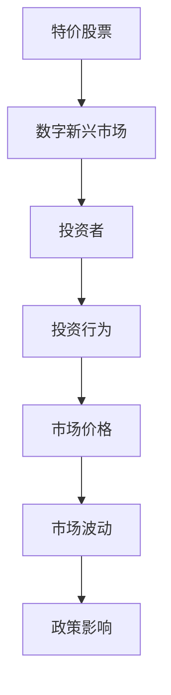
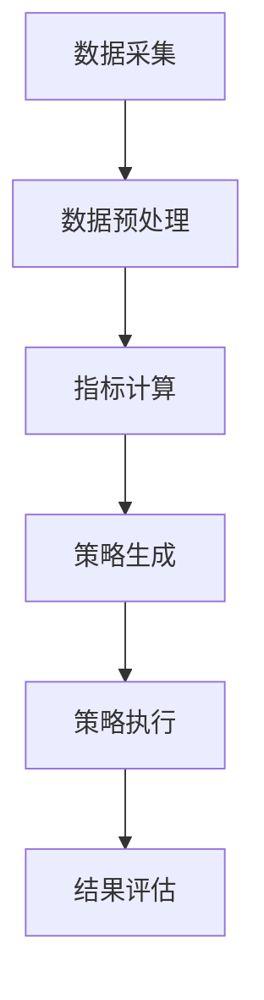
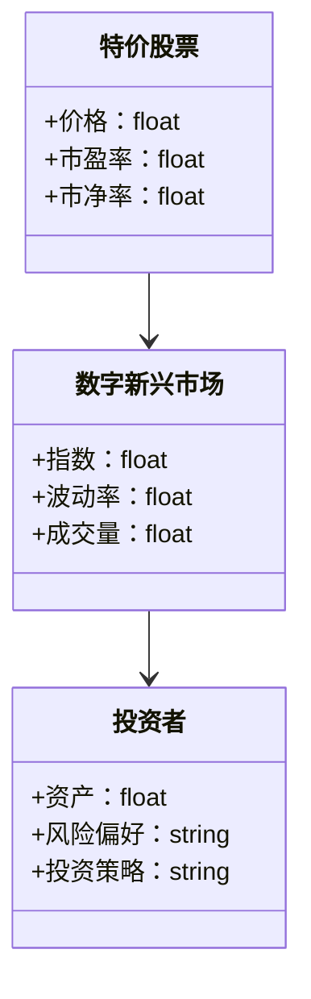
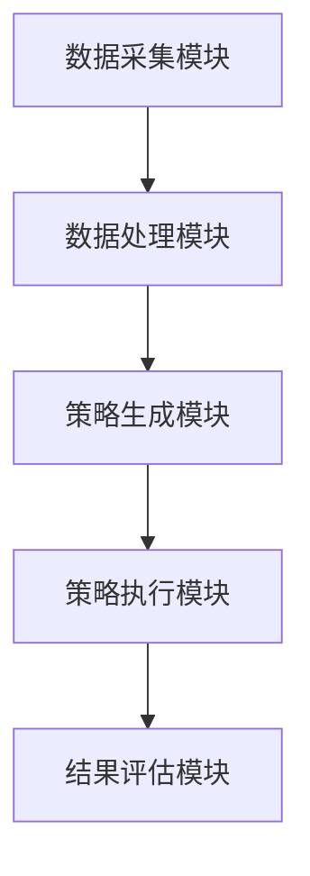
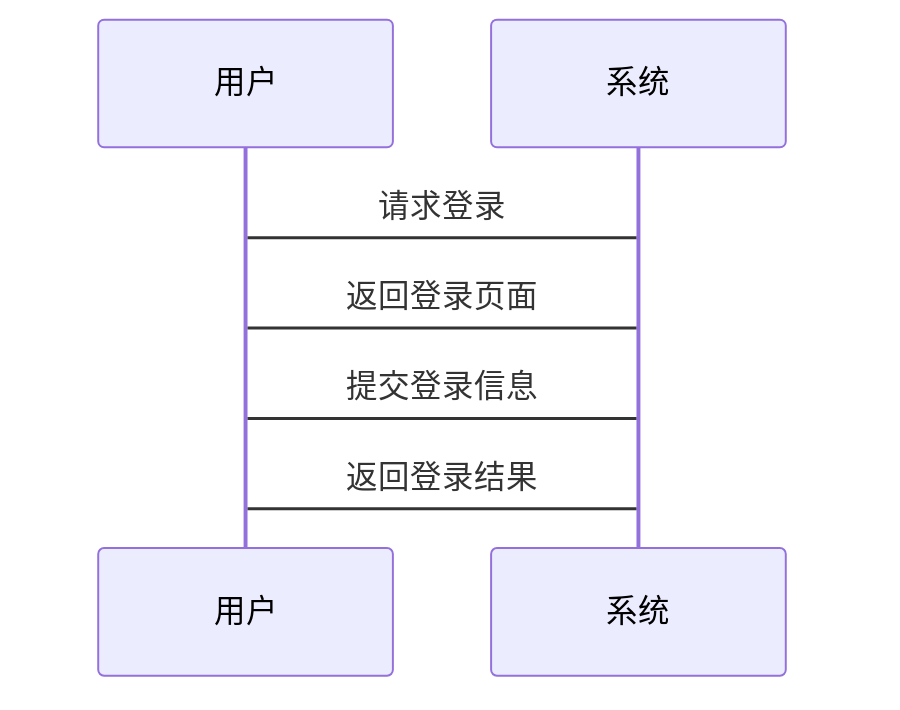
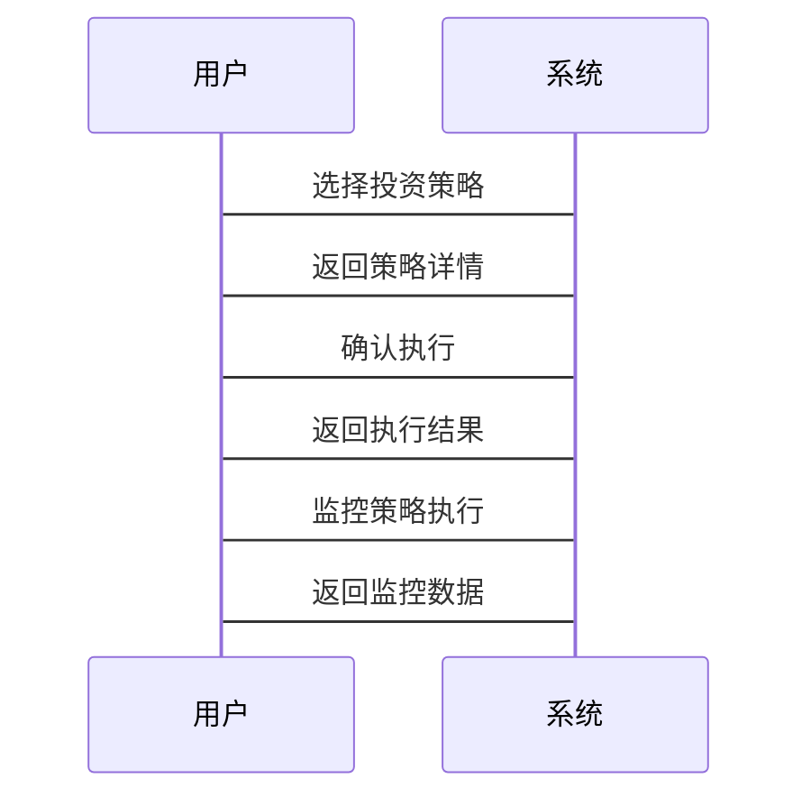

                 


# 特价股票投资策略在数字新兴市场中的适用性探讨

> 关键词：特价股票，数字新兴市场，投资策略，算法，系统架构，项目实战

> 摘要：本文探讨了特价股票投资策略在数字新兴市场中的适用性。首先，介绍了特价股票和数字新兴市场的基本概念及其特点。接着，分析了投资策略的核心原理，包括技术指标和量化模型。随后，通过系统架构设计和项目实战，展示了如何在实际市场中应用这些策略，并提供了详细的代码实现和案例分析。最后，总结了研究中的经验和教训，为未来的投资策略优化提供了参考。

---

## 第一部分: 特价股票投资策略的背景与概念

### 第1章: 特价股票与数字新兴市场的概述

#### 1.1 特价股票的基本概念

特价股票通常指价格相对较低的股票，具有较高的波动性和潜在的高回报率。在数字新兴市场中，这些股票往往集中在科技、金融科技等领域，这些领域的公司具有较高的增长潜力。

##### 1.1.1 特价股票的定义与特征

- **定义**：特价股票是指价格低于市场平均值的股票，通常具有较高的波动性和潜在的高回报率。
- **特征**：
  - 价格低：通常低于市场的平均水平。
  - 波动性高：短期内价格波动较大。
  - 增长潜力：公司可能处于成长期，未来有较高的增长潜力。
  - 风险较高：由于波动性大，投资风险较高。

##### 1.1.2 数字新兴市场的特点

数字新兴市场是指那些以科技和数字化为基础，快速发展的市场。这些市场的特点包括：

- **技术驱动**：市场主要由科技公司驱动。
- **高增长性**：市场增长速度快，具有较大的投资潜力。
- **波动性大**：由于市场的不确定性和高增长性，价格波动较大。
- **投资者多样性**：市场参与者包括机构投资者和个人投资者。

##### 1.1.3 特价股票在数字新兴市场的独特性

在数字新兴市场中，特价股票的独特性体现在以下几个方面：

- **技术驱动**：特价股票多集中在科技领域，技术进步可能带来股价的快速上涨。
- **高增长潜力**：这些公司可能处于成长期，未来有较高的增长潜力。
- **高波动性**：由于市场的不确定性和技术变化，股票价格波动较大。

#### 1.2 投资策略的基本原理

投资策略的基本原理是通过分析市场趋势、公司基本面和技术指标，找到具有投资价值的股票进行投资。

##### 1.2.1 投资策略的分类

- **价值投资**：寻找价格低于内在价值的股票进行投资。
- **成长投资**：投资于具有高增长潜力的公司。
- **趋势投资**：根据市场趋势进行投资。

##### 1.2.2 特价股票投资的核心逻辑

- **低估值**：寻找价格低于市场平均值的股票。
- **高增长潜力**：选择具有较高增长潜力的公司。
- **高波动性**：利用价格波动进行短期投资。

##### 1.2.3 数字新兴市场的投资机会与风险

- **投资机会**：数字新兴市场中的科技公司具有较高的增长潜力。
- **投资风险**：市场波动较大，投资风险较高。

---

### 第2章: 特价股票投资策略的适用性分析

#### 2.1 数字新兴市场的特点与挑战

##### 2.1.1 数字化对股票市场的改变

- **交易方式**：数字化使得交易更加便捷和高效。
- **信息传播**：信息传播速度加快，影响市场波动。
- **投资者行为**：投资者行为更加理性化和多样化。

##### 2.1.2 新兴市场的波动性与不确定性

- **市场波动**：新兴市场波动较大，价格变化快。
- **政策影响**：政策变化可能对市场产生重大影响。
- **经济周期**：新兴市场的经济周期波动较大。

##### 2.1.3 投资者行为的变化

- **理性化**：投资者更加理性化，注重基本面分析。
- **多样化**：投资者行为更加多样化，包括短期交易和长期投资。

#### 2.2 特价股票投资策略的适用性评估

##### 2.2.1 理论基础与实证分析

- **理论基础**：基于价值投资和成长投资理论。
- **实证分析**：通过历史数据验证策略的有效性。

##### 2.2.2 策略的有效性与局限性

- **有效性**：在某些市场环境下，策略表现良好。
- **局限性**：在市场波动较大或政策变化时，策略可能失效。

##### 2.2.3 不同市场环境下的策略调整

- **市场牛市**：增加投资，利用市场上涨趋势。
- **市场熊市**：减少投资，规避市场风险。

---

## 第二部分: 特价股票投资策略的核心概念与联系

### 第3章: 特价股票与新兴市场的实体关系分析

#### 3.1 实体关系图



#### 3.2 算法原理与流程图



### 第4章: 技术指标与量化模型

#### 4.1 技术指标分析

##### 4.1.1 移动平均线（MA）

- **计算公式**：MA = (P1 + P2 + ... + Pn) / n
- **应用**：用于判断市场趋势。

##### 4.1.2 相对强弱指数（RSI）

- **计算公式**：RSI = 100 - (100 - (100 - (Pn / (Pn + Pn-1))) / 14) * 100
- **应用**：用于判断超买超卖情况。

##### 4.1.3 布林带（Bollinger Bands）

- **计算公式**：Bollinger Bands = S_t ± 2 * std(S_t, n)
- **应用**：用于判断价格波动范围。

#### 4.2 量化模型构建

##### 4.2.1 数据采集与预处理

- **数据来源**：从股票交易所获取历史数据。
- **预处理**：去除缺失值和异常值。

##### 4.2.2 模型训练与优化

- **模型选择**：选择合适的机器学习模型，如随机森林、支持向量机等。
- **参数优化**：通过网格搜索优化模型参数。

##### 4.2.3 模型验证与评估

- **验证方法**：使用交叉验证评估模型性能。
- **评估指标**：准确率、召回率、F1分数等。

---

### 第5章: 系统功能设计

#### 5.1 领域模型设计



#### 5.2 系统架构设计



---

### 第6章: 系统接口与交互设计

#### 6.1 系统接口设计

##### 6.1.1 数据接口

- **API**：提供RESTful API接口，用于数据获取和策略执行。
- **数据格式**：使用JSON格式传输数据。

##### 6.1.2 用户接口

- **网页界面**：提供用户友好的界面，方便投资者进行操作。
- **移动端应用**：提供移动端应用，方便投资者随时随地进行操作。

##### 6.1.3 第三方接口

- **数据源接口**：与股票交易所或其他数据源对接。
- **支付接口**：集成支付功能，方便投资者进行交易。

#### 6.2 交互流程设计

##### 6.2.1 用户登录与注册



##### 6.2.2 策略执行与监控



---

## 第三部分: 投资策略的系统分析与架构设计

### 第7章: 项目实战

#### 7.1 环境安装

- **编程语言**：Python
- **开发框架**：Django或Flask
- **数据源**：Yahoo Finance API
- **开发工具**：Jupyter Notebook或VS Code

#### 7.2 核心实现

##### 7.2.1 数据采集与处理

```python
import pandas as pd
import requests

def get_stock_data(symbol):
    url = f"https://query1.finance.yahoo.com/v8/finance/chart/{symbol}"
    response = requests.get(url)
    data = response.json()
    df = pd.DataFrame(data['chart']['result'][0]['prices'])
    df['date'] = pd.to_datetime(df[0])
    df = df[['date', 1, 2, 3, 4]]
    df.columns = ['date', 'open', 'high', 'low', 'close']
    return df
```

##### 7.2.2 指标计算与策略生成

```python
from sklearn.ensemble import RandomForestClassifier

def calculate_indicators(df):
    # 计算移动平均线
    df['ma'] = df['close'].rolling(window=20).mean()
    # 计算相对强弱指数
    df['rsi'] = (100 - (100 - (100 - (df['close'] / df['close'].shift(1)) / 14)) * 100)
    return df

def generate_strategy(df):
    model = RandomForestClassifier()
    model.fit(df[['ma', 'rsi']], df['close'])
    return model
```

##### 7.2.3 策略执行与监控

```python
def execute_strategy(model, data):
    predictions = model.predict(data)
    return predictions
```

#### 7.3 案例分析

##### 7.3.1 案例背景

假设我们选择一家科技公司作为投资标的，分析其股价走势，计算技术指标，并生成投资策略。

##### 7.3.2 指标计算与分析

使用上述代码计算该公司的移动平均线和相对强弱指数，分析其趋势和买卖信号。

##### 7.3.3 策略执行与结果

根据模型生成的投资策略，执行交易操作，并监控结果，评估策略的有效性。

#### 7.4 项目小结

总结项目实施过程中的经验与教训，提出改进建议，为未来的策略优化提供参考。

---

## 第四部分: 总结与展望

### 第8章: 总结与展望

#### 8.1 总结

本文探讨了特价股票投资策略在数字新兴市场中的适用性，分析了策略的核心原理，展示了系统的架构设计和项目实战。通过技术指标和量化模型的分析，验证了策略的有效性，并提出了改进建议。

#### 8.2 展望

未来的研究可以进一步优化投资策略，引入更多的技术指标和机器学习算法，提高策略的准确性和稳定性。同时，可以研究市场的动态变化，适应不同的市场环境，提高投资收益。

---

通过以上步骤，本文详细探讨了特价股票投资策略在数字新兴市场中的适用性，为投资者提供了理论支持和实践指导。

