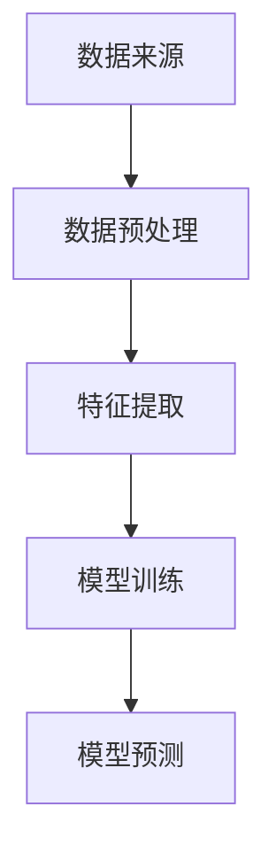
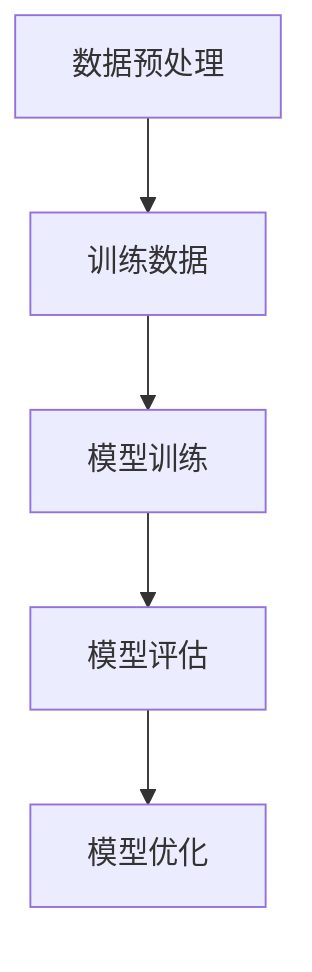
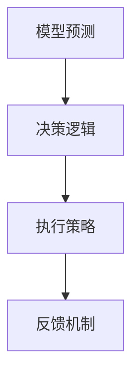
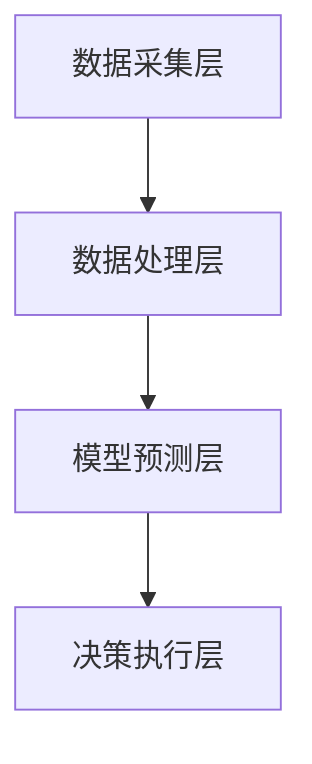
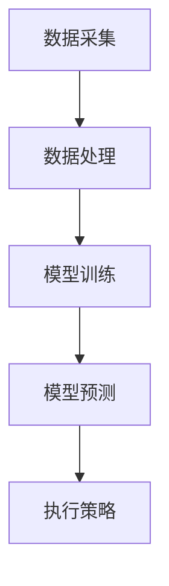
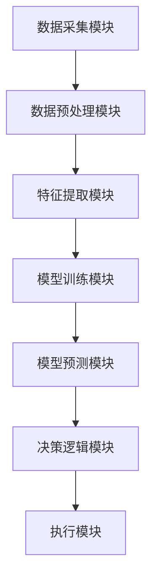
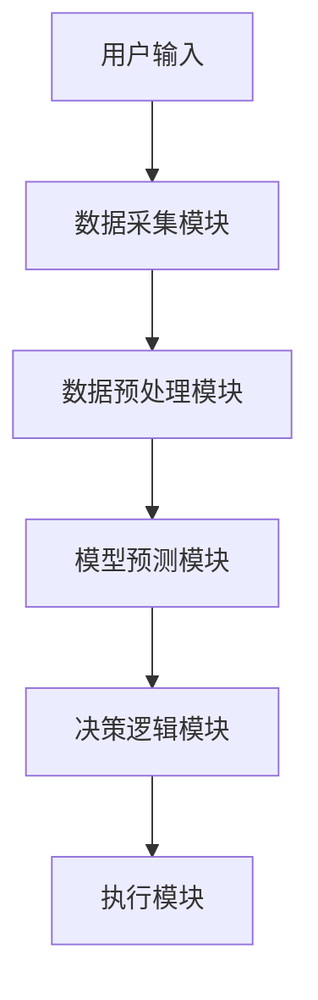

                 


```markdown
# 环保AI Agent：监测与保护生态环境

> 关键词：环保、AI、机器学习、生态保护、环境监测

> 摘要：随着全球环境问题的日益严重，人工智能技术在环境保护中的应用变得越来越重要。本文将详细探讨环保AI Agent的概念、原理、系统架构以及实际应用，通过具体案例展示如何利用AI技术实现环境监测与保护。

---

# 第一部分：环保AI Agent的背景与概念

## 第1章：环境保护问题的现状

### 1.1 当前环境问题的严重性
环境保护已成为全球性挑战，气候变化、污染、物种灭绝等问题亟待解决。传统环境监测手段存在效率低、成本高、覆盖面有限等问题，难以应对复杂的环境挑战。

### 1.2 AI技术在环境保护中的潜力
人工智能技术通过数据处理、模式识别和自动化决策，为环境监测与保护提供了新的解决方案。AI能够实时分析海量环境数据，帮助人类更高效地应对环境问题。

### 1.3 环保AI Agent的基本概念
环保AI Agent是一种能够自主感知环境、分析数据、做出决策并执行保护措施的智能体。它结合了人工智能、物联网和大数据技术，能够实现环境监测、污染预警、资源优化配置等功能。

### 1.4 环保AI Agent的应用场景
- 环境监测：实时监测空气、水、土壤的质量。
- 污染预警：预测污染物扩散趋势，提前采取措施。
- 资源优化：优化能源使用，减少浪费。
- 生态修复：协助恢复被破坏的生态系统。

## 第2章：环保AI Agent的核心概念与原理

### 2.1 数据采集与处理
环保AI Agent通过传感器、卫星、数据库等多种途径采集环境数据，包括温度、湿度、空气质量指数等。数据预处理包括去噪、归一化和特征提取，为后续分析奠定基础。

### 2.2 环境监测模型构建
基于机器学习和深度学习算法，构建环境预测模型。例如，使用支持向量机（SVM）预测空气质量指数，使用卷积神经网络（CNN）分析卫星图像中的污染区域。

### 2.3 决策与执行
AI Agent根据模型预测结果，制定最优决策并执行保护措施。例如，当预测到某区域空气质量恶化时，AI Agent可以自动启动洒水降尘装置或发出警报通知相关部门。

### 2.4 系统架构设计
环保AI Agent的系统架构通常包括数据采集层、数据处理层、模型预测层和执行层。各层之间通过标准化接口进行通信，确保系统的高效运行。

---

# 第二部分：环保AI Agent的算法原理

## 第3章：机器学习算法在环保中的应用

### 3.1 线性回归
线性回归用于预测连续型环境数据，例如预测某区域的温度变化趋势。

### 3.2 支持向量机（SVM）
SVM用于分类问题，例如区分空气质量是良好还是污染。

### 3.3 随机森林
随机森林用于特征重要性分析和分类预测，例如预测水质是否达标。

## 第4章：深度学习算法在环保中的应用

### 4.1 卷积神经网络（CNN）
CNN用于图像处理，例如分析卫星图像中的污染区域。

### 4.2 循环神经网络（RNN）
RNN用于时间序列数据的预测，例如预测某流域的水位变化。

### 4.3 图神经网络（GNN）
GNN用于处理环境监测网络中的关系数据，例如分析污染物在不同区域的传播路径。

## 第5章：算法流程图

### 5.1 数据流图


### 5.2 模型训练流程


### 5.3 决策执行流程


---

# 第三部分：环保AI Agent的系统分析与架构设计

## 第6章：系统功能模块

### 6.1 数据采集模块
负责采集环境数据，包括传感器数据、卫星图像和数据库数据。

### 6.2 数据处理模块
对采集到的数据进行清洗、归一化和特征提取。

### 6.3 模型预测模块
基于机器学习或深度学习模型，预测环境状况。

### 6.4 决策执行模块
根据预测结果，制定并执行保护措施。

## 第7章：系统架构设计

### 7.1 分层架构


### 7.2 微服务架构


### 7.3 组件交互图


## 第8章：系统接口设计

### 8.1 数据接口
定义数据输入和输出的格式，确保不同模块之间能够顺利通信。

### 8.2 模型接口
定义模型训练和预测的接口，方便不同算法的集成。

### 8.3 执行接口
定义执行策略的接口，确保AI Agent能够调用外部系统执行保护措施。

## 第9章：系统交互流程

### 9.1 交互流程图


---

# 第四部分：环保AI Agent的项目实战

## 第10章：环保AI Agent的实现

### 10.1 环境安装
安装必要的Python库和工具，例如TensorFlow、Scikit-learn、Mermaid等。

### 10.2 核心代码实现
以下是一个简单的空气质量预测模型代码：

```python
import numpy as np
from sklearn.svm import SVC
from sklearn.metrics import accuracy_score

# 数据加载
X_train = np.load('X_train.npy')
y_train = np.load('y_train.npy')

# 模型训练
model = SVC()
model.fit(X_train, y_train)

# 模型预测
X_test = np.load('X_test.npy')
y_pred = model.predict(X_test)

# 模型评估
print("模型准确率：", accuracy_score(y_test, y_pred))
```

### 10.3 案例分析
以空气质量预测为例，详细讲解如何利用AI Agent实现污染预警。

### 10.4 系统优化与维护
讨论如何优化模型性能、处理数据缺失和异常值等问题。

---

# 第五部分：总结与展望

## 第11章：总结

### 11.1 本章小结
总结全文内容，强调环保AI Agent的重要性和潜力。

## 第12章：展望

### 12.1 未来发展方向
讨论AI技术在环境保护中的未来应用，例如结合区块链技术实现数据可信共享，或者利用联邦学习保护数据隐私。

---

# 参考文献

1. 《机器学习实战》
2. 《深度学习》
3. 《AI for Good：人工智能与可持续发展》
4. 《环保技术与工程》

---

# 结束语

通过本文的详细讲解，读者可以全面了解环保AI Agent的概念、原理和实际应用。希望本文能够为环境保护事业提供新的思路和解决方案。
</think>

```markdown
# 环保AI Agent：监测与保护生态环境

> 关键词：环保、AI、机器学习、生态保护、环境监测

> 摘要：随着全球环境问题的日益严重，人工智能技术在环境保护中的应用变得越来越重要。本文将详细探讨环保AI Agent的概念、原理、系统架构以及实际应用，通过具体案例展示如何利用AI技术实现环境监测与保护。

---

# 第一部分：环保AI Agent的背景与概念

## 第1章：环境保护问题的现状

### 1.1 当前环境问题的严重性
环境保护已成为全球性挑战，气候变化、污染、物种灭绝等问题亟待解决。传统环境监测手段存在效率低、成本高、覆盖面有限等问题，难以应对复杂的环境挑战。

### 1.2 AI技术在环境保护中的潜力
人工智能技术通过数据处理、模式识别和自动化决策，为环境监测与保护提供了新的解决方案。AI能够实时分析海量环境数据，帮助人类更高效地应对环境问题。

### 1.3 环保AI Agent的基本概念
环保AI Agent是一种能够自主感知环境、分析数据、做出决策并执行保护措施的智能体。它结合了人工智能、物联网和大数据技术，能够实现环境监测、污染预警、资源优化配置等功能。

### 1.4 环保AI Agent的应用场景
- 环境监测：实时监测空气、水、土壤的质量。
- 污染预警：预测污染物扩散趋势，提前采取措施。
- 资源优化：优化能源使用，减少浪费。
- 生态修复：协助恢复被破坏的生态系统。

## 第2章：环保AI Agent的核心概念与原理

### 2.1 数据采集与处理
环保AI Agent通过传感器、卫星、数据库等多种途径采集环境数据，包括温度、湿度、空气质量指数等。数据预处理包括去噪、归一化和特征提取，为后续分析奠定基础。

### 2.2 环境监测模型构建
基于机器学习和深度学习算法，构建环境预测模型。例如，使用支持向量机（SVM）预测空气质量指数，使用卷积神经网络（CNN）分析卫星图像中的污染区域。

### 2.3 决策与执行
AI Agent根据模型预测结果，制定最优决策并执行保护措施。例如，当预测到某区域空气质量恶化时，AI Agent可以自动启动洒水降尘装置或发出警报通知相关部门。

### 2.4 系统架构设计
环保AI Agent的系统架构通常包括数据采集层、数据处理层、模型预测层和执行层。各层之间通过标准化接口进行通信，确保系统的高效运行。

---

# 第二部分：环保AI Agent的算法原理

## 第3章：机器学习算法在环保中的应用

### 3.1 线性回归
线性回归用于预测连续型环境数据，例如预测某区域的温度变化趋势。

### 3.2 支持向量机（SVM）
SVM用于分类问题，例如区分空气质量是良好还是污染。

### 3.3 随机森林
随机森林用于特征重要性分析和分类预测，例如预测水质是否达标。

## 第4章：深度学习算法在环保中的应用

### 4.1 卷积神经网络（CNN）
CNN用于图像处理，例如分析卫星图像中的污染区域。

### 4.2 循环神经网络（RNN）
RNN用于时间序列数据的预测，例如预测某流域的水位变化。

### 4.3 图神经网络（GNN）
GNN用于处理环境监测网络中的关系数据，例如分析污染物在不同区域的传播路径。

## 第5章：算法流程图

### 5.1 数据流图


### 5.2 模型训练流程


### 5.3 决策执行流程


---

# 第三部分：环保AI Agent的系统分析与架构设计

## 第6章：系统功能模块

### 6.1 数据采集模块
负责采集环境数据，包括传感器数据、卫星图像和数据库数据。

### 6.2 数据处理模块
对采集到的数据进行清洗、归一化和特征提取。

### 6.3 模型预测模块
基于机器学习或深度学习模型，预测环境状况。

### 6.4 决策执行模块
根据预测结果，制定并执行保护措施。

## 第7章：系统架构设计

### 7.1 分层架构


### 7.2 微服务架构


### 7.3 组件交互图


## 第8章：系统接口设计

### 8.1 数据接口
定义数据输入和输出的格式，确保不同模块之间能够顺利通信。

### 8.2 模型接口
定义模型训练和预测的接口，方便不同算法的集成。

### 8.3 执行接口
定义执行策略的接口，确保AI Agent能够调用外部系统执行保护措施。

## 第9章：系统交互流程

### 9.1 交互流程图


---

# 第四部分：环保AI Agent的项目实战

## 第10章：环保AI Agent的实现

### 10.1 环境安装
安装必要的Python库和工具，例如TensorFlow、Scikit-learn、Mermaid等。

### 10.2 核心代码实现
以下是一个简单的空气质量预测模型代码：

```python
import numpy as np
from sklearn.svm import SVC
from sklearn.metrics import accuracy_score

# 数据加载
X_train = np.load('X_train.npy')
y_train = np.load('y_train.npy')

# 模型训练
model = SVC()
model.fit(X_train, y_train)

# 模型预测
X_test = np.load('X_test.npy')
y_pred = model.predict(X_test)

# 模型评估
print("模型准确率：", accuracy_score(y_test, y_pred))
```

### 10.3 案例分析
以空气质量预测为例，详细讲解如何利用AI Agent实现污染预警。

### 10.4 系统优化与维护
讨论如何优化模型性能、处理数据缺失和异常值等问题。

---

# 第五部分：总结与展望

## 第11章：总结

### 11.1 本章小结
总结全文内容，强调环保AI Agent的重要性和潜力。

## 第12章：展望

### 12.1 未来发展方向
讨论AI技术在环境保护中的未来应用，例如结合区块链技术实现数据可信共享，或者利用联邦学习保护数据隐私。

---

# 参考文献

1. 《机器学习实战》
2. 《深度学习》
3. 《AI for Good：人工智能与可持续发展》
4. 《环保技术与工程》

---

# 结束语

通过本文的详细讲解，读者可以全面了解环保AI Agent的概念、原理和实际应用。希望本文能够为环境保护事业提供新的思路和解决方案。
```

