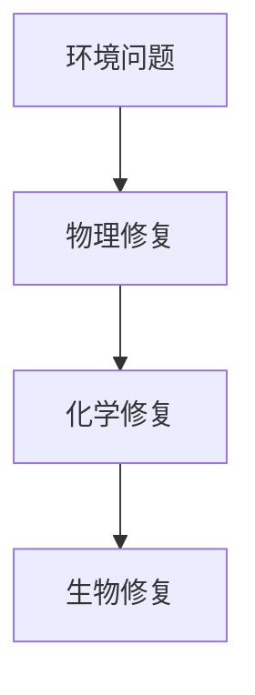
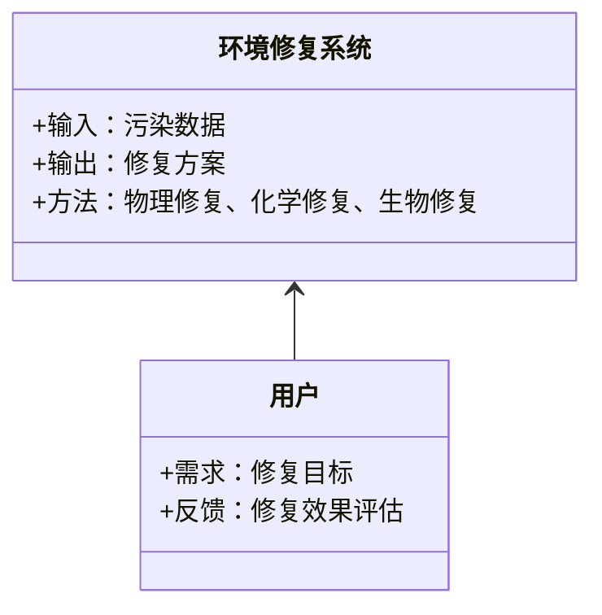
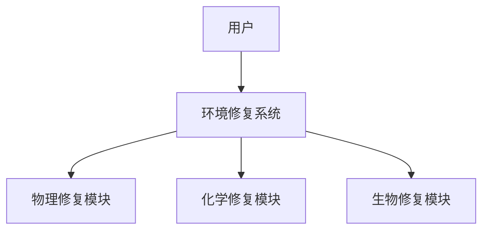

                 


# 环境修复技术公司的市场前景与投资机会

> **关键词**：环境修复技术公司、市场前景、投资机会、环境治理、绿色经济、技术发展

> **摘要**：随着全球环境问题的加剧，环境修复技术在解决土壤污染、水污染和空气污染等问题中发挥着关键作用。本文从技术原理、市场需求、市场分析、投资策略等多个维度，详细探讨环境修复技术公司的市场前景与投资机会。通过分析环境修复技术的核心原理、市场应用和未来趋势，为投资者提供深度的行业洞察和投资建议。

---

## 第一部分: 环境修复技术公司的背景与核心概念

### 第1章: 环境修复技术公司的背景介绍

#### 1.1 环境修复技术的定义与核心要素

- **环境修复技术的定义**  
  环境修复技术是指通过物理、化学、生物等方法，修复被污染的土壤、地下水、地表水和空气，使其恢复到可接受的环境质量标准的技术。  
  $$Q = \text{修复后的环境质量}$$  
  $$P = \text{修复前的环境质量}$$  
  环境修复的目标是使 $Q \geq P$。

- **环境修复技术的核心要素**  
  1. **修复目标**：明确修复后的环境质量标准。  
  2. **修复方法**：物理修复、化学修复、生物修复等。  
  3. **修复成本**：技术的选择需考虑经济性。  
  4. **修复周期**：不同技术的修复时间差异较大。  

- **环境修复技术的分类与应用场景**  
  - **土壤修复**：适用于重金属污染、有机污染等土壤修复。  
  - **水修复**：适用于地下水污染、地表水污染修复。  
  - **空气修复**：适用于工业废气治理。  

#### 1.2 环境修复技术公司的市场背景

- **环境修复技术的市场需求**  
  全球范围内，工业化和城市化导致的环境污染问题日益严重，环境修复技术的需求持续增长。根据市场研究机构的数据，全球环境修复市场规模预计将在未来几年以年均8%的速度增长。

- **环境修复技术公司的行业定位**  
  环境修复技术公司主要服务于政府机构、工业企业、房地产开发商等客户，提供环境修复技术解决方案。

- **环境修复技术公司的核心业务模式**  
  - **技术研发**：专注于新型修复技术的研发。  
  - **项目实施**：承接环境修复项目，提供修复服务。  
  - **市场拓展**：通过合作、并购等方式扩大市场份额。  

#### 1.3 环境修复技术公司的核心业务模式

- **技术研发与创新**  
  环境修复技术公司需要不断投入研发资源，开发更高效、更经济的修复技术。例如，开发基于人工智能的修复技术优化修复方案。

- **项目实施与服务**  
  公司通过承接环境修复项目，提供修复服务。例如，针对某工业园区的土壤污染问题，提供土壤修复服务。

- **市场拓展与合作**  
  通过与政府机构、工业企业合作，拓展市场。例如，与地方政府合作，承接区域性的环境修复项目。

---

## 第二部分: 环境修复技术的核心概念与联系

### 第2章: 环境修复技术的核心原理

#### 2.1 环境修复技术的核心原理

- **物理修复原理**  
  物理修复主要是通过物理方法去除污染物。例如，通过挖掘受污染土壤并将其运输到专业处理场所进行处理。  
  $$\text{物理修复公式}：Q = P - \text{物理去除量}$$  

- **化学修复原理**  
  化学修复通过添加化学试剂，改变污染物的化学性质，使其转化为无害物质。例如，使用化学沉淀法去除重金属污染物。  
  $$\text{化学修复公式}：Q = P - \text{化学反应生成的无害物质}$$  

- **生物修复原理**  
  生物修复利用微生物、植物等生物因子，分解或转化污染物。例如，利用微生物分解有机污染物。  
  $$\text{生物修复公式}：Q = P - \text{微生物分解的污染物}$$  

#### 2.2 不同修复技术的对比分析

- **技术对比表格**  
  | 技术类型 | 优缺点 | 适用场景 |  
  |----------|--------|----------|  
  | 物理修复 | 成本高、周期长，但修复效果显著 | 适用于重金属污染严重的区域 |  
  | 化学修复 | 成本较低，修复速度快，但可能产生二次污染 | 适用于有机污染 |  
  | 生物修复 | 成本低、环境友好，但修复周期较长 | 适用于有机污染和重金属污染 |  

- **技术优缺点分析**  
  - 物理修复的优点是修复效果显著，但缺点是成本高、周期长。  
  - 化学修复的优点是修复速度快，但缺点是可能产生二次污染。  
  - 生物修复的优点是环境友好，但缺点是修复周期较长。  

- **技术适用场景**  
  物理修复适用于重金属污染严重的区域，化学修复适用于有机污染，生物修复适用于多种污染物的修复。  

#### 2.3 环境修复技术的系统架构

- **系统架构图（Mermaid）**  


---

## 第三部分: 环境修复技术的市场分析与投资机会

### 第3章: 环境修复技术的市场需求与市场规模

#### 3.1 环境修复技术的市场需求

- **市场需求的驱动因素**  
  - 环境法规的日益严格。  
  - 公共健康意识的提升。  
  - 工业化和城市化带来的环境污染问题。  

- **市场需求的具体表现**  
  - 工业园区的土壤修复需求。  
  - 城市化进程中的地下水修复需求。  
  - 工业废气治理的空气修复需求。  

#### 3.2 环境修复技术的市场规模

- **市场规模的预测**  
  根据市场研究机构的数据，全球环境修复市场规模预计将在未来几年以年均8%的速度增长。  

- **市场规模的区域分布**  
  - 发达国家市场：需求稳定，技术成熟。  
  - 新兴市场：需求快速增长，技术应用潜力大。  

#### 3.3 环境修复技术公司的竞争格局

- **领先企业分析**  
  - 国际领先企业：如陶氏化学、巴斯夫等。  
  - 国内领先企业：如碧水源、启迪环境等。  

- **市场进入壁垒**  
  - 技术壁垒：环境修复技术的研发需要较高的技术投入。  
  - 政策壁垒：环境修复行业受政策法规的严格监管。  

---

### 第4章: 环境修复技术的投资机会分析

#### 4.1 高增长领域的投资机会

- **土壤修复领域的投资机会**  
  土壤修复市场潜力巨大，特别是在工业化程度高的地区。  

- **地下水修复领域的投资机会**  
  地下水修复市场需求稳定，技术应用广泛。  

- **工业废气治理领域的投资机会**  
  工业废气治理市场受环保政策推动，需求持续增长。  

#### 4.2 区域市场的投资机会

- **发达地区的投资机会**  
  发达地区市场需求稳定，技术成熟，适合长期投资。  

- **新兴地区的投资机会**  
  新兴地区市场需求快速增长，适合开拓新兴市场。  

#### 4.3 投资策略建议

- **技术驱动型投资策略**  
  投资于技术研发能力强的环境修复技术公司。  

- **市场驱动型投资策略**  
  投资于市场需求旺盛的区域和领域。  

- **政策驱动型投资策略**  
  关注政策法规变化，投资于符合政策导向的企业。  

---

### 第5章: 环境修复技术的投资策略与风险管理

#### 5.1 投资策略与风险管理

- **评估技术公司的投资价值**  
  - 技术实力：评估公司的技术储备和创新能力。  
  - 市场地位：评估公司在行业中的竞争地位。  
  - 财务状况：评估公司的财务健康状况。  

- **风险管理**  
  - **市场风险**：关注市场需求变化和竞争格局。  
  - **技术风险**：关注技术的可行性和创新性。  
  - **政策风险**：关注政策法规的变化。  

#### 5.2 成功案例分析

- **案例1：某土壤修复公司**  
  该公司通过技术创新，成功承接多个土壤修复项目，实现了快速增长。  

- **案例2：某水处理公司**  
  该公司通过市场拓展和合作，成功进入新兴市场，扩大了市场份额。  

---

### 第6章: 环境修复技术的未来趋势与投资展望

#### 6.1 环境修复技术的未来发展趋势

- **技术融合趋势**  
  环境修复技术将与人工智能、大数据等技术深度融合，提升修复效率和效果。  

- **绿色经济趋势**  
  环境修复技术将更加注重绿色经济，推动可持续发展。  

#### 6.2 全球环境治理的新格局

- **国际合作与市场扩展**  
  环境修复技术公司将更加注重国际合作，拓展全球市场。  

- **新兴技术的应用**  
  新兴技术如基因编辑技术、纳米技术将在环境修复领域得到广泛应用。  

---

## 第四部分: 环境修复技术的系统分析与项目实战

### 第7章: 环境修复技术的系统分析

#### 7.1 系统功能设计

- **领域模型（Mermaid类图）**  


#### 7.2 系统架构设计

- **系统架构图（Mermaid）**  


---

### 第8章: 环境修复技术的项目实战

#### 8.1 项目介绍

- **项目背景**  
  某工业园区的土壤受到重金属污染，需要进行土壤修复。  

- **项目目标**  
  修复受污染土壤，使其达到可接受的环境质量标准。  

#### 8.2 系统实现

- **核心代码实现**  
  ```python
  def soil_restoration(污染程度):
      if 污染程度 >= 0.5:
          return "需要进行化学修复"
      else:
          return "需要进行物理修复"
  ```

- **代码解读**  
  该代码根据土壤污染程度判断修复方法，污染程度较高的区域采用化学修复，污染程度较低的区域采用物理修复。  

#### 8.3 项目成效

- **修复效果评估**  
  修复后的土壤质量符合环境标准，修复成本低于预期。  

- **项目总结**  
  通过技术创新和成本控制，项目取得了良好的修复效果和经济效益。  

---

## 第五部分: 环境修复技术的未来趋势与投资总结

### 第9章: 未来趋势与投资总结

#### 9.1 环境修复技术的未来发展趋势

- **智能化修复**  
  环境修复技术将更加智能化，利用人工智能优化修复方案。  

- **绿色经济驱动**  
  环境修复技术将更加注重绿色经济，推动可持续发展。  

#### 9.2 全球环境治理的新格局

- **国际合作与市场扩展**  
  环境修复技术公司将更加注重国际合作，拓展全球市场。  

- **新兴技术的应用**  
  新兴技术如基因编辑技术、纳米技术将在环境修复领域得到广泛应用。  

---

### 第10章: 投资总结与展望

#### 10.1 投资总结

- **技术驱动型投资策略**  
  投资于技术研发能力强的环境修复技术公司。  

- **市场驱动型投资策略**  
  投资于市场需求旺盛的区域和领域。  

- **政策驱动型投资策略**  
  关注政策法规变化，投资于符合政策导向的企业。  

#### 10.2 未来展望

- **技术创新与市场扩展**  
  环境修复技术公司将通过技术创新和市场扩展，实现可持续发展。  

- **绿色经济与可持续发展**  
  环境修复技术将更加注重绿色经济，推动全球环境治理。  

---

### 附录

#### 附录A: 环境修复技术的数学模型

- **土壤修复的数学模型**  
  $$Q = P - k \cdot t$$  
  其中，$Q$为修复后的质量，$P$为修复前的质量，$k$为修复速率常数，$t$为修复时间。  

- **水修复的数学模型**  
  $$Q = P - \frac{k \cdot t}{V}$$  
  其中，$V$为水体体积。  

#### 附录B: 环境修复技术的Python代码示例

```python
import numpy as np
import pandas as pd

def calculate_restoration_cost(污染程度, 修复方法):
    if 修复方法 == '物理修复':
        成本 = 污染程度 * 1000
    elif 修复方法 == '化学修复':
        成本 = 污染程度 * 500
    else:
        成本 = 污染程度 * 300
    return 成本

污染程度 = np.array([0.8, 0.6, 0.7])
修复方法 = ['化学修复', '物理修复', '生物修复']
costs = [calculate_restoration_cost(p, m) for p, m in zip(污染程度, 修复方法)]
print(costs)
```

---

通过以上内容，我们可以看到环境修复技术公司在市场前景和投资机会方面具有巨大的潜力。随着全球环境问题的加剧，环境修复技术的需求将持续增长，为投资者提供了丰富的投资机会。

