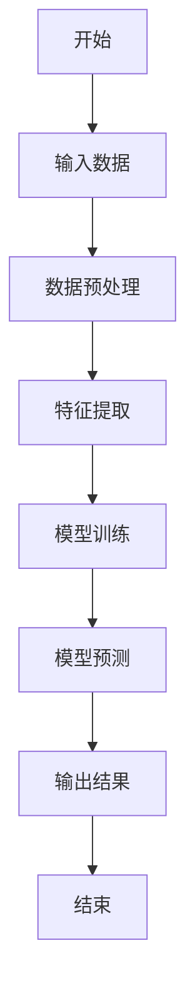
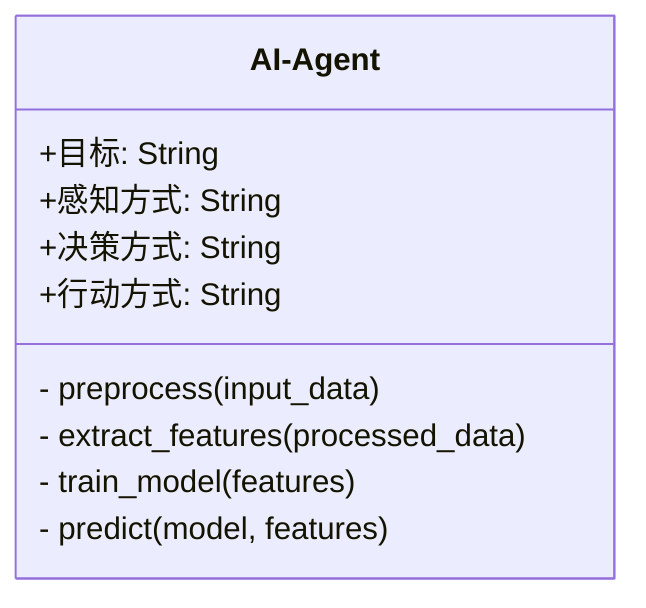
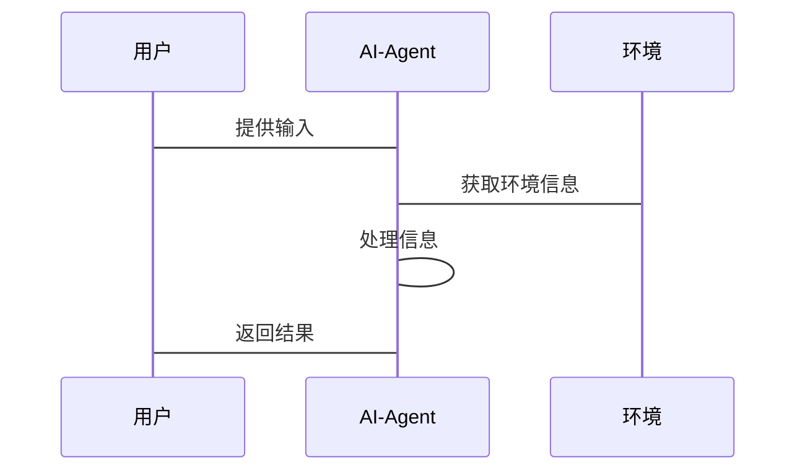

                 


# 理解AI Agent：核心概念与基本原理

> **关键词**：AI Agent, 人工智能, 机器学习, 算法原理, 系统架构
>
> **摘要**：本文旨在深入探讨AI Agent的核心概念与基本原理，通过系统化的分析与讲解，帮助读者全面理解AI Agent的定义、架构、算法、数学模型以及实际应用。文章结构清晰，内容详实，涵盖从基础概念到实际项目的各个方面，适合希望深入理解AI Agent技术的读者。

---

## 第1章: AI Agent的背景介绍

### 1.1 问题背景与问题描述
AI Agent（人工智能代理）是指在计算机系统中，能够感知环境并采取行动以实现目标的实体。随着人工智能技术的快速发展，AI Agent 已经广泛应用于自动驾驶、智能助手、机器人、推荐系统等领域。

**问题背景**：
- **自动化决策**：AI Agent 能够在没有人类干预的情况下，根据环境信息做出决策。
- **复杂问题解决**：AI Agent 可以处理复杂的问题，例如路径规划、资源分配等。
- **实时响应**：AI Agent 能够实时感知环境变化并快速响应。

**问题解决的基本思路**：
1. **感知环境**：通过传感器或其他输入方式获取环境信息。
2. **分析与推理**：利用算法对信息进行处理，生成决策。
3. **执行动作**：根据决策结果采取相应的行动。

**边界与外延**：
- **边界**：AI Agent 的决策范围和能力有限，依赖于其设计和算法。
- **外延**：AI Agent 可以与其他系统或人类交互，形成更复杂的系统架构。

### 1.2 核心概念结构与组成要素
AI Agent 的核心概念可以分为以下几个部分：
1. **目标**：AI Agent 的目标是其行动的驱动力。
2. **感知**：AI Agent 通过感知环境信息来做出决策。
3. **推理与决策**：基于感知信息，AI Agent 进行推理和决策。
4. **行动**：根据决策结果，AI Agent 执行相应的动作。

---

## 第2章: AI Agent的核心概念与联系

### 2.1 核心概念原理
AI Agent 的核心概念可以总结为以下几个方面：
1. **定义与属性**：AI Agent 是一个能够感知环境并采取行动以实现目标的实体。
2. **类型**：AI Agent 可以分为简单反射型、基于模型的反射型、目标驱动型、效用驱动型等类型。
3. **架构**：AI Agent 的架构决定了其感知、推理和行动的方式。

**属性特征对比表**：
| 特性       | 简单反射型 | 基于模型的反射型 | 目标驱动型 | 效用驱动型 |
|------------|------------|------------------|------------|------------|
| 决策方式   | 反射式      | 基于模型          | 目标导向    | 效用最大化  |
| 复杂性      | 低          | 中                | 高          | 高          |
| 应用场景    | 自动化控制  | 智能体规划        | 任务分配    | 多智能体协作  |

**ER实体关系图架构**：
```mermaid
erd
  entity AI Agent {
    类型: String
    目标: String
    感知方式: String
    决策方式: String
    行动方式: String
  }
```

### 2.2 本章小结
本章通过对比表和ER实体关系图，详细解释了AI Agent的核心概念，帮助读者理解其多样性和复杂性。

---

## 第3章: AI Agent的算法原理讲解

### 3.1 算法原理
AI Agent 的算法是其实现的核心，主要包括感知、推理和决策三个部分。

**算法流程图（使用mermaid）**：


### 3.2 算法实现
**Python源代码实现**：
```python
def ai_agent_algorithm(input_data):
    # 数据预处理
    processed_data = preprocess(input_data)
    # 特征提取
    features = extract_features(processed_data)
    # 模型训练
    model = train_model(features)
    # 模型预测
    prediction = predict(model, features)
    return prediction
```

### 3.3 数学模型与公式
**基本数学模型**：
$$y = f(x)$$

**详细公式推导**：
$$P(y|x) = \frac{P(x|y)P(y)}{P(x)}$$

### 3.4 本章小结
本章通过mermaid流程图和Python代码，详细讲解了AI Agent的算法原理，帮助读者理解其实现过程。

---

## 第4章: AI Agent的系统架构设计

### 4.1 问题场景介绍
AI Agent 的系统架构设计需要考虑以下几个方面：
1. **问题场景**：AI Agent 所处的环境和任务。
2. **系统功能**：AI Agent 的核心功能和模块。

### 4.2 系统功能设计
**领域模型（使用mermaid类图）**：


### 4.3 系统架构设计
**系统架构图（使用mermaid架构图）**：
```mermaid
container AI-Agent {
    use case 用户输入
    use case 数据预处理
    use case 特征提取
    use case 模型训练
    use case 模型预测
}
```

### 4.4 系统接口设计
AI Agent 的系统接口设计需要考虑以下几个方面：
1. **输入接口**：接收环境信息。
2. **输出接口**：输出决策结果。

### 4.5 系统交互流程图（使用mermaid序列图）**：


### 4.6 本章小结
本章通过系统架构设计和交互流程图，详细讲解了AI Agent的系统实现过程。

---

## 第5章: AI Agent的项目实战

### 5.1 环境安装
AI Agent 的开发需要以下环境：
1. **Python**：版本3.8以上。
2. **库依赖**：numpy、pandas、scikit-learn。

### 5.2 核心代码实现
**数据预处理**：
```python
def preprocess(input_data):
    # 数据清洗和转换
    processed_data = input_data.dropna()
    return processed_data
```

**特征提取**：
```python
def extract_features(processed_data):
    # 提取特征
    features = processed_data[['age', 'income']]
    return features
```

**模型训练**：
```python
def train_model(features):
    # 训练模型
    from sklearn.tree import DecisionTreeClassifier
    model = DecisionTreeClassifier().fit(features, labels)
    return model
```

**模型预测**：
```python
def predict(model, features):
    # 预测结果
    prediction = model.predict(features)
    return prediction
```

### 5.3 实际案例分析
**案例分析**：
假设我们有一个客户 churn 预测的项目，AI Agent 可以通过分析客户数据，预测客户是否会流失。

### 5.4 本章小结
本章通过实际项目案例，详细讲解了AI Agent 的开发过程，帮助读者掌握实际操作技能。

---

## 第6章: AI Agent的伦理与社会影响

### 6.1 伦理问题
1. **隐私**：AI Agent 可能会收集大量用户数据，引发隐私问题。
2. **安全**：AI Agent 可能被恶意攻击，导致安全风险。

### 6.2 社会影响
1. **就业**：AI Agent 可能会替代部分人类工作，影响就业市场。
2. **责任**：当AI Agent 出错时，责任归属问题需要明确。

### 6.3 未来发展
AI Agent 的未来发展将更加智能化和人性化，同时需要解决伦理和法律问题。

### 6.4 小结
本章讨论了AI Agent 的伦理与社会影响，强调了技术发展的伦理约束和社会责任。

---

## 第7章: 总结与展望

### 7.1 核心内容回顾
本文详细讲解了AI Agent 的核心概念、算法原理、系统架构和实际应用。

### 7.2 进一步学习与研究方向
1. **深入学习**：学习更复杂的AI Agent 算法，如强化学习和多智能体协作。
2. **实际应用**：尝试将AI Agent 技术应用到实际项目中。

### 7.3 注意事项
- **数据质量**：AI Agent 的性能依赖于数据质量。
- **算法选择**：根据具体任务选择合适的算法。

### 7.4 拓展阅读
- **书籍**：《人工智能：一种现代的方法》
- **论文**：《A survey on Deep Learning based AI Agents》

### 7.5 小结
本文通过系统化的分析，帮助读者全面理解AI Agent 的核心概念与基本原理，同时展望了其未来发展方向。

---

**结束语**：
通过本文的学习，读者可以深入理解AI Agent 的核心概念与基本原理，并掌握其实际应用的方法。希望本文能为读者提供有价值的参考，帮助他们在人工智能领域进一步探索和实践。

