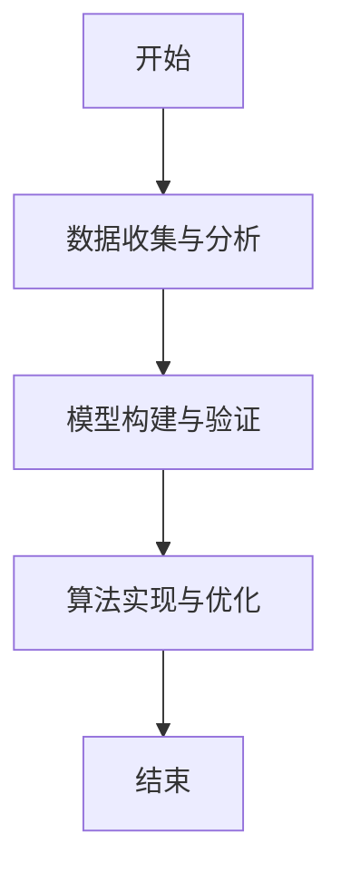

                 


# 生态系统服务付费机制的投资模式探讨

## 关键词：生态系统服务、付费机制、投资模式、博弈论、系统架构、数学模型

## 摘要：生态系统服务付费机制是一种通过建立明确的付费规则和投资模式，来实现对生态系统服务的有效供给和合理分配的机制。本文将从生态系统服务付费机制的背景、核心原理、算法实现、系统架构设计、项目实战以及最佳实践等多方面进行深入探讨，分析其在实际应用中的优势与挑战，并提出相应的优化建议。

---

## 第一部分：生态系统服务付费机制的背景与基础

### 第1章：生态系统服务付费机制的概述

#### 1.1 生态系统服务的定义与内涵

- **1.1.1 生态系统服务的定义**  
  生态系统服务是指生态系统为人类和其他生物提供的各种直接或间接的效益，包括 provisioning（ provisioning services）、regulating（regulating services）、cultural（cultural services）和 supporting（supporting services）四大类。

- **1.1.2 生态系统服务的核心内涵**  
  生态系统服务不仅是自然过程的产物，更是人类生存和发展的基础。例如，森林提供木材、调节气候、净化空气、涵养水源等。

- **1.1.3 生态系统服务的分类与特征**  
  - ** provisioning services**：直接提供食物、水、木材等资源。
  - ** regulating services**：调节气候、水循环、疾病控制等。
  - ** cultural services**：提供休闲、教育、精神满足等文化价值。
  - ** supporting services**：支持其他生态系统服务的生态过程，如土壤形成、养分循环等。

#### 1.2 生态系统服务付费机制的背景

- **1.2.1 当前生态系统服务面临的挑战**  
  - 自然资源过度开发导致生态退化。
  - 生态系统服务的外部性问题，即受益者不付费，破坏者不承担责任。
  - 市场失灵：生态系统服务难以通过市场定价。

- **1.2.2 生态系统服务付费机制的提出背景**  
  - 全球可持续发展目标的推动。
  - 政府在环境保护方面的责任与压力。
  - 市场机制在资源配置中的重要性。

- **1.2.3 生态系统服务付费机制的必要性**  
  - 通过付费机制，将生态系统的间接价值转化为经济价值。
  - 促进生态保护与经济发展的平衡。
  - 鼓励社会资本参与生态保护投资。

#### 1.3 生态系统服务付费机制的投资模式

- **1.3.1 投资模式的定义与分类**  
  - 定义：生态系统服务付费机制的投资模式是指通过政府购买、市场交易等方式，将生态系统服务的价值转化为经济收益，吸引投资者参与生态保护和可持续发展。
  - 分类：政府主导型、市场主导型、混合型。

- **1.3.2 生态系统服务付费机制的投资特点**  
  - 长期性：生态系统的恢复和维护需要长期投资。
  - 公益性：生态保护具有较强的公共利益属性。
  - 多元性：涉及政府、企业、非营利组织等多个主体。

- **1.3.3 生态系统服务付费机制的实施路径**  
  - 制定生态系统服务的定价标准。
  - 建立市场化交易平台。
  - 设计合理的激励机制，吸引社会资本参与。

#### 1.4 本章小结

本章主要介绍了生态系统服务的基本概念、付费机制的背景及必要性，以及其投资模式的特点和实施路径。生态系统服务付费机制的建立是实现生态保护与经济发展平衡的重要手段，而其投资模式的设计则是机制成功的关键。

---

## 第二部分：生态系统服务付费机制的核心概念与联系

### 第2章：生态系统服务付费机制的核心原理

#### 2.1 生态系统服务付费机制的原理

- **2.1.1 付费机制的基本原理**  
  生态系统服务付费机制通过将生态系统的间接价值转化为经济收益，实现生态资源的可持续利用。其核心是建立一个合理的定价机制，确保生态服务的供给者能够获得相应的经济回报。

- **2.1.2 生态系统服务付费机制的实现逻辑**  
  - 确定生态系统服务的范围和价值。
  - 设计合理的付费标准和支付方式。
  - 建立支付机制，确保资金的合理分配。

- **2.1.3 付费机制与投资模式的内在联系**  
  付费机制是投资模式的基础，而投资模式则是付费机制的具体实现方式。通过投资模式，可以将付费机制的理论转化为实际操作，实现生态资源的可持续管理。

#### 2.2 生态系统服务付费机制的核心要素

- **2.2.1 服务提供者**  
  包括政府、企业、非营利组织等，负责提供生态系统服务。

- **2.2.2 服务消费者**  
  包括企业和个人，通过付费方式获得生态系统服务。

- **2.2.3 付费机制设计**  
  包括定价模型、支付方式、收益分配机制等。

- **2.2.4 投资模式的多样性**  
  包括政府主导型、市场主导型、混合型等多种模式。

#### 2.3 生态系统服务付费机制的概念属性对比表

| 比较维度 | 传统付费机制 | 生态系统服务付费机制 |
|----------|--------------|----------------------|
| 服务对象 | 企业或个人 | 包括企业、个人和自然生态系统 |
| 服务范围 | 仅限于直接商品或服务 | 包括 provisioning、regulating、cultural 和 supporting 四大类 |
| 付费主体 | 政府或企业 | 政府、企业和社会组织均可参与 |
| 付费方式 | 一次性支付或分期支付 | 可能包括长期合同和绩效支付 |

#### 2.4 生态系统服务付费机制的ER实体关系图

```mermaid
erDiagram
    actor 用户角色
    actor 政府机构
    actor 企业
    actor 非营利组织
    actor 生态系统服务提供者
    actor 付费机制设计者

    用户角色 --> 支付平台
    政府机构 --> 支付平台
    企业 --> 支付平台
    非营利组织 --> 支付平台
    生态系统服务提供者 --> 支付平台
    付费机制设计者 --> 支付平台
```

---

### 第3章：生态系统服务付费机制的算法原理

#### 3.1 算法原理概述

- **3.1.1 生态系统服务付费机制的算法目标**  
  确定生态系统服务的经济价值，设计合理的定价模型，确保付费机制的公平性和可持续性。

- **3.1.2 算法的基本思路**  
  - 确定生态系统服务的类型和范围。
  - 通过博弈论模型确定各参与方的收益分配。
  - 设计动态调整机制，确保付费机制的灵活性和适应性。

- **3.1.3 算法的实现步骤**  
  - 数据收集与分析。
  - 模型构建与验证。
  - 算法实现与优化。

#### 3.2 算法流程图



#### 3.3 算法实现的Python代码

```python
def ecosystem_service_payment(service_type, service_value):
    # 简单的定价模型：固定比例收费
    payment = service_value * 0.1
    return payment

# 示例调用
service_value = 1000  # 生态系统服务的价值
payment = ecosystem_service_payment("carbon_sequestration", service_value)
print(f"支付金额为：{payment}")
```

#### 3.4 数学模型与公式

- **3.4.1 收益分配模型**  
  假设生态系统服务的总价值为 $V$，政府、企业和非营利组织的收益分配比例分别为 $a$、$b$ 和 $c$，则：

  $$
  a = V \times \alpha \\
  b = V \times \beta \\
  c = V \times \gamma \\
  \alpha + \beta + \gamma = 1
  $$

  其中，$\alpha$、$\beta$、$\gamma$ 分别为政府、企业和非营利组织的分配比例。

- **3.4.2 价格调整模型**  
  根据市场供需变化，价格 $P$ 的调整公式为：

  $$
  P_{new} = P_{old} \times (1 + \delta)
  $$

  其中，$\delta$ 是价格调整系数，取值范围为 $0 < \delta < 1$。

---

## 第三部分：生态系统服务付费机制的系统架构与设计

### 第4章：生态系统服务付费机制的系统架构设计

#### 4.1 系统功能设计

- **4.1.1 领域模型**  
  使用 Mermaid 类图表示生态系统服务付费机制的领域模型。

  ```mermaid
  classDiagram
      class 用户 {
          用户ID
          用户类型
          用户名称
      }
      class 支付平台 {
          支付ID
          交易金额
          交易时间
      }
      class 生态系统服务提供者 {
          服务ID
          服务类型
          服务价值
      }
      用户 --> 支付平台
      生态系统服务提供者 --> 支付平台
  ```

- **4.1.2 系统架构设计**  
  使用 Mermaid 架构图表示系统架构。

  ```mermaid
  architecture
      客户端
      服务器
      数据库
      支付网关
      第三方服务
  ```

- **4.1.3 系统接口设计**  
  - 用户端接口：提交支付请求。
  - 支付平台接口：处理支付请求，生成交易记录。
  - 服务提供者接口：接收支付款项，提供生态系统服务。

- **4.1.4 系统交互序列图**  
  ```mermaid
  sequenceDiagram
      用户 -> 支付平台: 提交支付请求
      支付平台 -> 用户: 返回支付确认
      用户 -> 生态系统服务提供者: 确认服务需求
      生态系统服务提供者 -> 用户: 提供服务
  ```

---

## 第四部分：生态系统服务付费机制的项目实战

### 第5章：项目实战与案例分析

#### 5.1 项目环境安装

- **5.1.1 系统环境**  
  - 操作系统：Linux/Windows/MacOS
  - Python版本：3.8+

- **5.1.2 依赖库安装**  
  ```bash
  pip install mermaid、numpy、matplotlib
  ```

#### 5.2 核心代码实现

- **5.2.1 生态系统服务定价模型**  
  ```python
  def calculate_payment(service_value, allocation_ratio):
      payment = service_value * allocation_ratio
      return payment

  # 示例：政府、企业和非营利组织的分配比例分别为0.5、0.3、0.2
  allocation_ratio = [0.5, 0.3, 0.2]
  service_value = 1000
  payment = calculate_payment(service_value, allocation_ratio)
  print(f"支付金额为：{payment}")
  ```

- **5.2.2 价格调整模型**  
  ```python
  def adjust_price(current_price, delta):
      new_price = current_price * (1 + delta)
      return new_price

  current_price = 100
  delta = 0.1
  new_price = adjust_price(current_price, delta)
  print(f"调整后的价格为：{new_price}")
  ```

#### 5.3 案例分析与解读

- **5.3.1 案例背景**  
  某地区希望通过生态系统服务付费机制，鼓励企业减少碳排放，提供碳汇服务。

- **5.3.2 案例实施步骤**  
  - 确定碳汇服务的价值。
  - 设计定价模型，分配收益。
  - 建立支付平台，实现交易。

- **5.3.3 实施结果与分析**  
  - 通过定价模型，企业获得相应的经济回报，提高了参与积极性。
  - 碳汇服务的供给增加，促进了地区的可持续发展。

---

## 第五部分：生态系统服务付费机制的最佳实践与总结

### 第6章：最佳实践与注意事项

#### 6.1 最佳实践

- **6.1.1 定价模型的科学性**  
  确保定价模型能够准确反映生态系统的实际价值。

- **6.1.2 支付机制的灵活性**  
  根据市场变化动态调整价格，确保机制的可持续性。

- **6.1.3 多方利益的平衡**  
  在设计投资模式时，要平衡政府、企业和非营利组织的利益。

#### 6.2 小结

本章总结了生态系统服务付费机制在实际应用中的最佳实践，强调了定价模型的科学性、支付机制的灵活性以及多方利益的平衡。这些原则对于机制的成功实施至关重要。

#### 6.3 注意事项

- 确保机制的透明性和公正性。
- 加强公众教育，提高生态意识。
- 定期评估机制的效果，及时调整。

#### 6.4 拓展阅读

- 推荐阅读《生态系统服务的经济价值评估》。
- 参考《博弈论与机制设计》的相关内容。

---

## 总结

通过本文的探讨，我们可以看到，生态系统服务付费机制的投资模式是一种创新的环境保护手段，其成功实施离不开科学的定价模型、灵活的支付机制以及多方利益的平衡。未来，随着技术的进步和社会的发展，生态系统服务付费机制将在更多的领域得到应用，为实现可持续发展做出重要贡献。

