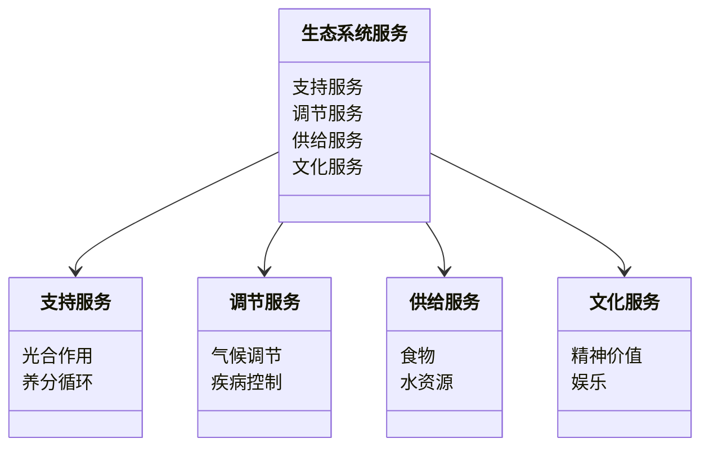
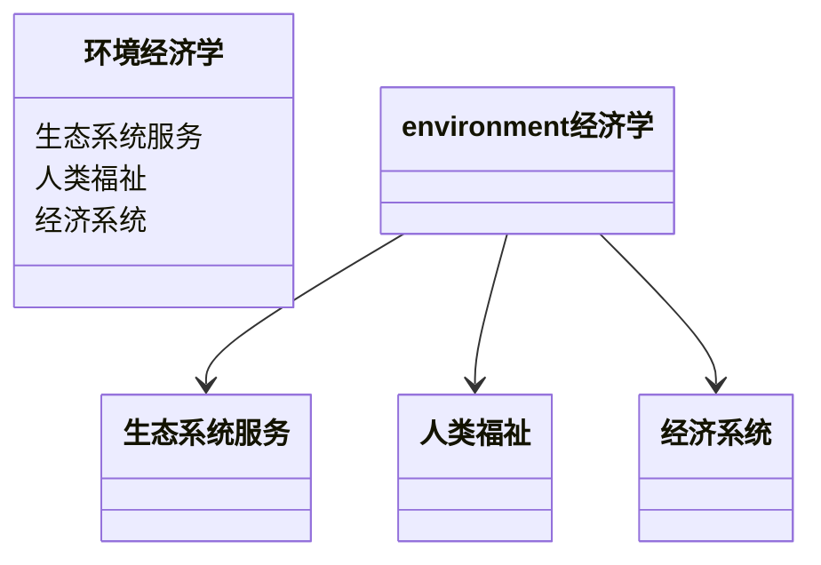
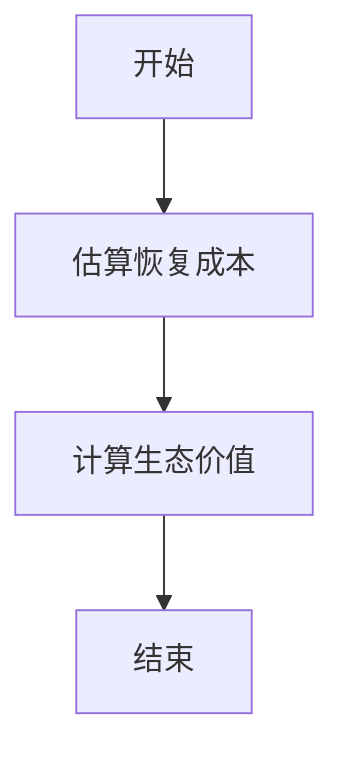
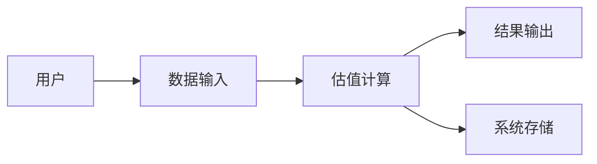
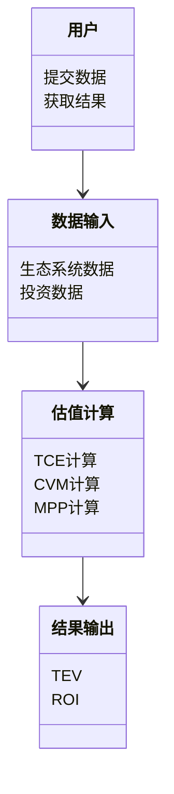
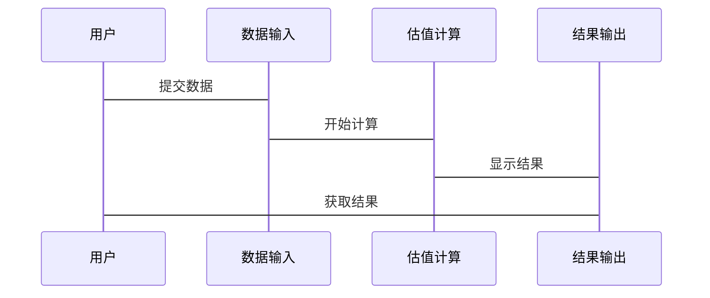

                 


# 生态系统服务估值方法在投资决策中的应用

## 关键词：生态系统服务、估值方法、投资决策、环境经济学、系统架构

## 摘要

本文系统地探讨了生态系统服务的估值方法及其在投资决策中的应用。首先，从生态系统服务的基本概念出发，分析其经济价值和分类体系。接着，详细介绍了几种主要的估值方法，如总量成本法（TCE）、替代市场法（CVM）和市场价格法（MPP），并比较了它们的优缺点。然后，构建了投资决策框架，分析了生态系统服务在投资决策中的影响。最后，通过系统架构设计和项目实战，展示了如何将这些方法应用于实际投资决策中，提出了系统实现的方案，并给出了案例分析。

---

## 第一部分：生态系统服务与估值方法概述

### 第1章：生态系统服务的背景与概念

#### 1.1 生态系统服务的定义与分类

**定义：**  
生态系统服务是指自然生态系统提供的对人类有益的 goods 和 services，包括支持服务、调节服务、供给服务和文化服务。

**分类：**  
- **支持服务：** 提供生态系统的支持功能，如光合作用、养分循环。
- **调节服务：** 调节气候、水文、疾病控制等。
- **供给服务：** 提供食物、水资源、能源等。
- **文化服务：** 提供精神、文化、娱乐价值。

**类图：**  


#### 1.2 生态系统服务的经济价值

**非市场价值：**  
无法直接用市场价格衡量的生态服务价值，如生态系统的调节功能。

**市场化价值：**  
通过市场交易获得的生态服务价值，如有机农产品的销售。

**外在化成本：**  
生态破坏带来的外部成本，如环境污染的治理费用。

**比较表：**  
| 类别       | 特征                       |
|------------|----------------------------|
| 非市场价值 | 无法直接交易，需间接估算 |
| 市场化价值 | 可通过市场交易获得         |
| 外在化成本 | 生态破坏带来的外部成本   |

#### 1.3 估值方法的理论基础

**环境经济学：**  
研究环境与经济系统交互的学科，关注生态系统的经济价值评估。

**生态系统服务与人类福祉：**  
生态系统服务是人类福祉的重要组成部分，影响经济和社会发展。

**类图：**  


#### 1.4 本章小结

本章介绍了生态系统服务的基本概念、分类及其经济价值，为后续估值方法的分析奠定了基础。

---

## 第二部分：生态系统服务的估值方法

### 第2章：生态系统服务的直接与间接估值方法

#### 2.1 总量成本法（TCE）

**原理：**  
通过估算恢复生态系统服务的成本，计算其价值。

**步骤：**  
1. 估算恢复或替代生态系统的成本。
2. 计算生态系统的总价值。

**优缺点：**  
- 优点：简单易行，适用于数据 scarce 的情况。
- 缺点：忽略市场交易数据，可能低估价值。

**流程图：**  


#### 2.2 替代市场法（CVM）

**理论基础：**  
通过问卷调查，了解人们对生态服务的支付意愿（WTP）。

**实施步骤：**  
1. 设计问卷，收集数据。
2. 计算平均支付意愿，确定价值。

**优缺点：**  
- 优点：考虑了个体差异，数据更准确。
- 缺点：实施成本高，需大量数据。

**比较表：**  
| 方法   | 理论基础 | 实施步骤 | 优缺点                     |
|--------|----------|----------|---------------------------|
| TCE    | 成本补偿 | 估算恢复成本 | 简单，但可能低估价值       |
| CVM    | WTP      | 调查问卷   | 准确，但成本高             |

#### 2.3 市场价格法（MPP）

**定义：**  
基于市场交易价格，直接估算生态服务价值。

**与TCE和CVM的区别：**  
- TCE：估算恢复成本。
- CVM：调查WTP。
- MPP：直接使用市场价格。

**局限性：**  
仅适用于有市场交易的生态服务，无法评估非市场价值。

#### 2.4 生态系统服务的总价值评估

**总经济价值（TEV）：**  
TEV = TCE + CVM

**计算公式：**  
$$ TEV = \sum_{i=1}^{n} (TCE_i + CVM_i) $$

**比较分析：**  
TCE适用于数据 scarce 的情况，CVM更准确，MPP适用于有市场交易的情况。

---

## 第三部分：生态系统服务估值在投资决策中的应用

### 第3章：生态系统服务与投资决策的关系

#### 3.1 投资决策中的生态因素

**生态系统的经济价值：**  
生态系统的调节、供给和文化服务直接影响投资回报。

**生态风险：**  
生态破坏可能导致投资损失，增加投资风险。

**长期价值：**  
生态系统服务的长期稳定为投资带来持续收益。

#### 3.2 投资决策框架的构建

**多维度分析：**  
- 经济效益
- 生态风险
- 社会影响

**权衡与优化：**  
综合考虑生态、经济和社会因素，优化投资决策。

**数学模型：**  
$$ ROI = \frac{TEV}{Investment} \times 100\% $$

#### 3.3 投资决策中的生态系统服务模型

**动态评估模型：**  
$$ V(t) = V(0) \times e^{rt} $$  
其中，\( r \) 为生态价值增长率，\( t \) 为时间。

**系统架构图：**  


---

## 第四部分：项目实战与系统设计

### 第4章：生态系统服务估值的系统实现

#### 4.1 系统架构设计

**系统架构图：**  


#### 4.2 系统功能设计

**领域模型类图：**  


#### 4.3 系统接口与交互设计

**交互序列图：**  


#### 4.4 项目实战

**环境安装：**  
安装Python和相关库（numpy, pandas, matplotlib）。

**核心代码实现：**  
```python
import numpy as np
import pandas as pd

def tce_method(costs):
    return np.sum(costs)

def cvm_method(wtp):
    return np.mean(wtp)

def mpp_method(price, quantity):
    return np.sum(price * quantity)

# 示例数据
costs = [100, 200, 300]
wtp = [50, 60, 70]
price = [10, 20, 30]
quantity = [5, 6, 7]

tce = tce_method(costs)
cvm = cvm_method(wtp)
mpp = mpp_method(price, quantity)

tev = tce + cvm
roi = tev / (price * quantity.sum()) * 100
print(f"TEV: {tev}")
print(f"ROI: {roi}%")
```

**案例分析：**  
以某湿地保护项目为例，计算TEV和ROI，评估投资回报。

---

## 总结

本文详细探讨了生态系统服务的估值方法及其在投资决策中的应用。通过系统架构设计和项目实战，展示了如何将这些方法应用于实际投资决策中。未来，随着环境经济学的发展，生态系统服务的估值方法将更加精确，投资决策将更加科学。

---

**注意事项：**  
本文内容基于理论分析和实际案例，投资者应结合具体情况进行综合判断。

