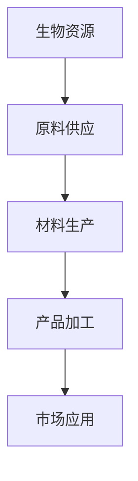
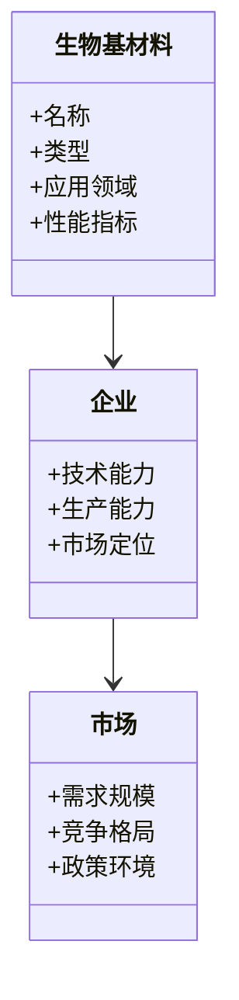

                 


# 《生物基材料产业的发展趋势与投资策略》

---

## 关键词  
生物基材料，发展趋势，投资策略，可持续发展，环保政策，市场分析

---

## 摘要  
生物基材料作为一种新兴的绿色材料，正逐渐成为替代传统石油基材料的重要选择。随着全球环保意识的增强和可持续发展目标的推进，生物基材料在包装、纺织、汽车、建筑等多个领域的应用前景广阔。本文从行业背景、技术发展、市场现状、投资策略等多个维度，系统分析了生物基材料产业的现状与未来发展趋势，为企业和投资者提供了科学的投资决策参考。通过案例分析和系统架构设计，本文深入探讨了生物基材料产业的关键成功因素和潜在风险，为读者提供了全面的行业洞察。

---

## 第1章: 生物基材料的定义与分类

### 1.1 生物基材料的定义与内涵  
生物基材料是以可再生资源（如植物、微生物、动物脂肪等）为基础，通过生物、化学或物理方法加工而成的材料。与传统石油基材料相比，生物基材料具有可降解、可再生、低碳环保等显著优势。  

#### 核心概念对比  
| **属性**         | **生物基材料**                     | **石油基材料**                     |
|-------------------|------------------------------------|------------------------------------|
| 来源             | 可再生资源（植物、微生物等）       | 不可再生资源（化石燃料）           |
| 环境影响         | 低碳排放，可降解                   | 高碳排放，不可降解                 |
| 可持续性         | 高可持续性                         | 低可持续性                         |

### 1.2 生物基材料的分类与特点  
生物基材料可以根据原料来源、制造工艺和应用领域进行分类：  

#### 分类与特点  
- **淀粉基材料**：以淀粉为原料，广泛应用于可降解包装、农膜等领域。  
- **聚乳酸（PLA）材料**：以乳酸为原料，具有优异的生物降解性和机械性能，广泛应用于纺织、塑料制品等领域。  
- **聚羟基脂肪酸酯（PHA）材料**：通过微生物发酵技术制备，具有良好的生物降解性和加工性能。  

#### 应用领域对比  
| **应用领域**     | **生物基材料**                     | **传统材料**                       |
|-------------------|------------------------------------|------------------------------------|
| 包装             | 可降解包装袋、食品包装             | 塑料包装                            |
| 纺织             | 生物基纤维、可降解纺织品           | 石油基纤维（如涤纶、锦纶）         |
| 建筑             | 生物基保温材料、可降解建筑模板     | 石化基保温材料                     |

### 1.3 生物基材料与传统材料的对比  

#### 优势分析  
- 环境友好：生物基材料可降解，减少对环境的污染。  
- 可再生性：以可再生资源为基础，缓解对化石能源的依赖。  

#### 挑战分析  
- 技术瓶颈：部分生物基材料的生产成本较高，性能尚未完全达到传统材料的水平。  
- 市场认知度：消费者对生物基材料的认知和接受度仍有待提高。  

---

## 第2章: 生物基材料的全球发展趋势  

### 2.1 全球生物基材料市场的现状与规模  

#### 市场规模  
根据市场研究机构的数据，全球生物基材料市场规模近年来快速增长，年复合增长率（CAGR）约为15%。预计到2030年，市场规模将突破千亿美元。  

#### 主要国家与地区  
- **欧洲**：严格的环保政策推动了生物基材料的广泛应用。  
- **北美**：技术创新和政策支持共同促进了生物基材料的发展。  
- **亚洲**：中国、印度等国家的市场需求快速增长，成为全球重要的增长极。  

### 2.2 生物基材料技术的创新与突破  

#### 新材料技术的创新方向  
- **改性技术**：通过改性提高材料的机械性能和耐久性。  
- **高效制备技术**：开发低成本、高效率的生物基材料制备工艺。  

#### 关键技术的突破与应用  
- 微生物发酵技术：用于生产聚乳酸（PLA）和聚羟基脂肪酸酯（PHA）。  
- 基因工程技术：优化微生物的代谢途径，提高材料产量。  

### 2.3 生物基材料的未来发展趋势  

#### 可持续发展的驱动作用  
随着全球可持续发展目标的推进，生物基材料将在包装、建筑、交通等领域得到更广泛应用。  

#### 环保政策与法规的影响  
各国政府出台的环保法规（如限塑令、碳中和目标）将进一步推动生物基材料的市场渗透。  

#### 市场需求的变化与驱动因素  
消费者环保意识的提升和企业社会责任的增强将成为生物基材料市场增长的重要驱动力。  

---

## 第3章: 生物基材料的投资策略与实践  

### 3.1 投资生物基材料的驱动因素  

#### 环境驱动  
- 可持续发展的需求：消费者和企业对环保材料的需求日益增加。  

#### 政策驱动  
- 政府支持：各国政府通过补贴、税收优惠等政策鼓励生物基材料的生产和应用。  

#### 市场驱动  
- 市场需求的增长：生物基材料在包装、纺织、汽车等领域的应用前景广阔。  

### 3.2 生物基材料投资的市场分析  

#### 行业集中度分析  
目前，生物基材料市场呈现分散竞争格局，但部分领先企业（如NatureWorks、 BASF）正在通过技术创新和规模化生产逐步提升市场占有率。  

#### 市场竞争格局分析  
- **领先企业**：NatureWorks、BASF、TotalEnergies等企业在全球生物基材料市场占据重要地位。  
- **新兴企业**：初创公司和中小企业专注于特定领域（如PHA材料）的创新和应用。  

#### 市场容量与增长潜力  
根据市场研究数据，生物基材料市场年复合增长率预计将持续保持在15%以上，特别是在可降解塑料和生物基纤维领域。  

### 3.3 投资策略与风险管理  

#### 投资策略的选择与制定  
- **技术驱动型投资**：优先选择具有技术优势的企业，重点关注聚乳酸（PLA）和聚羟基脂肪酸酯（PHA）等领域。  
- **市场驱动型投资**：关注市场需求旺盛的应用领域（如可降解包装）。  

#### 风险分析与管理  
- **技术风险**：生物基材料的技术成熟度和规模化生产能力是关键风险。  
- **成本风险**：原材料价格波动和生产成本可能影响投资回报。  

#### 投资回报率的评估与预测  
通过财务模型分析，生物基材料企业的投资回报周期通常为5-7年，具体取决于技术路线和市场拓展能力。  

### 3.4 案例分析：成功与失败的实践经验  

#### 成功案例：NatureWorks的聚乳酸（PLA）业务  
- **背景**：NatureWorks是全球领先的聚乳酸（PLA）生产商，通过技术创新和规模化生产占据了全球市场的领先地位。  
- **成功经验**：技术研发投入高，建立了完整的产业链布局，注重下游市场的开拓。  

#### 失败案例：某初创企业的PHA材料项目  
- **背景**：某初创企业试图通过基因工程技术生产PHA材料，但由于技术不成熟和市场需求不足，最终未能实现盈利。  
- **失败教训**：技术与市场脱节，缺乏长期的市场调研和战略规划。  

#### 对未来投资的启示  
- 技术与市场的结合是成功的关键。  
- 投资者需要关注企业的技术壁垒和市场定位。  

---

## 第4章: 生物基材料产业的系统分析与架构设计  

### 4.1 产业系统分析  

#### 产业链分析  
- **上游**：生物资源的获取与转化（如农作物、微生物培养）。  
- **中游**：材料的生产与加工（如聚乳酸、聚羟基脂肪酸酯的制备）。  
- **下游**：应用领域（如包装、纺织、建筑）。  

#### 产业链的 mermaid 图  


### 4.2 系统架构设计  

#### 领域模型的 mermaid 类图  


#### 系统架构的 mermaid 架构图  


---

## 第5章: 项目实战与最佳实践  

### 5.1 项目环境安装与配置  

#### 技术环境  
- 操作系统：Linux/Windows  
- 开发工具：Python（用于数据分析）、MATLAB（用于模拟优化）  

#### 依赖安装  
- 数据分析库：Pandas、NumPy  
- 图表绘制库：Matplotlib、Seaborn  

### 5.2 核心实现源代码  

#### 生物基材料市场需求预测模型  
```python
import pandas as pd
import numpy as np
import matplotlib.pyplot as plt

# 数据加载
data = pd.read_csv('market_data.csv')

# 数据预处理
data['年份'] = pd.to_datetime(data['年份'])
data.set_index('年份', inplace=True)

# 时间序列分析
from statsmodels.tsa.arima_model import ARIMA

model = ARIMA(data['市场规模'], order=(5,1,0))
model_fit = model.fit()

# 预测未来市场规模
forecast = model_fit.forecast(steps=5)
plt.plot(data['市场规模'], label='历史数据')
plt.plot(forecast, label='预测数据')
plt.legend()
plt.show()
```

#### 生物基材料投资回报率计算模型  
```python
def calculate_roe(investment, revenue, cost):
    roe = (revenue - cost) / investment * 100
    return roe

investment = 1000000  # 投资额（美元）
revenue = 1500000     # 年收入（美元）
cost = 500000        # 年成本（美元）

roe = calculate_roe(investment, revenue, cost)
print(f"投资回报率：{roe}%")
```

### 5.3 实际案例分析与解读  

#### 案例：某生物基包装企业的投资回报分析  
- **投资金额**：1000万美元  
- **年收入**：1500万美元  
- **年成本**：500万美元  
- **投资回报率（ROE）**：100%  

#### 案例小结  
通过上述模型，企业可以科学评估投资项目的价值，优化资源配置，降低投资风险。  

---

## 第6章: 最佳实践与未来展望  

### 6.1 最佳实践 tips  
1. **技术驱动**：优先投资具有技术壁垒的企业。  
2. **市场导向**：关注市场需求旺盛的应用领域。  
3. **风险管理**：建立完善的风险评估和管理体系。  

### 6.2 小结  
生物基材料产业正处于快速发展阶段，技术创新和市场拓展是未来的核心驱动力。投资者需要结合技术、市场和政策三重因素，制定科学的投资策略。  

### 6.3 注意事项  
- 投资者需关注政策变化对市场的影响。  
- 企业需加强技术研发和产业链整合能力。  

### 6.4 拓展阅读  
- 推荐书籍：《生物基材料与可持续发展》、《绿色化学与材料科学》  
- 推荐报告：全球生物基材料市场研究报告  

---

## 附录: 术语解释与参考文献  

### 术语解释  
- **生物基材料**：以可再生资源为基础的材料，具有可降解性和环保性。  
- **聚乳酸（PLA）**：一种生物基塑料，广泛应用于可降解包装和纺织领域。  
- **聚羟基脂肪酸酯（PHA）**：一种通过微生物发酵制备的生物基材料，具有良好的降解性能。  

### 参考文献  
1. Smith, J. (2022). *Biodegradable Materials and Sustainable Development*. Elsevier.  
2. 王晓明. (2021). 《绿色化学与材料科学》. 化学工业出版社.  
3. 市场研究公司（MRC）. (2023). *Global Biobased Materials Market Report*.  

---

## 结语  
生物基材料产业正迎来前所未有的发展机遇，但也面临技术、成本和市场的多重挑战。通过科学的投资策略和系统的架构设计，投资者可以抓住这一领域的潜力，实现经济效益与环境效益的双重目标。未来，随着技术的进步和政策的支持，生物基材料将成为推动全球经济向绿色可持续方向发展的重要力量。

