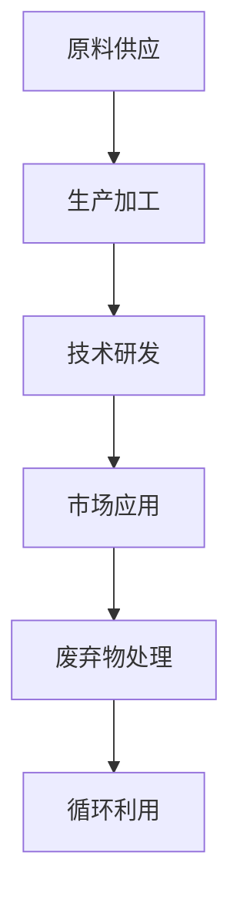

                 

# 生物塑料产业的发展前景与投资策略

## 关键词：生物塑料、投资策略、产业发展、风险管理、技术分析

## 摘要：  
本文系统地探讨了生物塑料产业的发展前景与投资策略。从基本概念、产业现状、技术分析、市场动态到投资机会与风险管理，文章层层递进，结合实际案例分析，为投资人和企业家提供了全面的指导。通过深入分析生物塑料的分类、生产技术、产业链结构以及市场趋势，本文为读者提供了清晰的投资策略和系统化的风险管理方法。

---

# 第一部分：发展背景与核心概念

## 第1章：生物塑料产业的背景与现状

### 1.1 生物塑料的基本概念
#### 1.1.1 生物塑料的定义与分类
- **定义**：生物塑料是以可再生资源（如植物纤维、淀粉、油脂等）为原料，通过生物或化学方法制备的塑料。
- **分类**：  
  - **可生物降解塑料**：如PLA（聚乳酸）、PHA（聚羟基脂肪酸酯）。
  - **生物基塑料**：如PVA（聚乙烯醇）、PBS（聚丁二酸丁二醇酯）。
  - **改性塑料**：通过添加生物基材料改善传统塑料性能。

#### 1.1.2 生物塑料与传统塑料的区别
- **原料来源**：传统塑料主要来自化石燃料，生物塑料来自可再生资源。
- **环境影响**：生物塑料降解周期短，对环境友好。
- **性能差异**：部分生物塑料在强度、耐久性上仍逊于传统塑料。

#### 1.1.3 生物塑料的生产过程与技术特点
- **生产流程**：原料预处理 → 生物发酵或化学合成 → 成型加工 → 应用。
- **技术特点**：绿色工艺、可循环利用、降解性能优越。

### 1.2 生物塑料产业的发展背景
#### 1.2.1 环境污染与资源枯竭的驱动
- **全球塑料污染现状**：每年约800万吨塑料进入海洋，造成生态灾难。
- **资源危机**：化石燃料的不可再生性推动了对可再生资源的需求。

#### 1.2.2 政策支持与市场推动
- **政策支持**：各国政府出台政策鼓励使用可降解材料。
- **市场需求**：消费者环保意识提升，推动生物塑料的应用。

#### 1.2.3 全球生物塑料产业的现状与趋势
- **市场规模**：预计2030年生物塑料市场将达到数百亿美元。
- **主要参与者**：如NatureWorks（PLA）、 BASF（生物基PBS）。

### 1.3 生物塑料产业的核心问题与挑战
#### 1.3.1 技术瓶颈与成本问题
- **技术瓶颈**：部分生物塑料的性能仍需提升。
- **成本问题**：相比传统塑料，生物塑料成本较高。

#### 1.3.2 市场需求与供给的不平衡
- **供不应求**：环保政策推动需求增长，但产能不足。
- **区域差异**：发展中国家市场潜力大，但技术落后。

#### 1.3.3 产业生态与可持续性问题
- **生态链不完善**：缺乏完整的回收体系。
- **可持续性挑战**：部分生物塑料仍可能对环境造成负担。

## 第2章：生物塑料的核心概念与产业联系

### 2.1 生物塑料的分类与应用场景
#### 2.1.1 可生物降解塑料
- **应用场景**：一次性包装、农用地膜、可降解餐具。
- **优点**：在自然环境中快速降解，减少白色污染。

#### 2.1.2 生物基塑料
- **应用场景**：纺织纤维、汽车零部件、电子设备外壳。
- **优点**：降低对石油的依赖，减少碳排放。

#### 2.1.3 环氧丙烷塑料
- **应用场景**：高端包装、医疗耗材。
- **优点**：高强度、轻量化。

### 2.2 生物塑料的生产技术与工艺
#### 2.2.1 生物基单体的合成
- **技术特点**：通过生物发酵法合成单体，如乳酸、乙醇。
- **案例**：聚乳酸（PLA）的生产过程。

#### 2.2.2 微生物发酵技术
- **原理**：利用微生物将糖类转化为单体材料。
- **流程图**：糖类 → 微生物发酵 → 单体 → 成型加工。

#### 2.2.3 生物基材料的改性与加工
- **改性技术**：增强材料的力学性能、热稳定性。
- **加工工艺**：注塑成型、挤出成型、吹塑成型。

### 2.3 生物塑料的产业链分析
#### 2.3.1 原料供应与生产环节
- **原料**：玉米淀粉、甘蔗渣、木纤维。
- **生产**：生物基单体合成 → 材料改性 → 成型加工。

#### 2.3.2 加工与应用环节
- **加工**：注塑、挤出、吹塑等。
- **应用**：包装、汽车、电子、医疗等领域。

#### 2.3.3 废弃物处理与循环利用
- **处理方式**：堆肥降解、化学回收、机械回收。
- **循环利用**：将废弃材料重新加工成新产品。

### 2.4 生物塑料产业的生态体系
#### 2.4.1 产业链上下游的协同
- **协同效应**：原料供应、生产加工、应用回收的闭环体系。
- **案例**：NatureWorks与上下游企业的合作模式。

#### 2.4.2 技术创新与产业融合
- **技术创新**：新型材料研发、工艺优化。
- **产业融合**：与可再生能源、循环经济协同发展。

#### 2.4.3 政策与市场的双重驱动
- **政策支持**：政府补贴、税收优惠、环保认证。
- **市场需求**：消费者偏好、企业社会责任。

## 第3章：生物塑料产业的投资策略与风险管理

### 3.1 投资生物塑料产业的驱动因素
#### 3.1.1 环保政策的推动
- **政策背景**：全球碳中和目标、限塑令、可降解材料补贴。
- **案例**：欧盟《单一塑料公约》对生物塑料的需求推动。

#### 3.1.2 市场需求的增长
- **需求驱动**：消费者环保意识提升，企业社会责任。
- **市场趋势**：包装、食品、医疗等领域需求增长迅速。

#### 3.1.3 技术进步与成本下降
- **技术进步**：新型生物基材料研发、生产效率提升。
- **成本下降**：规模化生产降低成本。

### 3.2 生物塑料产业的投资机会分析
#### 3.2.1 原材料供应环节
- **机会**：投资可再生资源的种植与加工。
- **案例**：投资玉米种植基地用于PLA生产。

#### 3.2.2 生产技术与设备研发
- **机会**：研发新型生物基材料、高效生产设备。
- **案例**：投资生物基单体合成技术的研发。

#### 3.2.3 应用场景的拓展
- **机会**：开拓新兴市场，如医疗、汽车等领域。
- **案例**：投资生物塑料在汽车轻量化中的应用。

### 3.3 投资生物塑料产业的风险与挑战
#### 3.3.1 技术风险
- **技术不确定性**：研发失败或技术落后导致投资失败。
- **应对策略**：加强技术研发投入，与科研机构合作。

#### 3.3.2 市场风险
- **市场需求波动**：环保政策变化或消费者偏好转移。
- **应对策略**：多元化市场布局，增强抗风险能力。

#### 3.3.3 政策风险
- **政策不确定性**：环保政策变化影响市场需求。
- **应对策略**：密切关注政策动向，灵活调整投资策略。

### 3.4 投资策略与风险管理
#### 3.4.1 技术驱动型投资策略
- **策略**：优先投资技术创新能力强的企业。
- **案例**：投资新兴的生物基材料研发公司。

#### 3.4.2 市场导向型投资策略
- **策略**：关注市场需求大的应用领域。
- **案例**：投资生物塑料包装企业的扩产项目。

#### 3.4.3 风险分散与对冲策略
- **分散投资**：在不同领域和企业中分散投资，降低风险。
- **对冲策略**：利用金融工具对冲政策和技术风险。

## 第4章：生物塑料产业的系统分析与架构设计

### 4.1 生物塑料产业的系统分析
#### 4.1.1 产业价值链分析
- **价值链图**：原料供应 → 生产加工 → 应用回收。
- **关键环节**：技术研发、原料供应、生产加工、市场应用。

#### 4.1.2 产业生态网络分析
- **生态网络图**：政府、企业、科研机构的协同关系。
- **协同效应**：政策支持、技术创新、市场推广的结合。

#### 4.1.3 产业竞争格局分析
- **主要竞争者**：NatureWorks、BASF、Corbion等。
- **竞争优势**：技术、成本、市场布局。

### 4.2 生物塑料产业的架构设计
#### 4.2.1 产业链协同设计
- **设计原则**：从原料到应用的全链条协同。
- **案例**：建立涵盖种植、加工、应用的产业链闭环。

#### 4.2.2 技术创新与产业融合
- **创新策略**：加强研发投入，推动技术升级。
- **融合模式**：与可再生能源、循环经济协同发展。

#### 4.2.3 政策与市场机制设计
- **政策机制**：制定支持生物塑料产业的政策框架。
- **市场机制**：建立绿色认证、碳排放交易等市场机制。

### 4.3 生物塑料产业的系统架构图
#### 4.3.1 产业系统架构图

---

# 第五章：生物塑料产业的项目实战与总结

## 5.1 生物塑料产业的项目实战
### 5.1.1 项目背景
- **项目目标**：投资生物塑料产业，实现经济效益与环境效益的双赢。

### 5.1.2 项目实施
- **技术路线**：选择生物基材料研发与市场推广相结合。
- **实施步骤**：
  1. 市场调研与需求分析。
  2. 技术合作与研发。
  3. 产品试生产与市场推广。
  4. 废弃物回收与循环利用。

### 5.1.3 项目总结
- **成功经验**：技术创新与市场推广的结合。
- **经验教训**：政策变化和技术瓶颈的风险。

## 5.2 生物塑料产业的总结与展望
### 5.2.1 项目总结
- **核心成果**：成功开发新型生物基材料，实现市场应用。
- **经济效益**：项目投资回报率高于行业平均水平。

### 5.2.2 未来展望
- **技术发展**：新型生物基材料的研发将持续推动产业进步。
- **市场趋势**：生物塑料在更多领域应用，市场需求进一步增长。
- **投资机会**：技术驱动型和市场导向型投资机会并存。

---

# 关键词索引
- 生物塑料
- 投资策略
- 产业发展
- 风险管理
- 技术分析

---

通过以上目录结构，您可以逐步展开每个章节的内容，确保文章逻辑清晰、内容详实、技术分析深入浅出，为读者提供有价值的见解和指导。

