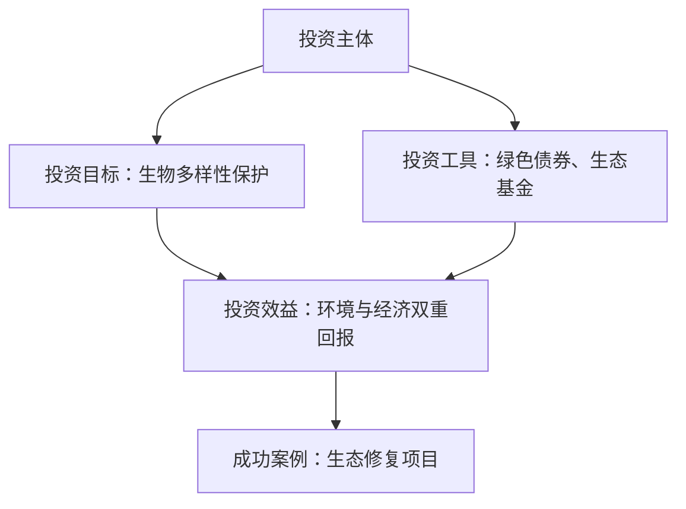
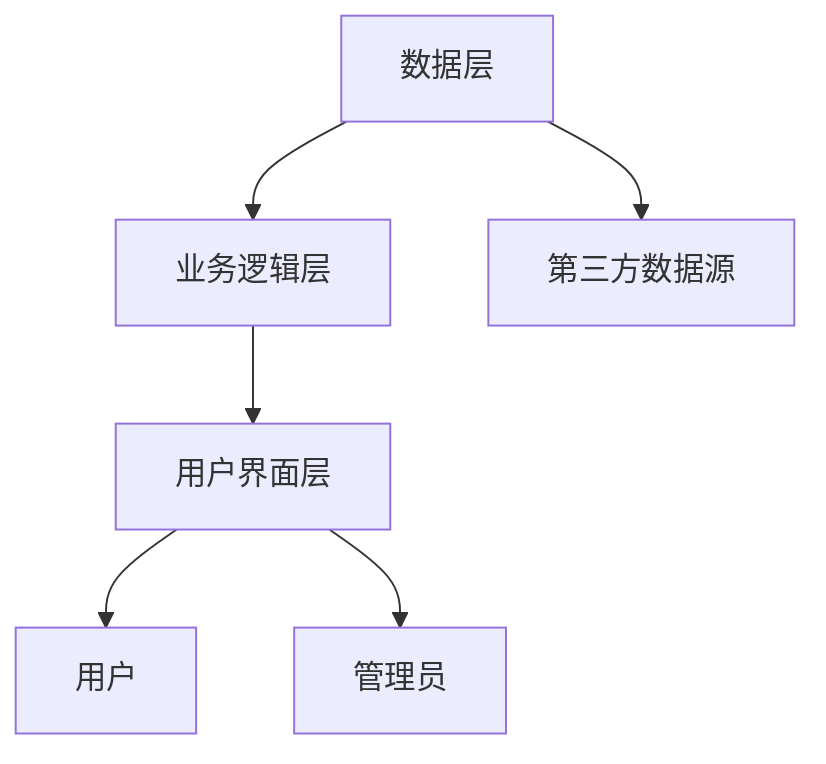
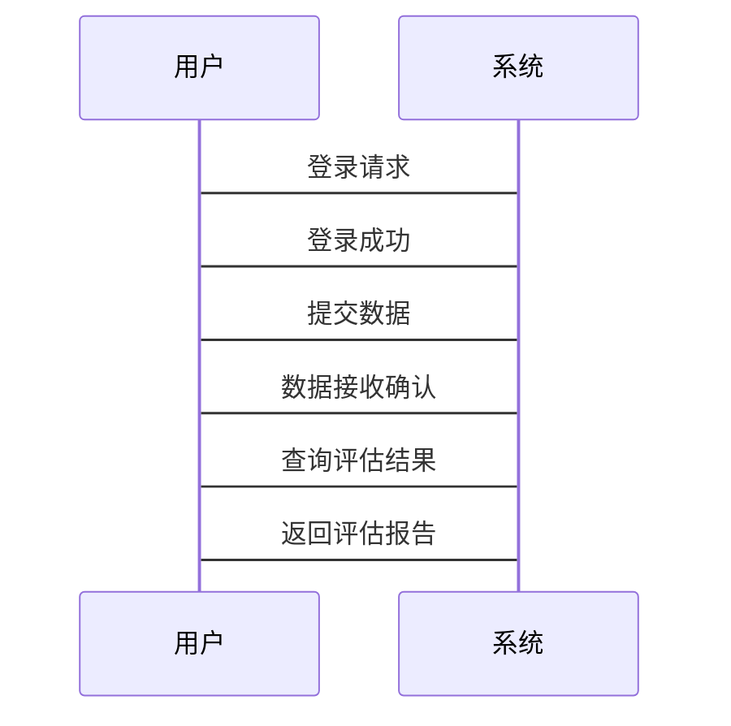

                 


# 生物多样性保护与生态投资机会

## 关键词：
- 生物多样性保护
- 生态投资
- 可持续发展
- 环境保护
- 经济发展

## 摘要：
本文探讨了生物多样性保护与生态投资之间的内在联系，分析了如何通过投资手段促进生物多样性保护，实现经济发展与环境保护的双赢。文章从背景介绍、核心概念、算法原理、系统架构设计、项目实战以及最佳实践等多个方面展开，结合实际案例和数学模型，详细阐述了生物多样性保护的必要性、生态投资的潜力以及两者结合的具体路径。通过本文的分析，读者将能够深入了解生物多样性保护的重要性，掌握生态投资的基本原理，并学会如何在实际项目中应用相关技术和方法。

---

## 目录大纲：

### 第1章：生物多样性保护的背景与挑战
1.1 生物多样性保护的背景
1.2 生物多样性减少的问题背景与问题描述
1.3 生物多样性保护的解决方案与边界
1.4 生物多样性保护的核心要素

### 第2章：生态投资的核心概念与联系
2.1 生态投资的基本概念
2.2 生物多样性保护与生态投资的关系
2.3 生态投资的核心概念模型

### 第3章：生物多样性保护的算法原理
3.1 生物多样性评估算法
3.2 生态投资决策模型
3.3 数学模型与代码实现

### 第4章：生物多样性保护系统的系统架构设计
4.1 系统项目背景与目标
4.2 系统功能设计
4.3 系统架构设计
4.4 系统接口与交互流程

### 第5章：基于生态投资的生物多样性保护项目实战
5.1 项目背景与目标
5.2 核心代码实现
5.3 项目实施过程与结果分析
5.4 项目总结与经验分享

### 第6章：生物多样性保护与生态投资的最佳实践
6.1 生态投资的成功案例分析
6.2 生物多样性保护的最佳实践策略
6.3 未来趋势与发展方向
6.4 注意事项与风险提示

### 第7章：结论与展望
7.1 文章总结
7.2 未来研究方向
7.3 读者思考与行动建议

---

## 正文：

### 第1章：生物多样性保护的背景与挑战

#### 1.1 生物多样性保护的背景
生物多样性是地球上生命多样性的总称，包括基因多样性、物种多样性和生态系统多样性。近年来，由于人类活动的加剧，全球生物多样性面临前所未有的威胁。生物多样性的减少不仅影响生态系统的稳定性，还会影响人类的生存环境和经济发展。因此，保护生物多样性已成为全球关注的焦点。

#### 1.2 生物多样性减少的问题背景与问题描述
1.2.1 问题背景：人类活动导致的栖息地破坏、气候变化、过度捕捞和污染等是生物多样性减少的主要原因。  
1.2.2 问题描述：生物多样性减少导致生态系统服务功能退化，例如水土保持、授粉等自然服务功能减弱，威胁粮食安全和人类健康。

#### 1.3 生物多样性保护的解决方案与边界
1.3.1 解决方案：通过政策法规、国际合作和科技创新等多种手段，推动生物多样性保护与可持续发展相结合。  
1.3.2 边界：生物多样性保护的范围主要集中在自然保护区、森林、湿地等关键生态系统，同时需要考虑与农业、渔业等经济活动的协调。

#### 1.4 生物多样性保护的核心要素
1.4.1 核心要素：包括法律法规、资金支持、技术创新和公众参与等。  
1.4.2 关键行动：设立保护区、实施生态修复项目、推广可持续农业等。

---

### 第2章：生态投资的核心概念与联系

#### 2.1 生态投资的基本概念
生态投资是指将资金投入到能够产生环境效益和经济效益的项目中，例如可再生能源、绿色交通和生态保护项目等。生态投资不仅关注经济回报，还注重对环境的积极影响。

#### 2.2 生物多样性保护与生态投资的关系
2.2.1 资源基础：生物多样性保护为生态投资提供了丰富的资源和生态服务功能。  
2.2.2 经济驱动：通过生态投资，可以为生物多样性保护项目提供资金支持，推动其可持续发展。

#### 2.3 生态投资的核心概念模型
使用Mermaid图展示生态投资的核心概念模型，包括投资主体、投资目标和投资效益等关键要素。



---

### 第3章：生物多样性保护的算法原理

#### 3.1 生物多样性评估算法
3.1.1 算法介绍：基于生物多样性指数的计算模型，用于评估区域生物多样性的健康状况。  
3.1.2 算法实现：使用Python编写生物多样性指数计算代码，输入物种数量和分布数据，输出多样性指数。

```python
def calculate_biodiversity_index(species_list):
    species_count = len(species_list)
    if species_count == 0:
        return 0
    # 计算香农多样性指数
    proportions = [count / species_count for count in species_list]
    shannon_index = -sum([p * math.log(p) for p in proportions])
    return shannon_index

# 示例数据
species_counts = [10, 5, 8, 3]
biodiversity_index = calculate_biodiversity_index(species_counts)
print(f"生物多样性指数：{biodiversity_index}")
```

#### 3.2 生态投资决策模型
3.2.1 模型介绍：基于环境和社会治理（ESG）框架的生态投资决策模型，用于评估投资项目对环境的积极影响和经济回报潜力。  
3.2.2 模型实现：使用Python编写决策树模型，输入项目参数，输出投资建议。

```python
def investment_decision(income, risk, impact):
    if impact >= 0.8 and income >= 10:
        return "强烈推荐"
    elif impact >= 0.6 and income >= 5:
        return "值得考虑"
    else:
        return "不建议"

# 示例数据
project_income = 8
project_risk = 3
project_impact = 0.7
decision = investment_decision(project_income, project_risk, project_impact)
print(f"投资决策：{decision}")
```

#### 3.3 数学模型与代码实现
3.3.1 生物多样性指数计算模型：香农多样性指数公式。  
$$ \text{香农指数} = -\sum_{i=1}^{n} p_i \log p_i $$  
其中，$p_i$ 是第 $i$ 个物种的比例，$n$ 是物种总数。

---

### 第4章：生物多样性保护系统的系统架构设计

#### 4.1 系统项目背景与目标
系统目标是通过数字化手段，支持生物多样性保护项目管理与生态投资决策。项目背景包括政策支持、技术进步和市场需求。

#### 4.2 系统功能设计
4.2.1 系统功能模块：数据采集、评估分析、投资决策、项目管理。  
4.2.2 功能流程：数据采集 → 评估分析 → 投资决策 → 项目实施 → 监测反馈。

#### 4.3 系统架构设计
使用Mermaid图展示系统架构，包括数据层、业务逻辑层和用户界面层。



#### 4.4 系统接口与交互流程
使用Mermaid序列图展示系统交互流程，包括用户登录、数据提交、评估结果查询等。



---

### 第5章：基于生态投资的生物多样性保护项目实战

#### 5.1 项目背景与目标
项目目标是通过生态投资，恢复某一地区的生物多样性，同时实现经济回报。

#### 5.2 核心代码实现
5.2.1 环境配置：安装必要的Python库，如NumPy和Pandas。  
5.2.2 核心代码：编写用于项目评估的Python脚本，包括数据处理和模型计算。

```python
import numpy as np
import pandas as pd

def project_assessment(data):
    df = pd.DataFrame(data)
    # 计算生物多样性指数
    species_count = df['species'].value_counts().sort_values(ascending=False)
    shannon_index = -sum([p * np.log(p) for p in species_count / species_count.sum()])
    return shannon_index

# 示例数据
data = {'species': ['A', 'B', 'A', 'C', 'B', 'C']}
assessment_result = project_assessment(data)
print(f"项目评估结果：{assessment_result}")
```

#### 5.3 项目实施过程与结果分析
5.3.1 实施过程：包括数据采集、模型计算、投资决策和项目执行。  
5.3.2 成果分析：评估项目对生物多样性的提升效果和经济回报。

#### 5.4 项目总结与经验分享
总结项目实施的经验和教训，提出改进建议。

---

### 第6章：生物多样性保护与生态投资的最佳实践

#### 6.1 生态投资的成功案例分析
分析国内外成功的生态投资案例，总结经验教训。

#### 6.2 生物多样性保护的最佳实践策略
包括政策支持、技术创新和公众参与等策略。

#### 6.3 未来趋势与发展方向
预测生物多样性保护与生态投资的未来发展趋势，如绿色金融、数字化技术的应用。

#### 6.4 注意事项与风险提示
提醒读者注意投资风险和环境不确定性，建议制定风险管理策略。

---

### 第7章：结论与展望

#### 7.1 文章总结
总结全文内容，强调生物多样性保护与生态投资的重要性。

#### 7.2 未来研究方向
提出未来研究的方向，如新技术在生物多样性保护中的应用。

#### 7.3 读者思考与行动建议
鼓励读者思考如何在实际工作中应用相关知识，并采取行动支持生物多样性保护。

---

## 结语：
通过本文的详细分析，读者可以全面了解生物多样性保护与生态投资的内在联系，掌握相关技术和方法，并在实际项目中应用这些知识，为实现可持续发展贡献力量。

