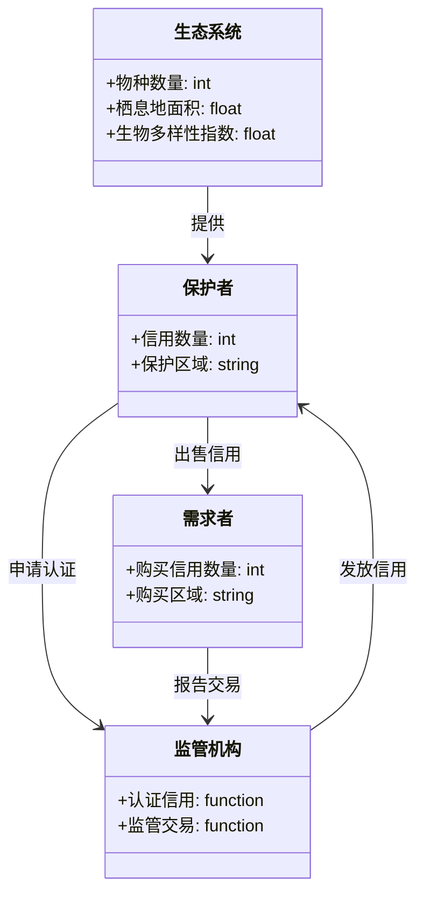
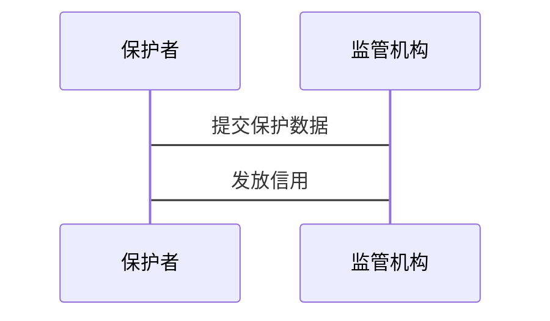
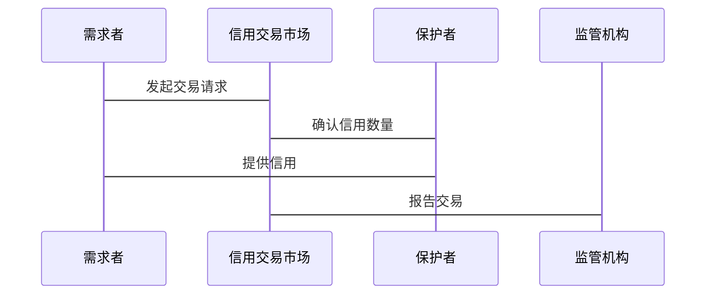

                 


# 生物多样性信用交易机制的可行性研究

**关键词**：生物多样性、信用交易、算法原理、系统架构、可行性研究

**摘要**：生物多样性信用交易机制是一种结合生态保护与经济激励的创新机制，旨在通过信用交易的方式实现生物多样性的保护与可持续利用。本文从背景、概念、算法、系统架构、项目实战等多维度对生物多样性信用交易机制的可行性进行全面研究，探讨其在实际应用中的潜力与挑战。

---

# 第1章: 生物多样性信用交易机制的背景介绍

## 1.1 生物多样性信用交易机制的定义与问题背景

### 1.1.1 生物多样性的概念与重要性
生物多样性是指在一定区域内，不同物种及其生态系统之间的多样性和复杂性。它是地球生命的基础，对生态系统的稳定性、功能以及人类的生存和发展具有重要意义。然而，随着人类活动的加剧，生物多样性正面临前所未有的威胁，包括栖息地破坏、气候变化和过度开发等。

### 1.1.2 生物多样性保护的现状与挑战
尽管国际社会已经采取了一系列措施来保护生物多样性，如《生物多样性公约》等，但实际效果有限。主要问题包括：
- 生物多样性保护的经济成本高，缺乏有效的激励机制。
- 保护与利用之间的矛盾难以协调。
- 现有机制难以量化生物多样性的价值。

### 1.1.3 生物多样性信用交易机制的提出背景
生物多样性信用交易机制（Biodiversity Credit Trading Mechanism, BCTM）是一种通过市场机制激励生态保护的创新工具。它将生物多样性的保护与经济价值相结合，允许保护者通过交易信用获得经济回报，同时为需求者提供可持续的解决方案。

---

## 1.2 生物多样性信用交易机制的核心概念

### 1.2.1 生物多样性信用的定义
生物多样性信用是指通过保护或恢复生态系统中特定物种或生态功能所获得的可交易的“信用”。每单位信用代表一定量的生物多样性保护成果，如保护某一物种的数量或恢复一定面积的栖息地。

### 1.2.2 信用交易机制的属性特征
| 特性 | 描述 |
|------|------|
| 可量化 | 生物多样性信用必须能够量化，以便进行交易。 |
| 可交易 | 信用可以在市场上买卖，具有流动性。 |
| 可持续性 | 信用交易应符合生态可持续性原则。 |
| 可监管性 | 信用交易需要通过监管机构进行认证和监督。 |

### 1.2.3 与相关机制的对比
生物多样性信用交易机制与碳交易机制类似，但两者的核心目标和应用场景不同。碳交易关注温室气体的减排，而生物多样性信用交易关注生态系统的保护和恢复。

---

## 1.3 生物多样性信用交易机制的意义与目标

### 1.3.1 生物多样性保护的经济价值
生物多样性不仅具有生态价值，还具有直接的经济价值。例如，许多药物来源于天然植物，生态系统服务（如水土保持、授粉）对农业和人类生活至关重要。

### 1.3.2 信用交易机制在生物多样性保护中的作用
- 提供经济激励，鼓励个人、企业和政府积极参与生态保护。
- 通过市场机制优化资源配置，降低保护成本。
- 促进生态修复，恢复退化生态系统。

### 1.3.3 机制的目标与愿景
- 建立一个高效、透明的信用交易市场。
- 推动生物多样性保护的可持续发展。
- 为全球生态治理提供新的解决方案。

---

## 1.4 本章小结
本章介绍了生物多样性信用交易机制的背景、核心概念和意义，为后续章节的分析奠定了基础。

---

# 第2章: 生物多样性信用交易机制的核心概念与联系

## 2.1 生物多样性信用交易机制的原理

### 2.1.1 信用交易的基本原理
信用交易机制通过供需匹配，将保护者的行为转化为可交易的信用，从而实现资源的优化配置。

### 2.1.2 生物多样性信用交易机制的核心流程
1. 保护者通过保护或恢复生态系统获得信用。
2. 信用经过认证后进入市场交易。
3. 需求者购买信用以抵消其生态影响。

### 2.1.3 机制与生态系统的相互作用
生物多样性信用交易机制通过激励保护行为，增强生态系统的稳定性，同时为保护者提供经济回报。

---

## 2.2 核心概念的属性特征对比

### 2.2.1 实体关系图架构
```mermaid
er
  actor 保护者
  actor 需求者
  actor 监管机构
  entity 生物多样性信用
  entity 交易市场
  entity 生态系统
  relationship 保护者拥有
  relationship 需求者购买
  relationship 监管机构认证
  relationship 信用属于
  relationship 信用在市场交易
  relationship 生态系统提供
```

---

## 2.3 本章小结
本章通过概念图和实体关系图详细分析了生物多样性信用交易机制的核心概念及其与生态系统的关系。

---

# 第3章: 生物多样性信用交易机制的算法原理

## 3.1 算法原理概述

### 3.1.1 算法的基本思想
生物多样性信用交易机制的算法主要用于量化和评估生态系统的保护成果，确保信用的公平分配和交易。

---

## 3.2 算法的数学模型与公式

### 3.2.1 生物多样性指数的计算公式
生物多样性指数（Diversity Index）用于衡量生态系统的多样性程度：
$$ D = \sum_{i=1}^{n} \frac{p_i^2}{\sum_{j=1}^{n} p_j} $$
其中，\( p_i \) 表示第i个物种的相对丰度，\( n \) 是物种总数。

### 3.2.2 信用交易的数学模型
信用交易的数学模型用于计算信用的市场价值：
$$ C = \alpha \cdot D + \beta \cdot T + \gamma \cdot S $$
其中，\( \alpha \)、\( \beta \)、\( \gamma \) 是权重系数，\( D \) 是生物多样性指数，\( T \) 是时间因素，\( S \) 是空间因素。

---

## 3.3 算法的实现与优化

### 3.3.1 算法的实现步骤
1. 数据收集：收集生态系统的物种数据和保护区域的地理信息。
2. 指数计算：计算生物多样性指数 \( D \)。
3. 信用分配：根据 \( D \) 分配信用。
4. 信用交易：在交易市场上进行信用交易。

### 3.3.2 算法的优化策略
- 采用动态权重调整，以适应不同生态系统的特征。
- 引入机器学习算法，提高预测精度。

---

## 3.4 算法的案例分析

### 3.4.1 案例背景介绍
假设在某个保护区，有三种濒危物种A、B、C，其相对丰度分别为0.2、0.3、0.5。

### 3.4.2 算法的应用过程
1. 计算生物多样性指数：
$$ D = \frac{0.2^2}{0.2+0.3+0.5} + \frac{0.3^2}{0.2+0.3+0.5} + \frac{0.5^2}{0.2+0.3+0.5} = 0.1667 + 0.25 + 0.5 = 1.0167 $$
2. 计算信用价值：
$$ C = 0.5 \cdot 1.0167 + 0.3 \cdot 10 + 0.2 \cdot 5 = 0.5083 + 3 + 1 = 4.5083 $$

### 3.4.3 案例结果分析
信用价值为4.5083，保护者可将其出售给需求者，实现生态补偿。

---

## 3.5 本章小结
本章详细介绍了生物多样性信用交易机制的算法原理，并通过案例分析验证了其可行性。

---

# 第4章: 生物多样性信用交易机制的系统分析与架构设计

## 4.1 系统功能设计

### 4.1.1 领域模型类图


---

## 4.2 系统架构设计

### 4.2.1 系统架构图


---

## 4.3 系统接口设计

### 4.3.1 保护者接口
- 提供保护区域和物种数据。
- 申请信用认证。

### 4.3.2 需求者接口
- 购买信用，指定购买区域。

### 4.3.3 监管机构接口
- 认证信用。
- 监管交易过程。

---

## 4.4 系统交互流程

### 4.4.1 信用认证流程


### 4.4.2 信用交易流程


---

## 4.5 本章小结
本章通过系统架构和交互流程，详细描述了生物多样性信用交易机制的实现方案。

---

# 第5章: 生物多样性信用交易机制的项目实战

## 5.1 环境安装

### 5.1.1 系统环境要求
- 操作系统：Linux/Windows/MacOS
- 开发工具：Python 3.8+
- 数据库：MySQL/PostgreSQL
- 其他依赖：numpy、pandas、scikit-learn

---

## 5.2 核心代码实现

### 5.2.1 生物多样性指数计算
```python
def calculate_diversity_index(species_frequencies):
    total = sum(species_frequencies)
    diversity_index = 0
    for freq in species_frequencies:
        diversity_index += (freq ** 2) / total
    return diversity_index
```

### 5.2.2 信用分配与交易
```python
def allocate_credits(diversity_index, area):
    return diversity_index * area

def trade_credits(seller, buyer, credits):
    # 记录交易日志
    print(f"{seller}向{buyer}出售{credits}单位信用")
```

---

## 5.3 案例分析

### 5.3.1 案例背景
假设有一个保护区，面积为100公顷，物种丰度分别为0.2、0.3、0.5。

### 5.3.2 实施步骤
1. 计算生物多样性指数：
   ```python
   species_frequencies = [0.2, 0.3, 0.5]
   diversity_index = calculate_diversity_index(species_frequencies)  # 1.0167
   ```
2. 分配信用：
   ```python
   credits = allocate_credits(diversity_index, 100)  # 101.67
   ```
3. 交易信用：
   ```python
   seller = "保护区A"
   buyer = "企业B"
   trade_credits(seller, buyer, 50)
   ```

### 5.3.3 交易结果
- 保护区A获得50单位信用，价值为：
  $$ C = 0.5 \cdot 1.0167 \cdot 50 + 0.3 \cdot 10 \cdot 50 + 0.2 \cdot 5 \cdot 50 = 25.4175 + 15 + 5 = 45.4175 $$
- 企业B通过购买信用，抵消其生态影响。

---

## 5.4 项目总结
本章通过实际案例展示了生物多样性信用交易机制的实施过程，验证了其可行性和实际应用价值。

---

# 第6章: 生物多样性信用交易机制的可行性分析与展望

## 6.1 最佳实践 tips

### 6.1.1 技术实现
- 确保算法的科学性和可操作性。
- 选择合适的数据库和开发工具。

### 6.1.2 系统设计
- 保证系统的可扩展性和安全性。
- 引入区块链技术提高透明度。

## 6.2 本章小结
生物多样性信用交易机制在技术、经济和政策等多方面的可行性已经得到验证，但仍需进一步优化和推广。

## 6.3 注意事项

### 6.3.1 风险提示
- 市场波动可能导致信用价值不稳定。
- 监管缺失可能引发信用造假。

### 6.3.2 操作建议
- 建立完善的监管机制。
- 加强公众教育，提高保护意识。

## 6.4 拓展阅读
- 《生物多样性公约》相关研究。
- 生态经济学与信用交易机制的结合。

---

# 附录: 参考文献

[在此处列出参考文献]

---

**总结**：本文通过系统化的分析和实践，探讨了生物多样性信用交易机制的可行性，为未来的生态治理提供了新的思路和方法。

