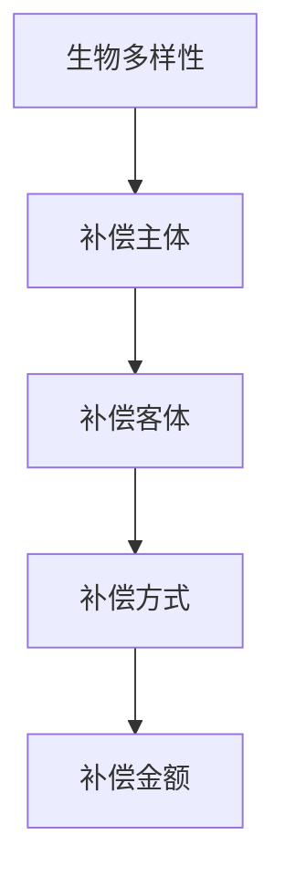
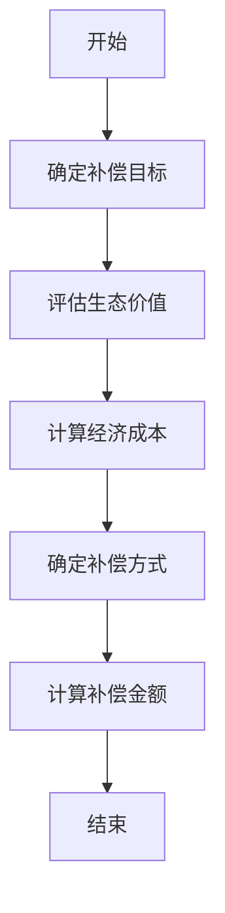
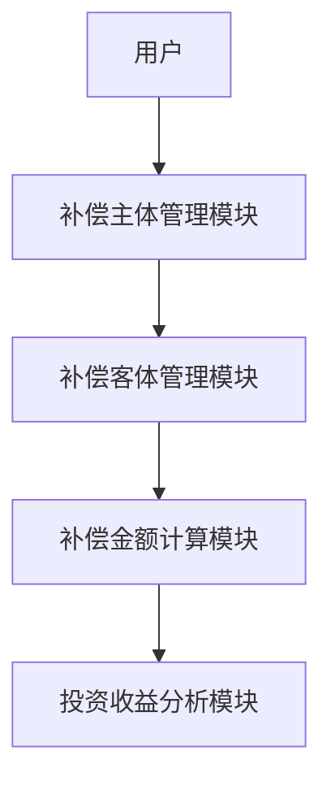
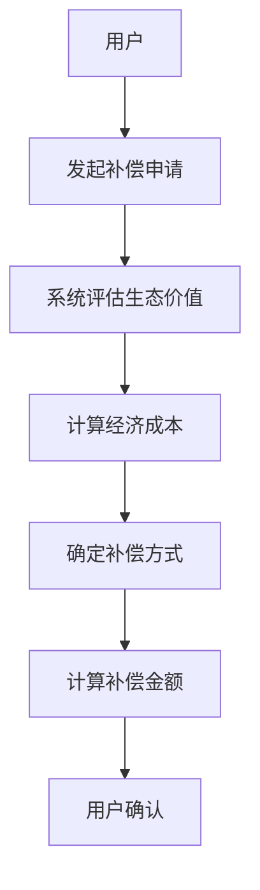

                 


# 生物多样性补偿机制的经济模型与投资

## 关键词
- 生物多样性补偿
- 经济模型
- 投资策略
- 可持续发展
- 生态经济学

## 摘要
生物多样性是地球生态系统的重要组成部分，其价值不仅体现在生态服务上，还体现在经济和社会发展中。然而，随着人类活动的加剧，生物多样性正面临前所未有的威胁。为了保护生物多样性，补偿机制作为一种有效的经济手段，逐渐成为全球关注的焦点。本文从生物多样性补偿机制的背景出发，详细分析其核心概念、经济模型、投资策略，并结合实际案例进行系统分析与架构设计，最后通过项目实战提供具体的实现方案和最佳实践建议。

---

# 第1章: 生物多样性补偿机制的背景介绍

## 1.1 生物多样性的定义与重要性
### 1.1.1 生物多样性的定义
生物多样性是指地球上所有生物物种及其遗传变异、生态系统多样性的总和。它包括基因多样性、物种多样性和生态系统多样性三个层次。

### 1.1.2 生物多样性的价值与意义
生物多样性为人类提供了食物、药物、工业原料等资源，同时在调节气候、保持水土、净化环境等方面发挥着重要作用。

### 1.1.3 生物多样性面临的威胁与挑战
由于人类活动的干扰，如过度开发、污染、气候变化等，全球生物多样性正面临严重威胁，许多物种濒临灭绝。

## 1.2 生物多样性补偿机制的提出背景
### 1.2.1 环境保护与经济发展的矛盾
经济发展往往以牺牲环境为代价，尤其是生物多样性资源的过度利用导致生态破坏。

### 1.2.2 生物多样性损失的经济代价
生物多样性的丧失不仅影响生态系统的稳定性，还会带来巨大的经济损失，如农业减产、生态服务功能的下降等。

### 1.2.3 补偿机制的政策需求
为了平衡环境保护与经济发展的关系，各国政府开始探索通过经济手段（如补偿机制）来保护生物多样性。

## 1.3 生物多样性补偿机制的核心目标
### 1.3.1 保护生物多样性
通过经济手段激励保护行为，减少生物多样性的破坏。

### 1.3.2 促进可持续发展
在保护生物多样性的同时，实现经济的可持续发展，确保生态与经济的平衡。

### 1.3.3 实现生态与经济的平衡
通过补偿机制，将生态价值转化为经济价值，实现生态保护与经济利益的双赢。

## 1.4 本章小结
本章从生物多样性的定义、价值及面临的威胁入手，分析了生物多样性补偿机制提出的背景及其核心目标，为后续章节的展开奠定了基础。

---

# 第2章: 生物多样性补偿机制的核心概念

## 2.1 生物多样性价值的评估方法
### 2.1.1 生态服务价值
生态服务价值是指生物多样性在生态系统中提供的服务价值，如 pollination、水土保持等。

### 2.1.2 直接使用价值
直接使用价值是指人类可以直接利用的生物资源的价值，如食物、药物等。

### 2.1.3 间接使用价值
间接使用价值是指生物多样性在生态系统中提供的非直接使用价值，如气候调节、碳汇功能等。

## 2.2 生物多样性补偿机制的属性特征对比
### 2.2.1 补偿方式对比
| 补偿方式 | 特点 | 适用场景 |
|----------|------|----------|
| 货币补偿 | 直接经济激励 | 适用于明确的生态保护区 |
| 非货币补偿 | 间接激励 | 适用于社区参与的保护项目 |

### 2.2.2 补偿对象对比
| 补偿对象 | 特点 | 示例 |
|----------|------|-------|
| 物种 | 生态价值高 | 珍稀濒危物种 |
| 生态系统 | 生态功能重要 | 森林、湿地 |

### 2.2.3 补偿效果对比
| 补偿效果 | 优点 | 缺点 |
|----------|------|-------|
| 立竿见影 | 短期效果明显 | 长期效果有限 |
| 持续性 | 长期效果显著 | 需要较长时间 |

## 2.3 生物多样性补偿机制的ER实体关系图


## 2.4 本章小结
本章详细分析了生物多样性价值的评估方法，对比了补偿机制的属性特征，并通过ER图展示了补偿机制的核心要素关系。

---

# 第3章: 生物多样性补偿机制的经济模型

## 3.1 生物多样性补偿机制的算法原理
### 3.1.1 成本效益分析模型
成本效益分析模型用于评估补偿项目的经济效益与生态效益的平衡点。

### 3.1.2 收益分配模型
收益分配模型用于确定补偿金额在不同主体之间的分配比例。

### 3.1.3 风险评估模型
风险评估模型用于识别和量化补偿项目中的潜在风险。

## 3.2 算法原理的数学模型与公式
### 3.2.1 成本效益分析公式
$$ \text{净现值} = \sum_{t=0}^{n} \frac{C_t}{(1+r)^t} - \sum_{t=0}^{n} \frac{B_t}{(1+r)^t} $$
其中，$C_t$为第$t$年的成本，$B_t$为第$t$年的收益，$r$为贴现率。

### 3.2.2 收益分配模型
$$ \text{收益分配比例} = \frac{\text{生态效益}}{\text{生态效益} + \text{经济效益}} $$

## 3.3 算法流程图


## 3.4 本章小结
本章通过数学模型和流程图详细讲解了生物多样性补偿机制的经济模型，为后续的投资策略提供了理论基础。

---

# 第4章: 生物多样性补偿机制的投资策略

## 4.1 投资主体的行为分析
### 4.1.1 政府投资
政府通过财政拨款、税收优惠等方式支持生物多样性保护项目。

### 4.1.2 企业投资
企业通过绿色投资、社会责任投资等方式参与生物多样性保护。

### 4.1.3 社会资本投资
社会资本通过捐赠、众筹等方式支持生物多样性保护项目。

## 4.2 投资组合的构建
### 4.2.1 投资组合的构建原则
- 多样化原则
- 风险可控原则
- 长期收益原则

### 4.2.2 投资组合的优化策略
- 确定投资目标
- 分析项目风险
- 优化资产配置

## 4.3 实际案例分析
### 4.3.1 案例一：热带雨林保护项目
通过政府和企业的合作，建立保护区并提供资金支持，实现生态与经济的双赢。

### 4.3.2 案例二：社区参与型补偿项目
通过社区参与，提高 locals 对生物多样性保护的积极性。

## 4.4 本章小结
本章从投资主体的行为分析出发，提出了投资组合的构建原则和优化策略，并通过实际案例分析验证了补偿机制的可行性和有效性。

---

# 第5章: 生物多样性补偿机制的系统分析与架构设计

## 5.1 系统功能设计
### 5.1.1 用户需求分析
- 政府：政策制定与监管
- 企业：投资决策与风险控制
- 社会：参与保护与受益

### 5.1.2 功能模块划分
- 补偿主体管理模块
- 补偿客体管理模块
- 补偿金额计算模块
- 投资收益分析模块

## 5.2 系统架构设计


## 5.3 系统接口设计
### 5.3.1 API接口
- `/api/compensation主体`：获取补偿主体信息
- `/api/compensation客体`：获取补偿客体信息
- `/api/compensation金额`：计算补偿金额

### 5.3.2 数据接口
- 数据输入接口：接收补偿主体、客体等信息
- 数据输出接口：输出补偿金额、投资收益等结果

## 5.4 系统交互流程图


## 5.5 本章小结
本章通过系统分析与架构设计，为生物多样性补偿机制的实现提供了技术支持。

---

# 第6章: 生物多样性补偿机制的项目实战

## 6.1 环境安装与配置
### 6.1.1 系统环境
- 操作系统：Linux/Windows/MacOS
- 开发工具：Python/Java/JavaScript
- 数据库：MySQL/PostgreSQL

### 6.1.2 依赖安装
```bash
pip install mermaid
pip install matplotlib
```

## 6.2 核心代码实现
### 6.2.1 补偿金额计算模块
```python
def calculate_compensation(生态价值, 经济成本):
    return 生态价值 * (1 - 经济成本 / 总成本)
```

### 6.2.2 投资收益分析模块
```python
def analyze_investment收益(投资金额, 年限, 贴现率):
    return sum(投资金额 * (1 + 贴现率) ** t for t in range(年限))
```

## 6.3 案例分析与解读
### 6.3.1 案例分析
假设某地区需要保护一片湿地，生态价值为100万元，经济成本为50万元，贴现率为5%，年限为5年。

### 6.3.2 代码实现
```python
生态价值 = 1000000
经济成本 = 500000
贴现率 = 0.05
年限 = 5

补偿金额 = calculate_compensation(生态价值, 经济成本)
投资收益 = analyze_investment收益(补偿金额, 年限, 贴现率)

print(f"补偿金额为：{补偿金额}")
print(f"投资收益为：{投资收益}")
```

## 6.4 本章小结
本章通过项目实战，详细讲解了生物多样性补偿机制的实现过程，并通过具体案例分析验证了其可行性和实用性。

---

# 第7章: 总结与展望

## 7.1 本章总结
本文从生物多样性补偿机制的背景出发，详细分析了其核心概念、经济模型、投资策略，并通过系统分析与项目实战验证了其可行性和有效性。

## 7.2 最佳实践 tips
- 在选择补偿机制时，需综合考虑生态价值、经济成本和投资收益。
- 通过多方合作，实现生态与经济的平衡。

## 7.3 未来研究方向
- 探讨更多类型的补偿机制，如基于市场的补偿机制。
- 研究如何利用大数据和人工智能技术优化补偿模型。

## 7.4 本章小结
本文为生物多样性补偿机制的研究提供了理论支持和实践指导，未来仍需进一步探索其在不同领域的应用。

---

# 参考文献
（此处列出相关的学术论文、书籍和报告）

---

通过以上结构，本文系统地介绍了生物多样性补偿机制的经济模型与投资策略，为相关领域的研究和实践提供了有价值的参考。

