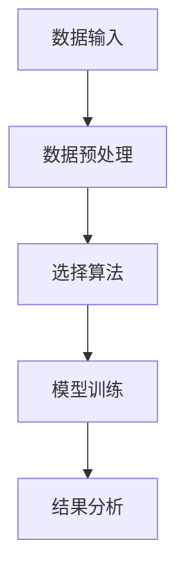
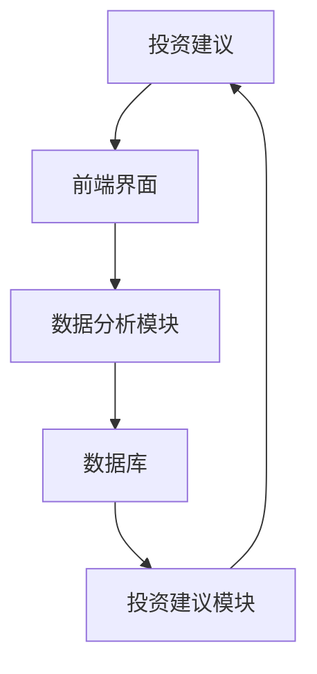

                 


# 生物技术进步带来的医疗健康投资主题

## 关键词：生物技术、医疗健康、投资主题、基因编辑、精准医疗、系统设计

## 摘要：  
生物技术的进步正在深刻改变医疗健康行业，并为投资者带来新的机遇和挑战。本文将从生物技术的核心概念出发，分析其在医疗健康领域的应用，探讨其对投资主题的影响。通过具体案例和系统设计，本文旨在为投资者提供科学的决策依据，帮助他们在生物技术驱动的医疗健康领域中把握投资机会。

---

## 第1章：生物技术与医疗健康的背景介绍

### 1.1 生物技术的定义与核心概念

#### 1.1.1 生物技术的定义  
生物技术（Biotechnology）是利用生命科学知识和工程技术，通过对生物体或其组成部分进行操作，以获得预期产品或服务的学科。它涵盖了基因工程、细胞工程、蛋白质工程等多个领域。

#### 1.1.2 生物技术的核心概念与组成要素  
- **基因工程**：通过修改基因序列，创造新的生物体或功能。  
- **细胞工程**：对细胞进行操作，如细胞培养、细胞融合等。  
- **蛋白质工程**：设计和制造具有特定功能的蛋白质。  
- **生物信息学**：利用计算机技术分析生物数据，如基因序列。  

#### 1.1.3 生物技术在医疗健康中的应用领域  
- **疾病诊断**：通过基因检测和蛋白质检测实现精准诊断。  
- **药物开发**：利用生物技术制造新型药物，如单克隆抗体。  
- **个性化治疗**：基于患者基因信息制定个性化治疗方案。  

### 1.2 生物技术的发展历程

#### 1.2.1 从传统医学到现代生物技术的演进  
- **传统医学**：基于经验和自然疗法。  
- **现代生物技术**：通过基因工程和细胞技术实现精准医疗。  

#### 1.2.2 关键技术突破与里程碑事件  
- **1973年**：第一个重组DNA技术的突破。  
- **2003年**：人类基因组计划完成，推动了基因技术的发展。  
- **2012年**：CRISPR-Cas9基因编辑技术的发明。  

#### 1.2.3 当前生物技术发展的主要趋势  
- **精准医疗**：基于个体基因信息的治疗方案。  
- **再生医学**：利用干细胞技术修复受损组织。  
- **合成生物学**：设计合成生物系统用于药物生产。  

### 1.3 生物技术对医疗健康的影响

#### 1.3.1 医疗模式的转变  
- 从“经验医学”转向“精准医学”。  

#### 1.3.2 医疗效率的提升  
- 基因检测技术使疾病诊断更加快速和准确。  

#### 1.3.3 医疗成本的变化  
- 高端技术的初期投入高，但长期来看成本可能下降。  

---

## 第2章：基因编辑技术与投资机会

### 2.1 基因编辑技术概述

#### 2.1.1 基因编辑的定义与原理  
基因编辑是通过技术手段对生物体的基因组进行特定修改，以达到治疗疾病或改善生物特性的目的。  

#### 2.1.2 常用技术：CRISPR-Cas9  
- **CRISPR-Cas9**：一种高效的基因编辑工具，能够精确地切割和修改DNA序列。  

#### 2.1.3 基因编辑的应用领域  
- **基因治疗**：用于治疗遗传性疾病，如镰刀型贫血症。  
- **疾病模型的建立**：用于研究疾病机制。  

### 2.2 基因编辑在医疗健康中的应用

#### 2.2.1 基因治疗  
- **案例**：治疗遗传性疾病的基因疗法已进入临床试验阶段。  

#### 2.2.2 疾病模型的建立  
- **用途**：用于药物研发和疾病机制研究。  

#### 2.2.3 个性化医疗  
- **优势**：基于患者基因信息制定个性化治疗方案，提高治疗效果。  

### 2.3 投资分析与挑战

#### 2.3.1 基因编辑技术的投资现状  
- **投资热点**：基因编辑技术在癌症治疗和罕见病领域的应用受到关注。  

#### 2.3.2 投资机会与风险分析  
- **机会**：基因治疗的市场潜力巨大。  
- **风险**：技术不确定性、监管风险和伦理问题。  

#### 2.3.3 未来展望  
- **技术突破**：基因编辑技术的进一步优化和应用扩展。  

---

## 第3章：算法原理讲解

### 3.1 生物技术中的数据分析算法

#### 3.1.1 算法原理概述  
- **目标**：通过算法分析生物数据，如基因序列和蛋白质结构。  

#### 3.1.2 算法流程图  


#### 3.1.3 算法实现代码  
```python
import pandas as pd
from sklearn.model_selection import train_test_split
from sklearn.tree import DecisionTreeClassifier

# 数据加载
data = pd.read_csv('gene_data.csv')
X = data.drop('label', axis=1)
y = data['label']

# 数据分割
X_train, X_test, y_train, y_test = train_test_split(X, y, test_size=0.2)

# 模型训练
model = DecisionTreeClassifier()
model.fit(X_train, y_train)

# 预测与评估
accuracy = model.score(X_test, y_test)
print(f'模型准确率：{accuracy}')
```

#### 3.1.4 数学模型解释  
- **决策树模型**：通过特征重要性分析，确定影响疾病的关键基因。  

---

## 第4章：数学模型

### 4.1 基因表达预测模型

#### 4.1.1 模型公式  
$$y = \beta_0 + \beta_1x_1 + \beta_2x_2 + \ldots + \beta_nx_n$$  
其中，$y$为基因表达水平，$x_i$为影响基因表达的变量，$\beta_i$为回归系数。  

#### 4.1.2 模型应用  
- **预测基因表达水平**：用于疾病诊断和治疗方案制定。  

---

## 第5章：系统分析与架构设计方案

### 5.1 问题场景介绍

#### 5.1.1 项目背景  
- **目标**：构建一个基于生物技术的医疗健康投资分析系统。  

### 5.2 系统功能设计

#### 5.2.1 领域模型  


### 5.3 系统架构设计

#### 5.3.1 架构图  


---

## 第6章：项目实战

### 6.1 环境安装

#### 6.1.1 安装Python和相关库  
- **命令**：  
  ```bash
  pip install numpy pandas scikit-learn
  ```

### 6.2 系统核心实现源代码

#### 6.2.1 基因数据分析代码  
```python
import pandas as pd
from sklearn import preprocessing

# 数据加载
data = pd.read_csv('gene_expression.csv')

# 数据预处理
label_encoder = preprocessing.LabelEncoder()
data['label'] = label_encoder.fit_transform(data['label'])

# 模型训练
from sklearn.ensemble import RandomForestClassifier
model = RandomForestClassifier()
model.fit(data.drop('label', axis=1), data['label'])

# 模型评估
from sklearn.metrics import accuracy_score
y_pred = model.predict(data.drop('label', axis=1))
print(f'模型准确率：{accuracy_score(data["label"], y_pred)}')
```

---

## 第7章：结论

### 7.1 投资建议

#### 7.1.1 最佳实践  
- **关注前沿技术**：如基因编辑和精准医疗。  
- **风险控制**：评估技术的可行性和监管风险。  

### 7.1.2 未来展望  
- **技术融合**：生物技术与其他技术的结合将推动医疗健康投资的进一步发展。  

### 7.1.3 注意事项  
- **持续学习**：关注行业动态和技术突破。  

### 7.1.4 拓展阅读  
- 推荐阅读《基因编辑：从原理到应用》。  

---

## 结语  
生物技术的进步正在为医疗健康投资带来前所未有的机遇。通过科学的系统设计和数据分析，投资者可以在这一领域找到丰厚的回报。然而，也需要关注技术风险和伦理问题，以确保投资的可持续性。

--- 

**（本文完）**

